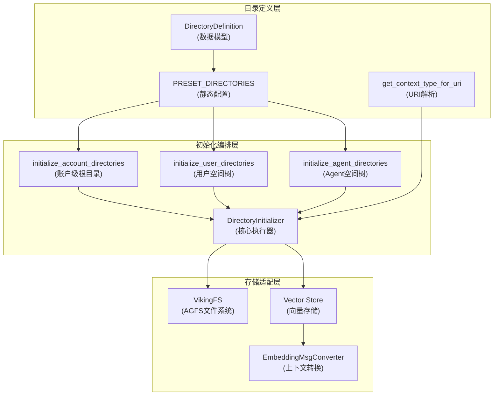

# directory_definition 模块技术深度解析

## 模块概述

`openviking.core.directories` 模块是 OpenViking 虚拟文件系统（VikingFS）的"骨架工程师"——它在系统初始化时预先定义并创建一套标准的目录层级结构。这套目录结构不仅仅是一堆空文件夹，它们是整个系统记忆存储、技能调度和资源管理的拓扑基础。

**为什么需要这个模块？** OpenViking 采用一种独特的设计理念：所有目录都是数据记录。在传统文件系统中，目录只是文件的容器；但在 OpenViking 中，每个目录本身就是一个可检索、可索引的实体。这种设计使得系统能够对"文件夹"进行语义搜索——你可以问"用户的偏好存在哪里"，系统会返回 `viking://user/{user_space}/memories/preferences/` 这个目录，因为目录本身携带着 L0 摘要和 L1 描述。

模块的核心职责是：**在账户初始化时，在文件系统和向量存储中双重构建这套预设目录结构，使目录成为可被发现、可被理解的一等公民。**

---

## 架构解析



### 核心抽象：DirectoryDefinition

`DirectoryDefinition` 是整个模块的数据模型基元：

```python
@dataclass
class DirectoryDefinition:
    path: str           # 相对路径，如 "memories/preferences"
    abstract: str       # L0 摘要——一句话概括该目录是什么
    overview: str       # L1 概述——更详细的描述，用于向量化索引
    children: List["DirectoryDefinition"]  # 子目录递归定义
```

这个设计采用了**树形模式**（Tree Pattern）来表达目录层级关系。`path` 字段是相对路径而非绝对路径，这使得同一个 `DirectoryDefinition` 实例可以在不同的命名空间下复用——例如，`memories` 目录结构既用于 user 域，也用于 agent 域，只是最终的 URI 不同。

### 预设目录结构：四域鼎立

`PRESET_DIRECTORIES` 定义了四个顶层作用域，这是系统最核心的分类维度：

| 作用域 | 用途 | 生命周期 | 典型子目录 |
|--------|------|----------|-------------|
| **session** | 会话级临时存储 | 会话周期 | 消息历史、压缩归档 |
| **user** | 用户长期记忆 | 跨会话持久 | preferences, entities, events |
| **agent** | Agent 学习记忆 | 跨会话持久 | memories, instructions, skills |
| **resources** | 共享知识资源 | 长期共享 | 无预设，按需创建 |

**设计洞察**：将 user 和 agent 分离是出于数据所有权的考虑——user 的记忆属于用户，agent 的学习成果属于 Agent 本身，两者不应混为一谈。session 则是临时缓存，会话结束后可归档或清理。resources 是跨账户共享的全局空间。

---

## 核心组件深度剖析

### 1. DirectoryDefinition —— 目录元数据的载体

这个数据类看似简单，但它承载了系统对"目录即数据"这一核心理念的实现。每个字段都有明确的语义：

- **`abstract`**：对应 `ContextLevel.ABSTRACT`（L0），用于快速概览和列表展示
- **`overview`**：对应 `ContextLevel.OVERVIEW`（L1），用于语义搜索和理解目录意图
- **`path`**：仅存储相对路径，最终 URI 由父节点和 scope 共同决定

这种设计允许**一次性定义，多处复用**。例如，`memories` 目录结构在 user 和 agent 域下都存在，内容完全相同，只是挂载点不同。

### 2. get_context_type_for_uri —— URI 到语义的翻译器

```python
def get_context_type_for_uri(uri: str) -> str:
    if "/memories" in uri:
        return ContextType.MEMORY.value
    elif "/resources" in uri:
        return ContextType.RESOURCE.value
    elif "/skills" in uri:
        return ContextType.SKILL.value
    elif uri.startswith("viking://session"):
        return ContextType.MEMORY.value
    return ContextType.RESOURCE.value
```

这个函数体现了**约定优于配置**的设计思想：不需要为每个目录显式指定类型，系统通过 URI 模式自动推断。这种设计有其 Trade-off：

- **优点**：简化初始化逻辑，新增目录类型时无需修改初始化代码
- **缺点**：URI 命名必须遵循约定，如 `/memories` 必须出现在路径中才能识别为记忆

### 3. DirectoryInitializer —— 初始化编排器

这是模块的执行引擎，负责将定义转化为实际的存储记录。它的设计体现了几个关键决策：

#### 3.1 双重写入：文件系统 + 向量存储

每个目录的创建都涉及两个存储系统：

```python
# 1. 在 AGFS 中创建 .abstract.md 和 .overview.md 文件
await self._create_agfs_structure(uri, defn.abstract, defn.overview, ctx=ctx)

# 2. 在向量存储中创建 Context 记录，供语义搜索使用
context = Context(uri=uri, ..., abstract=defn.abstract, ...)
dir_emb_msg = EmbeddingMsgConverter.from_context(context)
await self.vikingdb.enqueue_embedding_msg(dir_emb_msg)
```

**为什么需要双重写入？** 这涉及到两个访问模式的差异：

- **AGFS 文件**：面向 LLM 的快速读取，`.abstract.md` 提供即时概览，`.overview.md` 提供详细描述
- **向量存储**：面向语义搜索，通过 embedding 匹配找到最相关的目录

这类似于搜索引擎的索引架构：文件内容是"原文"，向量索引是"倒排表"，两者配合实现快速准确的检索。

#### 3.2 幂等性设计：idempotent initialization

```python
# 先检查是否已存在，再决定是否创建
if not await self._check_agfs_files_exist(uri, ctx=ctx):
    await self._create_agfs_structure(...)
    created = True
else:
    logger.debug(f"Directory {uri} already exists")

existing = await self.vikingdb.get_context_by_uri(account_id=..., uri=uri, limit=1)
if not existing:
    # 向量记录不存在，创建新的
    ...
    created = True
```

这种设计使得初始化操作可以**安全地重复执行**——无论是首次初始化还是故障恢复，逻辑都是一致的。对于分布式系统中的幂等操作，这至关重要。

#### 3.3 分层初始化策略

模块实现了三层初始化：

1. **`initialize_account_directories`**：创建四个顶层 scope 根节点（user, agent, resources, session）
2. **`initialize_user_directories`**：为当前用户创建 user 域下的完整子树
3. **`initialize_agent_directories`**：为当前 Agent 创建 agent 域下的完整子树

**设计动机**：分层使得初始化可以按需触发。account 级目录只需创建一次，而 user/agent 级目录是"懒加载"的——只有当特定用户或 Agent 首次活动时才创建。这避免了为不存在的用户/Agent 预创建大量空目录。

---

## 数据流追踪

以初始化用户目录为例，完整的数据流动过程如下：

```
RequestContext (user=user_001, account_id=acc_123)
    │
    ▼
DirectoryInitializer.initialize_user_directories()
    │
    ├──► 构建 URI: "viking://user/user_001"
    │
    ├──► _ensure_directory()
    │   │
    │   ├──► 1. 检查 AGFS 文件是否存在
    │   │       │
    │   │       ▼
    │   │       VikingFS.abstract("viking://user/user_001")
    │   │           │
    │   │           ▼ (文件不存在，抛出异常)
    │   │       返回 False
    │   │
    │   ├──► 2. 创建 AGFS 结构
    │   │       │
    │   │       ▼
    │   │       VikingFS.write_context(
    │   │           uri="viking://user/user_001",
    │   │           abstract=L0摘要,
    │   │           overview=L1描述,
    │   │           is_leaf=False
    │   │       )
    │   │           │
    │   │           ▼
    │   │       生成文件:
    │   │         /local/acc_123/user/user_001/.abstract.md
    │   │         /local/acc_123/user/user_001/.overview.md
    │   │
    │   ├──► 3. 检查向量存储记录
    │   │       │
    │   │       ▼
    │   │       VikingDB.get_context_by_uri("viking://user/user_001")
    │   │           │
    │   │           ▼
    │   │       返回空（记录不存在）
    │   │
    │   ├──► 4. 创建向量记录
    │   │       │
    │   │       ▼
    │   │       Context(
    │   │           uri="viking://user/user_001",
    │   │           context_type="memory",  # 推断自 URI
    │   │           owner_space="user_001",
    │   │           abstract=L0摘要,
    │   │           user=UserIdentifier(...),
    │   │           account_id="acc_123"
    │   │       )
    │   │
    │   │       ▼ EmbeddingMsgConverter.from_context()
    │   │
    │   │       EmbeddingMsg(message=L1文本, context_data={...})
    │   │
    │   │       ▼
    │   │       VikingDB.enqueue_embedding_msg(embedding_msg)
    │
    ├──► 5. 递归初始化子目录
    │       _initialize_children("user", children, "viking://user/user_001")
    │           │
    │           └──► 对 children 中的每个定义重复 _ensure_directory()
    │               ├──► "viking://user/user_001/memories"
    │               ├──► "viking://user/user_001/memories/preferences"
    │               ├──► "viking://user/user_001/memories/entities"
    │               └──► "viking://user/user_001/memories/events"
    │
    ▼
返回创建的目录数量
```

---

## 设计决策与权衡

### 1. 静态定义 vs 动态发现

**选择**：使用 `PRESET_DIRECTORIES` 静态定义目录结构。

**分析**：当前设计将目录层级硬编码在 Python 代码中。这有以下 Trade-off：

- **优点**：初始化速度快，逻辑简单，不需要查询外部配置服务
- **缺点**：修改目录结构需要代码变更，无法运行时动态配置

**替代方案**：可以从数据库或配置文件加载目录定义，但这会增加复杂度和启动时间。对于一个以速度和确定性为导向的初始化模块，当前的静态设计是合理的。

### 2. 路径推断 vs 显式类型

**选择**：通过 `get_context_type_for_uri` 根据 URI 路径隐式推断 context_type。

**分析**：

```python
# 隐式推断
def get_context_type_for_uri(uri: str) -> str:
    if "/memories" in uri:
        return ContextType.MEMORY.value
    ...
```

这种设计的代价是 URI 命名必须遵循约定。优点是初始化代码简洁——不需要在 `DirectoryDefinition` 中额外存储 `context_type` 字段。

### 3. 懒加载 vs 预创建

**选择**：user 和 agent 目录采用懒加载策略，只在首次需要时创建。

**分析**：这是典型的**延迟计算**模式。如果系统有 10000 个用户和 1000 个 Agent，预创建所有目录意味着创建 11000 个目录节点；但实际上大部分用户可能从不使用系统。懒加载确保只创建实际需要的目录。

代价是首次访问会有额外的初始化延迟。

### 4. 同步检查 vs 乐观写入

**选择**：先检查存在性，再决定是否创建（check-then-act）。

```python
if not await self._check_agfs_files_exist(uri, ctx=ctx):
    await self._create_agfs_structure(...)
```

**分析**：这是经典的 TOCTOU（Time-of-check to time-of-use）问题。在并发场景下，两个请求可能同时检查到目录不存在，然后都尝试创建。

当前实现**存在潜在的竞态条件**：在高并发初始化时，可能出现重复创建的情况。不过，向量存储层面通常有幂等保护（根据 URI 主键去重），文件系统的 mkdir 也通常是幂等的。这个 Trade-off 换取的是更简洁的代码和更好的性能——如果采用锁机制，会显著增加复杂度。

---

## 使用指南与扩展点

### 如何添加新的顶层作用域

如果要添加新的顶层作用域（例如 `team` 用于团队级共享资源），需要：

1. 在 `PRESET_DIRECTORIES` 中添加新条目：
   ```python
   "team": DirectoryDefinition(
       path="",
       abstract="Team scope. Shared resources within a team.",
       overview="Team-level data storage...",
       children=[...]  # 根据需要定义子目录
   ),
   ```

2. 在 `DirectoryInitializer.initialize_account_directories()` 的 `scope_roots` 字典中添加映射：
   ```python
   scope_roots = {
       "user": PRESET_DIRECTORIES["user"],
       "agent": PRESET_DIRECTORIES["agent"],
       "resources": PRESET_DIRECTORIES["resources"],
       "session": PRESET_DIRECTORIES["session"],
       "team": PRESET_DIRECTORIES["team"],  # 新增
   }
   ```

### 如何修改目录结构

当前目录结构已深度嵌入系统各处（检索逻辑、权限模型、UI 显示），修改时需谨慎。核心步骤：

1. 修改 `PRESET_DIRECTORIES` 中的定义
2. 重新运行初始化（幂等性设计保证了安全）
3. 确保下游检索逻辑能处理新结构

### 常见集成模式

`DirectoryInitializer` 通常在账户创建流程中被调用：

```python
async def on_user_first_login(ctx: RequestContext):
    initializer = DirectoryInitializer(vikingdb=vikingdb_manager)
    
    # 1. 确保顶层作用域存在（通常系统启动时执行一次）
    await initializer.initialize_account_directories(ctx)
    
    # 2. 为当前用户创建个人空间
    await initializer.initialize_user_directories(ctx)
    
    # 3. 为当前 Agent 创建能力空间
    await initializer.initialize_agent_directories(ctx)
```

---

## 边界情况与已知限制

### 1. URI 命名敏感

`get_context_type_for_uri` 依赖字符串包含判断：

```python
if "/memories" in uri:
    return ContextType.MEMORY.value
```

如果 URI 是 `/my-memories`（带连字符），会正确识别；但如果目录结构改变（例如移到 `/user/memories/legacy`），推断逻辑可能失效。

**建议**：未来可以考虑在 `DirectoryDefinition` 中显式存储 `context_type`，以便更精确地控制分类。

### 2. 并发初始化竞态

如前所述，高并发下可能存在重复创建。虽然向量存储和文件系统通常能容忍重复（幂等性），但会产生不必要的日志和开销。

**当前缓解**：通过日志记录创建状态，便于监控。

### 3. 向量存储可用性依赖

初始化过程假设向量存储可用。如果向量存储故障，AGFS 文件会正常创建，但向量索引会缺失，导致这些目录无法被语义搜索发现。

**建议**：在生产环境中，向量存储应该是高可用的，或者实现初始化状态的持久化记录以便后续恢复。

### 4. 嵌套层级深度

当前预设结构的深度约为 3-4 层。代码逻辑本身支持任意深度（递归初始化），但过深的层级会增加检索时的遍历成本。

---

## 依赖关系

### 被依赖

| 上游模块 | 依赖方式 |
|----------|----------|
| [session_runtime_and_skill_discovery](session_runtime_and_skill_discovery.md) | 使用 `DirectoryInitializer` 初始化会话所需的目录结构 |
| [context_typing_and_levels](context_typing_and_levels.md) | 使用 `ContextType` 枚举进行类型推断 |

### 依赖

| 下游模块 | 依赖方式 |
|----------|----------|
| [openviking.core.context.Context](未找到) | 创建 Context 对象作为向量存储记录 |
| [openviking.storage.viking_fs.VikingFS](未找到) | 通过 VikingFS 写入 .abstract.md 和 .overview.md 文件 |
| [openviking.storage.queuefs.embedding_msg_converter.EmbeddingMsgConverter](未找到) | 将 Context 转换为 EmbeddingMsg 用于向量化 |

---

## 总结

`directory_definition` 模块是 OpenViking 虚拟文件系统的基础设施层。它用一种优雅而务实的方式解决了"目录即数据"的核心命题：通过静态定义目录结构、幂等初始化、双重写入存储系统，使每个目录同时具备快速读取（AGFS 文件）和语义搜索（向量索引）的能力。

对于新加入的开发者，需要牢记的核心概念是：

1. **四域模型**：session（临时）、user（用户长期记忆）、agent（Agent 学习）、resources（共享资源）
2. **L0/L1 语义分离**：abstract 用于快速概览，overview 用于深度理解和搜索
3. **幂等初始化**：初始化可以安全重复执行
4. **懒加载策略**：user/agent 目录按需创建，避免预创建开销

这个模块虽然不涉及复杂的业务逻辑，但它定义的目录结构将贯穿整个系统的生命周期——从检索到持久化，从 UI 显示到权限控制，是整个系统的"拓扑骨架"。