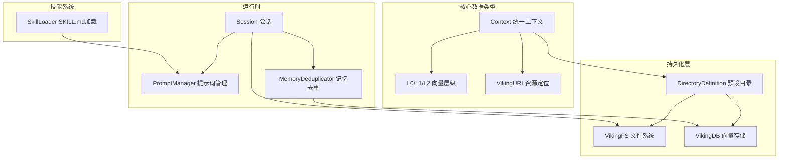

# core_context_prompts_and_sessions 模块

> **模块定位**：本模块是 OpenViking 系统的"记忆与上下文中枢"——它定义了系统如何理解、组织和管理三类核心知识资产（技能、记忆、资源），同时提供了对话历史的管理能力和提示词模板的运行时支撑。

## 问题空间：为什么需要这个模块？

想象你正在与一个 AI 助手进行一场漫长的多日对话。随着对话进行，助手需要记住：

1. **你之前提到过的偏好**（比如"我喜欢简洁的代码注释"）
2. **你们共同解决的问题**（比如"上次我们一起修复了登录 bug"）
3. **它曾经使用过的技能**（比如"用 Python 写一个快速排序"）

如果没有精心设计的数据结构，这些信息会：
- 散落在文件系统的各个角落，难以检索
- 在长对话中无限膨胀，导致性能问题
- 出现重复或过时的记录，降低 AI 的决策质量

OpenViking 的设计选择是：为每一条"知识"赋予统一的上下文抽象，采用三层向量化索引（L0/L1/L2）实现精准检索，并通过会话压缩和记忆去重机制控制存储成本。

## 核心抽象：设计师的心智模型

本模块围绕三个核心概念构建：

```
┌─────────────────────────────────────────────────────────────────┐
│                        上下文 (Context)                          │
│  ┌─────────────┬─────────────┬─────────────┐                    │
│  │   技能      │    记忆     │   资源      │                    │
│  │  (SKILL)   │  (MEMORY)  │ (RESOURCE) │                    │
│  └─────────────┴─────────────┴─────────────┘                    │
│                                                                 │
│  三层向量化索引:                                                 │
│  ┌─────┐  ┌───────┐  ┌─────────┐                               │
│  │ L0  │→ │  L1   │→ │   L2    │  (抽象→概要→详情)              │
│  │摘要 │  │ 概览  │  │ 详细内容 │                               │
│  └─────┘  └───────┘  └─────────┘                               │
└─────────────────────────────────────────────────────────────────┘
```

### 1. 统一上下文模型

所有知识资产（技能、记忆、资源）都使用同一个 `Context` 类表示。这不是简单的代码复用——它体现了**统一资源定位**的设计哲学：

```python
# 无论什么类型，都用 URI 定位
viking://user/zhangsan/memories/preferences/coding_style/
viking://agent/my_agent/skills/file_operations/
viking://resources/docs/api_reference/
```

### 2. 三层向量化索引 (L0/L1/L2)

这是本模块最关键的设计决策之一。将上下文分解为三个抽象层级：

| 层级 | 名称 | 用途 | 示例 |
|------|------|------|------|
| L0 | 摘要 (Abstract) | 快速筛选、相关性判断 | "用户偏好简洁的代码风格" |
| L1 | 概要 (Overview) | 语义搜索、意图理解 | "用户prefer简洁注释、类型标注，关注性能优化..." |
| L2 | 详情 (Detail) | 精确匹配、工具执行 | 完整的偏好配置文件内容 |

**为什么这样设计？** 向量检索是有成本的操作。L0 相当于"索引的索引"——当系统需要从上万条记忆中找到相关候选时，先用 L0 做粗筛，再用 L1/L2 做精筛，可以显著降低向量计算量。

### 3. 会话即上下文

`Session` 类不仅仅是"聊天记录管理器"——它是**上下文生命周期的控制器**：

```
用户对话 → 实时消息 → commit() → 归档 + 记忆提取 + 关系创建
```

每次 `commit()` 操作会：
1. 将当前消息归档到历史目录
2. 调用 LLM 从归档中**提取长期记忆**
3. 写入 L0/L1 到向量存储
4. 创建会话与上下文之间的**关系图**

## 架构概览



## 数据流分析

### 场景一：创建新会话并添加消息

```
用户发送消息 
    ↓
Session.add_message(role="user", parts=[...])
    ↓
消息写入 messages.jsonl (VikingFS)
    ↓
实时更新 .abstract.md 和 .overview.md
```

关键路径：`Session.add_message` → `_append_to_jsonl` → `VikingFS.write_file`

### 场景二：会话提交（压缩与记忆提取）

```
Session.commit()
    ↓
1. 归档: messages → history/archive_XXX/
    ↓
2. 生成摘要: LLM 生成结构化 summary
    ↓
3. 提取记忆: SessionCompressor.extract_long_term_memories()
    ↓
4. 记忆去重: MemoryDeduplicator.deduplicate()
    ↓
5. 写入向量存储: enqueue_embedding_msg()
    ↓
6. 创建关系: VikingFS.link()
```

### 场景三：提示词渲染

```
业务代码调用 render_prompt("vision.image_understanding", {...})
    ↓
PromptManager.render()
    ↓
1. 加载 YAML 模板 (带缓存)
    ↓
2. 验证变量类型和必填项
    ↓
3. Jinja2 模板渲染
    ↓
返回最终字符串
```

## 关键设计决策

### 决策 1：统一上下文类 vs 多态类层次

**选择**：使用统一的 `Context` 类，通过 `context_type` 字段区分类型。

** tradeoff 分析**：
- ✅ 简单性：一条数据库记录、一个数据结构就能表示所有类型
- ✅ 可扩展：新增类型只需修改 `ContextType` 枚举
- ❌ 类型安全：无法在编译期区分技能和记忆，运行时需要做类型判断

### 决策 2：同步文件操作包装异步接口

**选择**：`Session` 内部大量使用 `run_async()` 将异步 VikingFS 操作包装为同步调用。

```python
# 代码中的典型模式
run_async(viking_fs.write_file(...))
```

**设计原因**：Session 类被设计为可同步调用（如在同步的 Web 请求处理器中使用），而 VikingFS 是原生异步的。这是一种**防腐层模式**——让核心业务逻辑与 I/O 模式解耦。

**潜在问题**：如果 Session 在高并发场景下被频繁同步调用，可能会阻塞事件循环。

### 决策 3：LLM 辅助的记忆去重

**选择**：使用向量相似度预筛选 + LLM 决策的两阶段去重流程。

```
候选记忆 → 向量搜索相似记忆 → [阈值过滤] → LLM 判断 → 决策
```

**为什么不是纯向量搜索？**
- 向量相似度只能判断"语义相近"，无法判断"是否需要合并"
- LLM 可以理解记忆的**语义边界**和**时效性**，做出更智能的决策

**成本考量**：每次去重都需要调用 LLM，这是有成本的。设计中通过 `SIMILARITY_THRESHOLD = 0.0`（基本无过滤）来确保大多数候选记忆都会经过 LLM 判断——这意味着系统设计者认为去重的准确性比调用成本更重要。

### 决策 4：目录即数据

**选择**：预设目录结构（`PRESET_DIRECTORIES`）不是空的文件夹，而是**预填充的 Context 记录**。

```python
# directories.py 中的定义
PRESET_DIRECTORIES = {
    "user": DirectoryDefinition(
        path="",
        abstract="用户作用域...",
        children=[
            DirectoryDefinition(path="memories", ...),
            ...
        ]
    )
}
```

**设计意图**：这是 OpenViking 的"默认世界观"——新用户一上手就会看到预设的记忆分类（偏好、实体、事件）和技能分类（案例、模式、指令），而不需要从零开始组织。

## 子模块关系

| 子模块 | 职责 | 关键组件 |
|--------|------|----------|
| [context_typing_and_levels](core_context_prompts_and_sessions-context_typing_and_levels.md) | 定义上下文类型系统和向量层级 | `ContextType`, `ContextLevel`, `ResourceContentType` |
| [prompt_template_metadata](core_context_prompts_and_sessions-prompt_template_metadata.md) | 提示词模板的加载、验证、渲染 | `PromptManager`, `PromptTemplate`, `render_prompt()` |
| [session_memory_deduplication](core_context_prompts_and_sessions-session_memory_deduplication.md) | 记忆去重的决策逻辑 | `MemoryDeduplicator`, `DedupDecision`, `MemoryActionDecision` |
| [session_runtime](session_runtime.md) | 会话生命周期管理 | `Session`, `SessionCompression`, `SessionStats` |
| [skill_loader](openviking-core-skill_loader.md) | SKILL.md 文件的加载和解析 | `SkillLoader` |
| [directory_definition](core-context-directories.md) | 预设目录结构的定义和初始化 | `DirectoryDefinition`, `DirectoryInitializer` |

## 外部依赖关系

### 依赖本模块的模块

| 上游模块 | 使用方式 |
|----------|----------|
| `server_api_contracts` | `Context` 作为会话 API 的请求/响应数据结构 |
| `storage_core_and_runtime_primitives` | `EmbeddingMsgConverter` 将 `Context` 转为嵌入消息 |
| `model_providers_embeddings_and_vlm` | `Context` 的 `vectorize` 字段用于生成向量 |
| `python_client_and_cli_utils` | `Session` 作为 Python 客户端的会话抽象 |

### 本模块依赖的外部模块

| 下游模块 | 依赖内容 |
|----------|----------|
| `openviking.message` | `Message`, `Part` 类型 |
| `openviking.storage` | `VikingDBManager`, `VikingFS` |
| `openviking.server.identity` | `RequestContext`, `Role` |
| `openviking_cli.session` | `UserIdentifier` |
| `openviking_cli.utils.llm` | `get_openviking_config()`, `parse_json_from_response()` |

## 贡献者注意事项：常见陷阱

### 1. L0/L1 更新延迟

**问题**：`Session` 写入 `.abstract.md` 和 `.overview.md` 是同步调用 `run_async()`，但这些 L0/L1 文件的向量嵌入是**异步**通过 `enqueue_embedding_msg()` 插入队列的。

**影响**：刚写入的内容可能无法立即被向量搜索检索到。

### 2. Context 序列化的版本兼容

**问题**：`Context.to_dict()` 和 `Context.from_dict()` 手动处理字段映射，如果新增字段但忘记同时修改两个方法，会导致数据丢失。

**建议**：在修改 `Context` 类时，确保序列化/反序列化方法保持同步。

### 3. 目录初始化的幂等性

**问题**：`DirectoryInitializer.initialize_account_directories()` 会检查目录是否已存在，但 `DirectoryInitializer.initialize_user_directories()` 和 `initialize_agent_directories()` 是**懒加载**的，只在首次访问时创建。

**影响**：如果预定义目录结构发生变化（新增子目录），已存在的用户空间不会自动获得新目录——需要单独的处理逻辑或迁移脚本。

### 4. 提示词模板缓存

**问题**：`PromptManager` 默认启用缓存，且使用进程级全局单例 `_default_manager`。

**影响**：在测试环境或热重载场景下，修改 YAML 模板文件后可能不会立即生效。需要调用 `clear_cache()` 或重启进程。

### 5. 记忆去重的阈值陷阱

**问题**：`MemoryDeduplicator.SIMILARITY_THRESHOLD = 0.0` 意味着**所有**通过向量搜索返回的相似记忆都会发送给 LLM。

**影响**：如果向量搜索返回大量结果（且没有 `limit` 限制），可能产生超长的 LLM 上下文。代码中虽然有 `MAX_PROMPT_SIMILAR_MEMORIES = 5` 限制，但这是针对发送给 LLM 的数量，向量搜索本身可能已经消耗了大量资源。

## 总结

`core_context_prompts_and_sessions` 模块是 OpenViking 系统的**知识管理层**——它解决的问题是如何在长期、多会话的 AI 交互中有效地：

1. **表示**异构知识资产（技能、记忆、资源）
2. **组织**成可导航的层次结构
3. **压缩**历史会话以控制成本
4. **去重**积累的冗余记忆
5. **检索**通过三层向量索引

理解这个模块的关键在于把握三个核心抽象：`Context`（统一的数据模型）、`Session`（生命周期的控制器）、以及 `L0/L1/L2`（分层索引策略）。在此基础上，`PromptManager` 和 `MemoryDeduplicator` 分别提供了运行时模板能力和智能去重能力。