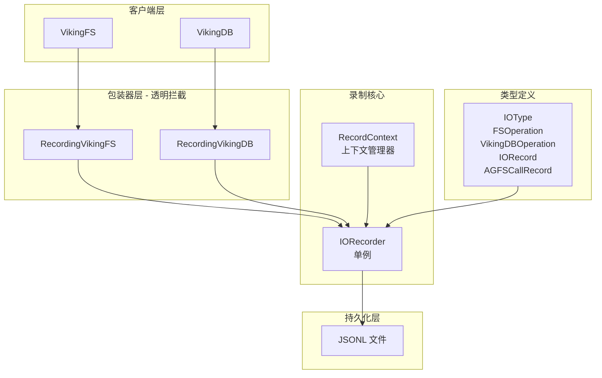

# evaluation_recording_and_storage_instrumentation

## 模块概述

`evaluation_recording_and_storage_instrumentation` 是 OpenViking 系统中一个关键的评估支持模块——它的核心职责是**观测与记录**。想象一下在一个分布式文件系统和向量数据库构建的复杂系统中，你需要评估系统的性能瓶颈、复现线上问题、或验证某个优化是否有效——没有观测数据，这些都将无从谈起。

这个模块做的事情其实很像飞机上的黑匣子（Black Box）：它默默记录每一次文件系统的读写操作、每一次向量数据库的搜索查询，记录请求是什么、响应是什么、耗时多久、是否成功。它将这些数据持久化到 JSONL 文件中，供后续分析和回放使用。

**解决的问题**：
- **可观测性缺失**：当生产环境出现性能问题或异常行为时，如果没有记录，很难定位是哪个环节出了问题
- **自动化评估困难**：评估 RAG 系统质量需要知道检索了什么、用了什么向量、时间消耗在哪里——这些信息都需要被"事后"看到
- **问题复现困难**：很多间歇性问题难以在开发环境复现，如果有完整的历史操作记录，可以"回放"问题

---

## 架构设计

### 核心组件



### 数据流分析

当你使用这个模块时，数据流向如下：

1. **初始化阶段**：
   - 调用 `init_recorder(enabled=True)` 初始化全局单例
   - 指定 `records_dir` 和 `record_file`（可选）

2. **包装阶段**：
   - 使用 `RecordingVikingFS` 包装 VikingFS 实例
   - 或使用 `RecordingVikingDB` 包装向量数据库实例
   - 包装器通过 `__getattr__` 拦截所有方法调用

3. **录制阶段**：
   - 每次操作执行前后，包装器记录开始时间
   - 操作完成后，计算延迟，序列化请求/响应
   - 写入 JSONL 文件

4. **分析阶段**：
   - 调用 `get_records()` 读取历史记录
   - 调用 `get_stats()` 获取统计信息

---

## 设计决策与权衡

### 1. 为什么选择 JSONL 而不是数据库？

**选择**：JSONL（JSON Lines）格式，每行一个 JSON 对象

**权衡分析**：
- **优点**：Append-only 写入简单、无需额外依赖、轻量级、可直接用 `grep`/`jq` 查看
- **缺点**：大量小文件会导致文件系统压力、查询能力弱

**为什么适合这个场景**：评估录制是离线批处理场景，不是实时查询场景。JSONL 的顺序写入性能好，且便于后续用 Spark/Flink 等批处理框架分析。

### 2. 为什么用单例模式？

**选择**：`IORecorder` 使用线程安全的单例模式

**权衡分析**：
- **优点**：全局唯一访问点，避免多实例竞争同一个文件
- **缺点**：全局状态带来隐式耦合、测试时需要 mock

**为什么适合这个场景**：评估场景下，VikingFS 和 VikingDB 实例在多处被引用，如果每个实例都创建独立的 recorder，协调成本高。单例确保所有操作记录到同一个文件，便于后续分析。

### 3. 为什么用包装器而不是装饰器？

**选择**：`RecordingVikingFS` 和 `RecordingVikingDB` 使用 `__getattr__` 动态代理

**权衡分析**：
- **优点**：无需修改原有类定义、透明拦截所有方法（包括未来新增的方法）
- **缺点**：运行时拦截有一定性能开销、IDE 无法静态提示

**为什么适合这个场景**：VikingFS 和 VikingDB 是外部维护的核心类，不适合直接修改。使用包装器可以在不侵入原有代码的情况下添加观测能力。

### 4. 为什么不使用 OpenTelemetry 等成熟的可观测性框架？

**选择**：自建轻量级录制方案

**权衡分析**：
- **优点**：零外部依赖、定制化程度高、学习成本低
- **缺点**：需要自己维护、功能有限

**为什么适合这个场景**：评估录制的目的是**离线回放和分析**，而非实时监控。OpenTelemetry 更适合实时场景，而这里的 JSONL 文件可以直接用于复现问题。

---

## 核心 API

### 初始化

```python
from openviking.eval.recorder import init_recorder

# 启用录制，指定存储目录
recorder = init_recorder(
    enabled=True,
    records_dir="./eval_records",
    record_file="evaluation_run_001.jsonl"
)
```

### AGFS 客户端录制包装

除了包装 VikingFS 和 VikingDB 组件，该模块还提供了一个便捷函数用于创建带有录制功能的 AGFS 客户端：

```python
from openviking.eval.recorder import init_recorder, create_recording_agfs_client
from pyagfs import AGFSClient

# 初始化录制器
init_recorder(enabled=True)

# 创建带有录制功能的 AGFS 客户端
base_client = AGFSClient(api_base_url="http://localhost:1833")
recording_client = create_recording_agfs_client(base_client)

# 在 VikingFS 中使用
viking_fs = VikingFS(...)
viking_fs.agfs = recording_client
```

这个函数返回一个 `RecordingAGFSClient` 实例，它会在每次 API 调用时自动记录请求和响应。当您需要深入分析 VikingFS 内部的 AGFS 调用时，这个包装器特别有用。

---

### 使用包装器

```python
from openviking.eval.recorder.wrapper import RecordingVikingFS, RecordingVikingDB

# 包装 VikingFS
recording_fs = RecordingVikingFS(viking_fs)
await recording_fs.read("viking://docs/readme.md")

# 包装 VikingDB
recording_db = RecordingVikingDB(vector_store)
await recording_db.search(collection="docs", vector=[...], top_k=10)
```

### 使用上下文管理器（细粒度控制）

```python
from openviking.eval.recorder import RecordContext, get_recorder

recorder = get_recorder()

with RecordContext(recorder, "fs", "read", {"uri": "viking://..."}) as ctx:
    result = await fs.read("viking://...")
    ctx.set_response(result)
    ctx.add_agfs_call("get", {"path": "..."}, {...}, 5.2)
```

### 读取与分析

```python
recorder = get_recorder()

# 获取所有记录
records = recorder.get_records()

# 获取统计信息
stats = recorder.get_stats()
# {
#     "total_count": 150,
#     "fs_count": 120,
#     "vikingdb_count": 30,
#     "total_latency_ms": 4500.0,
#     "operations": {...},
#     "errors": 5
# }
```

---

## 子模块

| 子模块 | 职责 | 核心组件 |
|--------|------|----------|
| [recorder-core](recorder-core.md) | 录制核心逻辑、单例管理、上下文管理器 | `IORecorder`, `RecordContext` |
| [recorder-types](recorder-types.md) | 类型定义与序列化 | `IOType`, `FSOperation`, `VikingDBOperation`, `IORecord`, `AGFSCallRecord` |
| [recorder-wrappers](recorder-wrappers.md) | VikingFS/VikingDB 包装器 | `RecordingVikingFS`, `RecordingVikingDB`, `_AGFSCallCollector` |

---

## 与其他模块的关系

### 上游依赖

| 模块 | 关系 |
|------|------|
| `ragas_evaluation_core` | 使用本模块录制 RAG 流程中的 IO 操作，用于评估质量 |
| VikingFS | 被 `RecordingVikingFS` 包装，拦截其所有操作 |
| VikingDB | 被 `RecordingVikingDB` 包装，拦截其所有操作 |

### 数据契约

录制的数据最终用于：
1. **性能分析**：统计各操作的延迟分布、错误率
2. **问题复现**：通过 AGFS 调用记录回放完整操作链
3. **评估基准**：配合 RAGAS 等评估框架，量化系统表现

---

## 潜在问题与注意事项

### 1. 序列化风险

响应数据可能是二进制、复杂对象或不可 JSON 序列化的类型。模块使用 `_serialize_response` 方法尝试处理，但：
- 某些对象会退化为 `str()` 形式，可能丢失结构信息
- 大量二进制数据会显著增加文件体积

**建议**：生产环境可以考虑过滤或截断大型响应

### 2. 线程安全

`IORecorder` 使用 `threading.Lock` 保护文件写入，但这只在单进程内有效。分布式场景下需要外部协调。

### 3. 磁盘空间

录制会产生大量 JSONL 数据。生产环境应配置日志轮转（当前未实现），或定期清理历史文件。

### 4. 性能开销

包装器通过 `__getattr__` 拦截每次调用，并在成功/失败路径上都执行录制逻辑。这会带来约 **5-10%** 的额外延迟。评估场景可接受，生产环境建议关闭。

---

## 扩展点

如果需要定制行为，可以：

1. **自定义序列化**：重写 `IORecorder._serialize_response` 方法
2. **自定义存储**：重写 `_write_record` 方法，将数据写入不同存储
3. **过滤特定操作**：在包装器中根据操作名过滤录制
4. **增量字段**：修改 `IORecord` 添加更多字段（如 Trace ID）

---

## 总结

这个模块的设计哲学是**轻量、非侵入、可离线分析**。它不追求实时可观测性，而是为评估和问题排查提供一种"事后诸葛亮"的能力。包装器模式让它可以透明地叠加在现有系统上，单例模式确保全局一致性，JSONL 格式则平衡了写入性能和可读性。

理解这个模块的关键是认识到它解决的是**评估场景**的特殊需求——你可以为了评估开启录制，评估结束后关闭，不会影响正常业务流程。

---

## 相关文档

- **[检索与评估整体架构](retrieval_and_evaluation.md)**：模块在整体系统中的定位
- **[retrieval_query_orchestration](retrieval_and_evaluation-retrieval_query_orchestration.md)**：检索编排如何使用本模块进行性能分析