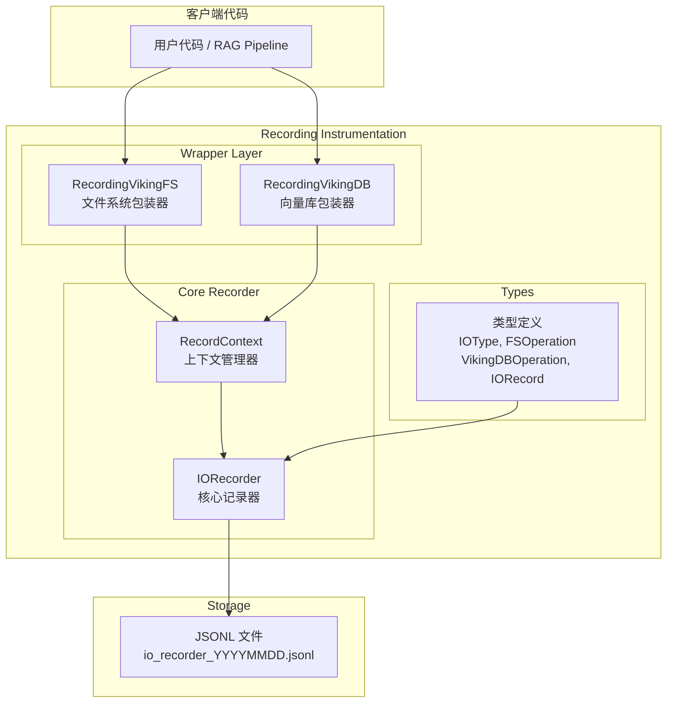
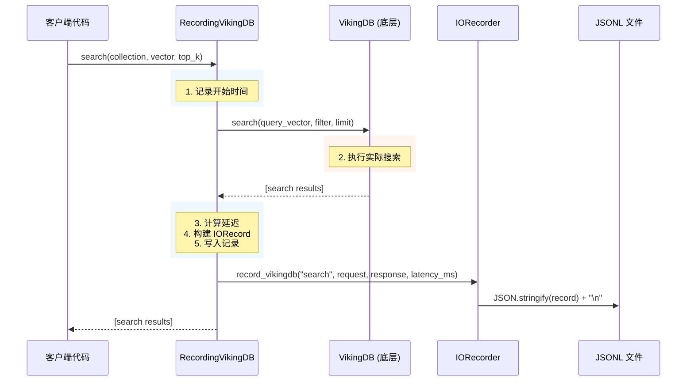
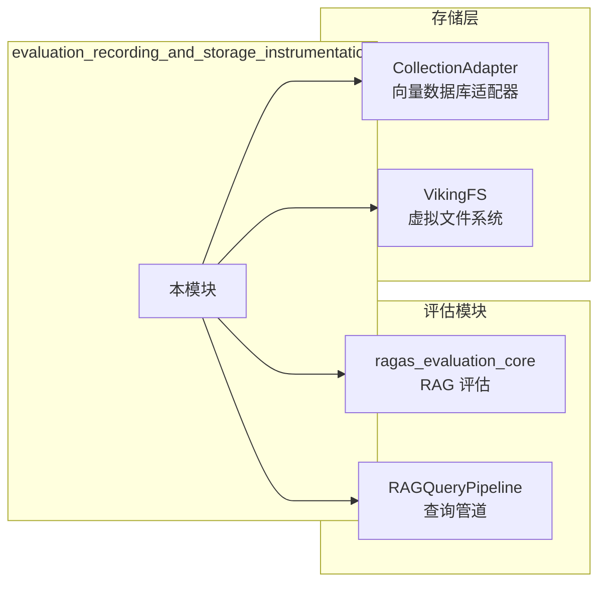

# evaluation_recording_and_storage_instrumentation

## 概述

想象一下：你正在构建一个复杂的 RAG（检索增强生成）系统，它涉及文件系统的读取、向量数据库的搜索、内容的索引等大量 IO 操作。当系统出现性能问题或结果不符合预期时，你如何定位问题？是搜索速度太慢？还是读取了错误的内容？抑或是某个特定的文档处理逻辑有问题？

**`evaluation_recording_and_storage_instrumentation` 模块就是这个问题的答案**——它是一个 IO 操作录制与存储的仪表盘系统，能够完整地记录系统中所有文件系统操作和向量数据库操作的请求、响应、延迟甚至内部调用细节。这些记录可以被用于：
- **性能分析**：识别慢速操作
- **Bug 复现**：通过记录回放问题场景
- **评估基准**：构建可重复的测试数据集
- **审计追踪**：了解系统行为的完整轨迹

简单来说，这个模块就像飞机的黑匣子——它默默记录着系统的一举一动，在你需要的时候提供诊断所需的所有信息。

## 架构概览



### 核心组件与职责

| 组件 | 文件 | 职责 |
|------|------|------|
| **IORecorder** | `recorder.py` | 核心记录器，单例模式管理，将记录写入 JSONL 文件 |
| **RecordContext** | `recorder.py` | 上下文管理器，自动测量延迟，捕获异常并记录 |
| **RecordingVikingFS** | `wrapper.py` | VikingFS 包装器，透明拦截所有文件系统操作 |
| **RecordingVikingDB** | `wrapper.py` | 向量数据库包装器，透明拦截所有 CRUD 操作 |
| **类型定义** | `types.py` | IO 操作类型枚举和记录数据结构 |

### 数据流追踪

当一个典型的 RAG 查询执行时，数据流向如下：



## 设计决策与权衡

### 1. 为什么选择 JSONL 而不是数据库？

**决策**：使用 JSONL（JSON Lines）格式存储记录，而非关系型数据库或专用时序数据库。

**权衡分析**：
- **优点**：
  - 实现简单，无需额外依赖
  - 支持追加写入，高并发友好
  - 人类可读，便于调试
  - 可以用 `grep`、`jq` 等工具直接分析
- **缺点**：
  - 大规模数据查询效率低
  - 不支持索引，统计分析需要加载全部数据
  - 文件会不断增大

**选择理由**：在评估场景下，记录数据量可控（通常是一次评估运行产生的数据），且优先考虑调试便利性而非大规模分析能力。

### 2. 为什么使用装饰器模式而非继承？

**决策**：使用包装器（Wrapper）模式而非让 VikingFS/VikingDB 继承记录功能。

**权衡分析**：
- **装饰器模式优点**：
  - 透明接入，无需修改原有类
  - 可以在运行时动态启用/禁用
  - 保持原有接口不变
- **继承方案缺点**：
  - 强耦合，修改核心类
  - 无法在运行时切换

**选择理由**：保持核心组件的纯净性，录制功能是横切关注点，使用 AOP 式的包装更符合开闭原则。

### 3. 为什么单例模式而非依赖注入？

**决策**：使用单例模式的 `IORecorder` 而非通过依赖注入管理。

**权衡分析**：
- **单例优点**：
  - 全局唯一，无需在各处传递
  - 简化使用，符合直觉
- **依赖注入优点**：
  - 便于测试，可替换 mock
  - 明确的依赖关系

**选择理由**：记录器是全局基础设施，单例简化了接入成本。但这也意味着测试时需要特别注意隔离。

### 4. 为什么区分 FS 和 VikingDB 两种 IO 类型？

**决策**：分别记录文件系统操作和向量数据库操作，使用不同的枚举和记录方法。

**权衡分析**：
- **分类优点**：
  - 语义清晰，便于统计
  - 可以针对不同类型做不同分析
  - AGFS 调用仅与文件系统操作相关
- **统一方案**：
  - 统一接口，代码更简洁

**选择理由**：在 RAG 系统中，文件系统操作（读文件、解析代码）和向量数据库操作（搜索、过滤）有本质区别，分别记录便于针对性地分析性能瓶颈。

## 子模块说明

### 1. recorder_core

`recorder.py` 包含模块的核心基础设施：

- **IORecorder**：单例记录器，负责将记录写入文件，支持启用/禁用切换
- **RecordContext**：上下文管理器，提供 `with` 语法的便捷接口，自动处理计时和异常
- **辅助函数**：`get_recorder()`、`init_recorder()`、`create_recording_agfs_client()`

详细内容见 [evaluation_recording_and_storage_instrumentation-recorder_core](./evaluation_recording_and_storage_instrumentation-recorder_core.md)

### 2. recording_types

`types.py` 定义了模块使用的所有类型：

- **IOType**：IO 操作类型枚举（FS, VIKINGDB）
- **FSOperation**：文件系统操作枚举（read, write, ls, stat 等）
- **VikingDBOperation**：向量数据库操作枚举（insert, upsert, search 等）
- **IORecord**：单条记录的数据结构
- **AGFSCallRecord**：AGFS 底层调用的记录

详细内容见 [evaluation_recording_and_storage_instrumentation-recording_types](./evaluation_recording_and_storage_instrumentation-recording_types.md)

### 3. storage_wrappers

`wrapper.py` 实现了透明的包装器：

- **RecordingVikingFS**：包装 VikingFS，拦截所有文件操作，记录 AGFS 底层调用
- **RecordingVikingDB**：包装 VikingDB，拦截所有向量数据库操作
- **_AGFSCallCollector**：辅助类，用于收集 VikingFS 内部的 AGFS 调用

详细内容见 [evaluation_recording_and_storage_instrumentation-storage_wrappers](./evaluation_recording_and_storage_instrumentation-storage_wrappers.md)

## 与其他模块的关联



### 上游依赖

- **ragas_evaluation_core**：评估模块使用录制功能来收集评估过程中的 IO 数据
- **RAGQueryPipeline**：RAG 管道可以使用录制功能来诊断检索问题

### 下游依赖

- **VikingDB（向量数据库）**：`RecordingVikingDB` 包装的底层向量数据库
- **VikingFS（虚拟文件系统）**：`RecordingVikingFS` 包装的虚拟文件系统
- **AGFS Client**：VikingFS 底层的 AGFS 协议客户端

## 使用指南

### 快速开始

```python
from openviking.eval.recorder import init_recorder, get_recorder

# 1. 初始化录制器
init_recorder(enabled=True, records_dir="./evaluation_records")

# 2. 包装你的 VikingDB 实例
from openviking.eval.recorder.wrapper import RecordingVikingDB
db = RecordingVikingDB(original_vikingdb)

# 3. 正常使用，operations 会被自动记录
results = await db.search(collection="docs", vector=query_embedding, top_k=5)

# 4. 查看统计数据
recorder = get_recorder()
stats = recorder.get_stats()
print(f"Total operations: {stats['total_count']}")
print(f"Total latency: {stats['total_latency_ms']}ms")
```

### 记录 AGFS 底层调用

对于 VikingFS 操作，还可以记录其内部对 AGFS 的调用：

```python
from openviking.eval.recorder.wrapper import RecordingVikingFS

# RecordingVikingFS 会自动收集 AGFS 底层调用
fs = RecordingVikingFS(viking_fs)
content = await fs.read(uri="viking://project/main.py")

# 查看记录中包含的 AGFS 调用
records = get_recorder().get_records()
for record in records:
    if record.operation == "read":
        print(f"AGFS calls made: {len(record.agfs_calls)}")
        for call in record.agfs_calls:
            print(f"  - {call.operation}: {call.latency_ms}ms")
```

## 潜在问题与注意事项

### 1. 线程安全

`IORecorder` 使用 `threading.Lock` 保护文件写入，但：
- 多个进程同时写入同一文件可能导致竞争条件
- 建议在多进程场景下使用不同的 `record_file` 参数

### 2. 大响应数据的序列化

默认的 `_serialize_response` 方法会将响应转换为字符串：
- 对于大量数据的操作（如 `read` 返回整个文件内容），记录文件会快速膨胀
- 如需限制，可以自定义序列化逻辑或启用条件录制

### 3. 异步方法的包装

`RecordingVikingFS` 使用 `inspect.iscoroutinefunction` 判断异步方法：
- 如果底层 VikingFS 的方法签名不标准，可能无法正确包装
- 目前已硬编码支持的操作列表

### 4. 单例状态管理

`IORecorder` 是全局单例：
- 在测试中使用 `init_recorder()` 会影响其他测试
- 测试前需要调用 `init_recorder(enabled=False)` 重置状态

---

*本模块是评估与诊断基础设施的关键组成部分，通过透明拦截 IO 操作，为性能分析和问题诊断提供了可靠的数据来源。*