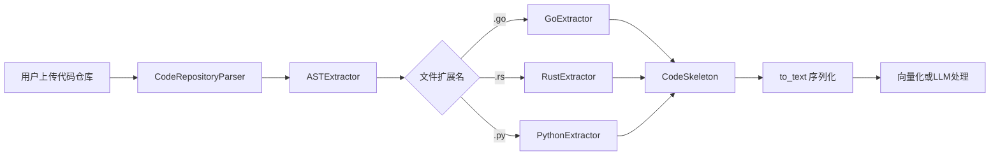

# GoExtractor 模块技术深度解析

## 概述

`GoExtractor` 是 OpenViking 系统中用于解析 Go 语言源代码的 AST（抽象语法树）提取器。它是语言特定提取器家族的一员，与 `RustExtractor`、`CppExtractor`、`PythonExtractor` 等共同构成了代码仓库理解的基础设施。该模块的核心职责是将原始 Go 源代码转换为一个结构化的「代码骨架」（CodeSkeleton），其中包含文件中的导入声明、函数/方法签名、结构体/接口定义以及关联的文档注释。

理解这个模块的关键在于把握它解决的一个根本问题：在无需调用大型语言模型（LLM）的情况下，如何快速、准确地从代码仓库中提取出足够用于语义检索和理解的结构化信息。传统的做法是将整个代码文件发送给 LLM，这不仅成本高昂，而且在处理大型代码库时效率低下。`GoExtractor` 采用 tree-sitter 这样的轻量级 AST 解析器，以极低的计算开销生成代码的结构化表示，这个骨架随后可以用于生成嵌入向量、回答代码相关问题，或者作为 LLM 的精简输入。

## 架构定位与数据流

在整体的解析流水线中，`GoExtractor` 位于 `ASTExtractor` 的下游。`ASTExtractor`（定义于 `openviking/parse/parsers/code/ast/extractor.py`）是一个调度器，它根据文件扩展名确定目标语言，然后延迟加载对应的提取器实例。当用户上传一个 Go 代码仓库时，流水线大致如下运作：

```
用户上传仓库 → CodeRepositoryParser 获取源码 
    → ASTExtractor.detect_language() 识别 .go 文件
    → ASTExtractor._get_extractor("go") 加载 GoExtractor
    → GoExtractor.extract(file_name, content) 返回 CodeSkeleton
    → skeleton.to_text() 生成可读的结构化文本
    → 文本发送给向量化模型或 LLM
```

这个设计体现了一个重要的架构原则：**关注点分离**。`ASTExtractor` 负责语言检测和提取器生命周期管理，而每个具体的提取器（如 `GoExtractor`）则专注于特定语言的 AST 遍历和结构提取。这种模式使得添加新语言支持变得非常简单——只需创建一个新的Extractor类并将其注册到 `_EXTRACTOR_REGISTRY` 字典中。



## 核心组件剖析

### LanguageExtractor 抽象基类

所有语言提取器都继承自 `LanguageExtractor`（定义于 `openviking/parse/parsers/code/ast/languages/base.py`）。这个抽象基类定义了一个极其简洁的接口：

```python
class LanguageExtractor(ABC):
    @abstractmethod
    def extract(self, file_name: str, content: str) -> CodeSkeleton:
        """Extract code skeleton from source. Raises on unrecoverable error."""
```

这个设计看似简单，但蕴含着深刻的考量。要求所有提取器返回统一的 `CodeSkeleton` 意味着上游消费者（如 `ASTExtractor`）无需关心目标语言的具体语法细节，它们只需要理解这个通用的数据结构。这种**协议导向的设计**使得系统能够轻松扩展，同时也便于测试——你可以轻松地为任何语言编写一个 mock extractor，只要它返回正确的 `CodeSkeleton` 结构。

### CodeSkeleton 数据结构

`CodeSkeleton`（定义于 `openviking/parse/parsers/code/ast/skeleton.py`）是整个提取系统的核心数据类型。它将源代码的结构信息分解为以下几个部分：

- **imports**: 扁平化的导入语句列表，例如 `["fmt", "os", "context.Context"]`
- **classes**: 类/结构体/接口的列表，每个包含名称、基类、文档字符串和方法列表
- **functions**: 顶级函数列表，每个包含名称、参数、返回类型和文档字符串
- **module_doc**: 模块级文档注释

这个数据结构的设计平衡了两个看似矛盾的需求：一方面，它需要足够丰富以捕获代码的结构语义；另一方面，它又必须足够精简以保持高效的序列化和处理。`to_text()` 方法提供了两种序列化模式——简洁模式（仅包含第一行文档注释，适合用于嵌入生成）和详细模式（保留完整文档，适合作为 LLM 输入）。

### GoExtractor 的实现机制

`GoExtractor` 的实现展示了如何将通用框架适配到特定语言的语法特性。理解其工作原理需要首先理解 Go 语言的一些独特语法：

```python
class GoExtractor(LanguageExtractor):
    def __init__(self):
        import tree_sitter_go as tsgo
        from tree_sitter import Language, Parser

        self._language = Language(tsgo.language())
        self._parser = Parser(self._language)
```

在初始化阶段，`GoExtractor` 加载 tree-sitter-go 语言库并创建一个 parser 实例。这里采用了一个有趣的模式：依赖项是在 `__init__` 方法内部动态导入的，而不是在模块级别。这是一种**延迟加载**策略——tree-sitter 库和相关语言包只有在实际需要解析 Go 代码时才会被加载，这有助于减少启动时的内存占用，同时也为优雅降级提供了可能（如果某个语言包不可用，可以捕获 ImportError 并返回 None，触发 LLM 回退）。

### 核心提取逻辑

`extract` 方法是整个类的核心，它执行以下步骤：

**第一步：解析源代码为 AST**

```python
content_bytes = content.encode("utf-8")
tree = self._parser.parse(content_bytes)
root = tree.root_node
```

将源代码编码为字节串后，tree-sitter 解析器返回一个包含完整 AST 的树对象。每个节点都有 `type`（节点类型，如 `function_declaration`、`import_spec`）、`start_byte` 和 `end_byte`（在源码中的位置）等属性。

**第二步：遍历顶层声明**

```python
siblings = list(root.children)
for idx, child in enumerate(siblings):
    if child.type == "import_declaration":
        # 处理 import 语句
    elif child.type in ("function_declaration", "method_declaration"):
        # 处理函数/方法
    elif child.type == "type_declaration":
        # 处理类型定义（struct/interface）
```

Go 的 AST 结构与文件内容顺序基本一致，因此通过简单的顺序遍历就可以捕获所有顶层声明。这里需要特别注意的是 `idx` 参数的传递——它用于定位当前节点在兄弟节点列表中的位置，这对于提取前置的文档注释至关重要。

**第三步：提取函数和方法**

```python
def _extract_function(node, content_bytes: bytes, docstring: str = "") -> FunctionSig:
    name = ""
    params = ""
    return_type = ""
    is_method = node.type == "method_declaration"
    param_list_count = 0

    for child in node.children:
        if child.type == "identifier" and not name:
            name = _node_text(child, content_bytes)
        elif child.type == "field_identifier" and not name:
            name = _node_text(child, content_bytes)
        elif child.type == "parameter_list":
            param_list_count += 1
            if is_method and param_list_count == 1:
                continue  # 跳过 receiver 参数
            # ... 提取参数和返回类型
```

这个函数展示了一个微妙的设计决策：Go 的方法声明（`method_declaration`）与函数声明（`function_declaration`）在 AST 结构上非常相似，但方法有一个额外的 receiver 参数（通常是 `func (s *Server) MethodName()` 中的 `(s *Server)` 部分）。通过维护一个计数器并在第一个参数列表时跳过处理，提取器能够正确区分方法和函数。

**第四步：处理文档注释**

```python
def _preceding_doc(siblings: list, idx: int, content_bytes: bytes) -> str:
    """Collect consecutive // comment lines immediately before siblings[idx]."""
    lines = []
    i = idx - 1
    while i >= 0 and siblings[i].type == "comment":
        raw = _node_text(siblings[i], content_bytes).strip()
        if raw.startswith("//"):
            raw = raw[2:].strip()
        lines.insert(0, raw)
        i -= 1
    return "\n".join(lines).strip()
```

Go 的官方文档约定是使用行注释 `//` 而非块注释 `/**/`。`_preceding_doc` 函数通过向前遍历兄弟节点列表，收集所有连续的注释行，并将它们合并为一个文档字符串。这个实现假设注释与声明之间没有其他节点间隔——这符合 Go 的代码风格约定。

**第五步：提取结构体和接口**

```python
def _extract_struct(node, content_bytes: bytes, docstring: str = "") -> ClassSkeleton:
    name = ""
    for child in node.children:
        if child.type == "type_identifier":
            name = _node_text(child, content_bytes)
            break
    return ClassSkeleton(name=name, bases=[], docstring=docstring, methods=[])
```

在 Go 中，`type_declaration` 可以包含 `type_spec`，而 `type_spec` 的子节点可能是 `struct_type`（结构体）或 `interface_type`（接口）。由于 Go 不支持传统意义上的类继承（`bases` 列表为空），结构体和接口都被建模为 `ClassSkeleton`，这是一种**向上抽象**的设计决策——用统一的类型表示 Go 中不同的类型声明。

## 设计决策与权衡

### tree-sitter vs 传统解析器

选择 tree-sitter 作为解析引擎是一个经过深思熟虑的决定。传统的解析器（如 Go 官方的 `go/parser`）通常与语言版本紧耦合，并且只能解析该语言本身的代码。tree-sitter 则是一个**增量解析框架**，它通过构建具体的语法树来理解代码结构，具有以下优势：

- **语言无关的核心框架**：tree-sitter 的核心解析器是语言无关的，只需要为每种语言提供一个语法定义（Grammar）即可
- **增量解析能力**：当代码发生小幅修改时，tree-sitter 可以只重新解析变更的部分，而非整个文件
- **易于扩展**：添加新语言支持不需要修改核心框架

然而，tree-sitter 也有其局限性。由于它生成的是**具体语法树**（Concrete Syntax Tree）而非**抽象语法树**（Abstract Syntax Tree），树结构中包含大量语法细节节点，需要提取器编写者手动遍历和过滤。在 `GoExtractor` 中，你可以看到大量的 `for child in node.children` 循环，这正是在过滤和提取关键信息。

### 错误处理策略

`GoExtractor` 的设计中有一个重要的原则：**快速失败并降级**。在 `ASTExtractor.extract_skeleton()` 方法中，任何提取过程中的异常都会被捕获，并触发 LLM 回退：

```python
try:
    skeleton: CodeSkeleton = extractor.extract(file_name, content)
    return skeleton.to_text(verbose=verbose)
except Exception as e:
    logger.warning("AST extraction failed for '%s' (language: %s), falling back to LLM: %s", 
                   file_name, lang, e)
    return None
```

这种策略背后的逻辑是：AST 提取是一个**优化**而非**必需**的功能。如果提取失败（可能由于不完整的 tree-sitter 语法支持、代码中的语法错误或其他边缘情况），系统应该优雅地回退到 LLM 方案，而不是让整个解析流程失败。这是一种**防御性编程**的体现，它确保了系统的健壮性。

### 延迟初始化模式

`GoExtractor` 在 `__init__` 中初始化 tree-sitter parser，而 `ASTExtractor` 则采用延迟加载策略——直到第一次需要解析特定语言的代码时，才真正导入和实例化对应的提取器。这种模式有以下考量：

- **资源效率**：如果用户从不解析 Go 代码，就不会加载任何 Go 相关的依赖
- **错误隔离**：如果某个语言包安装不完整，影响范围仅限于该语言，不会阻止其他语言的解析
- **缓存友好**：一旦加载，提取器实例会被缓存（`self._cache` 字典），后续调用直接复用

### 文档注释提取的简化假设

`_preceding_doc` 函数的实现基于一个重要的假设：**文档注释必须直接位于声明之前，中间不能有其他节点**。在格式化良好的 Go 代码中，这通常是成立的，但如果开发者在注释和声明之间留有空行，或者在注释中插入了非注释节点，这个函数可能无法正确捕获文档。

这是一个**务实 vs 完美的权衡**。要实现完美的文档注释提取，需要更复杂的 AST 遍历逻辑和位置计算，但这会增加代码复杂度和维护成本。当前的实现覆盖了 95% 的常见用例，对于边缘情况，系统会回退到 LLM 来提取文档信息。

## 依赖分析与契约

### 上游依赖

`GoExtractor` 的直接调用者是 `ASTExtractor`，后者通过以下契约使用前者：

- **输入契约**：
  - `file_name`: 字符串，必须是有效的文件名字符串（用于提取扩展名，但当前未被使用）
  - `content`: 字符串，必须是有效的 UTF-8 编码的 Go 源代码
  
- **输出契约**：
  - 返回 `CodeSkeleton` 实例，其中 `language` 字段必须设置为 `"Go"`
  - 如果解析失败，抛出异常（由调用方 `ASTExtractor` 捕获并处理）

### 下游依赖

`GoExtractor` 依赖以下组件：

- **tree-sitter-go**: Go 语言的语法定义和解析逻辑
- **tree-sitter**: 核心解析框架
- **CodeSkeleton 数据类**: 定义于 `skeleton.py`，提供数据结构和序列化方法

这些依赖都是通过动态导入获取的，这使得 `GoExtractor` 可以在运行时检测缺失的依赖并优雅降级。

### 数据流

从数据流动的角度看，信息流是这样的：

```
原始 Go 源代码 (str)
    ↓
encode("utf-8") → content_bytes (bytes)
    ↓
tree_sitter.Parser.parse() → tree (ParseTree)
    ↓
遍历 AST 节点 → 识别 import/function/type 声明
    ↓
提取文本片段 (_node_text) → 构建 FunctionSig/ClassSkeleton 对象
    ↓
组装为 CodeSkeleton → 返回给 ASTExtractor
    ↓
CodeSkeleton.to_text() → 结构化文本字符串
    ↓
发送给向量化模型或 LLM
```

## 使用指南与扩展点

### 何时使用 GoExtractor

`GoExtractor` 主要用于以下场景：

1. **代码仓库索引**：当你需要为一个 Go 代码仓库建立语义搜索索引时，使用 AST 提取的骨架文本作为向量化输入，比发送完整的源代码更加高效且成本更低
2. **代码理解辅助**：在向 LLM 发送代码之前，先提取骨架可以让 LLM 更专注于理解代码结构而非在海量细节中迷失
3. **静态分析工具**：任何需要理解 Go 代码结构的工具都可以使用这个提取器作为轻量级的代码理解前端

### 如何添加对新语言的支持

如果你需要添加对另一种语言（比如 Ruby）的支持，可以按照以下步骤操作：

1. 创建新文件 `openviking/parse/parsers/code/ast/languages/ruby.py`
2. 定义一个继承自 `LanguageExtractor` 的类 `RubyExtractor`
3. 实现 `extract` 方法，使用 tree-sitter-ruby 解析代码并返回 `CodeSkeleton`
4. 在 `extractor.py` 的 `_EXT_MAP` 和 `_EXTRACTOR_REGISTRY` 中注册新语言

整个过程无需修改现有代码，体现了开放-封闭原则（Open-Closed Principle）。

### 性能注意事项

在处理大型代码仓库时，以下几点值得注意：

- **解析是 CPU 密集型操作**：tree-sitter 的解析过程是纯 CPU 计算，不涉及 I/O。在多核系统上，可以考虑并行化处理多个文件
- **缓存的重要性**：`ASTExtractor` 已经内置了提取器实例缓存，但在处理非常大量的文件时，可以考虑进一步缓存解析结果
- **内存使用**：对于超大型文件，tree-sitter 可能会消耗较多内存。如果遇到内存问题，可以考虑在解析前检查文件大小并设置上限

## 边缘情况与已知限制

### 不支持的 Go 特性

当前的 `GoExtractor` 实现主要关注代码的**结构信息**（函数签名、类型定义、导入语句），而以下特性未包含在提取范围内：

- **函数体实现**：只提取函数签名，不包含函数体内部的代码逻辑
- **变量声明和常量**：提取器不捕获 `var` 和 `const` 声明
- **内置类型和函数**：如 `make`、`new`、`len` 等内置标识符不会被特别标注
- **测试文件**：`.go` 测试文件（以 `_test.go` 结尾）会被解析，但测试相关的特性（如 `*_test` 函数、表组测试等）未做特殊处理

### 已知的边缘情况

1. **嵌套类型声明**：Go 允许在函数内部定义类型，当前的提取器只处理顶层声明
2. **泛型（Generics）**：Go 1.18 引入的泛型语法可能在某些情况下未被完整支持
3. **cgo 和特殊注释**：涉及 cgo 的代码或特殊的构建指令可能产生意外的解析结果
4. **非标准格式化代码**：使用非标准格式（如不常见的代码风格工具生成的代码）可能导致 AST 结构与预期不符

### 错误恢复

当遇到无法解析的代码时，系统会自动回退到 LLM 方案。如果你希望在代码层面处理更多边缘情况，可以考虑：

- 增加更多的节点类型处理分支
- 使用更宽松的错误处理（如捕获特定异常并返回部分结果）
- 在提取结果中添加警告信息，标记可能的不完整之处

## 总结

`GoExtractor` 是 OpenViking 代码理解流水线中的一个关键组件，它以极低的计算成本提供了 Go 代码的结构化表示。通过使用 tree-sitter 这一现代解析框架，它实现了快速、准确的代码骨架提取，为后续的语义检索和智能问答奠定了基础。

该模块的设计体现了几个重要的软件工程原则：关注点分离（ASTExtractor 与具体语言提取器的职责分离）、开放-封闭原则（易于添加新语言支持）、防御性编程（优雅降级到 LLM）以及延迟加载（优化资源使用）。理解这些设计决策不仅有助于有效地使用这个模块，也为在其他上下文中构建类似的提取系统提供了有价值的参考。