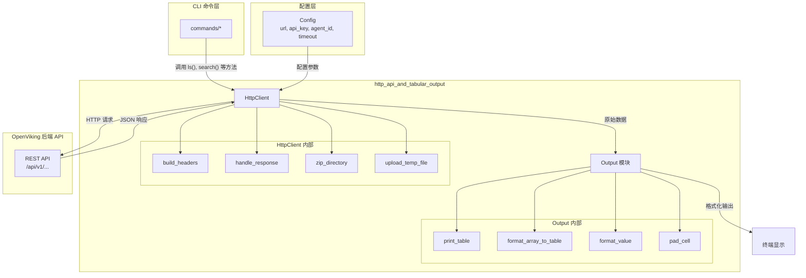

# http_api_and_tabular_output

## 模块概述

`http_api_and_tabular_output` 是 OpenViking CLI 的核心通信与展示层，负责两件看似简单但至关重要的事情：**如何与后端服务器对话**，以及**如何把服务器返回的数据呈现给用户**。

如果你把 OpenViking CLI 想象成一个"中间人"——一端坐着用户，另一端是远程 API 服务——那么这个模块就是这部电话的听筒和显示屏：它把用户的指令翻译成网络请求，把服务器的回复翻译成人能看懂的表格或 JSON。

这个模块包含两个核心组件：

- **HttpClient** (`crates/ov_cli/src/client.rs`)：一个面向 OpenViking API 的高级 HTTP 客户端，封装了认证、请求构建、响应解析、错误处理以及目录上传等复杂逻辑。
- **输出格式化** (`crates/ov_cli/src/output.rs`)：一套智能的数据渲染引擎，能够根据 JSON 数据的结构自动选择最佳展示方式——无论是表格、JSON 文本，还是混合布局。

## 架构概览



**数据流解读**：

1. **命令发起**：用户在终端输入命令（如 `viking ls /resources`），CLI 命令模块调用 `HttpClient` 的对应方法
2. **请求构建**：`HttpClient` 根据方法参数构建请求，包括 URL、查询参数、请求体，并调用 `build_headers()` 添加认证头
3. **网络传输**：通过 `reqwest` 库发送 HTTP 请求到后端 API
4. **响应处理**：`handle_response()` 方法接收响应，解析 JSON，处理 HTTP 错误和业务错误
5. **格式化输出**：返回的 JSON 数据传递给 `output_success()`，后者分析数据结构，选择合适的渲染策略
6. **终端显示**：格式化后的文本输出到终端

## 核心设计决策

### 1. HttpClient 的"本地服务器优先"策略

**决策**：`HttpClient` 有一个 `is_local_server()` 方法，用于检测目标服务器是否是本地服务（localhost 或 127.0.0.1）。

**为什么这么做**：当用户添加一个本地目录作为资源时，如果目标服务器是远程的，客户端需要先将目录压缩成 ZIP 上传到服务器。但如果目标服务器就是本地（开发调试场景），直接传路径即可，无需上传。

```rust
// 关键逻辑在 add_resource 方法中
if path_obj.exists() && path_obj.is_dir() && !self.is_local_server() {
    // 需要压缩上传
    let zip_file = self.zip_directory(path_obj)?;
    let temp_path = self.upload_temp_file(zip_file.path()).await?;
    // ...
} else {
    // 本地服务器，直接传路径
    // ...
}
```

这是一个**简单的配置优于复杂的自动检测**的案例。另一种选择是根据服务器能力动态判断是否支持路径直传，但这会增加复杂度且收益有限。

### 2. 智能表格格式化：基于启发式的布局选择

**决策**：`output.rs` 中的表格格式化不是简单的"所有对象转表格"，而是根据数据的**形状**（shape）选择不同的渲染策略。

**为什么这么做**：CLI 输出的数据形状各异——有时是一个对象列表，有时是一个包含多个数组的复杂对象，有时只有单个键值对。如果用单一策略渲染，往往效果很差。

代码中实现了**六条渲染规则**（Rule 1-6），按优先级依次尝试：

| 规则 | 数据形态 | 渲染策略 |
|------|----------|----------|
| Rule 1 | `list[dict]`（对象数组） | 多行表格，每个对象一行 |
| Rule 2 | 多个 `list[dict]` | 扁平化为单一表格，添加 `type` 列区分来源 |
| Rule 3a | 单个 `list[primitive]` | 每项一行，去掉列表名后缀（`items` → `item`） |
| Rule 3b | 单个 `list[dict]` | 直接渲染为表格 |
| Rule 4 | 普通对象（无列表） | 单行横向表格，键值对形式 |
| Rule 5 | ComponentStatus（`name + is_healthy + status`） | 特殊格式的健康状态显示 |
| Rule 6 | SystemStatus（`is_healthy + components`） | 组合多个组件的健康状态 |

** tradeoff 分析**：这种启发式方法灵活但不可预测。好处是能处理大多数常见情况，坏处是用户可能对某些边界情况的输出形式感到意外。对于需要确定性输出的场景，应该使用 JSON 格式。

### 3. 统一的错误处理抽象

**决策**：`HttpClient` 的 `handle_response()` 方法同时处理 HTTP 状态码错误和 API 层面的业务错误。

```rust
async fn handle_response<T: DeserializeOwned>(&self, response: reqwest::Response) -> Result<T> {
    // 1. 检查 HTTP 状态码
    if !status.is_success() {
        return Err(Error::Api(error_msg));
    }
    
    // 2. 检查 API 错误（HTTP 200 但 body 有 error 字段）
    if let Some(error) = json.get("error") {
        if !error.is_null() {
            return Err(Error::Api(format!("[{}] {}", code, message)));
        }
    }
    
    // 3. 提取结果（可能是 wrapped 或 raw）
    // ...
}
```

**为什么这么做**：有些 API 设计会返回 HTTP 200 但在 body 中携带错误信息（如 `{"error": {...}}`），尤其是在微服务架构中常见。统一处理避免了调用者需要写两层错误检查。

### 4. URI 列的特殊处理

**决策**：在表格格式化中，名为 `uri` 的列享受特殊待遇——**不截断**。

```rust
fn truncate_string(s: &str, is_uri: bool, max_width: usize) -> (String, bool) {
    // URI 列：永不截断
    if is_uri {
        return (s.to_string(), true);
    }
    // 普通列：按宽度截断
    // ...
}
```

**为什么这么做**：URI 通常是长字符串，包含完整路径信息。截断 URI 会让用户无法复制完整链接或辨识资源身份，这与 CLI 工具的可操作性原则相悖。

## 子模块说明

虽然这个模块只有两个代码文件，但它们各自承担清晰的职责，可以视为逻辑上的子模块：

| 子模块 | 文件 | 职责 |
|--------|------|------|
| **HTTP 客户端层** | `crates/ov_cli/src/client.rs` | 负责与 OpenViking 后端 API 的所有通信，包括请求构建、响应解析、认证、文件上传 |
| **表格输出层** | `crates/ov_cli/src/output.rs` | 负责将 JSON 数据智能渲染为人类可读的终端输出，支持表格和 JSON 两种格式 |

详细内容请参考：

- [rust_cli_interface-http_api_and_tabular_output-http_client](./rust_cli_interface-http_api_and_tabular_output-http_client.md) - HTTP 客户端层详解，包含请求构建、响应处理、认证机制和文件上传流程
- [http-api-and-tabular-output](./http-api-and-tabular-output.md) - 表格输出层详解，包含启发式渲染规则、Unicode 处理和列对齐策略

## 与其他模块的关系

### 上游依赖

```
http_api_and_tabular_output
├──↑── cli_bootstrap_and_runtime_context (rust_cli_interface)
│       └── Config（配置注入：url, api_key, agent_id, timeout）
├──↑── parsing_and_resource_detection (如果资源需要先被解析)
└──↑── server_api_contracts (API 契约类型定义)
```

### 下游消费者

```
http_api_and_tabular_output
├──↓── CLI 命令模块 (crates/ov_cli/src/commands/*)
│       ├── filesystem.rs  ──→ ls(), tree(), mkdir(), rm(), mv(), stat()
│       ├── search.rs      ──→ find(), search(), grep(), glob()
│       ├── resources.rs   ──→ add_resource(), add_skill()
│       ├── content.rs     ──→ read(), abstract_content(), overview()
│       ├── relations.rs   ──→ relations(), link(), unlink()
│       ├── pack.rs        ──→ export_ovpack(), import_ovpack()
│       ├── admin.rs       ──→ admin_* 系列方法
│       └── session.rs, observer.rs, system.rs
└──↓── tui_application_orchestration
        └── TUI 内部可能也使用 output 模块做数据显示
```

### 关键数据契约

- **HttpClient** 的方法返回值大多是 `Result<T>`，其中 `T` 通常是 `serde_json::Value` 或具体结构体
- **output_success** 接受任何 `Serialize` 类型，自动转为 JSON 再分析结构
- 错误类型统一为 `crate::error::Error` 枚举：`Config`, `Network`, `Api`, `Client`, `Parse`, `Output`, `Io`, `Serialization`, `Zip`
- 错误类型定义在 `crates/ov_cli/src/error.rs` 中，提供了从各种错误类型到 `CliError` 的转换实现

## 新贡献者注意事项

### 1. 本地服务器检测的边界条件

```rust
fn is_local_server(&self) -> bool {
    if let Ok(url) = Url::parse(&self.base_url) {
        if let Some(host) = url.host_str() {
            return host == "localhost" || host == "127.0.0.1";
        }
    }
    false
}
```

**注意**：这个检测只识别 `localhost` 和 `127.0.0.1`。如果用户配置了 `127.0.0.2` 或自定义域名指向本地，将走远程上传逻辑，可能导致不必要的上传。另外，注意 `Url::parse` 可能失败（无效 URL），此时默认返回 `false`。

### 2. Rust Edition 2024 的影响

**关键观察**：`Cargo.toml` 中使用了 `edition = "2024"`，这是一个相对较新的 Rust edition。这意味着：

- 编译环境需要支持 Rust 1.85 或更高版本
- 项目可以享受最新的语言特性（如 async closures、never type 等）
- 如果你在较低版本的 Rust 环境中尝试构建项目，会遇到兼容性问题

```toml
[package]
edition = "2024"  # 需要 Rust 1.85+
```

### 3. TLS 选型：rustls vs native-tls

**关键观察**：`reqwest` 依赖使用了 `rustls-tls` 而非默认的 `native-tls`：

```toml
reqwest = { version = "0.12", features = ["json", "multipart", "rustls-tls"], default-features = false }
```

**设计意图**：
- `rustls` 是纯 Rust 实现的 TLS 库，不依赖 OpenSSL 或其他系统库
- 这使得 CLI 在不同平台上的构建更加一致（避免链接 OpenSSL 兼容层的问题）
- 但这也可能导致某些企业环境下的证书验证行为与系统默认不同

如果你需要使用系统证书存储，可能需要切换到 `native-tls` 特性。

### 4. 表格格式化的"魔法数字"

```rust
const MAX_COL_WIDTH: usize = 256;          // 单列最大宽度
const MAX_COL_ALIGN_WIDTH: usize = 120;    // 对齐计算时的封顶（代码中实际未使用，但暗示了意图）
```

这些数字是硬编码的。如果你需要支持更宽的终端或更窄的列，需要修改这些常量。`MAX_COL_WIDTH` 影响截断逻辑，`MAX_COL_ALIGN_WIDTH`（虽然代码中未使用）暗示了设计者认为超过一定宽度的列应该被截断而非无限撑开。

### 5. 空响应处理

```rust
if status == StatusCode::NO_CONTENT || status == StatusCode::ACCEPTED {
    return serde_json::from_value(Value::Null)
        // ...
}
```

注意：`ACCEPTED`（202）通常表示异步操作已接受但未完成。这种情况返回 `Value::Null`，调用者需要理解这不代表错误。如果你的命令期望有返回数据却得到 202，需要有额外的业务逻辑处理。

### 6. 输出格式的"降级"行为

当 `print_table` 无法将数据渲染为表格时，会**降级**为 JSON 输出：

```rust
// Default: JSON output
if compact {
    println!("{}", serde_json::to_string(&result).unwrap_or_default());
} else {
    println!("{}", serde_json::to_string_pretty(&result).unwrap_or_default());
}
```

这意味着如果启发式规则都无法匹配数据结构，用户最终会看到 JSON。这种设计保证了**永不言败**的输出——总会有东西显示出来。但可能让用户困惑：为什么有些输出是表格，有些是 JSON？

### 7. 认证头的构建时机

```rust
fn build_headers(&self) -> reqwest::header::HeaderMap {
    // 每次请求都重新构建
    // ...
}
```

当前实现是每次请求都重新构建 HeaderMap。对于高频调用场景，这有一些微小开销。更高效的做法是缓存已构建的 HeaderMap（除非配置会动态变化）。但考虑到 HTTP 客户端通常不会有每秒成千上万次请求，这种"每次构建"的简单性更值得维护。

### 8. 文件上传的临时文件管理

```rust
fn zip_directory(&self, dir_path: &Path) -> Result<NamedTempFile> {
    let temp_file = NamedTempFile::new()?;
    // ... 写入 ZIP 数据
    Ok(temp_file)
}
```

使用 `NamedTempFile` 确保临时文件在作用域结束时被自动清理。但如果上传失败或程序异常退出，临时文件可能残留在文件系统中。`NamedTempFile` 的 `persist` 方法可用于保留文件，否则默认会自动删除。

### 9. Unicode 宽度计算

表格对齐依赖于 `unicode_width` crate 来计算字符的显示宽度：

```rust
use unicode_width::{UnicodeWidthChar, UnicodeWidthStr};

let display_width = formatted.width();
```

这对于 CJK（中文、日文、韩文）字符尤为重要——它们通常占据两个字符宽度。如果终端不支持 Unicode 显示，输出可能不对齐。另外，有些 emoji 字符的宽度计算可能与终端实际显示不一致。

## 总结

`http_api_and_tabular_output` 模块体现了 CLI 工具的两个核心原则：**与机器对话要可靠，与人对话要友好**。

- **HttpClient** 通过统一的请求/响应处理、细粒度的错误抽象、智能的本地/远程判断，解决了"如何可靠地调用后端 API"这个问题
- **Output 模块** 通过启发式的布局选择、灵活的格式适配、细节的排版处理（如 URI 不截断、数值右对齐），解决了"如何让数据一目了然"这个问题

理解这个模块的关键在于认识到它的双重角色：既是**通信层**（面向 API），又是**展示层**（面向用户）。任何修改都需要同时考虑这两个方面的影响。