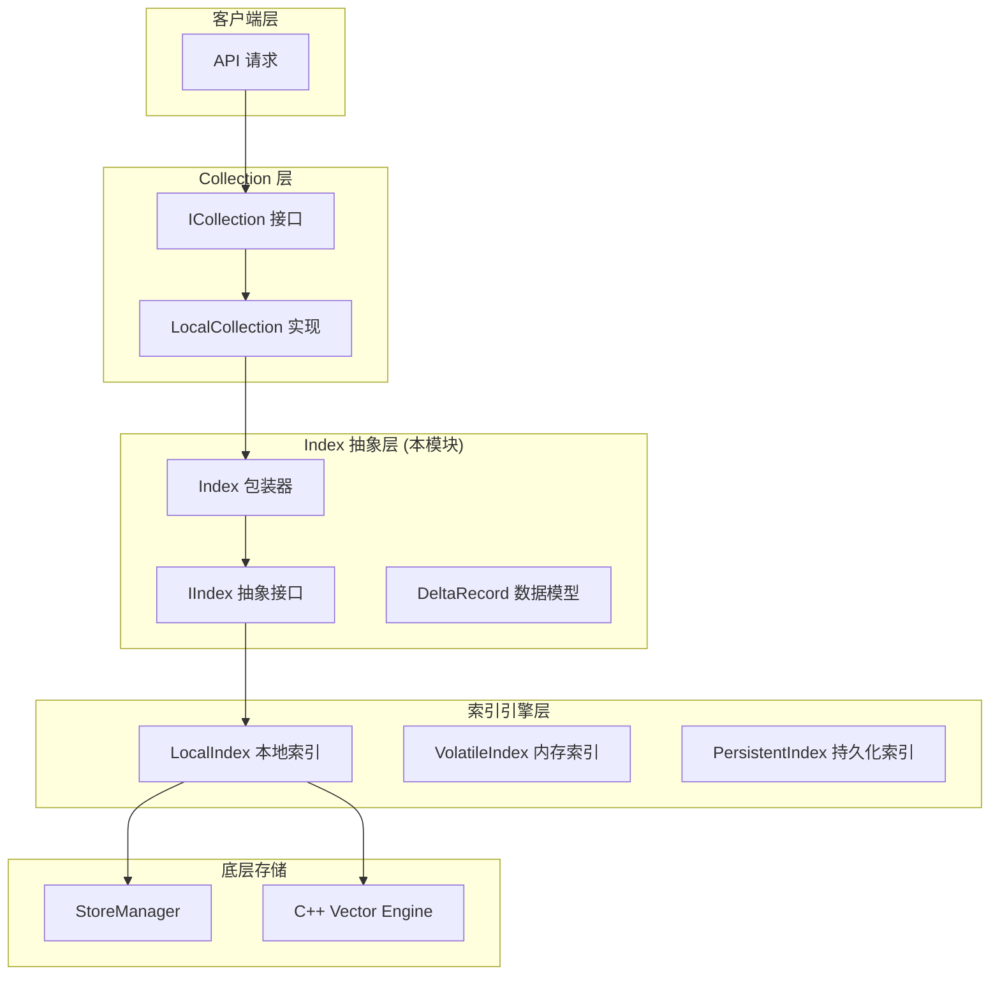

# index_domain_models_and_interfaces

## 模块概述

`index_domain_models_and_interfaces` 是 OpenViking 向量数据库存储层的核心抽象模块，它定义了向量索引（Index）的接口契约和数据模型。**如果你把这个系统想象成一座图书馆，那么 Index 模块就是图书馆的「索引系统」——它不存储书籍本身，但负责组织、检索和定位书籍的位置。**

这个模块解决的问题是：**如何为不同的向量索引实现（内存索引、磁盘持久化索引、远程服务索引）提供统一的操作接口**，从而使上层 Collection 层无需关心底层存储细节。

从架构位置来看，这个模块处于 [vectordb_domain_models_and_service_schemas](vectordb_domain_models_and_service_schemas.md) 的核心位置，它被 [LocalCollection](collection_contracts_and_results.md) 和各种 Collection 适配器所依赖，是数据从用户请求流向底层存储引擎的必经之路。

## 架构概览



### 数据流向

当用户执行一次向量搜索时，数据流动过程如下：

1. **API 层** 调用 `Collection.search_by_vector()`
2. **Collection 层** 根据索引名称获取对应的 `IIndex` 实例
3. **Index 层** 调用 `index.search()` 执行相似度搜索
4. **引擎层** 在底层 C++ 向量引擎中执行 ANN（近似最近邻）搜索
5. **结果返回** 从底层逐层向上返回 labels 和 scores

这种分层设计确保了：**Collection 不知道也无需知道底层是内存索引还是持久化索引**，它只知道调用 `IIndex` 接口。

## 核心抽象：为什么需要 IIndex 接口？

想象一个场景：你的应用在开发阶段使用内存索引（快速迭代），上线时需要切换到磁盘持久化索引（数据不丢失），未来可能还要支持远程向量服务。如果每种实现都有一套不同的 API，上层代码将变成灾难。

**IIndex 接口的存在就是为了解决这个问题**——它定义了所有索引实现必须支持的操作集合：

| 操作 | 用途 | 触发时机 |
|------|------|----------|
| `upsert_data` | 插入或更新数据 | 用户调用 `collection.upsert_data()` |
| `delete_data` | 删除数据 | 用户调用 `collection.delete_data()` |
| `search` | 向量相似度搜索 | 用户调用 `collection.search_by_vector()` |
| `aggregate` | 聚合统计 | 用户调用 `collection.aggregate_data()` |
| `update` | 更新索引配置 | 用户修改索引元数据 |
| `get_meta_data` | 获取索引信息 | 查看索引状态 |
| `close` / `drop` | 资源清理 | 应用关闭或删除索引 |

**设计权衡**：选择抽象类（ABC）而非纯协议（Protocol），是因为接口需要提供一些**默认行为**（如 `get_newest_version()` 返回 0，`need_rebuild()` 返回 True），这样实现类只需要覆盖真正需要自定义的部分。

## 关键设计决策

### 1. 包装器模式：Index 类

`Index` 类是对 `IIndex` 的**类型安全包装器**，它并不是简单的代理，而是增加了以下保护：

```python
def upsert_data(self, delta_list: List[DeltaRecord]):
    if self.__index is None:
        raise RuntimeError("Index is not initialized")  # 空指针检查
    self.__index.upsert_data(delta_list)
```

**为什么需要这个包装器？**

- **防御式编程**：在调用底层实现前检查空状态，避免难以追踪的 `AttributeError`
- **默认参数处理**：如 `search()` 方法中自动将 `None` 转换为空字典/列表
- **API 稳定性**：如果未来 `IIndex` 接口发生变化，`Index` 可以作为兼容层

### 2. DeltaRecord：增量更新模型

`DeltaRecord` 是本模块的核心数据模型，它的命名源自数据库的"增量"（Delta）概念：

```python
@dataclass
class DeltaRecord:
    type: int = 0           # UPSERT=0 或 DELETE=1
    label: int = 0          # 主键/唯一标识
    vector: List[float] = []  # 稠密向量
    sparse_raw_terms: List[str] = []  # 稀疏向量词项
    sparse_values: List[float] = []   # 稀疏向量权重
    fields: str = ""        # 当前字段（JSON 编码）
    old_fields: str = ""    # 旧字段（用于更新时的比较）
```

**为什么使用 Delta 而不是全量数据？**

- **带宽优化**：更新一条记录不需要发送整个 Collection 的数据
- **原子性**：`old_fields` 字段支持乐观锁机制，防止并发更新冲突
- **日志友好**：Delta 天然适合构建变更日志（CDC - Change Data Capture）

### 3. 混合搜索支持

`search()` 方法同时支持**稠密向量**和**稀疏向量**搜索：

```python
def search(
    self,
    query_vector: Optional[List[float]],  # 稠密向量 (e.g., BERT embeddings)
    limit: int = 10,
    filters: Optional[Dict[str, Any]] = None,
    sparse_raw_terms: Optional[List[str]] = None,  # 稀疏词项 (e.g., BM25 terms)
    sparse_values: Optional[List[float]] = None,   # 稀疏权重
) -> Tuple[List[int], List[float]]
```

**设计理由**：现代检索系统往往采用**混合检索**策略——稠密向量捕获语义相似性，稀疏向量（BM25）捕获关键词匹配。两者的组合通常优于单一方法。

### 4. 过滤器的 DSL 设计

`filters` 参数使用 JSON 结构的领域特定语言（DSL）：

```python
filters = {
    "filter": {"price": {"gt": 100}},    # 过滤条件
    "sorter": {"op": "count", "field": "category"}  # 排序/聚合
}
```

**权衡分析**：这种设计的优点是表达力强、 backend-agnostic；缺点是运行时解析有开销。对于高频场景，这是一个合理的性能-灵活性 tradeoff。

## 子模块概览

本模块是叶子模块（没有下级子模块），其核心组件直接定义在 `openviking/storage/vectordb/index/index.py` 和 `openviking/storage/vectordb/store/data.py` 中：

| 组件 | 文件 | 职责 |
|------|------|------|
| `IIndex` | `index.py` | 抽象接口，定义索引操作契约 |
| `Index` | `index.py` | 包装器，提供类型安全和默认参数处理 |
| `DeltaRecord` | `data.py` | 数据模型，表示索引的增量变更 |
| `CandidateData` | `data.py` | 数据模型，表示索引中的完整记录 |

## 与其他模块的依赖关系

### 上游依赖（谁调用本模块）

- **[collection_contracts_and_results](collection_contracts_and_results.md)**：Collection 层通过 `IIndex` 接口操作索引，这是最主要的依赖者
- **[service_api_models_search_requests](service_api_models_search_requests.md)**：服务层的搜索请求最终会路由到 Index 层

### 下游依赖（本模块调用谁）

- 底层 C++ 索引引擎（通过 `LocalIndex` 间接调用）
- `DeltaRecord` 依赖 `serializable` 装饰器进行跨语言序列化

### 横向关系

- **[kv_store_interfaces_and_operation_model](kv_store_interfaces_and_operation_model.md)**：本模块处理向量索引，KV Store 处理标量数据存储，两者共同构成完整的存储层
- **[collection_adapter_abstractions](collection_adapter_abstractions.md)**：Collection 适配器是 Index 的消费者

## 开发者注意事项

### 1. 索引未初始化时的空指针问题

```python
# 常见错误：Index 包装器在底层 index 为 None 时会抛出 RuntimeError
index = collection.get_index("my_index")  # 可能返回 None
index.search(...)  # RuntimeError: Index is not initialized

# 正确做法
index = collection.get_index("my_index")
if index is None:
    raise ValueError("Index not found")
index.search(...)
```

### 2. 过滤器的类型转换

`LocalIndex` 内部使用 `DataProcessor` 将用户传入的过滤器转换为底层引擎期望的格式：

```python
# 用户传入
filters = {"price": {"gt": 100}}

# 底层引擎可能需要
filters = {"price": {"$gt": 100}}
```

如果你在实现新的 Index 类型，**务必检查是否需要类似的转换**。

### 3. 索引版本与重建

`get_newest_version()` 方法用于获取索引的最新版本号（通常是时间戳）。这在**持久化索引**场景下非常重要——当你有多个时间点快照时，需要知道哪个是最新的。

`need_rebuild()` 方法指示索引是否需要重建。当删除操作达到一定比例时，索引会产生"碎片"，此时重建可以回收空间并提升性能。

### 4. 混合搜索的参数对应关系

```python
# 错误：稀疏向量参数不匹配
index.search(
    query_vector=[...],
    sparse_raw_terms=["word1", "word2"],  # 2 个词
    sparse_values=[0.1]  # 只有 1 个值！会报错或产生未定义行为
)

# 正确：长度必须一致
index.search(
    query_vector=[...],
    sparse_raw_terms=["word1", "word2"],
    sparse_values=[0.1, 0.9]  # 2 个值
)
```

### 5. close() 和 drop() 的区别

```python
index.close()   # 关闭连接，释放资源，但数据可能还在磁盘上
index.drop()    # 彻底删除索引，释放磁盘空间（不可逆！）
```

**线上环境务必小心 `drop()` 操作**，建议增加二次确认机制。

## 总结

本模块是 OpenViking 向量数据库的**抽象层核心**，通过 `IIndex` 接口和 `Index` 包装器，为上层 Collection 提供了统一的索引操作入口。`DeltaRecord` 模型则解决了增量更新的问题，使得索引的插入、删除、更新操作变得简洁高效。

对于新加入团队的开发者，理解这个模块的关键在于把握**接口抽象**和**增量更新**两个核心概念——前者保证了多后端支持的灵活性，后者则是高性能索引操作的基础。