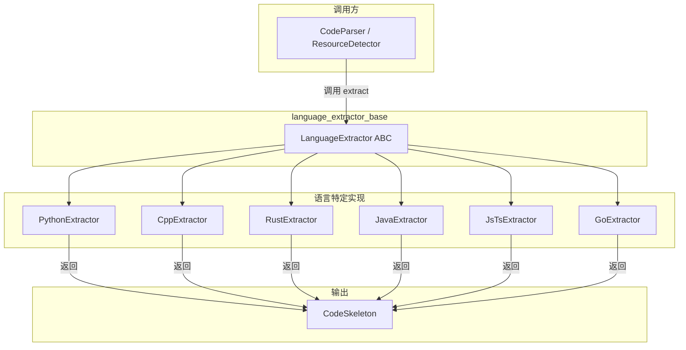

# language_extractor_base 模块技术文档

## 概述

`language_extractor_base` 模块定义了一个抽象基类 `LanguageExtractor`，它是整个代码语言 AST 提取框架的基石。想象一下一个**多语言翻译官**——无论输入的是 Python、C++、Rust 还是 Java 源代码，这个模块都能将其转换为一种统一的"代码骨架"表示形式。这种标准化使得下游系统（如检索、嵌入、向量化）可以以统一的方式处理任意编程语言的代码，而无需关心每种语言的语法细节。

这个模块解决的问题是：**如何用一种语言无关的方式理解代码结构？** 答案就是定义一个通用的契约，让每种语言提供自己的实现，将各自的 AST（抽象语法树）转换为统一的 `CodeSkeleton` 数据结构。

---

## 架构与数据流



### 核心组件

**LanguageExtractor (抽象基类)**

这是整个模块的核心，定义了一个极简的接口：

```python
class LanguageExtractor(ABC):
    @abstractmethod
    def extract(self, file_name: str, content: str) -> CodeSkeleton:
        """Extract code skeleton from source. Raises on unrecoverable error."""
```

这种设计体现了**接口最小化原则**——只暴露必须的方法，让实现者拥有最大的自由度来处理语言特定的细节。

---

## 深入理解组件

### LanguageExtractor 的设计意图

这个抽象基类的设计哲学是**"一个契约，多种实现"**。它并不试图定义完整的解析流程，而是声明了一个简单的事实："如果你想成为语言提取器，你必须提供 `extract` 方法"。

#### 为什么要这样设计？

想象你在构建一个文件系统，你的目标是对各种类型的文件进行分类检索。一种做法是为每种文件类型编写专门的解析逻辑，结果是代码中充满了 `if extension == '.py' else if extension == '.cpp'` 的分支。另一种做法是定义一个统一的接口，让每种文件类型自己负责转换——`LanguageExtractor` 就是后者在代码解析领域的体现。

这种模式的好处是：
1. **添加新语言无需修改核心代码**——只需创建新的 `XxxExtractor` 类即可
2. **各语言实现独立演进**——Python 语法的变化不需要影响 C++ 的实现
3. **关注点分离**——调用方只需要知道接口，不需要了解任何语言的语法细节

### 数据契约

**输入**：
- `file_name: str` — 文件名，用于在生成的骨架中标识来源
- `content: str` — 原始源代码内容

**输出**：
- `CodeSkeleton` — 统一的代码骨架结构，包含：
  - `file_name`: 文件名
  - `language`: 语言名称（如 "Python", "C/C++", "Rust"）
  - `module_doc`: 模块级文档字符串
  - `imports`: 导入语句列表（扁平化）
  - `classes`: 类定义列表
  - `functions`: 顶级函数列表

### 关键设计决策：同步而非异步

你可能会注意到 `extract` 方法是**同步**的，而不是 `async def`。这背后有一个有趣的设计考量：

Tree-sitter 的解析操作是 CPU 密集型的，但对于单文件解析来说速度极快（通常在毫秒级）。引入异步机制会为每个调用增加协程切换的开销，对于这种快速操作来说反而是负担。设计者选择了让调用方在需要时自己处理并发（比如使用 `ThreadPoolExecutor` 或 `asyncio.gather`），而不是把异步复杂性嵌入到接口层面。

---

## 依赖分析

### 上游依赖（谁调用这个模块）

`LanguageExtractor` 被以下组件调用：

- **CodeParser**（代码解析器）— 根据文件扩展名选择合适的提取器
- **ResourceDetector**（资源检测器）— 在代码资源中发现结构和依赖关系

这些调用方并不直接依赖具体的提取器实现，而是通过 `LanguageExtractor` 接口进行多态调用。

### 下游依赖（这个模块调用谁）

每个具体的提取器实现都依赖：

- **tree-sitter** — 用于解析源代码的 AST
- **tree-sitter-{language}** — 特定语言的语法定义包（如 `tree_sitter_python`, `tree_sitter_rust`）
- **CodeSkeleton** 及相关数据类 — 定义在 `openviking.parse.parsers.code.ast.skeleton` 模块中

### 数据流完整路径

```
源代码文件 → 读取内容 → 选择语言提取器 → 调用 extract() 
         → Tree-sitter 解析 AST → 遍历节点提取结构 → 返回 CodeSkeleton 
         → 转换为文本/用于嵌入/存入向量数据库
```

---

## 设计权衡与tradeoff分析

### 1. 最小化接口 vs 灵活性

`LanguageExtractor` 只定义了 `extract` 一个方法，没有任何配置参数。这是一种**极端的简洁性选择**。

**优点**：
- 实现者不需要学习复杂的接口
- 添加新语言只需要复制粘贴一个模板
- 调用方代码极为简单

**代价**：
- 无法传递解析选项（如是否包含私有成员、是否保留完整文档字符串）
- 各实现的行为可能有细微差异

**为什么这是合理的**：根据模块树中的使用场景，这些提取器主要用于代码骨架生成和向量化。在这种情况下，提取逻辑相对标准化，配置需求不高。如果将来需要更多灵活性，可以通过继承或组合模式扩展。

### 2. 异常处理策略

接口约定是"Raises on unrecoverable error"——遇到不可恢复的错误时直接抛出异常，而不是返回错误码或 `Optional[CodeSkeleton]`。

**这意味着什么**：
- 调用方需要准备好捕获异常
- 实现者可以用任何适合的方式表达错误（`ValueError`, `RuntimeError`, 自定义异常）
- 正常情况下不需要检查空值

**为什么这样设计**：解析失败（如语法错误的代码）对于代码骨架提取来说确实是"异常"情况——系统期望输入是有效的源代码。调用方通常会在更上层处理这些异常（比如跳过该文件、记录警告等）。

### 3. 返回类型的选择

返回 `CodeSkeleton` 而不是更底层的 AST 或其他中间形式，这体现了**一次转换到位**的思路。

**为什么选择这个粒度**：
- 下游消费者（检索、嵌入）只需要结构化的类/函数信息，不需要完整的 AST
- 避免调用方重复处理 AST 到骨架的转换
- `CodeSkeleton` 提供了 `to_text()` 方法，可以直接生成可用于 LLM 提示的文本

---

## 使用指南与扩展点

### 如何添加新语言支持

假设你要添加一个 Ruby 提取器：

```python
from openviking.parse.parsers.code.ast.languages.base import LanguageExtractor
from openviking.parse.parsers.code.ast.skeleton import CodeSkeleton

class RubyExtractor(LanguageExtractor):
    def __init__(self):
        import tree_sitter_ruby as tsruby
        from tree_sitter import Language, Parser
        
        self._language = Language(tsruby.language())
        self._parser = Parser(self._language)
    
    def extract(self, file_name: str, content: str) -> CodeSkeleton:
        # 1. 用 tree-sitter 解析
        content_bytes = content.encode("utf-8")
        tree = self._parser.parse(content_bytes)
        
        # 2. 遍历 AST 节点，提取 imports, classes, functions
        # ...（使用 _node_text 等辅助函数）
        
        # 3. 返回骨架
        return CodeSkeleton(
            file_name=file_name,
            language="Ruby",
            module_doc="",
            imports=imports,
            classes=classes,
            functions=functions,
        )
```

关键点：
- 导入对应语言的 tree-sitter 包
- 在 `__init__` 中初始化解析器（延迟加载是常见模式）
- 在 `extract` 中实现 AST 遍历逻辑
- 返回标准的 `CodeSkeleton`

### 常见使用模式

```python
# 典型的调用方式
from openviking.parse.parsers.code.ast.languages.python import PythonExtractor

extractor = PythonExtractor()
skeleton = extractor.extract("example.py", source_code)

# 直接生成文本（用于 LLM 或调试）
print(skeleton.to_text(verbose=False))

# 访问结构化数据
for cls in skeleton.classes:
    print(f"Class: {cls.name}")
    for method in cls.methods:
        print(f"  - {method.name}")
```

---

## 边缘情况与注意事项

### 1. 编码问题

所有提取器都假设输入是有效的 UTF-8 编码。如果遇到编码错误的文件，`BaseParser` 提供了 fallback 机制（尝试多种编码），但 `LanguageExtractor` 本身不处理这个问题——它期望获得有效的字符串。

### 2. 语法错误的代码

提取器使用 tree-sitter 进行解析，tree-sitter 对语法错误的容忍度较高（它会尽可能解析并返回部分树）。但极端情况下可能抛出异常或返回不完整的结果。调用方应该用 `try/except` 包装调用。

### 3. 文档字符串提取的差异

不同提取器对文档字符串的处理方式略有不同：
- **PythonExtractor** — 提取模块级文档字符串和每个类/函数的文档
- **CppExtractor** — 尝试提取前置注释作为文档
- **JavaExtractor** — 只处理类级别文档
- **RustExtractor** — 处理 struct、trait、enum 的文档

这种差异是有意的，因为每种语言的文档风格不同。如果需要统一的文档提取逻辑，可能需要在 `CodeSkeleton` 层面增加规范化处理。

### 4. 导入语句的扁平化

`CodeSkeleton.imports` 是扁平化的字符串列表，而不是保留原始的导入块结构。例如：

```python
# 源代码
import os
import sys
from typing import List, Dict

# 提取后
imports: List[str] = ["os", "sys", "typing.List", "typing.Dict"]
```

这是有意为之的设计——向量化时需要知道具体导入了什么，而不是它们如何组织。

### 5. 顶级函数 vs 嵌套函数

`CodeSkeleton.functions` 只包含**顶级函数**。类的方法包含在 `ClassSkeleton.methods` 中，嵌套函数（如内部函数）会被忽略。这反映了大多数代码检索场景的需求——开发者通常关心的是模块级和类级的结构。

---

## 相关模块参考

- **[base_parser_abstract_class](base_parser_abstract_class.md)** — 更高层的解析器抽象，定义了文档解析的统一接口，`LanguageExtractor` 是其代码解析场景的具体实现基础
- **[code_language_ast_extractors](code_language_ast_extractors.md)** — 所有语言特定提取器的父目录
- **[resource_and_document_taxonomy](resource_and_document_taxonomy.md)** — 定义了资源的分类体系，代码作为一种资源类型，其结构发现依赖于 `LanguageExtractor`
- **[parser_abstractions_and_extension_points](parser_abstractions_and_extension_points.md)** — 解析器扩展点概览，包含自定义解析器协议

---

## 小结

`LanguageExtractor` 是代码解析架构中的**抽象契约层**，它用最小的接口实现了最大的灵活性。通过定义一个简单的 `extract` 方法，它让每种编程语言可以独立实现自己的 AST 遍历逻辑，同时为上游消费者提供统一的 `CodeSkeleton` 输出。

这种设计的核心洞察是：**尽管编程语言语法各异，但它们都有"导入-类型-函数"这样的共同结构**。把握住这个本质，就能理解为什么一个如此简单的接口能够支撑起一个完整的多语言代码解析系统。