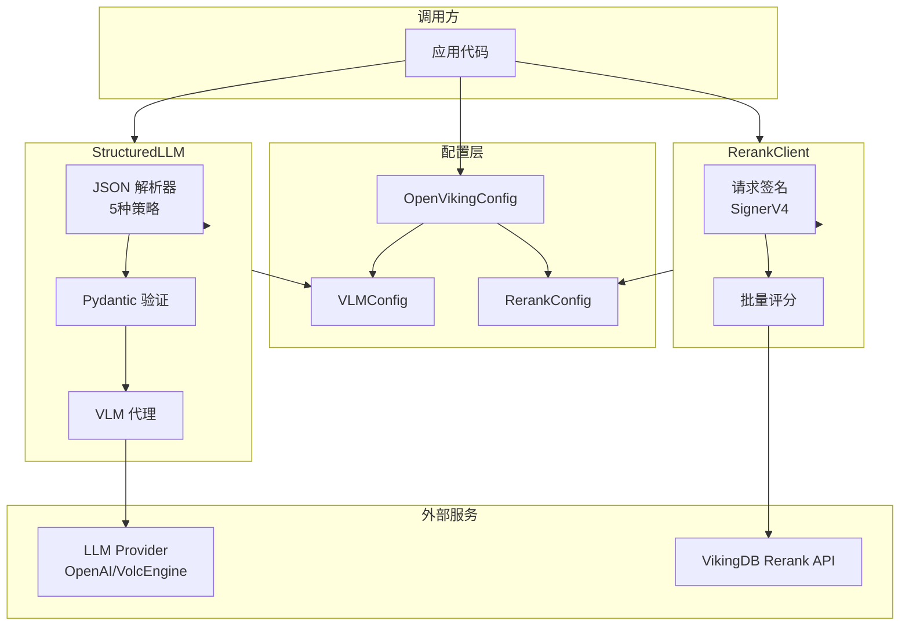

# llm_and_rerank_clients 模块

> **模块职责**：为 OpenViking 提供结构化 LLM 输出能力和文档重排序（Rerank）功能。该模块位于检索增强生成（RAG）流程的关键位置：StructuredLLM 负责将 LLM 的自由文本输出转换为类型安全的结构化数据；RerankClient 则对初步检索结果进行相关性评分优化。

## 问题空间：为什么需要这个模块？

### StructuredLLM：驯服 LLM 的"自由意志"

大型语言模型本质上是一个**文本生成器**——它输出自由形式的文本，而非结构化数据。然而现代应用开发中，我们常常需要 LLM 返回精确的 JSON 格式：

- 从自然语言描述中提取结构化实体（人名、日期、关系）
- 生成带类型约束的配置或代码
- 对话式 UI 需要结构化响应来驱动界面渲染

**问题在于**：LLM 输出格式极不可控。它可能：
1. 直接输出 `{"key": "value"}`
2. 包裹在 markdown 代码块中：`` ```json {...} ``` ``
3. 忘记转义内部引号，导致 JSON 解析失败
4. 输出的 JSON 缺少字段或多出字段

**这就是 StructuredLLM 存在的意义**——它是一个"翻译层"，把 LLM 的"自由发挥"翻译成应用程序需要的结构化数据。

### RerankClient：检索质量的 second pass

向量相似度搜索是 RAG 系统的一把"快刀"——快速、低成本，但它有两把致命的弱点：

1. **语义漂移**：查询 "如何配置数据库" 可能匹配到 "数据库性能调优"（相关但不同）
2. **表面匹配**：仅比较向量相似度，无法理解查询意图与文档内容的深层关联

Rerank（重排序）是对这一缺陷的补救：先用向量搜索快速召回候选文档，再用一个专门的**重排序模型**对这些文档进行更精细的相关性打分。

**VikingDB Rerank API** 就是这个环节的实现——它接收一个查询和一组文档，返回每个文档与查询的相关性分数。

## 架构概览



**数据流说明**：

1. **结构化输出流程**：应用代码调用 `StructuredLLM.complete_model()` → 获取 VLM 配置 → 生成 JSON Schema prompt → 调用 LLM 获取响应 → 5 种策略解析 JSON → Pydantic 模型验证 → 返回结构化对象

2. **重排序流程**：应用代码调用 `RerankClient.rerank_batch()` → 使用 SignerV4 签名请求 → 发送批量评分请求 → VikingDB 返回分数列表 → 应用根据分数排序

## 核心设计决策

### 决策一：多策略 JSON 解析

**选择**：在 `parse_json_from_response` 中实现了 5 种递进式解析策略，而不是依赖单一方法。

```python
# 策略 1: 直接解析
json.loads(response)

# 策略 2: 从 markdown 代码块提取
re.search(r"```(?:json)?\s*([\s\S]*?)\s*```", response)

# 策略 3: 正则匹配 JSON 结构
re.search(r"(\{[\s\S]*\}|\[[\s\S]*\])", response)

# 策略 4: 修复未转义引号
_fix_json_quotes(response)

# 策略 5: json_repair 库兜底
json_repair.loads(response)
```

**为什么这样做**：LLM 输出格式的随机性极强，没有单一策略能覆盖所有 case。选择"递进式"而不是"全部并行"的原因是：
- 优先尝试最简单的方法（性能最优）
- 真正需要修复的情况相对少见
- 每种策略都有性能成本，递进可以避免不必要的计算

**trade-off 分析**：这种设计的代价是——当 LLM 输出严重格式错误时，错误信息会被"吞掉"（都返回 None），调试困难。这是一个**刻意选择**的 simplicity vs debuggability 的权衡。

### 决策二：RerankClient 的"安全失败"

**选择**：`rerank_batch` 在任何异常情况下都返回 `0.0` 分数列表，而不是抛出异常。

```python
except Exception as e:
    logger.error(f"[RerankClient] Rerank failed: {e}")
    return [0.0] * len(documents)
```

**为什么这样做**：在检索系统中，如果重排序服务不可用，**系统应该降级而不是崩溃**。返回 0.0 分数意味着：
- 文档不会被过滤（保留在候选集中）
- 排序顺序不变（等同于跳过重排序步骤）
- 用户仍然能得到结果，只是可能不是最优排序

**trade-off 分析**：这创造了"静默失败"的风险——如果配置错误或网络问题持续存在，系统会默默降级，用户可能不知道检索质量已下降。这是**可用性优先**的设计选择。

### 决策三：配置驱动的懒初始化

**选择**：`StructuredLLM` 和 `RerankClient` 都不在 `__init__` 中初始化底层服务，而是通过配置在首次调用时懒加载。

```python
class StructuredLLM:
    def _get_vlm(self):
        from openviking_cli.utils.config import get_openviking_config
        return get_openviking_config().vlm  # 延迟到此处
```

**为什么这样做**：
- 避免 CLI 启动时就检查 LLM 可用性（冷启动更快）
- 支持"可选"配置——如果用户没配 VLM，相关功能 просто 不可用，不影响其他功能
- 单例模式（通过 `OpenVikingConfigSingleton`）确保配置只加载一次

**trade-off 分析**：懒初始化的代价是——第一次调用的延迟不确定（可能触发配置加载、VLM 实例化、网络请求），在某些实时性要求高的场景可能有问题。

## 子模块说明

本模块包含两个独立的子模块，分别处理 LLM 结构化输出和文档重排序：

| 子模块 | 核心组件 | 职责 |
|--------|---------|------|
| **structured_llm** | `StructuredLLM` | LLM 响应 → 结构化 JSON → Pydantic 模型 |
| **rerank_client** | `RerankClient` | 批量文档相关性评分 |

详见各子模块文档：
- [structured_llm](structured_llm.md) - StructuredLLM 详解
- [rerank_client](rerank_client.md) - RerankClient 详解

## 与其他模块的关系

### 上游依赖

| 模块 | 关系 |
|------|------|
| [open_viking_config](open_viking_config.md) | 提供 `VLMConfig` 和 `RerankConfig`，是这两个客户端的配置来源 |
| [vlm_abstractions_factory_and_structured_interface](../model_providers_embeddings_and_vlm/vlm_abstractions_factory_and_structured_interface.md) | `VLMBase` 是 StructuredLLM 调用底层 LLM 的抽象接口 |

### 下游使用

- **检索模块**：在 hierarchical retrieval 中使用 `RerankClient` 对候选文档进行重排序
- **内容提取**：使用 `StructuredLLM` 从非结构化文本中提取结构化信息（如 PDF 解析结果）
- **会话管理**：使用 `StructuredLLM` 处理对话中的结构化工具调用

## 新贡献者注意事项

### 1. JSON 解析的边界情况

`parse_json_from_response` 的正则策略（策略 3）使用 `[\s\S]*` 匹配，**在极端情况下可能匹配到错误的闭合括号**：

```python
# LLM 可能输出这样的"残次品"
response = '{"items": [{"name": "test"}, {"name": "broken"}]'  # 缺少 }
```

正则会匹配到第一个 `}` 就停止，返回不完整的 JSON。`json_repair` 库（策略 5）能修复部分情况，但不是 100%。

### 2. RerankClient 的请求体格式

注意请求体的特殊格式：

```python
req_body = {
    "data": [[{"text": doc}] for doc in documents],  # 每个文档是嵌套数组
    "query": [{"text": query}],                       # 查询也是数组
    ...
}
```

这是 VikingDB Rerank API 的特定格式，**不能随意修改**。如果 API 升级格式，需要同步更新。

### 3. 同步/异步的选择

`StructuredLLM` 提供了 sync 和 async 两套 API：
- `complete_json` / `complete_model` —— 同步
- `complete_json_async` / `complete_model_async` —— 异步

**选择建议**：在 CLI 工具中优先使用同步版本（实现简单）；在服务端或需要高并发时使用异步版本。

### 4. 配置可用性检查

`RerankClient.from_config()` 返回 `Optional[RerankClient]`：

```python
client = RerankClient.from_config(config)
if client is None:
    # rerank 功能不可用，应该跳过 rerank 步骤而不是报错
    pass
```

调用方需要正确处理 `None` 的情况——这是"优雅降级"设计的一部分。

### 5. VLM 实例是共享的

`StructuredLLM` 每次调用 `_get_vlm()` 都从配置中获取同一个 VLM 实例（通过 `VLMConfig.get_vlm_instance()` 的单例逻辑）。这意味着：
- **优点**：配置一次，复用连接池
- **缺点**：如果需要针对不同任务使用不同模型，不适合（需要自行管理多个 VLM 实例）