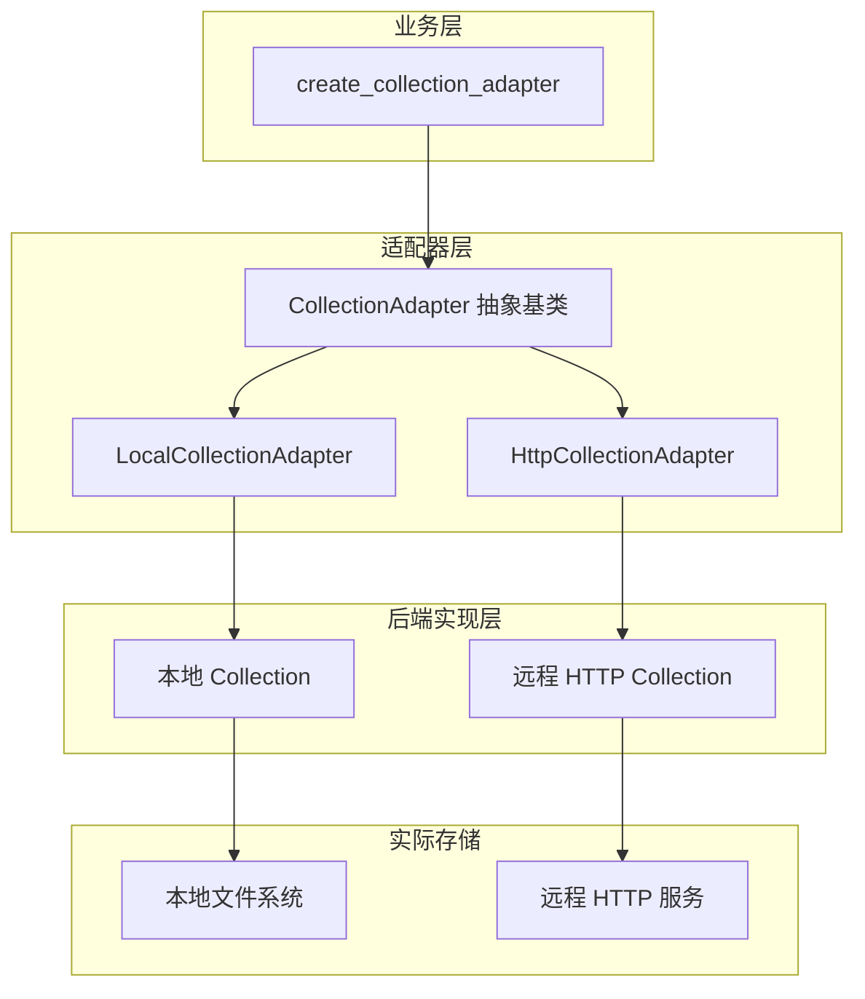

# local_and_http_collection_backends 模块

## 概述

`local_and_http_collection_backends` 模块是向量数据库适配层中的两个核心实现：为本地嵌入式存储和远程 HTTP 服务提供统一的 Collection 接口抽象。本质上，这是一个**适配器模式（Adapter Pattern）**的典型应用——它将两种截然不同的存储后端（本地文件系统 vs. 远程 HTTP API）包装成统一的业务接口，使得上层业务逻辑无需关心数据实际存储在何处。

当你阅读这个模块时，应该持有这样一个心智模型：**CollectionAdapter 是业务代码与存储后端之间的"翻译层"**。业务代码说"创建一个 Collection"，适配器负责决定是在本地磁盘上新建一个目录，还是向远程 HTTP 服务发送一个 POST 请求。

---

## 架构概览



### 数据流向

1. **创建阶段**：业务层通过 `create_collection_adapter(config)` 工厂方法请求一个适配器，传入的配置中包含 `backend` 字段（"local" 或 "http"）
2. **实例化阶段**：工厂方法根据 `backend` 类型从注册表中查找对应的 Adapter 类，调用其 `from_config()` 类方法创建实例
3. **懒加载阶段**：当业务代码首次调用 `get_collection()` 或 `collection_exists()` 时，适配器才真正与后端建立连接
4. **操作阶段**：所有 CRUD 操作（upsert/query/delete/count）都通过统一的 `CollectionAdapter` 接口，最终委托给具体的 Collection 实现

---

## 核心设计决策

### 1. 为什么要用适配器模式？

**问题背景**：系统在设计之初就需要支持多种部署形态——桌面端应用需要本地离线存储，企业版需要连接远程向量数据库服务。这意味着存储后端的差异不仅体现在物理位置，更体现在 API 协议、数据组织方式、甚至语义上（例如本地支持文件系统路径，远程支持项目/集合层级）。

**选择的方案**：适配器模式 + 工厂方法

- **适配器（CollectionAdapter）**：定义统一的抽象接口，所有后端必须实现 `from_config()`、`_load_existing_collection_if_needed()`、`_create_backend_collection()` 三个核心方法
- **工厂（create_collection_adapter）**：根据配置动态创建合适的适配器实例，业务代码只需依赖抽象接口

**未选择的方案**：
- **策略模式**：虽然策略模式也能实现后端切换，但这里的核心差异不仅是"算法"不同，而是整个生命周期的管理方式不同（本地有文件系统依赖，HTTP 有网络依赖），适配器模式更适合这种场景
- **单一后端 + 配置切换**：如果只有单一后端，可以通过配置参数切换，但这会导致后端代码与业务逻辑耦合，且难以扩展新后端

### 2. 本地后端的设计：内存 vs. 持久化

`LocalCollectionAdapter` 支持两种运行模式，这是通过传入的 `path` 参数控制的：

- **空 path**：创建内存中的 `VolatileCollection`，数据仅存在于进程生命周期内，适合测试或临时计算
- **非空 path**：创建基于文件系统的 `PersistCollection`，数据持久化到磁盘，适合离线存储和桌面应用

这种设计用一个形象的比喻：**path 参数就像"电源"**——没有电源（path），数据就是 RAM 中的电荷，掉电即失；有了电源（path），数据就写入了 SSD/HDD，即使关机也依然存在。

### 3. HTTP 后端的设计：远程存在性检查

`HttpCollectionAdapter` 在加载现有集合时，会先调用 `_remote_has_collection()` 检查远程服务是否已存在该集合。这是一个**防御性设计**——因为本地无法直接感知远程状态，必须主动查询。

```python
def _remote_has_collection(self) -> bool:
    raw = list_vikingdb_collections(...)  # 调用远程 API 列出所有集合
    return self._collection_name in _normalize_collection_names(raw)
```

**设计考量**：
- 如果不检查直接创建，可能导致远程已存在同名集合时产生冲突
- 列表操作比直接创建更安全，因为它不会产生副作用

### 4. 懒加载策略

两个适配器都采用了**懒加载（Lazy Loading）**模式——只有在真正需要操作集合时才与后端建立连接。这体现在：

- `_collection` 字段初始化为 `None`
- `get_collection()` 和 `collection_exists()` 方法内部调用 `_load_existing_collection_if_needed()`

**为什么选择懒加载**：
- **性能**：启动时无需遍历所有后端，减少初始化时间
- **资源**：避免不必要的网络连接或文件句柄打开
- **解耦**：延迟绑定使得适配器可以在配置阶段就创建出来，而不必等待后端就绪

---

## 子模块说明

| 子模块 | 文件 | 职责 |
|--------|------|------|
| **LocalCollectionAdapter** | `local_adapter.py` | 本地嵌入式向量数据库适配器，支持内存和持久化两种模式 |
| **HttpCollectionAdapter** | `http_adapter.py` | 远程 HTTP 向量数据库服务适配器，支持分布式部署场景 |

---

## 依赖关系

### 上游依赖（谁调用这个模块）

- **factory.py**: 通过 `create_collection_adapter()` 工厂方法创建具体适配器
- **业务层代码**: 间接依赖，业务代码通过统一的 CollectionAdapter 接口操作数据

### 下游依赖（这个模块调用谁）

- **LocalCollectionAdapter** → `get_or_create_local_collection`: 获取本地 Collection 实例
- **HttpCollectionAdapter** → `get_or_create_http_collection`: 获取远程 HTTP Collection 实例
- **HttpCollectionAdapter** → `list_vikingdb_collections`: 检查远程集合是否存在

---

## 使用示例与常见陷阱

### 创建本地持久化 Collection

```python
from openviking.storage.vectordb_adapters.factory import create_collection_adapter

# 模拟配置对象
class Config:
    backend = "local"
    name = "my_context"
    path = "/home/user/.openviking/data"

adapter = create_collection_adapter(Config)
adapter.create_collection(
    name="my_context",
    schema={"Fields": [...]},
    distance="cosine",
    sparse_weight=0.3,
    index_name="default"
)
```

### 创建 HTTP 远程 Collection

```python
class Config:
    backend = "http"
    url = "http://192.168.1.100:8080"
    project_name = "production"
    name = "context"

adapter = create_collection_adapter(Config)
adapter.create_collection(...)
```

### 常见陷阱

1. **HTTP 模式不检查连接可用性**：如果远程服务不可用，`collection_exists()` 会返回 `False`，但不会抛出明确的网络错误——开发者需要自行处理超时和重试

2. **Local 模式 path 为空时的行为**：如果你期望数据持久化但忘记传入 path，会创建内存集合，进程退出后数据丢失

3. **Collection 关闭后复用**：调用 `adapter.close()` 后，内部 `_collection` 置为 `None`，后续操作会抛出 `CollectionNotFoundError`。如果需要继续使用，需要重新通过 `create_collection()` 创建

4. **HTTP 后端的集合名称规范化**：远程返回的集合名称可能是多种格式（大小写不同、带项目前缀等），`_normalize_collection_names()` 会处理这些变体，但极端情况下可能存在边界情况

---

## 设计权衡总结

| 权衡点 | 选择 | 理由 |
|--------|------|------|
| **灵活性 vs. 简单性** | 支持四种后端（local/http/volcengine/vikingdb） | 满足从桌面到云端的多样化部署需求 |
| **启动速度 vs. 按需加载** | 懒加载 | 减少启动时的 I/O 和网络开销 |
| **本地存储：内存 vs. 磁盘** | 通过 path 参数自动切换 | 同一套 API 兼容两种场景 |
| **远程后端：乐观 vs. 防御** | 先检查存在性再加载 | 避免覆盖远程已有数据 |
| **错误处理：显式 vs. 隐式** | 某些场景返回 False 而不是抛异常 | 保持接口简洁，让调用方决定处理策略 |