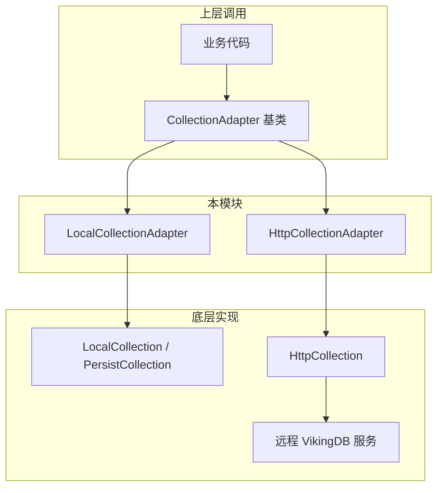

# local_and_http_collection_backends 模块技术深度解析

## 概述

`local_and_http_collection_backends` 模块是 OpenViking 向量数据库存储层的两个核心后端适配器实现。该模块包含 `LocalCollectionAdapter` 和 `HttpCollectionAdapter` 两个类，分别提供了本地嵌入式向量存储和远程 HTTP 向量数据库两种截然不同的存储方案。在阅读这段代码时，你可能会想："为什么不直接用一个统一的实现？" 答案藏在这个模块的设计哲学中——**不同的存储后端有着根本性的差异**：本地存储是基于文件系统的事务型持久化，而远程存储则是基于 HTTP API 的网络服务调用。强行统一这些差异会导致要么抽象泄漏（abstraction leak），要么功能受限。这个模块的存在，正是为了让上层的业务逻辑能够以统一的方式操作向量集合，同时又能充分利用各后端的独特能力。

从架构角度来看，这个模块位于 [collection_adapters_abstraction_and_backends](collection_adapters_abstraction_and_backends.md) 的核心位置，向上承接了 [CollectionAdapter](collection_adapters_abstraction_and_backends.md) 定义的抽象接口，向下分别调用了 `get_or_create_local_collection` 和 `get_or_create_http_collection` 这两个完全不同的底层实现。这种设计类似于适配器模式（Adapter Pattern）的经典应用场景——它不是简单地封装一个实现，而是为两个本质上不同的系统提供了统一的视图。

## 架构与数据流



### 核心抽象：CollectionAdapter 基类

在深入具体实现之前，必须理解 [CollectionAdapter](collection_adapters_abstraction_and_backends.md) 基类定义的核心契约。这个抽象类定义了向量集合操作的完整生命周期：

- **create_collection**: 创建新集合并配置索引
- **get_collection**: 获取已存在的集合句柄
- **upsert / query / delete / count**: 标准的 CRUD 操作
- **drop_collection / clear**: 集合销毁操作

基类使用了一个关键设计模式——**延迟加载**（Lazy Loading）：`self._collection` 成员变量在初始化时为 `None`，直到真正需要使用时才通过 `_load_existing_collection_if_needed()` 方法加载。这种设计避免了不必要的资源消耗，特别是对于远程后端，每次初始化都意味着一次网络调用。

### LocalCollectionAdapter：本地嵌入式存储

`LocalCollectionAdapter` 是为**单机或嵌入式场景**设计的适配器。它的核心特点是将向量数据持久化到本地文件系统。

**初始化流程**：

```python
def __init__(self, collection_name: str, project_path: str):
    super().__init__(collection_name=collection_name)
    self.mode = "local"
    self._project_path = project_path
```

这里的 `project_path` 指定了数据存储的根目录。集合的实际路径通过 `_collection_path()` 方法计算：`{project_path}/{collection_name}`。如果 `project_path` 为空字符串，则会创建一个内存中的临时集合（`VolatileCollection`），这种方式非常适合测试或不需要持久化的场景。

**延迟加载的实现**：

```python
def _load_existing_collection_if_needed(self) -> None:
    if self._collection is not None:
        return
    collection_path = self._collection_path()
    if not collection_path:
        return
    meta_path = os.path.join(collection_path, "collection_meta.json")
    if os.path.exists(meta_path):
        self._collection = get_or_create_local_collection(path=collection_path)
```

这段代码揭示了一个重要的设计决策：**通过检查元数据文件来判断集合是否存在**。这是一种经典的"存在性检查"模式，避免了每次调用都尝试加载集合。与远程后端不同，本地适配器可以直接访问文件系统，因此这种检查既快速又可靠。

**集合创建的原子性**：

```python
def _create_backend_collection(self, meta: Dict[str, Any]) -> Collection:
    collection_path = self._collection_path()
    if collection_path:
        os.makedirs(collection_path, exist_ok=True)
    return get_or_create_local_collection(meta_data=meta, path=collection_path)
```

注意这里使用 `os.makedirs(exist_ok=True)` 确保目录存在。这是一个细微但重要的细节——它防止了因父目录不存在而导致的创建失败，同时也允许多次调用而不报错。

### HttpCollectionAdapter：远程 HTTP 存储

`HttpCollectionAdapter` 面向**分布式或托管场景**，它通过 HTTP API 与远程 VikingDB 服务通信。这种模式的典型用例包括：

- 多客户端共享数据的服务器部署
- 使用云托管 VikingDB 服务的场景
- 需要将数据与计算分离的架构

**与本地适配器的根本差异**：

1. **网络开销**：每次操作都可能涉及网络请求，因此需要考虑超时、重试、错误处理
2. **一致性模型**：远程服务可能有不同的数据可见性语义
3. **集合存在性检查**：无法直接访问文件系统，只能通过 API 查询

**初始化与配置解析**：

```python
def __init__(self, host: str, port: int, project_name: str, collection_name: str):
    super().__init__(collection_name=collection_name)
    self.mode = "http"
    self._host = host
    self._port = port
    self._project_name = project_name

@classmethod
def from_config(cls, config: Any):
    if not config.url:
        raise ValueError("HTTP backend requires a valid URL")
    host, port = _parse_url(config.url)
    return cls(
        host=host,
        port=port,
        project_name=config.project_name or "default",
        collection_name=config.name or "context",
    )
```

这里使用了一个辅助函数 `_parse_url` 来标准化 URL 解析。即使配置中只写了 `localhost:5000`，它也会被规范化为 `http://localhost:5000`。这种设计降低了配置时的出错概率。

**远程集合的发现机制**：

```python
def _remote_has_collection(self) -> bool:
    raw = list_vikingdb_collections(
        host=self._host,
        port=self._port,
        project_name=self._project_name,
    )
    return self._collection_name in _normalize_collection_names(raw)
```

这是远程适配器特有的操作。相比本地文件系统检查，这里多了一层**名称规范化**（`_normalize_collection_names`），因为远程 API 返回的集合名称格式可能不稳定——有时是大写的 `CollectionName`，有时是小写的 `collection_name`，有时又是简短的 `name`。这种防御性编程避免了因 API 返回格式微小变化而导致的兼容性问题。

**延迟加载的网络开销**：

```python
def _load_existing_collection_if_needed(self) -> None:
    if self._collection is not None:
        return
    if not self._remote_has_collection():
        return
    self._collection = Collection(
        HttpCollection(
            ip=self._host,
            port=self._port,
            meta_data=self._meta(),
        )
    )
```

注意这里有一个潜在的性能陷阱：每次调用 `get_collection()` 时，如果集合尚未加载，都会触发一次 `list_vikingdb_collections` 的网络调用。在高频访问场景下，这会造成不必要的开销。基类通过 `_collection` 缓存来解决这个问题，但首次加载的成本仍然存在。

## 设计决策与权衡

### 1. 抽象层级选择：为什么需要适配器？

你可能会问：为什么不直接在业务代码中调用 `get_or_create_local_collection` 和 `get_or_create_http_collection`？答案在于**接口的统一性**。

如果没有适配器层，业务代码需要这样写：

```python
if config.mode == "local":
    collection = get_or_create_local_collection(...)
    # 手动管理集合生命周期
elif config.mode == "http":
    collection = get_or_create_http_collection(...)
    # 又是另一套逻辑
```

这种 `if-else` 分散在代码各处会导致：
- **维护困难**：更改后端需要修改多个位置
- **测试复杂**：无法轻易模拟不同后端的行为
- **接口不一致**：各后端可能有不同的方法签名

适配器层将这种复杂性集中在一个地方，使得切换后端成为一行配置的改动。

### 2. 延迟加载 vs 预加载

两个适配器都采用了**延迟加载**策略（lazy loading），但原因不同：

- **本地适配器**：避免不必要的文件系统 I/O，特别是在 project_path 很大时
- **HTTP 适配器**：避免不必要的网络请求

然而，这种设计也有代价：
- 首次访问延迟较高
- 并发场景下可能产生"惊群效应"（thundering herd）

一个潜在的改进方向是引入"预热"（warm-up）机制，在应用启动时主动加载热点集合。

### 3. 错误处理哲学

两个适配器在错误处理上采取了**静默失败**（fail silently）的策略：

```python
# LocalCollectionAdapter
if not collection_path:
    return  # 不报错，返回 None

# HttpCollectionAdapter  
if not self._remote_has_collection():
    return  # 不报错，返回 None
```

这种设计在某些场景下是合理的——例如，对于"获取集合，如果不存在则创建"的模式，区分"不存在"和"加载失败"并不总是必要的。但它也带来了调试困难的问题：当真正的网络错误或文件系统错误发生时，这些细节被隐藏了。

### 4. 索引策略的差异

这是一个容易被忽视的细节。对比基类和各个适配器的 `_build_default_index_meta` 方法：

| 适配器 | 索引类型（稀疏） | 索引类型（稠密） |
|--------|-----------------|-----------------|
| 基类 | flat_hybrid | flat |
| Volcengine | hnsw_hybrid | hnsw |
| LocalCollectionAdapter | 使用基类默认值 | 使用基类默认值 |

这说明：
- **LocalCollectionAdapter** 使用平坦索引（flat index），适合小数据集或需要精确召回的场景
- **VolcengineAdapter** 使用 HNSW 索引，牺牲部分精度换取查询性能

这是一个典型的**性能 vs 精度**权衡。HNSW 是内存密集型的索引结构，在资源受限的本地环境中可能不是最佳选择。

## 依赖关系分析

### 上游依赖：谁调用这个模块？

这个模块被以下组件调用：

1. **[collection_adapters_abstraction_and_backends](collection_adapters_abstraction_and_backends.md)**：工厂类使用 `from_config` 方法创建具体适配器
2. **业务层代码**：通过统一的 CollectionAdapter 接口进行向量操作

### 下游依赖：这个模块调用什么？

- **LocalCollectionAdapter** → `get_or_create_local_collection`（来自 `openviking.storage.vectordb.collection.local_collection`）
- **HttpCollectionAdapter** → `HttpCollection`, `get_or_create_http_collection`, `list_vikingdb_collections`（来自 `openviking.storage.vectordb.collection.http_collection`）

### 数据契约

无论底层是本地还是远程，适配器向上返回的都是统一的 `Collection` 对象。这个对象封装了以下能力：

- `upsert_data` / `fetch_data` / `delete_data`：数据写入读取
- `search_by_vector` / `search_by_scalar`：向量检索和标量检索
- `create_index` / `drop_index`：索引管理
- `aggregate_data`：聚合统计

关键洞察是：**底层实现可能完全不同，但接口完全一致**。这正是适配器模式的核心价值。

## 扩展点与注意事项

### 为新开发者提供的清单

1. **路径处理**：确保 project_path 在跨平台场景下正确处理（Windows 的路径分隔符 vs Linux）
2. **HTTP 超时**：当前实现使用 `DEFAULT_TIMEOUT`，但没有暴露配置接口
3. **重试机制**：远程适配器没有实现自动重试，网络不稳定时可能直接失败
4. **连接复用**：HTTP 适配器每次请求都创建新连接，没有使用连接池

### 常见的"坑"

**坑1：本地模式的路径为空**

```python
# 这种情况下会创建内存集合
adapter = LocalCollectionAdapter(collection_name="test", project_path="")
# 内存集合在程序退出后数据丢失
```

**坑2：HTTP 后端集合不存在时创建**

```python
adapter = HttpCollectionAdapter(host="localhost", port=5000, project_name="p", collection_name="nonexistent")
adapter.get_collection()  # 抛出 CollectionNotFoundError
adapter.create_collection(...)  # 如果同名集合已在远程存在，返回 False
```

**坑3：混合使用索引类型**

如果远程服务不支持 `flat_hybrid` 索引类型，创建集合时会失败。建议在生产环境先测试索引创建。

### 扩展这个模块

如果你需要添加新的后端（例如基于 Redis 或 MongoDB），参考以下步骤：

1. 创建新的适配器类，继承 `CollectionAdapter`
2. 实现 `from_config`、`_load_existing_collection_if_needed`、`_create_backend_collection` 三个抽象方法
3. 可选：重写 `_build_default_index_meta` 以适配后端的索引能力
4. 在工厂类中注册新适配器

## 与其他模块的关系

- [collection_adapters_abstraction_and_backends](collection_adapters_abstraction_and_backends.md)：定义了基类 `CollectionAdapter` 和工厂逻辑
- [provider_specific_managed_collection_backends](provider_specific_managed_collection_backends.md)：包含 Volcengine 和 VikingDB 私有部署的适配器
- [collection_contracts_and_results](collection_contracts_and_results.md)：定义了 `Collection` 接口和各操作返回类型

## 小结

`local_and_http_collection_backends` 模块展示了如何用适配器模式统一不同后端的差异化能力。核心洞见是：**本地存储和远程存储不仅仅是"位置"不同，它们在一致性模型、性能特征、错误处理上都有根本差异**。通过将差异封装在适配器内部，上层业务逻辑获得了简洁而统一的接口。

对于新加入团队的工程师，关键理解是：这两个适配器不是简单的一对一映射，而是为两种截然不同的使用场景（本地开发/嵌入式 vs 分布式/托管服务）分别优化的结果。选择哪个适配器，应该基于你的部署环境、数据规模、一致性需求来决定——而不是基于代码的相似性。