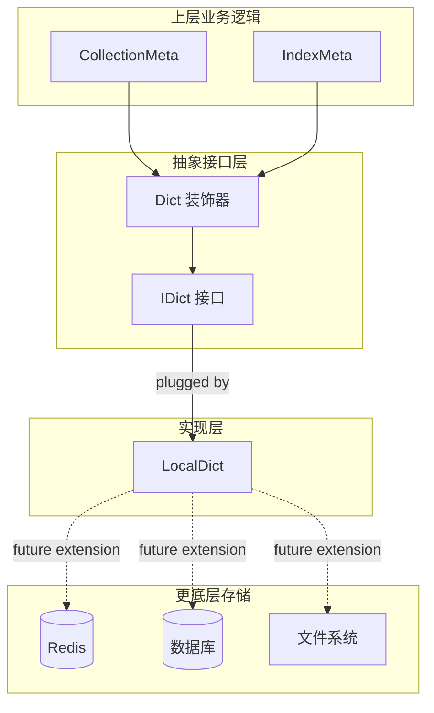

# metadata_dictionary_models 模块技术深度解析

## 模块概述

`metadata_dictionary_models` 模块是 OpenViking 向量数据库存储层的基础设施组件，它定义了一套用于存储和管理键值对元数据的抽象接口。这个模块的核心价值在于**解耦**：它将"如何存储"与"如何使用"分离，使得上层业务逻辑（如 CollectionMeta、IndexMeta）无需关心底层存储的具体实现细节。

想象一下，一个图书馆的图书目录系统。`IDict` 接口就像是书架的抽象定义——它规定了"可以存放书籍"和"可以取回书籍"的契约，但不关心书籍是存放在纸质书架上还是数字化的云存储中。这种抽象使得系统可以轻松地在不同的存储后端之间切换，而不影响使用书籍的读者（上层调用者）。

## 架构定位与数据流向



在这个架构中，`IDict` 处于**抽象接口层**的核心位置。它的设计遵循了依赖倒置原则（Dependency Inversion Principle）：高层模块（CollectionMeta、IndexMeta）依赖抽象（IDict），而不是依赖具体实现（LocalDict）。

### 数据流动的两种路径

1. **读取路径**：当上层调用 `get_meta_data()` 时，数据流经 `Dict` 包装器 → `IDict` 接口 → `LocalDict` 实现 → 返回 Python 字典
2. **写入路径**：当上层调用 `update()` 时，数据经过验证和转换后，通过 `override()` 方法写入底层存储

## 核心组件详解

### IDict 抽象接口

`IDict` 是一个抽象基类（ABC），它定义了字典存储的**契约**。理解这个接口的关键在于把握各个方法的语义差异：

#### update() vs override()：两种写入语义

这是设计中最容易引起困惑的点。`update()` 方法执行**合并操作**——它将新数据与现有数据混合，相同键会被新值覆盖，不同键则保留。想象一下给一份文档打补丁：原有的内容还在，只是被修改的部分被替换了。

而 `override()` 执行**替换操作**——它完全丢弃现有数据，用新数据作为唯一来源。这相当于把整个文件覆盖掉，而不是在原文件中修改某些行。

这种设计反映了两种常见的业务场景：
- `update()` 用于渐进式更新，例如用户只修改了部分配置项
- `override()` 用于完全替换，例如从服务端拉取完整的最新配置

#### get_raw() vs get_raw_copy()：性能与安全的权衡

`get_raw()` 返回底层字典的**引用**，这意味着调用者可以直接修改返回的字典，进而影响 `IDict` 内部的状态。这是一种**高性能但高风险**的操作——它避免了深拷贝的开销，但如果调用者不小心修改了返回数据，就会产生意外的副作用。

`get_raw_copy()` 返回一个**深拷贝**，调用者可以安全地自由使用而不会影响原始数据。这是**低性能但安全**的操作——每次调用都会触发完整的递归拷贝，对于大型元数据可能带来显著的性能开销。

这种双模式设计是一种经典的**性能优化手段**：当你确定不会修改数据时，可以使用 `get_raw()` 节省开销；当你需要保证数据不变时，使用 `get_raw_copy()` 获得安全保障。

### Dict 装饰器类

`Dict` 是一个**装饰器**（Decorator）模式的实现，它本身不实现任何存储逻辑，而是将对操作的调用委托给被包装的 `IDict` 实例。设计这个类的核心理由是**类型安全和接口一致性**：

```python
def __init__(self, idict: "IDict"):
    assert isinstance(idict, IDict), "idict must be a IDict"
    self.__idict = idict
```

这个断言确保了任何被 `Dict` 包装的对象都真正实现了 `IDict` 接口。它在运行时提供了一种"防御性编程"机制，防止将不合适的对象错误地当作字典使用。

值得注意的是，`Dict` 使用了**名字改写**（name mangling）技术，将 `__idict` 改为 `_Dict__idict`，这提供了一定程度的属性隐藏能力。虽然 Python 的私有属性主要是约定而非强制，但这种设计传递了一个信号：外部代码不应该直接访问这个内部属性。

### LocalDict 实现

`LocalDict` 是 `IDict` 的**内存实现**，它使用 Python 原生的 `dict` 作为存储后端，并使用 `copy.deepcopy()` 来保证数据的隔离性。

```python
def update(self, data: Dict[str, Any]):
    for key, value in data.items():
        self.data[key] = value

def override(self, data: Dict[str, Any]):
    self.data = data
```

这里的实现有一个微妙之处：`update()` 逐个键进行赋值，而不是简单地使用 `dict.update()`。这样做的好处是可以保持对每个值引用的精细控制，尽管在大多数情况下结果是一样的。

## 设计决策与权衡

### 为什么不使用 Protocol 而使用 ABC？

Python 3.8 引入了 `Protocol` 用于结构化子类型检查（structural subtyping），这通常被认为是比 ABC 更好的选择，因为它是静态类型检查友好的，且不强制运行时继承。

然而，选择 ABC 有其合理理由：
1. **向后兼容**：代码可能创建于 Protocol 被广泛采用之前
2. **显式意图**：`IDict` 明确表达"这是一个接口，所有实现必须遵守这个契约"
3. **文档价值**：ABC 的 `@abstractmethod` 装饰器在代码审查中提供了清晰的视觉提示

如果你在 2026 年从头设计这个模块，Protocol 可能是更好的选择。

### 浅层抽象 vs 深层抽象

当前的 `IDict` 接口相对"浅"——它基本上就是 `dict` 的翻版。一个更激进的设计可能是引入事务支持、版本控制、观察者模式等高级功能。

当前设计的权衡是：
- **优点**：简单、熟悉、学习曲线低
- **缺点**：如果将来需要这些高级功能，上层代码需要大幅重构

这是一个经典的**YAGNI**（You Aren't Gonna Need It） vs **可扩展性**之间的权衡。团队选择了前者，这通常是合适的，除非有明确的理由预见到需要更复杂的功能。

### 属性隐藏的微妙之处

`Dict` 类使用 `self.__idict`（双下划线）而非 `self._idict`（单下划线）。双下划线会触发 Python 的名字改写，使得属性变成 `_Dict__idict`。这提供了一定程度的"硬私有"语义——子类无法直接通过 `self.__idict` 访问。

但这种设计并非没有代价：
- 它使得在子类中重写行为变得更困难
- 它给调试带来一点麻烦（属性名被改写了）

如果设计目标只是"这是一个内部属性，不鼓励直接访问"，单下划线通常是更好的选择。

## 使用场景与扩展点

### 谁在调用这个模块？

根据代码分析，主要的调用者是：

1. **[CollectionMeta](vectordb-domain-models-and-service-schemas.md#collectionmeta)**：管理集合的元数据，包括字段定义、向量维度、主键配置等
2. **[IndexMeta](vectordb-domain-models-and-service-schemas.md#indexmeta)**：管理索引的元数据，包括索引类型、距离度量、量化配置等

这两个类都使用了"门面模式"（Facade Pattern）：它们在 `IDict` 之上封装了更高级的业务逻辑，如元数据验证、内外格式转换等。

### 扩展场景

如果你需要实现一个新的 `IDict` 实现，比如支持 Redis 缓存：

```python
class RedisDict(IDict):
    def __init__(self, redis_client, key_prefix: str):
        self.redis = redis_client
        self.key_prefix = key_prefix
    
    def get(self, key: str, default: Any = None) -> Any:
        value = self.redis.get(f"{self.key_prefix}:{key}")
        return json.loads(value) if value else default
    
    # ... 其他方法实现
```

然后在创建 CollectionMeta 时：

```python
meta_store = RedisDict(redis_client, "collection:meta:my_collection")
collection_meta = CollectionMeta(meta_store)
```

这种设计使得切换存储后端就像换掉一个插头一样简单。

## 潜在问题与注意事项

### 1. 浅拷贝的陷阱

在使用 `LocalDict` 时，`update()` 方法执行的是**浅合并**：

```python
def update(self, data: Dict[str, Any]):
    for key, value in data.items():
        self.data[key] = value
```

如果 `value` 是一个可变对象（如列表或字典），多个键可能共享同一个引用。正确的做法是在必要时进行深拷贝，但这会增加性能开销。这是一个需要根据具体使用场景权衡的问题。

### 2. 并发安全性

`IDict` 接口及其实现都没有声明线程安全性。在多线程环境下直接使用 `LocalDict` 可能导致竞争条件。如果你计划在多线程环境中使用，需要：
- 在调用处添加锁
- 或者实现一个线程安全的 `IDict` 子类

### 3. 空值处理的隐式约定

`get()` 方法的 `default` 参数只在键**不存在**时返回。如果键存在但值为 `None`，`default` 不会被使用。这与 `dict.get()` 的行为一致，但有时会让开发者感到困惑。

### 4. 缺少批量操作

当前接口只支持单个键或整体字典的操作，没有提供像 `get_many()`、`update_many()` 这样的批量方法。如果你的使用场景涉及大量键的批量读写，这可能是一个性能瓶颈。

## 与其他模块的关系

- **[collection_contracts_and_results](vectordb-domain-models-and-service-schemas.md#collection-contracts-and-results)**：Collection 使用 CollectionMeta 来管理元数据，而 CollectionMeta 依赖 IDict
- **[index_domain_models_and_interfaces](vectordb-domain-models-and-service-schemas.md#index-domain-models-and-interfaces)**：Index 使用 IndexMeta 来管理元数据
- **[service_api_models_collection_and_index_management](service-api-models-collection-and-index-management.md)**：服务层的 API 模型最终会转换成元数据存储在 IDict 中

## 总结

`metadata_dictionary_models` 模块是 OpenViking 向量数据库存储层的**抽象基础设施**。它的设计体现了几个核心原则：

1. **依赖倒置**：高层依赖抽象而非具体实现
2. **接口最小化**：只暴露必要的方法，避免过度设计
3. **性能选择权**：提供 `get_raw()` 和 `get_raw_copy()` 两种模式，让调用者根据场景选择

对于新加入团队的开发者，关键的理解要点是：
- `IDict` 是存储的抽象，不关心数据从哪里来到哪里去
- `CollectionMeta` 和 `IndexMeta` 是业务的抽象，处理业务逻辑和验证
- 扩展新的存储后端只需要实现 `IDict` 接口，无需修改上层代码

这个模块的代码量不大，但它为整个元数据管理系统提供了灵活性和可测试性的基础。