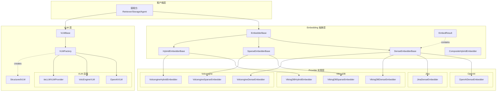

# model_providers_embeddings_and_vlm 模块详解

## 模块概述

想象一下，你在运营一个知识库系统，用户提交查询时，你需要从海量的文档、代码、对话历史中找到最相关的内容。这其中有一个核心挑战：**如何把人类的语言转化为机器能够理解和比较的数学表示？** 这就是 Embedding（向量嵌入）技术要解决的问题。

`model_providers_embeddings_and_vlm` 模块是 OpenViking 系统的"语义理解层"：它负责将文本转换为高维向量（用于语义搜索），同时提供视觉语言模型（VLM）接口来处理图像理解任务。这个模块的统一抽象使得系统能够无缝切换不同的 embedding 提供商（如 OpenAI、Jina、VikingDB、Volcengine），同时也提供了一个标准化的 VLM 接口来支持多模态理解。

> **一句话概括**：本模块是系统的"翻译官"——把文本翻译成向量，把图像和文本翻译成理解后的回答。

---

## 架构总览



### 数据流说明

1. **Embedding 请求流程**：
   - 调用方通过 `DenseEmbedderBase`/`SparseEmbedderBase`/`HybridEmbedderBase` 接口发起 embedding 请求
   - 具体 Provider 实现（OpenAI/Jina/VikingDB/Volcengine）调用各自的 API
   - 统一返回 `EmbedResult` 对象，其中包含 `dense_vector`（稠密向量）和/或 `sparse_vector`（稀疏向量）

2. **VLM 请求流程**：
   - 调用方通过 `VLMFactory.create(config)` 创建 VLM 实例
   - 根据配置中的 `provider` 字段，工厂方法返回对应的 VLM 实现（OpenAI/Volcengine/LiteLLM）
   - 支持同步和异步两种调用方式，支持纯文本和视觉理解（Vision Completion）

---

## 核心设计决策

### 1. 为什么需要三种 Embedding 类型？

**Dense（稠密向量）**：传统的 embedding 方式，将文本映射为固定维度的连续浮点数向量。例如 `"hello"` 可能变成 `[0.12, -0.34, 0.56, ...]`。这种方式语义表达能力强，适合捕捉深层的语义关系。

**Sparse（稀疏向量）**：采用词袋式的表示，通常是 `Dict[str, float]`，表示每个词项的权重。例如 `{"information": 0.8, "retrieval": 0.6}`。这种方式擅长精确匹配关键词，适合与 Dense 向量配合实现混合搜索。

**Hybrid（混合向量）**：同时返回 Dense 和 Sparse 两种向量，兼顾语义理解和精确匹配。这就是为什么你会在模块中看到 `CompositeHybridEmbedder`——它可以将两个独立的 Embedder 组合成一个混合 Embedder。

> **设计意图**：这种分层抽象让系统能够灵活应对不同的搜索场景——简单的关键词搜索用 Sparse，语义搜索用 Dense，混合场景用 Hybrid。

### 2. 为什么 VLM 要用工厂模式？

VLM 的 Provider（OpenAI、Volcengine、LiteLLM）有不同的 SDK、不同的 API 规范、不同的能力范围。如果在调用方代码中硬编码每个 provider 的逻辑，后期新增 provider 将会是一场灾难。

`VLMFactory.create(config)` 的设计让这一切变得简单：
- 调用方只需要传递一个配置字典，包含 `provider` 字段
- 工厂根据 provider 名称动态创建对应的 VLM 实例
- 新增 Provider 只需在工厂中添加新的分支，无需修改调用方

这正是**依赖倒置原则**的典型应用——调用方依赖抽象（`VLMBase`），而不依赖具体实现。

### 3. 为什么 Sparse Embedder 的格式是 Dict[str, float]？

不同于 Dense 向量的 `List[float]`（固定维度、连续空间），Sparse 向量采用稀疏表示是为了节省存储空间和计算资源。在真实场景中，一段文本可能只包含少数几个关键词，如果用 Dense 向量表示，大部分维度都是零，非常浪费。

`Dict[str, float]` 格式只存储非零值，例如 `{"函数": 0.8, "调用": 0.6, "参数": 0.4}`，这在 BM25 类型的稀疏检索场景中非常高效。

### 4. 为什么 OpenAI 的 Sparse 和 Hybrid Embedder 会抛出 NotImplementedError？

这并非技术限制，而是**诚实的 API 设计**。OpenAI 的 embedding API 确实不支持 sparse 和 hybrid 模式。如果在代码中静默返回空值或错误结果，调用方可能在排查问题时浪费大量时间。通过显式抛出 `NotImplementedError`，开发者能立即意识到问题并切换到支持的 Provider（如 Volcengine）。

---

## 子模块概览

本模块包含以下几个子模块文档：

| 子模块 | 核心职责 | 关键类 |
|--------|----------|--------|
| [embedder_base_contracts](model_providers_embeddings_and_vlm-embedder_base_contracts.md) | 定义 Embedding 的抽象接口和统一返回类型 | `EmbedderBase`, `EmbedResult`, `CompositeHybridEmbedder` |
| [openai_embedding_providers](model_providers_embeddings_and_vlm-openai_embedding_providers.md) | OpenAI Embedding 提供商实现 | `OpenAIDenseEmbedder` |
| [jina_embedding_provider](model_providers_embeddings_and_vlm-jina_embedding_provider.md) | Jina AI Embedding 提供商实现 | `JinaDenseEmbedder` |
| [vikingdb_embedding_providers](model_providers_embeddings_and_vlm-vikingdb_embedding_providers.md) | VikingDB Embedding 提供商实现 | `VikingDBDenseEmbedder`, `VikingDBSparseEmbedder`, `VikingDBHybridEmbedder` |
| [volcengine_embedding_providers](model_providers_embeddings_and_vlm-volcengine_embedding_providers.md) | Volcengine Embedding 提供商实现 | `VolcengineDenseEmbedder`, `VolcengineSparseEmbedder`, `VolcengineHybridEmbedder` |
| [vlm_abstractions_factory_and_structured_interface](vlm_abstractions_factory_and_structured_interface.md) | VLM 抽象层、工厂模式和结构化输出 | `VLMBase`, `VLMFactory`, `StructuredVLM` |

---

## 与其他模块的依赖关系

### 上游依赖（调用本模块）

| 模块 | 依赖内容 |
|------|----------|
| **retrieval_and_evaluation** | `RetrieverMode` 使用 Embedder 进行向量化和语义搜索 |
| **vectorization_and_storage_adapters** | `VectorizerFactory` 使用 Embedder 进行向量生成 |
| **storage_core_and_runtime_primitives** | `EmbeddingMsgConverter` 依赖 EmbedResult 格式 |
| **python_client_and_cli_utils** | `Session` 可能使用 VLM 进行多模态理解 |

### 下游依赖（本模块调用）

| 依赖 | 用途 |
|------|------|
| **OpenAI SDK** | OpenAI Embedder 和 VLM 的 HTTP 客户端 |
| **Volcengine Ark SDK** | Volcengine Embedder 和 VLM 的 HTTP 客户端 |
| **LiteLLM** | 多 Provider VLM 的统一封装 |
| **Pydantic** | `StructuredVLM` 的结构化输出验证 |

---

## 新贡献者注意事项

### 1. Embedding 维度的不一致性

不同的 Provider 默认返回不同维度的向量：

- OpenAI `text-embedding-3-small`：1536 维
- Jina `jina-embeddings-v5-text-small`：1024 维（可通过 Matryoshka 降维）
- Volcengine `doubao-embedding`：2048 维

**注意**：当你在混合搜索场景中使用 `CompositeHybridEmbedder` 时，务必确保两个 Embedder 映射到同一个向量数据库，否则查询时会维度不匹配。

### 2. VLM 的同步/异步陷阱

`VLMBase` 同时提供了同步方法（`get_completion`）和异步方法（`get_completion_async`）。在异步框架（如 FastAPI、asyncio）中使用同步方法会导致阻塞，严重影响并发性能。确保根据你的运行上下文选择正确的方法。

### 3. Token 使用量追踪的线程安全

`TokenUsageTracker` 使用普通的 Python `dict` 存储统计信息。如果在多线程环境中使用，请注意这不是线程安全的（虽然通常 embedding 调用是原子的）。如果需要严格的线程安全，考虑使用 `threading.Lock`。

### 4. 图片格式支持的差异

不同的 VLM Provider 支持不同的图片格式：
- **OpenAI VLM**：支持 PNG, JPEG, GIF, WebP
- **Volcengine VLM**：额外支持 BMP, TIFF, ICO, ICNS, SGI, JPEG2000, HEIC, HEIF（但不支持 SVG！）
- **LiteLLM**：取决于具体 Provider

传递不受支持的格式时，行为可能不可预测（静默失败或抛出异常）。

### 5. StructuredVLM 的容错机制

`StructuredVLM` 内部使用了多层次的 JSON 解析策略：
1. 直接 `json.loads()`
2. 提取代码块中的 JSON
3. 提取大括号/方括号包裹的 JSON
4. 修复引号问题后重试
5. 使用 `json_repair` 库修复

但这不意味着你可以完全依赖它——如果 LLM 返回的回答完全不是 JSON 格式（如拒绝回答或提供解释性文本），`parse_json_from_response` 最终会返回 `None`。调用方需要做好这个降级处理。

---

## 扩展点与锁定边界

### 可扩展的部分

1. **新增 Embedding Provider**：只需继承 `DenseEmbedderBase`/`SparseEmbedderBase`/`HybridEmbedderBase` 并实现 `embed()` 方法即可。推荐参考 `VolcengineDenseEmbedder` 的实现模式。

2. **新增 VLM Backend**：在 `VLMFactory.create()` 中添加新的 provider 分支，实现 `VLMBase` 的所有抽象方法。

3. **自定义 Hybrid 组合**：使用 `CompositeHybridEmbedder` 可以将任何 Dense 和 Sparse Embedder 组合成 Hybrid。

### 锁定边界

1. **`EmbedResult` 的结构**：这是整个模块的"通用语言"，所有 Embedder 都必须返回这个类型的实例。不要尝试修改它的结构或添加新字段。

2. **`VLMBase` 的抽象方法**：所有 VLM 实现必须实现以下四个方法：
   - `get_completion()`
   - `get_completion_async()`
   - `get_vision_completion()`
   - `get_vision_completion_async()`

---

## 常见使用模式

### 模式一：简单的文本向量化

```python
from openviking.models.embedder.openai_embedders import OpenAIDenseEmbedder

embedder = OpenAIDenseEmbedder(
    model_name="text-embedding-3-small",
    api_key="sk-xxx"
)

result = embedder.embed("什么是量子计算？")
print(len(result.dense_vector))  # 1536
```

### 模式二：混合搜索

```python
from openviking.models.embedder.volcengine_embedders import (
    VolcengineDenseEmbedder,
    VolcengineSparseEmbedder,
    CompositeHybridEmbedder
)

dense = VolcengineDenseEmbedder(api_key="xxx", model_name="doubao-embedding")
sparse = VolcengineSparseEmbedder(api_key="xxx", model_name="doubao-embedding")
hybrid = CompositeHybridEmbedder(dense, sparse)

result = hybrid.embed("Python 异步编程")
print(result.is_hybrid)  # True
print(result.dense_vector[:5])  # 稠密向量
print(result.sparse_vector)     # 稀疏向量 {"Python": 0.8, "异步": 0.6}
```

### 模式三：带结构化输出的 VLM

```python
from pydantic import BaseModel
from openviking.models.vlm.llm import StructuredVLM

class ArticleSummary(BaseModel):
    title: str
    summary: str
    keywords: list[str]

vlm = StructuredVLM({"provider": "openai", "api_key": "xxx"})
result = vlm.complete_model(
    "请总结以下文章：...", 
    ArticleSummary
)
# result 是 ArticleSummary 实例，自动验证
```

---

## 总结

`model_providers_embeddings_and_vlm` 模块的设计体现了几个核心原则：

1. **抽象优先**：通过 `EmbedderBase` 和 `VLMBase` 定义清晰的接口契约，让调用方无需关心具体实现细节。

2. **统一的返回类型**：`EmbedResult` 同时支持 dense、sparse、hybrid 三种模式，让下游处理逻辑可以统一。

3. **工厂解耦**：`VLMFactory` 使得新增 Provider 的成本降到最低，符合开闭原则。

4. **诚实的设计**：当某个 Provider 不支持某项能力时（如 OpenAI 的 sparse embedding），代码会显式报错而不是静默失败。

理解了这几个原则，你就掌握了打开这个模块的钥匙。无论是要集成新的 Embedding 提供商，还是扩展 VLM 的能力，都只需要在既定的接口框架内添加实现，而无需担心破坏现有功能。