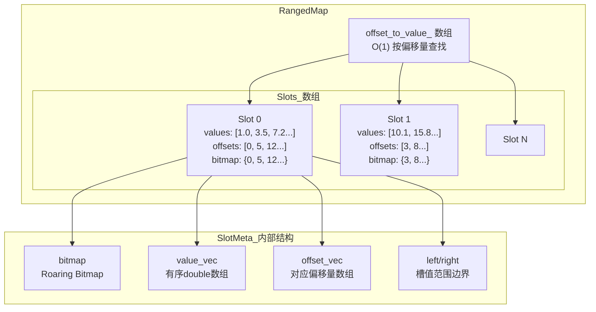

# RangedMap 模块技术深度解析

## 概述

`ranged_map` 模块是向量数据库索引系统中处理**连续值字段**（如分数、价格、时间戳等）的核心组件。它解决的问题非常直观：当我们需要根据某个数值字段进行范围查询（如"查找分数在 80-90 之间的所有记录"）或 Top-K 查询（如"查找分数最高的 100 条记录"）时，如何在海量数据中高效地完成这些操作？

想象一个图书馆的图书管理系统。如果你只有一份按字母顺序排列的图书清单，查找特定作者的所有图书需要遍历整个清单——这是线性扫描。但如果你按类别把图书分区域存放，每类再用字母顺序排列，查找效率就会大幅提升。`ranged_map` 正是采用了类似的"分段有序"策略，它将数据分割成固定大小的"槽（slot）"，每个槽内数据保持有序，槽之间也保持有序，从而将原本需要全表扫描的操作优化为只扫描相关槽。

## 架构设计

### 核心数据结构



**关键设计参数：**

- `kRangedMapSlotSize = 10000`：每个槽的初始容量阈值
- `kRangedMapSortMultiplier = 2.0`：分裂触发系数（当槽内数据超过 20000 时触发分裂）

### RangedMap 类

`RangedMap` 是整个模块的核心类，它维护了两层索引：

1. **主索引 `offset_to_value_`**：一个 `std::vector<double>`，下标即为记录的 offset（逻辑行号），可以直接 O(1) 访问任意 offset 对应的值。这类似于一个密集数组，为 `get_score_by_offset` 提供常数时间查询。

2. **分段索引 `slots_`**：`std::vector<SlotMeta>`，每个 `SlotMeta` 包含：
   - `left` / `right`：该槽内值的最小/最大边界，用于快速定位相关槽
   - `bitmap`：一个 [CRoaring](https://github.com/RoaringBitmap/CRoaring) 位图，高效支持集合操作
   - `value_vec`：槽内按值排序的 double 数组
   - `offset_vec`：与 `value_vec` 对应的 offset 数组，保持同步排序

### SlotMeta 的内部机制

每个 SlotMeta 实际上是一个自包含的微型索引结构。`split_half_to_new_slot` 方法展示了它的分裂逻辑：

```cpp
bool split_half_to_new_slot(SlotMeta& new_slot) {
  if (value_vec.size() < 2) {
    return false;
  }
  size_t split_idx = value_vec.size() / 2;
  // 将后一半数据移动到新槽
  new_slot.value_vec.assign(value_vec.begin() + split_idx, value_vec.end());
  new_slot.offset_vec.assign(offset_vec.begin() + split_idx, offset_vec.end());
  new_slot.bitmap->SetMany(new_slot.offset_vec);
  
  // 更新左右边界
  new_slot.left = *new_slot.value_vec.begin();
  new_slot.right = *new_slot.value_vec.rbegin();
  
  // 保留前一半数据
  value_vec.resize(split_idx);
  offset_vec.resize(split_idx);
  bitmap->clear();
  bitmap->SetMany(offset_vec);
  right = *value_vec.rbegin();
  return true;
}
```

这种设计有几个精妙之处：
- 分裂是中点的自然分割，保证了分裂后两个槽的值范围不会重叠
- 同步维护 value_vec 和 offset_vec 的排序一致性
- 使用 Roaring Bitmap 而非普通 set，在基数大时具有极高的压缩率和查询性能

### RangedMap2D 扩展

`RangedMap2D` 是 RangedMap 的二维扩展，用于支持地理位置等二维范围查询。它组合了两个 RangedMap（分别代表 x 和 y 坐标），通过计算欧氏距离的平方来进行圆形区域查询：

```cpp
inline double dist_square_to(double x, double y, uint32_t offset) const {
  double xdiff = x_.offset_to_value_[offset] - x;
  double ydiff = y_.offset_to_value_[offset] - y;
  double d2 = xdiff * xdiff + ydiff * ydiff;
  return d2;
}
```

注意这里使用的是距离平方，避免了开方运算的开销。

## 数据流分析

### 插入操作：add_offset_and_score

```
用户调用 add_offset_and_score(offset=100, value=85.5)
            │
            ▼
┌─────────────────────────────────────────────────────────┐
│ 1. 检查 offset 是否已存在，若已存在则返回 -1           │
│ 2. 扩展 offset_to_value_ 数组确保足够大                │
│ 3. 更新 offset_to_value_[offset] = value               │
└─────────────────────────────────────────────────────────┘
            │
            ▼
┌─────────────────────────────────────────────────────────┐
│ 4. 若 slots_ 为空，创建第一个槽                         │
│    否则使用 find_right_slot_index 定位合适槽           │
│    （二分查找，基于 value 找槽区间）                    │
└─────────────────────────────────────────────────────────┘
            │
            ▼
┌─────────────────────────────────────────────────────────┐
│ 5. 在目标槽内执行有序插入：                              │
│    - std::upper_bound 找到插入位置 O(log n)            │
│    - vector::insert 插入值和偏移量 O(n)                │
│    - 更新槽的 left/right 边界                           │
│ 6. 检查是否超过阈值(20000)，若超过则 split             │
└─────────────────────────────────────────────────────────┘
```

关键性能点：
- 二分查找定位槽：O(log S)，S 为槽数量
- 槽内有序插入：O(n)，n 为槽内元素数量，但由于槽大小有限（~10000），实际开销可控

### 范围查询：get_range_bitmap

```
用户调用 get_range_bitmap(lower_than=90, greater_than=70)
            │
            ▼
┌─────────────────────────────────────────────────────────┐
│ 1. find_right_slot_index 找右边界槽                    │
│ 2. find_left_slot_index 找左边界槽                     │
│    （都是二分查找，基于槽的 left/right 边界）          │
└─────────────────────────────────────────────────────────┘
            │
            ▼
┌─────────────────────────────────────────────────────────┐
│ 3. 对完全在范围内的槽，直接 union 其 bitmap            │
│ 4. 对边界槽，使用 get_range_data 精细筛选：            │
│    - get_right_border: std::upper_bound/lower_bound    │
│    - get_left_border: std::lower_bound/upper_bound     │
│    - 在 value_vec 中定位后取对应的 offset              │
└─────────────────────────────────────────────────────────┘
            │
            ▼
         返回 BitmapPtr
```

这里的设计非常巧妙：完全在范围内的槽直接使用 bitmap 操作，只有边界槽才需要遍历向量，这大大减少了计算量。

### Top-K 查询：get_topk_result

对于 Top-K 查询，模块提供了几种变体：

1. **基本 Top-K** (`get_topk_result`)：按值排序返回前 k 个
2. **中心距离 Top-K** (`get_topk_result_center1d`)：找到距离指定值最近的 k 个
3. **多条件 Top-K** (`get_topk_result_with_conditions`)：支持额外的过滤条件

基本 Top-K 的实现逻辑是：按顺序遍历槽（升序或降序），收集满足条件的 offset，直到凑够 k 个即停止。这种"早停"策略在数据分布均匀时非常高效。

中心距离 Top-K 的实现更为复杂，需要使用双指针从中心向两侧扩展：

```cpp
// 伪代码示意
1. 二分找到 center1d 在 value_vec 中的位置
2. 使用双指针 left/right 从中心向两侧扩展
3. 每次选择距离中心更近的一侧加入结果
4. 两侧都遍历完后继续向外扩展直到凑够 k 个
```

## 设计决策与权衡

### 1. 槽大小选择：10000 的来由

选择 `kRangedMapSlotSize = 10000` 是一个经验性的权衡：

- **太大**：单次查询需要扫描的元素过多，无法利用"分段"优势
- **太小**：槽数量激增，二分查找定位槽的开销增加，同时管理复杂度上升
- **10000**：对于典型的向量数据库查询模式，这个大小使得：
  - 槽内二分查找开销可控（约 14 次比较）
  - 单个槽的内存占用合理（约几百 KB）
  - 分裂频率适中

### 2. 延迟分裂策略

代码中的分裂阈值是 `kRangedMapSlotSize * 2 = 20000`，而不是创建时就保持 10000。这种"延迟分裂"策略的好处是：

- 避免频繁分裂带来的抖动
- 让数据自然聚集，减少无意义的分割
- 代价是某些查询可能需要扫描略大的槽

### 3. 使用 Roaring Bitmap 而非 std::set

`Bitmap` 类内部使用 CRoaring 库，这是一个高度优化的压缩位图库。相比 `std::set`：

- **基数高时**：Roaring Bitmap 压缩率极高，内存占用可能降低 10-100 倍
- **集合操作**：Roaring 原生支持 Union/Intersect 等操作，效率远高于手动遍历
- **小基数优化**：代码中保留 `std::set` 作为小数据量的fallback（阈值 32），避免小数据量时压缩的开销

### 4. 为什么不用平衡二叉搜索树？

如果使用 B+ 树或红黑树，理论上可以达到 O(log n) 的插入和查询性能。但这里选择了"分段数组"方案，原因可能是：

- **实现简洁**：std::vector + 二分查找的代码更容易理解和维护
- **缓存友好**：连续内存布局对 CPU 缓存更友好
- **足够实用**：在典型数据量下，性能差距可接受，而工程复杂度更低

### 5. 2D 扩展的设计

RangedMap2D 采用"组合"而非"继承"的方式扩展，这是很合理的设计：
- 不影响原有 RangedMap 的实现
- 避免引入不必要的复杂性
- 可以灵活地复用已有的单维查询能力

## 依赖分析

### 上游依赖

`ranged_map` 依赖以下组件：

| 依赖组件 | 作用 |
|---------|------|
| `bitmap.h` | 提供 BitmapPtr 类型和位图操作能力 |
| `common/io_utils.h` | 提供二进制序列化工具（read_bin/write_bin） |
| `index/detail/scalar/bitmap_holder/bitmap_utils.h` | 工具函数 |
| `common/ann_utils.h` | 提供 RecallResult 结构定义 |

### 下游消费者

`ranged_map` 被以下组件使用：

| 消费者组件 | 使用方式 |
|-----------|---------|
| `bitmap_field_group.h` | `FieldBitmapGroup` 使用 RangedMap 存储 double/float 字段的索引 |

具体在 `bitmap_field_group.h` 中的调用链：
```cpp
// 添加数据时
virtual int add_field_data(double field_dbl, int offset) {
  RangedMap* temp_p = get_editable_rangedmap();
  return temp_p->add_offset_and_score(offset, field_dbl);
}

// 范围查询时
BitmapPtr get_bitmap_in_range(bool range_out, double lower_than,
                              bool include_le, double greater_than,
                              bool include_ge) {
  return rangedmap_ptr_->get_range_bitmap(...);
}
```

这意味着 RangedMap 是作为"字段索引"的一部分被使用，上层（检索引擎）通过 `FieldBitmapGroup` 接口来操作。

## 使用示例与常见模式

### 基本使用

```cpp
// 创建 RangedMap
RangedMapPtr score_map = std::make_shared<RangedMap>();

// 添加数据：offset 为逻辑行号，value 为分数
score_map->add_offset_and_score(0, 85.5);
score_map->add_offset_and_score(1, 92.3);
score_map->add_offset_and_score(2, 78.1);

// 范围查询：查找 [80, 90) 范围内的记录
BitmapPtr result = score_map->get_range_bitmap(
    false,              // range_out: false 表示范围内
    90.0,               // lower_than
    false,              // include_le: 不包含 90
    80.0,               // greater_than  
    true                // include_ge: 包含 80
);

// Top-K 查询：查找分数最高的 10 条
RecallResultPtr topk = score_map->get_topk_result(
    10,                 // topk
    false,              // order_asc: 降序
    nullptr             // filter_func: 无过滤
);

// 查找距离 85 最近的 5 条
RecallResultPtr nearest = score_map->get_topk_result_center1d(
    5, true, 85.0, nullptr
);
```

### 在检索流程中的位置

典型的检索流程中，数据流是这样的：

```
用户查询请求
    │
    ▼
检索引擎解析查询条件
    │
    ├─► 标量字段过滤 ──► FieldBitmapGroupSet ──► RangedMap（范围查询）
    │
    ├─► 向量相似度计算 ──► VectorIndex（ANN 检索）
    │
    └─► 结果合并排序
```

RangedMap 在这里扮演"过滤层"的角色：首先通过范围查询筛除不满足条件的记录，然后与其他索引的结果进行交集运算。

## 边界情况与注意事项

### 1. 插入顺序影响槽分布

由于采用有序插入，数据的插入顺序会影响最终的槽分布：
- **顺序插入**（如按 ID 顺序）：数据会集中在前几个槽，后面的槽为空
- **随机插入**：数据会较均匀地分布在各槽

对于批量导入场景，建议在导入前对数据按查询字段排序，以获得更均匀的槽分布。

### 2. 删除操作的代价

`delete_offset` 需要：
1. 在 `offset_to_value_` 中将值设为 NaN（逻辑删除）
2. 在对应槽中二分查找定位
3. 从两个 vector 中 erase 元素（O(n) 移动）

这比插入更昂贵，且不会回收已分配的内存。如果删除操作频繁，需要定期重建索引。

### 3. NaN 值的特殊处理

代码中使用 `std::numeric_limits<double>::quiet_NaN()` 表示已删除或未初始化的值：

```cpp
offset_to_value_.resize(offset + 1, std::numeric_limits<double>::quiet_NaN());
```

这意味着：
- 查询时需要检查 `std::isnan(value)`
- NaN 值不会被任何范围查询返回（因为 NaN 不大于也不小于任何值）

### 4. 序列化注意事项

`SerializeToStream` 将所有槽数据（包括 bitmap 的二进制表示）写入流。恢复时需要确保 CRoaring 库版本兼容，否则可能导致反序列化失败。

### 5. 浮点数边界判断

在 `get_range_data` 等方法中，使用 `std::upper_bound` 和 `std::lower_bound` 进行边界判断：

```cpp
uint32_t get_right_border(double lower_than, bool include_le) const {
  if (include_le) {
    // include_le=true: <= lower_than
    const auto& u_it = std::upper_bound(value_vec.begin(), value_vec.end(), lower_than);
    return u_it - value_vec.begin();
  } else {
    // include_le=false: < lower_than
    const auto& l_it = std::lower_bound(value_vec.begin(), value_vec.end(), lower_than);
    return l_it - value_vec.begin();
  }
}
```

理解 `upper_bound`（第一个大于）和 `lower_bound`（第一个大于等于）的区别对于正确使用 API 至关重要。

## 扩展点与可改进方向

### 当前设计未覆盖的场景

1. **范围统计**：目前只能返回满足条件的 offset 列表，无法直接返回 count。如果需要高效的范围计数，可能需要额外维护每个槽的元素数量。

2. **并发写入**：RangedMap 本身不是线程安全的，如果有并发写入需求，需要在外层加锁。

3. **范围更新**：目前只支持单点删除，不支持范围更新（如"将所有分数低于 60 的记录加 10 分"）。

### 可选的优化方向

1. **范围聚合**：为每个槽维护 min/max/sum 等聚合值，支持更高效的统计查询
2. **自适应槽大小**：根据数据分布动态调整槽大小，而非固定阈值
3. **持久化优化**：考虑使用内存映射文件（mmap）来处理超大索引

## 相关模块

- [bitmap_field_group](native-engine-and-python-bindings-scalar-bitmap-and-field-dictionary-structures-bitmap-field-group.md)：RangedMap 的上层封装，提供了更友好的字段索引接口
- [bitmap](native-engine-and-python-bindings-scalar-bitmap-and-field-dictionary-structures-bitmap.md)：底层位图实现，RangedMap 依赖此组件进行集合操作
- [dir_index](native-engine-and-python-bindings-scalar-bitmap-and-field-dictionary-structures-dir-index.md)：目录索引，用于字符串字段的，前缀/后缀匹配