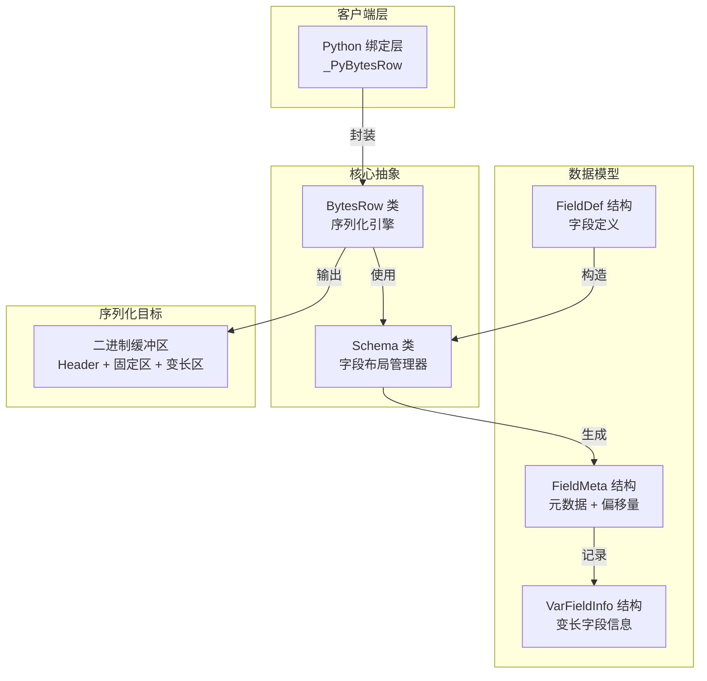
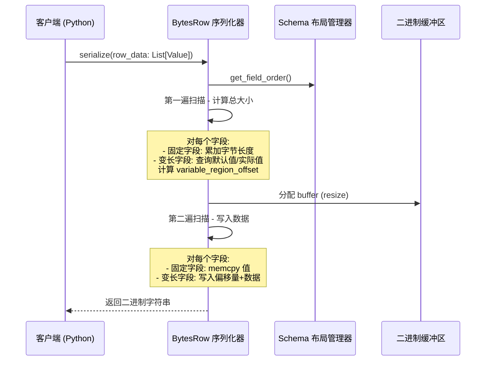

# native_bytes_row_schema_and_field_layout 模块

## 概述

`native_bytes_row_schema_and_field_layout` 模块是 OpenViking 向量数据库引擎的核心序列化组件，负责将结构化的行数据（包含多种数据类型）紧凑地打包成二进制格式，并从二进制数据中反序列化还原原始数据。

**为什么需要这个模块？**

在向量数据库中，每条记录不仅包含用于相似度搜索的向量 embedding，还需要存储丰富的元数据（ID、分数、标签、JSON 文档等）。如果使用 JSON 或 MessagePack 等通用序列化格式，每个字段名都会重复出现在每条记录中，造成严重的存储浪费。本模块采用**固定偏移量布局 + 变长区域引用**的二进制格式，实现了：

1. **零字段名开销**：字段顺序在 Schema 中定义一次，所有行数据只存储值
2. **内存直接访问**：固定-size 字段（如 INT64、FLOAT32）可通过偏移量直接寻址，无需解析
3. **类型安全**：通过 `std::variant` 在 C++ 端和 Python 枚举在 Python 端实现类型安全的序列化

---

## 架构概览



### 核心组件职责

| 组件 | 职责 |
|------|------|
| **FieldDef** | 用户提供的字段定义（名称、类型、ID、默认值） |
| **FieldMeta** | 运行时字段元数据，包含计算出的内存偏移量 |
| **Schema** | 管理所有字段的布局，计算总字节长度，验证字段 ID 连续性 |
| **BytesRow** | 执行实际的序列化/反序列化，包含两遍扫描的序列化算法 |
| **VarFieldInfo** | 临时结构，用于在序列化过程中记录变长字段的位置信息 |

---

## 二进制布局设计

理解二进制布局是掌握本模块的关键。以下是数据行的内存布局：

```
┌─────────────────────────────────────────────────────────────────────┐
│ Header (1 byte)                                                     │
│   - 字段数量 (uint8_t, 最大 255)                                     │
├─────────────────────────────────────────────────────────────────────┤
│ Fixed Region (固定区域)                                             │
│   ┌──────────┬──────────┬──────────┬──────────┬──────────────────┐  │
│   │ int64_t  │ float_t  │ bool     │ uint32_t │ ...              │  │
│   │ (8字节)  │ (4字节)  │ (1字节)  │ (4字节)  │ 固定size字段     │  │
│   └──────────┴──────────┴──────────┴──────────┴──────────────────┘  │
│                                                                     │
│   变长字段这里存储的是什么？—— offset (uint32_t)                      │
│   指向 Variable Region 中实际数据的位置                              │
├─────────────────────────────────────────────────────────────────────┤
│ Variable Region (变长区域)                                          │
│   ┌──────────────────────────────────────────────────────────────┐  │
│   │ STRING: [len:uint16][字符数据...]                             │  │
│   │ BINARY: [len:uint32][字节数据...]                             │  │
│   │ LIST_INT64: [count:uint16][int64_t x N]                      │  │
│   │ LIST_STRING: [count:uint16][len1:uint16][s1][len2:uint16]... │  │
│   └──────────────────────────────────────────────────────────────┘  │
└─────────────────────────────────────────────────────────────────────┘
```

### 布局设计的关键决策

1. **固定区域只存储偏移量**：STRING、BINARY、LIST_* 等变长字段在固定区域占用 4 字节（UINT32），存储指向变长区域的指针
2. **变长区域紧邻固定区域**：先计算所有字段的总大小，再一次性分配 buffer，避免动态扩容
3. **两遍扫描策略**：
   - 第一遍：遍历所有字段，计算总字节长度和每个变长字段的位置
   - 第二遍：实际写入数据到预分配的 buffer

---

## 核心类型系统

### 字段类型枚举

```cpp
enum class FieldType {
    INT64 = 0,        // 有符号 64 位整数
    UINT64 = 1,       // 无符号 64 位整数  
    FLOAT32 = 2,      // 32 位浮点数
    STRING = 3,       // UTF-8 字符串 (长度前缀: UINT16)
    BINARY = 4,       // 原始字节 (长度前缀: UINT32)
    BOOLEAN = 5,      // 布尔值 (1 字节)
    LIST_INT64 = 6,   // int64_t 数组
    LIST_STRING = 7,  // string 数组 (嵌套长度前缀)
    LIST_FLOAT32 = 8  // float 数组
};
```

### 类型选择的设计考量

- **STRING 用 UINT16，BINARY 用 UINT32**：字符串长度通常远小于 64KB，而二进制数据可能很大
- **LIST_* 统一用 UINT16 表示元素数量**：限制每行列数不超过 65535，在合理性和实用性之间取得平衡
- **不存在嵌套复杂类型**：不支持 LIST<LIST<...>> 或 MAP 等复杂结构，简化序列化逻辑

---

## 数据流分析

### 序列化流程



### 反序列化流程

反序列化是**按需读取**的设计——不一次性解析所有字段，而是根据请求的字段名单独读取：

```cpp
Value BytesRow::deserialize_field(const std::string& serialized_data, 
                                   const std::string& field_name) const {
    // 1. 通过 Schema 查找字段元数据
    const FieldMeta* meta = schema_->get_field_meta(field_name);
    
    // 2. 直接跳转到固定区域的对应偏移量
    const char* field_ptr = ptr + meta->offset;
    
    // 3. 根据字段类型分支处理
    switch (meta->data_type) {
        case FieldType::STRING: {
            // 读取偏移量
            uint32_t offset; 
            memcpy(&offset, field_ptr, sizeof(offset));
            // 跳转到变长区域读取长度和数据
            uint16_t len; 
            memcpy(&len, ptr + offset, sizeof(len));
            return std::string(ptr + offset + 2, len);
        }
        // ... 其他类型
    }
}
```

这种设计使得**只读取少数字段时效率极高**，避免了全量解析的开销。

---

## 设计决策与 tradeoff 分析

### 1. 两遍扫描 vs 动态扩容

| 方案 | 优点 | 缺点 |
|------|------|------|
| **两遍扫描（当前）** | 一次分配，无需 realloc | 需要遍历两遍数据 |
| 动态扩容 | 代码更简洁 | 可能多次拷贝数据 |

**选择理由**：向量数据库通常处理百万级记录，两遍扫描的一次性分配避免了多次内存拷贝的开销。对于 Python 绑定侧的实现，也采用了类似的预计算策略（先计算所有格式字符串和值列表，再一次 struct.pack_into）。

### 2. 偏移量存储 vs 链式结构

| 方案 | 优点 | 缺点 |
|------|------|------|
| **偏移量数组（当前）** | 随机访问 O(1)，内存连续 | 变长数据无法在固定区域存储 |
| 链式/指针结构 | 灵活 | 内存不连续，缓存局部性差 |

**选择理由**：向量数据库的典型工作负载是**批量读取**场景（一次查询返回 top-k 条结果），内存连续性对 CPU 缓存命中至关重要。

### 3. Python 并行实现

Python 绑定（`_PyBytesRow`）没有直接调用 C++ 库，而是用 Python 的 `struct` 模块重新实现了一遍相同的逻辑。这样做：

- **优点**：避免 Python 调用 Rust FFI 的开销，对于批量序列化场景更高效
- **缺点**：两套实现需要维护同步，但 Python 侧逻辑更简单，出错概率低

### 4. 字段 ID 连续性强制

```cpp
if (max_id != static_cast<int>(fields.size()) - 1) {
    throw std::invalid_argument(
        "Field ids must be contiguous from 0 to N-1");
}
```

这个设计确保了**字段顺序与 ID 的双射关系**，简化了序列化时按索引遍历的逻辑。

---

## 与其他模块的交互

### 上游依赖

| 模块 | 交互方式 |
|------|----------|
| **Python 绑定层** (`_PyBytesRow`) | 使用本模块定义的二进制格式进行跨语言数据交换 |
| **SearchContext** | 通过 BytesRow 序列化/反序列化搜索结果中的元数据 |
| **VectorRecall** | 向量召回结果需要伴随的元数据（ID、分数等）使用本模块存储 |

### 下游依赖

本模块是底层基础设施，被以下模块使用：

- [python-bytes-row-bindings](python_bytes_row_bindings.md) - Python 语言绑定
- 搜索结果处理模块 - 从二进制数据中提取字段

---

## 扩展点与注意事项

### 添加新字段类型

如需添加新类型（如 TIMESTAMP、FLOAT64），需要修改：

1. `FieldType` 枚举
2. `Schema` 构造函数中的 byte_len 计算
3. `BytesRow::serialize` 中的两处 switch 分支（计算长度 + 写入数据）
4. `BytesRow::deserialize_field` 中的读取逻辑
5. Python 侧的 `_PyFieldType` 枚举和 `_PySchema`、`_PyBytesRow` 的对应处理

### 边界情况与陷阱

1. **字段 ID 不连续会抛异常**：如果你手动指定了跳过的 ID，Schema 构造会失败
2. **LIST_STRING 的双重长度前缀**：列表长度 + 每个字符串长度，容易在边界处出错
3. **空值处理**：使用 `std::monostate` 表示空值，序列化时回退到默认值
4. **二进制与字符串的类型歧义**：BINARY 类型在 C++ 端用 `std::string` 存储，区分依靠 `FieldType`
5. **缓冲区大小限制**：Header 只有 1 字节，字段数最大 255；变长区域用 UINT32 offset，最大单个行约 4GB

### 性能考量

- **固定-size 字段**：直接 memcpy，无任何抽象开销
- **变长字段**：需要两次内存访问（读偏移量 → 读数据），但由于内存连续，缓存预取仍然有效
- **批量序列化**：建议使用 Python 侧的 `serialize_batch` 方法，减少 Python ↔ C++ 切换开销

---

## 相关文档

- [Python Bytes Row 绑定](native-engine-and-python-bindings-python-bytes-row-bindings.md) - Python 端的并行实现
- [向量召回模块](vector_recall_and_sparse_ann_primitives.md) - 使用本模块存储搜索结果元数据