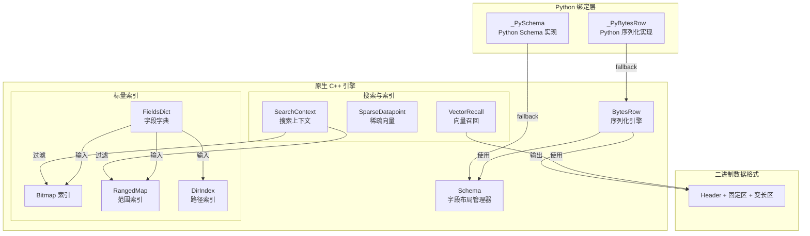
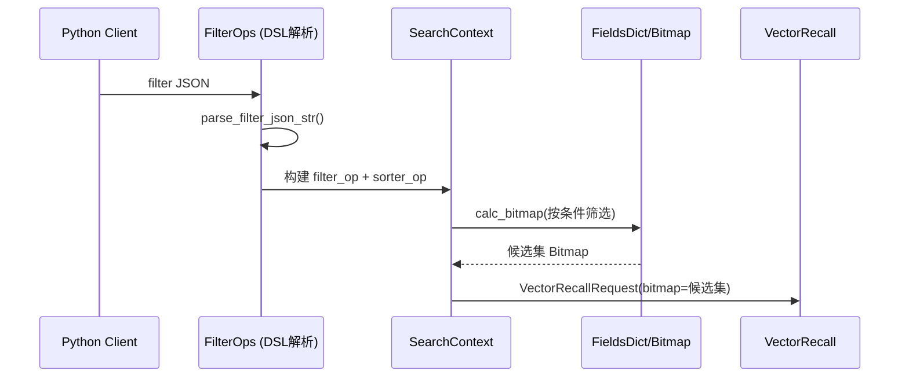

# native_engine_and_python_bindings 模块技术深度解析

> **阅读提示**：本模块是 OpenViking 向量数据库引擎的**核心基础设施层**，位于 Python 客户端与底层存储之间。它解决的问题是：如何以极低的性能开销，在 Python 灵活的数据结构和 C++ 高效的二进制格式之间搭建桥梁。如果你刚加入团队并需要理解数据是如何被序列化、存储、检索的，这篇文档将帮助你建立完整的上下文。

## 一、问题空间：为什么需要这个模块？

### 1.1 向量数据库的核心挑战

在构建一个支持语义搜索的 AI 助手系统时，你面临几个核心挑战：

1. **数据表示问题**：每条记录不仅包含用于相似度搜索的向量 embedding，还需要存储丰富的元数据（ID、分数、标签、JSON 文档等）。如果使用 JSON 等通用序列化格式，每个字段名都会重复出现在每条记录中，造成严重的存储浪费。

2. **过滤与检索的协同**：向量搜索（ANN 算法）需要与标量过滤（字段条件）紧密配合。如果先召回大量候选再过滤，99% 的计算会被浪费。

3. **混合检索的支持**：在某些场景下，稀疏表示（基于词项匹配，如 BM25）比稠密向量更能捕获精确的关键词匹配需求，系统需要同时支持这两种检索模式。

4. **Python 与 C++ 的边界**：Python 是开发效率之王，但执行效率远低于 C++。如何在 Python 层保持灵活性的同时，让 C++ 层发挥极限性能？

### 1.2 本模块的使命

`native_engine_and_python_bindings` 模块通过以下方式解决这些问题：

| 需求 | 传统方案 | 本模块方案 |
|------|----------|------------|
| 紧凑数据存储 | JSON/MessagePack（字段名重复） | 二进制紧凑格式（零字段名开销） |
| 固定-size 字段访问 | 解析整个记录 | 偏移量直接寻址 O(1) |
| 标量过滤 | 逐条遍历 O(n) | 位图 + 分桶索引 O(∩) |
| 混合检索 | 各自独立实现 | 统一的召回请求/响应结构 |
| Python/C++ 协作 | FFI 高开销 | 并行实现 + fallback 策略 |

---

## 二、架构概览：核心组件地图



### 模块核心职责地图

| 子模块 | 核心组件 | 职责概述 |
|--------|----------|----------|
| [python_bytes_row_bindings](native-engine-and-python-bindings-python-bytes-row-bindings.md) | `_PyBytesRow`, `_PySchema` | Python 端的二进制序列化实现，提供 fallback 能力 |
| [native_bytes_row_schema_and_field_layout](native_bytes_row_schema_and_field_layout.md) | `BytesRow`, `Schema`, `FieldDef` | C++ 端的高性能序列化引擎，两遍扫描策略 |
| [vector_recall_and_sparse_ann_primitives](vector_recall_and_sparse_ann_primitives.md) | `VectorRecallRequest`, `SparseDatapoint` | 向量召回和稀疏检索的请求/响应结构 |
| [search_context_and_fetch_state_models](search_context_and_fetch_state_models.md) | `SearchContext`, `StateResult` | 搜索上下文封装和索引状态查询 |
| [scalar_bitmap_and_field_dictionary_structures](scalar_bitmap_and_field_dictionary_structures.md) | `FieldsDict`, `RangedMap`, `DirIndex` | 标量字段的索引与过滤（位图、范围、路径） |

---

## 三、心智模型：如何在脑中构建这个系统？

### 3.1 核心比喻：餐厅的点菜与上菜

把这个系统想象成一家餐厅的工作流程：

- **SearchContext** 就像是点菜单——告诉厨师（检索引擎）顾客要什么口味（过滤条件）、怎么排序上菜（排序规则）
- **FieldsDict** 像是食材清单——记录每道菜的所有配料（字段键值对）
- **RangedMap** 像是食材分区——把食材按种类分区域存放（分桶索引），查找"价格 100-200 的食材"时直接定位到对应区域
- **Bitmap** 像是冰柜的抽屉标签——每个抽屉对应一种条件，满足条件的食材抽屉就标记为"可用"
- **VectorRecall** 像是厨师的"拿手菜推荐"——根据顾客口味（查询向量）快速推荐最匹配的菜品
- **BytesRow** 像是食材的真空包装——把各种食材（不同类型字段）紧凑地压缩在一起

### 3.2 数据流全景图

```
Python 用户调用
collection.add(
    vector=[0.1, 0.2, ...],      # 向量数据
    fields={                      # 标量字段
        "price": 99.9,
        "category": "book",
        "rating": 5,
        "path": "/home/user/docs"
    }
)
        │
        ▼ JSON 字符串序列化
┌─────────────────────────────────────────────────┐
│           Python 绑定层 (_PyBytesRow)            │
│  尝试导入 C++ 实现，失败则使用 Python 实现        │
└─────────────────────────────────────────────────┘
        │
        ▼ 二进制数据 (Header + 固定区 + 变长区)
┌─────────────────────────────────────────────────┐
│              C++ 原生引擎                        │
│  ┌─────────────────────────────────────────┐   │
│  │ ScalarIndex: 字段写入索引                 │   │
│  │   • FieldsDict 解析 JSON                 │   │
│  │   • 字符串 → Bitmap / DirIndex           │   │
│  │   • 数值 → RangedMap                     │   │
│  └─────────────────────────────────────────┘   │
│  ┌─────────────────────────────────────────┐   │
│  │ VectorIndex: 向量写入索引                 │   │
│  └─────────────────────────────────────────┘   │
└─────────────────────────────────────────────────┘
        │
        ▼ 写入 KV Store
┌─────────────────────────────────────────────────┐
│           底层存储 (LevelDB / 内存)              │
└─────────────────────────────────────────────────┘
```

---

## 四、设计决策与权衡分析

### 4.1 为什么序列化需要"两遍扫描"？

在 `BytesRow::serialize` 中，采用了**两遍扫描策略**：

```cpp
// 第一遍：遍历所有字段，计算总字节长度和每个变长字段的位置
int variable_region_offset = total_size;
for (size_t i = 0; i < field_order.size(); ++i) {
    // 计算变长字段的实际长度
    var_infos[i] = {variable_region_offset, len};
    variable_region_offset += UINT16_SIZE + len;
}

// 第二遍：实际写入数据到预分配的 buffer
std::string buffer;
buffer.resize(variable_region_offset);
// ... 写入数据
```

| 方案 | 优点 | 缺点 |
|------|------|------|
| **两遍扫描（当前）** | 一次分配，无需 realloc | 需要遍历两遍数据 |
| 动态扩容 | 代码更简洁 | 可能多次拷贝数据 |

**选择理由**：向量数据库通常处理百万级记录，**两遍扫描的一次性分配避免了多次内存拷贝的开销**，对于批量序列化场景尤其重要。

### 4.2 Python 实现 vs C++ 实现：为什么不直接用 FFI？

模块采用了**并行实现 + fallback 策略**：

```python
# bytes_row.py 末尾的导入逻辑
try:
    import openviking.storage.vectordb.engine as engine
    BytesRow = engine.BytesRow
    Schema = engine.Schema
    FieldType = engine.FieldType
except ImportError:
    # Fallback 到 Python 实现
    BytesRow = _PyBytesRow
    Schema = _PySchema
    FieldType = _PyFieldType
```

**设计意图**：
- **避免 FFI 开销**：Python 调用 C++ 需要跨语言边界，有一定开销。对于批量序列化场景，直接用 Python 实现可能反而更快（无需反复跨越边界）
- **开发便利性**：在没有编译原生扩展的情况下，也可以进行开发和调试
- **一致性保证**：Python 实现与 C++ 实现保持相同的二进制格式，确保可以互相替换

### 4.3 为什么 FieldsDict 使用两个独立的 Map？

```cpp
struct FieldsDict {
    std::unordered_map<std::string, std::string> str_kv_map_;  // 字符串
    std::unordered_map<std::string, double> dbl_kv_map_;       // 数值
};
```

**选择理由**：
- **性能**：访问时无需类型判断和动态类型转换，直接定位到正确的 Map
- **下游友好**：字符串字段走 Bitmap/DirIndex，数值字段走 RangedMap，职责清晰分流
- **权衡**：轻微的存储冗余（整数会在两个 Map 中各存一份），但字段数量有限时可接受

### 4.4 为什么 RangedMap 的槽大小是 10000？

```cpp
static int kRangedMapSlotSize = 10000;
```

这是一个**经验性权衡**：
- 槽太小：槽数量激增，二分查找开销增加
- 槽太大：单次查询扫描元素过多，无法利用"分段"优势
- 10000 这个值使得 100 万条记录只需约 100 个槽，每次范围查询最多扫描 2 个边界槽

---

## 五、数据流全程追踪

### 5.1 场景：用户执行一次带过滤的向量搜索

**Step 1: Python 层构建请求**

```python
results = collection.query(
    vector=[0.1, 0.2, ...],    # 查询向量
    topk=10,
    filter={"category": "book", "price": {"gte": 50, "lt": 100}}
)
```

**Step 2: 编译过滤表达式**



**Step 3: 执行搜索**

1. **过滤阶段**：根据 `category="book"` 从 Bitmap 中获取所有书籍的 offset，再根据 `price in [50, 100)` 从 RangedMap 中获取价格符合条件的 offset，取交集
2. **向量召回阶段**：只在过滤后的候选集上进行向量相似度搜索
3. **结果返回**：将 Top-K 结果的 label 和 score 返回给 Python

### 5.2 边界情况的数据流

#### 情况 1：Schema 演化（新增字段）

当新版 Schema 添加新字段时，旧数据没有这些字段，反序列化时会返回默认值：

```cpp
// _PyBytesRow.deserialize_field 中的保护逻辑
if (field_meta.id >= serialized_data[0]) {
    return field_meta.default_value;
}
```

**数据流**：旧数据 → 反序列化 → 字段 ID 不存在 → 返回默认值 → 用户看到新字段有默认值

#### 情况 2：混合检索（稠密 + 稀疏）

```cpp
// VectorRecallRequest 支持同时提供稠密和稀疏向量
struct VectorRecallRequest {
    const float* dense_vector = nullptr;      // 稠密向量
    const std::vector<std::string>* sparse_terms = nullptr;  // 稀疏词项
    const std::vector<float>* sparse_values = nullptr;        // 稀疏权重
};
```

**数据流**：同时传入两种向量 → 系统融合两种方式的得分 → 返回综合排序结果

---

## 六、与其他模块的依赖关系

### 上游依赖（调用本模块）

| 模块 | 依赖内容 |
|------|----------|
| `vectorization_and_storage_adapters` | 使用 `BytesRow` 序列化/反序列化 collection 数据 |
| `python_client_and_cli_utils` | 通过 Python 绑定层调用原生引擎 |
| `retrieval_and_evaluation` | 使用 `SearchContext` 执行过滤查询 |

### 下游依赖（本模块调用）

| 模块 | 依赖内容 |
|------|----------|
| `storage_core_and_runtime_primitives` | 写入 KV Store（LevelDB/内存） |
| `common/json_utils.h` | JSON 合并工具（RecallResult.merge_dsl_op_extra_json） |
| `rapidjson` | FieldsDict 解析 JSON |

---

## 七、新贡献者注意事项与常见陷阱

### 7.1 序列化相关

| 陷阱 | 描述 | 规避方式 |
|------|------|----------|
| **字段顺序不可改变** | 二进制格式中偏移量依赖于字段顺序 | 新字段必须追加到末尾，不能插入中间 |
| **UTF-8 编码假设** | string 类型假设数据是有效 UTF-8 | 在数据入口处进行编码验证 |
| **列表长度限制** | list_* 类型用 UINT16 存储长度，单个列表最多 65535 元素 | 需要更大列表时修改格式 |
| **字段数量限制** | Header 只有 1 字节，最大 255 个字段 | 超过时需修改格式 |

### 7.2 标量索引相关

| 陷阱 | 描述 | 规避方式 |
|------|------|----------|
| **整数双重存储** | JSON 整数会同时存入 str_kv_map_ 和 dbl_kv_map_ | 理解这是设计决策，不是 bug |
| **数组序列化为字符串** | JSON 数组被序列化为分号分隔的字符串 | 只能做整体匹配，无法做数组成员查询 |
| **RangedMap 非线程安全** | 并发写入需要外层加锁 | 在上层实现并发控制 |
| **范围边界语义** | include_le / include_ge 容易混淆 | 使用命名参数风格，测试覆盖边界 |

### 7.3 搜索相关

| 陷阱 | 描述 | 规避方式 |
|------|------|----------|
| **空指针安全** | VectorRecallRequest 的指针字段可能为空 | 调用方必须检查 |
| **内存所有权** | Request 不持有指针指向的数据 | 调用方需保证数据在搜索期间有效 |
| **DSL 解析失败** | parse_filter_json_str 失败可能返回空指针 | 必须检查返回值 |

### 7.4 开发相关

| 陷阱 | 描述 | 规避方式 |
|------|------|----------|
| **Python/C++ 格式不一致** | 两套实现可能产生不同结果 | 使用统一的测试用例验证两种实现 |
| **序列化兼容性** | 修改格式后旧数据可能无法读取 | 考虑版本号和迁移策略 |

---

## 八、总结

`native_engine_and_python_bindings` 模块是 OpenViking 向量数据库引擎的**核心基础设施**，它通过以下设计哲学实现了高性能与开发便利性的平衡：

1. **二进制紧凑格式**：固定偏移量布局 + 变长区域引用，实现零字段名开销和 O(1) 固定字段访问

2. **双层实现策略**：C++ 实现负责性能关键路径，Python 实现提供开发和调试便利

3. **位图驱动的过滤**：所有过滤条件最终归约为位图运算，支持任意复杂的 AND/OR 组合

4. **分段有序索引**：RangedMap 的分桶策略让范围查询从 O(n) 优化到 O(log S + K)

5. **统一的召回抽象**：向量召回、稀疏检索、标量过滤通过统一的 Request/Result 结构解耦

当你需要在这个系统中添加新的字段类型、修改序列化格式、优化过滤性能或扩展检索能力时，记住这个核心心智模型：**把数据当作二进制紧凑格式，把过滤条件当作位图运算，把向量检索当作统一的召回服务**。掌握这些要点，你就能安全地使用和扩展这个模块。

---

## 相关文档

- [Python Bytes Row 绑定](native-engine-and-python-bindings-python-bytes-row-bindings.md) — Python 端的并行实现
- [原生字节行 Schema 与字段布局](native_bytes_row_schema_and_field_layout.md) — C++ 高性能序列化引擎
- [向量召回与稀疏 ANN 原语](vector_recall_and_sparse_ann_primitives.md) — 搜索请求/响应结构
- [搜索上下文与状态模型](search_context_and_fetch_state_models.md) — 过滤与排序的封装
- [标量位图与字段字典结构](scalar_bitmap_and_field_dictionary_structures.md) — 位图、范围、路径索引详解
- [Collection 适配器抽象与后端](collection_adapters_abstraction_and_backends.md) — 使用本模块的存储适配器层