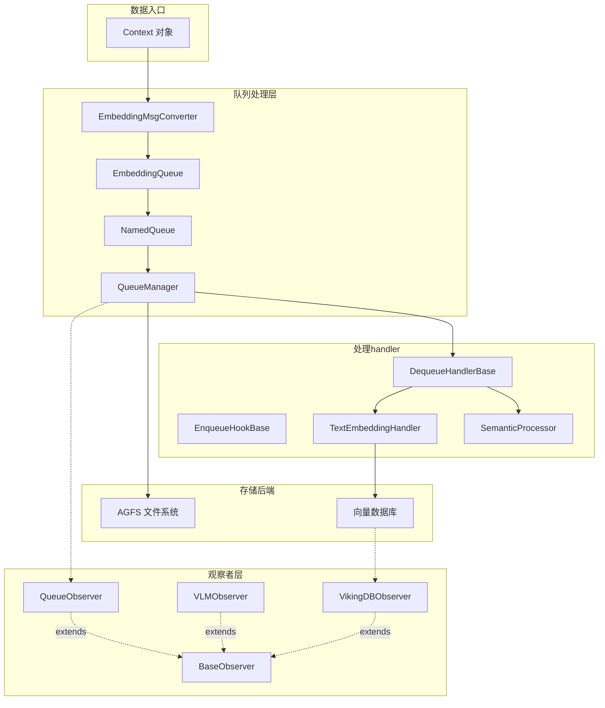

# 观察者与队列处理原语 (Observer and Queue Processing Primitives)

## 模块概述

`observer_and_queue_processing_primitives` 模块是 OpenViking 存储层的两大核心抽象的集合：**观察者模式（Observer）** 为系统提供可观测性能力，让运营人员能够监控队列、向量数据库、VLM 等关键组件的健康状态；**命名队列（Named Queue）** 则构建了一套异步消息处理管道，让文本嵌入（embedding）和语义处理能够与主业务逻辑解耦，以后台任务的方式运行。

想象一个餐馆的运作：观察者就像后厨墙上那块「状态看板」，实时显示「腌制中 3 道、已完成 128 道、出错 1 道」；而队列系统则像是传菜通道——食材（Context）从一端进入，经过不同处理工位（DequeueHandler），最终变成向量存入仓库。这两个抽象共同支撑了系统的可观测性和异步处理能力。

---

## 架构概览



### 核心组件职责

| 组件 | 职责 | 位置 |
|------|------|------|
| **BaseObserver** | 所有观察者的抽象基类，定义 `get_status_table()`、`is_healthy()`、`has_errors()` 三个接口 | `openviking.storage.observers.base_observer` |
| **NamedQueue** | 基于 AGFS 的具名队列，提供 enqueue/dequeue/peek/size 等操作，支持状态追踪 | `openviking.storage.queuefs.named_queue` |
| **EnqueueHookBase** | 入队钩子的抽象基类，允许在消息入队前执行自定义处理（如数据转换、验证） | `openviking.storage.queuefs.named_queue` |
| **DequeueHandlerBase** | 出队处理器的抽象基类，支持回调机制报告处理结果（成功/失败） | `openviking.storage.queuefs.named_queue` |
| **EmbeddingMsgConverter** | 将 Context 对象转换为 EmbeddingMsg，负责字段补全和层级推导 | `openviking.storage.queuefs.embedding_msg_converter` |

---

## 设计决策与Tradeoff分析

### 1. 为什么选择观察者模式而非直接轮询？

**决策**：为每个子系统（Queue、VLM、VikingDB）实现独立的 Observer 类，统一继承 `BaseObserver`。

**替代方案考察**：
- *直接轮询*：调用方在需要时直接查询各个子系统状态。问题是调用方需要知道所有子系统的存在和查询方式，违反了「关注点分离」原则。
- *事件总线*：所有子系统向事件总线发送状态变更事件。实现更复杂，且对于「查询当前状态」这种场景过于重量级。

**选择的理由**：观察者模式让各子系统自己负责「如何暴露状态」，而调用方只需要知道「有没有问题」。`get_status_table()` 返回人类可读的表格，`is_healthy()` 和 `has_errors()` 返回布尔值用于健康检查。这种「双重接口」设计既满足了运维人员查看详情的需求，也满足了自动化监控系统简洁判断的需求。

### 2. 为什么队列要区分 "enqueue hook" 和 "dequeue handler"？

**决策**：将入队前处理（hook）和出队后处理（handler）分离为两个独立的抽象。

** tradeoff 分析**：
- **入队阶段**适合做「转换」和「验证」：比如 EmbeddingMsgConverter 将 Context 转换为 EmbeddingMsg，或者对输入数据进行 schema 验证。这个阶段是同步的、可预测的。
- **出队阶段**适合做「业务处理」：比如 TextEmbeddingHandler 调用向量化服务写入向量库，这个阶段可能很慢（网络调用），可能失败（服务不可用），需要错误处理和重试机制。

这种分离让两个阶段的职责清晰：Hook 返回转换后的数据即可，Handler 需要报告成功/失败以便队列更新状态计数。

### 3. 为什么使用 AGFS 作为队列后端？

**决策**：NamedQueue 依赖 AGFS（一个自定义文件系统）实现队列的持久化和分布式访问。

** tradeoff 分析**：
- *内存队列*（如 asyncio.Queue）：无法持久化，重启后数据丢失，不适合需要后台异步处理的场景。
- *数据库表*：功能上可行，但需要额外维护表结构，且数据库的写入延迟通常高于文件系统。
- *消息中间件*（如 Kafka、RabbitMQ）：功能最完善，但引入额外依赖，部署复杂度增加。

**选择 AGFS 的理由**：这是一个「恰到好处」的权衡——文件系统天然支持顺序读写（队列的核心操作），同时通过文件系统接口暴露队列能力，与现有基础设施（AGFS）保持一致。如果未来需要更强大的消息队列能力，可以替换后端而不影响上层的 NamedQueue 接口。

### 4. 状态追踪的设计：为什么在队列内部维护状态？

**决策**：NamedQueue 内部维护 `_in_progress`、`_processed`、`_error_count` 等计数器。

** tradeoff 分析**：
- *外部状态服务*：将计数器放在 Redis 等外部服务，优点是重启后仍可查询，缺点是增加系统复杂度（需要额外依赖）。
- *完全无状态*：队列只管消息传递，不关心处理结果。问题是调用方无法知道「队列是否堵塞」或「处理失败率」。

**选择的理由**：内部状态是一种「尽力而为」的监控方式——实现简单，且对于大多数运维场景足够。如果未来需要更可靠的状态持久化，可以升级到外部状态服务，但当前的设计已经能回答「队列堵不堵」「有没有错误」这类核心问题。

---

## 数据流分析

### 场景：从 Context 到向量入库

```
Context 对象
    │
    ▼
[EmbeddingMsgConverter] ── 转换为 EmbeddingMsg
    │                         - 提取 vectorization_text
    │                         - 补全 account_id、owner_space
    │                         - 推导 ContextLevel (ABSTRACT/OVERVIEW/DETAIL)
    ▼
[EmbeddingQueue.enqueue()] ── 序列化后写入 AGFS
    │
    ▼
[QueueManager worker 线程] ── 后台轮询队列
    │
    ▼
[NamedQueue.dequeue()] ── 读取并标记 in_progress +1
    │
    ▼
[TextEmbeddingHandler.on_dequeue()] ── 实际处理：
    │                                   - 调用 embedder 生成向量
    │                                   - 写入向量数据库
    │                                   - report_success() 或 report_error()
    ▼
[状态更新] ── in_progress -1, processed +1 (或 error_count +1)
```

关键设计点：
1. **EmbeddingMsgConverter 是无状态的静态方法**：这意味着它不持有任何资源，可以安全地被多次并发调用。
2. **状态更新是原子性的**：`_on_dequeue_start()` 在 `dequeue()` 内部调用，而 `report_success()`/`report_error()` 在 handler 处理完成后调用。两者之间的时间窗口就是 `in_progress` 的含义——「正在处理但尚未完成」。
3. **错误有上限**：队列最多保留 100 条错误记录（`MAX_ERRORS = 100`），防止内存无限增长。

---

## 子模块文档

本模块包含以下子模块，点击链接查看详细文档：

- **[base_observer](storage-core-and-runtime-primitives-observer-and-queue-processing-primitives-base-observer.md)** — 观察者模式抽象基类，定义存储系统监控的统一接口
- **[named_queue_and_handlers](storage-core-and-runtime-primitives-observer-and-queue-processing-primitives-named-queue-and-handlers.md)** — 队列核心实现、状态追踪、Hook/Handler 抽象
- **[embedding_msg_converter](storage-core-and-runtime-primitives-observer-and-queue-processing-primitives-embedding-msg-converter.md)** — Context 到 EmbeddingMsg 的转换器

---

## 与其他模块的关系

| 依赖模块 | 关系说明 |
|----------|----------|
| **[storage_schema_and_query_ranges](storage_schema_and_query_ranges.md)** | 队列处理的结果（向量）最终写入向量数据库 |
| **[collection_adapters_abstraction_and_backends](collection_adapters_abstraction_and_backends.md)** | TextEmbeddingHandler 通过 CollectionAdapter 写入向量 |
| **[model_providers_embeddings_and_vlm](model_providers_embeddings_and_vlm.md)** | TextEmbeddingHandler 调用 embedder 生成向量 |
| **[context_typing_and_levels](context_typing_and_levels.md)** | EmbeddingMsgConverter 依赖 ContextLevel 枚举 |
| **[session_runtime_and_skill_discovery](session_runtime_and_skill_discovery.md)** | Context 对象来源于 Session 管理的内容 |
| **[client_session_and_transport](client_session_and_transport.md)** | UserIdentifier 用于推导 owner_space |

---

## 新贡献者注意事项

### 1. AGFS 依赖是隐式的
NamedQueue 依赖 `AGFSClient` 实例，但代码中没有显式声明所有 AGFS 操作可能抛出的异常。处理 `read()`/`write()` 时要小心处理各种返回值类型（bytes、str、或带 `.content` 属性的对象），这是 `NamedQueue._read_queue_message()` 之所以复杂的原因。

### 2. 队列状态不是持久化的
NamedQueue 维护的 `_in_progress`、`_processed`、`_error_count` 等计数器存在于内存中。这意味着：
- 进程重启后状态丢失
- 多实例部署时状态不共享
如果需要持久化状态，需要改造 QueueManager 使用外部存储。

### 3. EmbeddingMsgConverter 的向后兼容性处理
`EmbeddingMsgConverter.from_context()` 包含了「回填」逻辑（backfill），用于处理早期版本写入的 Context 数据缺少 `account_id` 或 `owner_space` 字段的情况。这种「尽力而为」的兼容逻辑虽然实用，但增加了代码复杂度，新贡献者看到这段代码时不要惊讶——这是为了保持向后兼容的必要「技术债」。

### 4. 异步与线程的混合
QueueManager 的 worker  loop 既有 `threading.Thread` 又有 `asyncio`。这是因为：
- 外部调用（enqueue/dequeue）可能是同步的，需要线程来运行事件循环
- 内部处理（semantic processing）使用 asyncio 实现并发

理解这个混合模型对于调试队列行为非常重要——特别是当你在看日志发现「同时有 N 个任务在处理」时。

### 5. ContextLevel 的推导是基于 URI 后缀的
EmbeddingMsgConverter 通过 `uri.endswith("/.abstract.md")` 和 `uri.endswith("/.overview.md")` 来推导 ContextLevel。这种方式简单但脆弱——如果 URI 规范改变，层级推导就会失效。如果你的新功能涉及新的 URI 模式，需要同步更新这里的推导逻辑。