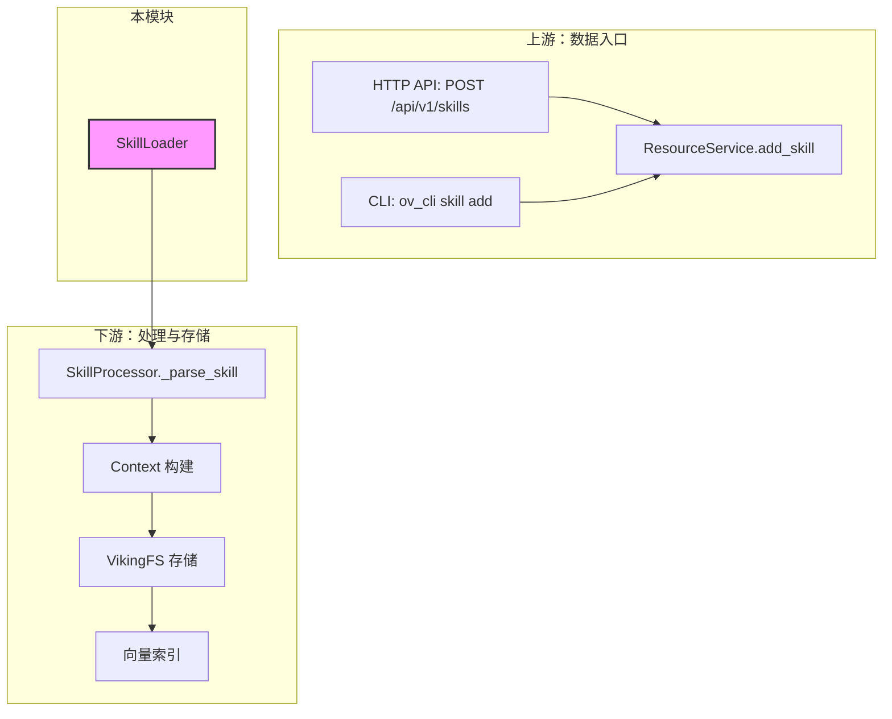

# OpenViking Skill Loader 模块技术深度解析

## 概述：问题空间与设计意图

在 OpenViking 系统中，"Skill"（技能）是一种可复用的 AI 能力单元——你可以把它想象成一个「配方」，它告诉 AI 如何执行特定类型的任务。与传统的硬编码工具不同，Skill 采用声明式定义，允许用户以结构化的方式描述技能的名称、用途、可用工具和内容。

**这个模块解决的核心问题是**：如何将人类可读的 Skill 定义文件（SKILL.md）转化为系统可处理的结构化数据。

想象一下这样的场景：用户编写了一个 `SKILL.md` 文件，内容如下：

```markdown
---
name: code_review
description: Perform automated code review
allowed-tools: [read_file, grep, comment]
tags: [development, quality]
---

# Code Review Skill

This skill performs a thorough review of code changes...
```

`SkillLoader` 的职责就是解析这个文件，提取出 YAML frontmatter 中的元数据（name、description、allowed-tools、tags）以及 Markdown body 中的内容，并将其转换为统一的字典格式供下游消费。

---

## 架构角色与数据流

### 模块定位

`SkillLoader` 是整个 Skill 处理流水线中的**第一道入口**——它是纯粹的解析层，不涉及 IO 操作（文件读取由调用方完成），不涉及向量化，不涉及存储。它的角色非常单一：**将字符串内容转换为结构化字典**。

### 上下游依赖



**数据流追踪**：

1. **入口**：用户通过 HTTP API (`/api/v1/skills`) 或 CLI 提交 skill 数据
2. **路由层**：[`resources.py`](openviking-server-routers-resources.md) 中的 `add_skill` 接收请求
3. **服务层**：[`resource_service.py`](openviking-service-resource_service.md) 调用 `SkillProcessor.process_skill()`
4. **解析层**：`SkillProcessor._parse_skill()` 调用 `SkillLoader.load()` 或 `SkillLoader.parse()`
5. **结构化**：`SkillLoader` 返回标准化的 `Dict[str, Any]`
6. **后续处理**：构建 `Context` 对象、写入 VikingFS、索引到向量数据库

---

## 核心组件深度解析

### SkillLoader 类

```python
class SkillLoader:
    """Load and parse SKILL.md files."""
    
    FRONTMATTER_PATTERN = re.compile(r"^---\s*\n(.*?)\n---\s*\n(.*)$", re.DOTALL)
```

#### 设计决策：为什么使用 YAML Frontmatter？

选择 YAML frontmatter 而非 JSON 或其他格式，是一个经过权衡的设计决策：

- **可读性**：YAML 对人类更友好，用户可以直接编辑 SKILL.md 而不需要了解严格的 JSON 语法
- **与 Markdown 的天然整合**：Frontmatter 模式是 Markdown 生态的事实标准（Hugo、Jekyll、Notion 等都支持），用户迁移成本低
- **灵活性**：YAML 支持注释、多行字符串、嵌套结构，比 JSON 更适合配置文件

正则表达式 `FRONTMATTER_PATTERN` 使用 `re.DOTALL` 标志，确保 `.` 可以匹配换行符，从而正确捕获跨越多行的 frontmatter 内容。

#### load() 方法

```python
@classmethod
def load(cls, path: str) -> Dict[str, Any]:
    """Load Skill from file and return as dict."""
    file_path = Path(path)
    if not file_path.exists():
        raise FileNotFoundError(f"Skill file not found: {path}")
    
    content = file_path.read_text(encoding="utf-8")
    return cls.parse(content, source_path=str(file_path))
```

**职责**：将文件路径作为输入，读取文件内容后委托给 `parse()` 方法。

**关键点**：
- 文件不存在时抛出 `FileNotFoundError`，而不是返回空值或使用默认值——这是一种**fail-fast**策略，确保错误在最早阶段被捕获
- 强制使用 UTF-8 编码，避免跨平台编码问题
- `source_path` 被传递下去，用于在解析结果中保留来源信息，这对于调试和溯源非常重要

#### parse() 方法

```python
@classmethod
def parse(cls, content: str, source_path: str = "") -> Dict[str, Any]:
    """Parse SKILL.md content and return as dict."""
    frontmatter, body = cls._split_frontmatter(content)
    
    if not frontmatter:
        raise ValueError("SKILL.md must have YAML frontmatter")
    
    meta = yaml.safe_load(frontmatter)
    if not isinstance(meta, dict):
        raise ValueError("Invalid YAML frontmatter")
    
    # 必填字段校验
    if "name" not in meta:
        raise ValueError("Skill must have 'name' field")
    if "description" not in meta:
        raise ValueError("Skill must have 'description' field")
    
    return {
        "name": meta["name"],
        "description": meta["description"],
        "content": body.strip(),
        "source_path": source_path,
        "allowed_tools": meta.get("allowed-tools", []),
        "tags": meta.get("tags", []),
    }
```

**职责**：解析 SKILL.md 字符串内容，返回结构化字典。

**验证逻辑**：
1. **Frontmatter 存在性**：如果没有 frontmatter，抛出明确的错误——这是因为 SKILL.md 的核心价值就在于结构化元数据，没有它文件就失去了意义
2. **类型校验**：确保 YAML 解析结果是字典类型，防止用户在 frontmatter 中放置数组或标量
3. **必填字段**：`name` 和 `description` 是必需字段，前者是 skill 的唯一标识，后者用于向量化和检索

**返回值结构**：

| 字段 | 类型 | 说明 |
|------|------|------|
| `name` | str | Skill 名称，唯一标识 |
| `description` | str | Skill 描述，用于 L0 抽象和向量检索 |
| `content` | str | Markdown 正文内容，包含技能的具体实现 |
| `source_path` | str | 文件来源路径（调试用） |
| `allowed-tools` | List[str] | 该 skill 允许使用的工具列表 |
| `tags` | List[str] | 标签，用于分类和检索 |

#### _split_frontmatter() 内部方法

```python
@classmethod
def _split_frontmatter(cls, content: str) -> Tuple[Optional[str], str]:
    """Split frontmatter and body."""
    match = cls.FRONTMATTER_PATTERN.match(content)
    if match:
        return match.group(1), match.group(2)
    return None, content
```

这是一个纯粹的字符串分割逻辑，使用正则匹配将内容分为 frontmatter 和 body 两部分。**值得注意的是**，如果文件没有 frontmatter，它不会抛出错误，而是返回 `(None, content)`，将原始内容整体作为 body。这种**宽容的处理**使得 `parse()` 方法可以在没有 frontmatter 的情况下执行完整的验证逻辑，从而给出更精确的错误信息。

#### to_skill_md() 方法：双向转换能力

```python
@classmethod
def to_skill_md(cls, skill_dict: Dict[str, Any]) -> str:
    """Convert skill dict to SKILL.md format."""
    frontmatter: dict = {
        "name": skill_dict["name"],
        "description": skill_dict.get("description", ""),
    }
    
    yaml_str = yaml.dump(frontmatter, allow_unicode=True, sort_keys=False)
    
    return f"---\n{yaml_str}---\n\n{skill_dict.get('content', '')}"
```

这个方法提供了**反向转换**能力——将结构化字典转换回 SKILL.md 格式。这在以下场景中非常有用：
- 导出 skill 到本地文件系统
- 将数据库中的 skill 以可编辑格式展示给用户

**设计细节**：只序列化 `name` 和 `description` 到 frontmatter，`allowed-tools` 和 `tags` 被省略了。这是一种有意的简化——如果要完整还原，需要在调用方补充这些字段。

---

## 设计权衡与trade-offs

### 1. 纯同步 vs 异步

`SkillLoader` 的所有方法都是**同步**的，没有任何 `async/await`。这是正确的选择吗？

**答案是肯定的**，原因如下：
- `SkillLoader` 只做字符串解析，计算量极小，异步不会带来性能收益
- YAML 解析（`yaml.safe_load`）是 CPU 密集型操作，在 Python 中放到线程池反而有 GIL 竞争开销
- 调用方（`SkillProcessor`）已经在 async 上下文中，可以通过 `await` 等待同步函数完成

### 2. 类方法 vs 实例方法

所有方法都是 `@classmethod`，没有实例状态。这符合 **无状态解析器** 的模式——给定相同输入，总是有相同输出。这种设计：
- 避免了不必要的对象创建
- 简化了测试（可以直接 `SkillLoader.parse(...)` 而无需 mock）
- 明确了函数的"纯函数"性质

### 3. 严格验证 vs 宽松处理

在 `parse()` 方法中，我们看到了严格的验证：
- frontmatter 必须是 dict 类型
- `name` 和 `description` 必须存在

但同时，对于可选字段（`allowed-tools`、`tags`），使用的是 `.get()` 方法提供空列表默认值，保持了**宽容的接口**。这种「必填字段严格、可选字段宽松」的策略，是一种平衡用户体验和系统健壮性的常见实践。

### 4. 正则 vs 专业 parser

使用正则表达式而非专门的 Markdown frontmatter 解析库，这是一个明确的**轻量级选择**。优势是零依赖，劣势是可能对某些边缘情况处理不完美（如 frontmatter 中包含 `---` 字符串）。对于 SKILL.md 这种受控格式，这个 trade-off 是合理的。

---

## 扩展点与协作模式

### 调用方：SkillProcessor

`SkillProcessor`（位于 [`utils/skill_processor.py`](openviking-utils-skill_processor.md)）是 `SkillLoader` 的主要消费者。它展示了如何将 `SkillLoader` 融入更大的工作流：

```python
def _parse_skill(self, data: Any) -> tuple[Dict[str, Any], List[Path], Optional[Path]]:
    # 支持多种输入格式
    if isinstance(data, Path):
        if data.is_dir():
            skill_file = data / "SKILL.md"
            skill_dict = SkillLoader.load(str(skill_file))
        else:
            skill_dict = SkillLoader.load(str(data))
    elif isinstance(data, str):
        # 可能 是文件路径，也可能是原始内容
        skill_dict = SkillLoader.parse(data)
    # ...
```

这个例子展示了 `SkillLoader` 的两种使用模式：
- **load()**: 输入是文件路径，方法内部读取文件
- **parse()**: 输入是原始内容字符串，调用方控制 IO

### 与 Context 系统的集成

解析后的 skill 字典被转换为 `Context` 对象（参见 [`context.py`](openviking-core-context.md)）：

```python
context = Context(
    uri=f"viking://agent/skills/{skill_dict['name']}",
    context_type=ContextType.SKILL.value,
    abstract=skill_dict.get("description", ""),
    meta={
        "name": skill_dict["name"],
        "allowed_tools": skill_dict.get("allowed-tools", []),
        "tags": skill_dict.get("tags", []),
    },
)
```

这里体现了 **数据契约**：`SkillLoader` 输出的字段与 `Context` 构造器期望的字段之间的映射关系是隐式的，但必须保持一致。

---

## 常见陷阱与注意事项

### 1. 编码问题

```python
content = file_path.read_text(encoding="utf-8")
```

**必须指定 encoding**。不指定时，`read_text()` 在不同操作系统上行为不同（Windows 默认 GBK，Linux/macOS 默认 UTF-8），会导致中文内容解析失败。

### 2. YAML 解析安全

```python
meta = yaml.safe_load(frontmatter)
```

使用 `safe_load` 而非 `load`，防止 YAML 解析任意 Python 对象（安全考虑）。

### 3. 正则匹配的位置敏感性

`FRONTMATTER_PATTERN` 以 `^` 开头，强制从头匹配。如果 SKILL.md 文件开头有 BOM（字节顺序标记）或其他字符，正则会失败。这种设计假设 SKILL.md 是「干净」的文件，符合预期。

### 4. 空 content 的处理

```python
"content": body.strip(),
```

即使 body 为空字符串，`.strip()` 也会返回 `""`，这是合理的行为。但下游（如 `SkillProcessor`）在调用 VLM 生成 overview 时需要处理空 content 的情况。

---

## 相关模块索引

### 父模块
- [session_runtime_and_skill_discovery](./session_runtime_and_skill_discovery.md) — 模块总览，了解 Session、SkillLoader、DirectoryDefinition 如何协同工作

### 下游消费者
| 模块 | 关系 | 说明 |
|------|------|------|
| [`openviking-utils-skill_processor`](openviking-utils-skill_processor.md) | 下游消费者 | 使用 SkillLoader 解析 skill，负责完整处理流程 |
| [`openviking-service-resource_service`](openviking-service-resource_service.md) | 下游消费者 | Skill 存储的服务层入口 |
| [`openviking-server-routers-resources`](openviking-server-routers-resources.md) | HTTP 接口 | 提供 `/api/v1/skills` 端点 |
| [`openviking-core-context`](openviking-core-context.md) | 数据结构 | Skill 解析后转换为 Context 对象 |
| [`openviking-session-session`](openviking-session-session.md) | 间接依赖 | Session 通过 `used()` 方法记录 skill 使用情况 |

---

## 总结

`SkillLoader` 是 OpenViking 系统中一个设计精良的**轻量级解析器**。它的职责边界清晰——只负责将 SKILL.md 字符串解析为结构化字典，不越界处理存储、索引或向量化。这种单一职责原则使得模块易于理解、测试和维护。

核心设计洞察：
1. **Frontmatter 格式**选择是用户体验与实现简洁性的平衡点
2. **严格的必填字段验证** + **宽松的可选字段处理**是合理的 API 边界策略
3. **同步、纯函数、无状态**的实现风格与其计算性质完美匹配
4. **双向转换能力**（`parse` + `to_skill_md`）提供了更好的可操作性

理解这个模块的关键在于认识到它是一个**数据转换层**——它的价值不在于复杂的逻辑，而在于可靠、稳定地将人类可读的定义转化为机器可处理的结构。