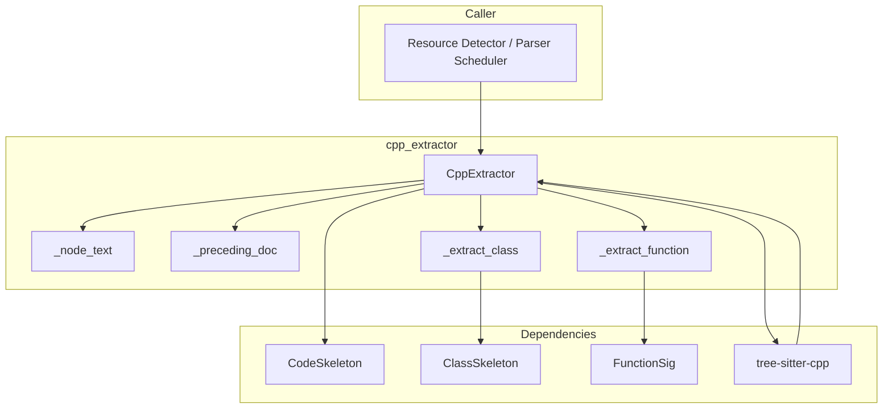

# cpp_extractor 模块技术深度解析

## 概述

`cpp_extractor` 模块是 OpenViking 项目中用于解析 C/C++ 源代码的核心组件。它的存在解决了一个关键问题：**如何将人类可读的 C/C++ 源代码转化为机器可理解的结构化数据**，以便后续进行语义搜索、代码理解、知识图谱构建等任务。

想象一下你在阅读一份复杂的 C++ 项目源码——你需要识别哪些是头文件引用、哪些是类定义、每个类有哪些方法、方法的签名是什么、是否有文档注释。人工做这件事既耗时又容易出错。`cpp_extractor` 的职责就是自动化地完成这个"代码理解"的过程，它使用 tree-sitter-cpp 解析器将源代码解析为抽象语法树（AST），然后从 AST 中提取出结构化的骨架信息。

这个模块的设计遵循了一个重要的洞察：对于代码理解任务，我们往往不需要完整的源代码，而是需要代码的"骨架"——即类型定义、函数签名、导入关系等高层结构。这类似于我们阅读论文时先看摘要和目录，而不是逐字阅读全文。

## 架构与数据流

### 核心组件关系



### 数据流全过程

当一个 C/C++ 源文件需要被处理时，数据经历以下旅程：

1. **输入阶段**：调用方传入 `file_name`（文件名）和 `content`（源代码内容字符串）

2. **解析阶段**：`CppExtractor.extract()` 方法将源代码编码为 UTF-8 字节串，调用 tree-sitter 解析器生成 AST（抽象语法树）

3. **遍历阶段**：从 AST 根节点开始，遍历顶层兄弟节点，根据节点类型进行分发处理：
   - `preproc_include` → 提取 `#include` 语句
   - `class_specifier` / `struct_specifier` → 提取类或结构体
   - `function_definition` → 提取顶层函数
   - `namespace_definition` → 递归处理命名空间内部

4. **提取阶段**：对于每种目标节点类型，调用对应的提取函数（`_extract_class`、`_extract_function`），这些函数递归遍历子节点，提取名称、参数、返回值类型等信息

5. **文档关联阶段**：`_preceding_doc` 函数负责查找每个代码元素前面的 Doxygen 风格注释

6. **输出阶段**：所有提取结果组装为 `CodeSkeleton` 对象返回，包含文件信息、导入列表、类列表、函数列表

### 模块在整体架构中的位置

`cpp_extractor` 位于解析层的语言提取器分支，属于 `parsing_and_resource_detection` 大模块。根据依赖关系，它可以向上被资源检测器或解析调度器调用，向下依赖 tree-sitter 生态和骨架模型。

## 核心组件详解

### CppExtractor 类

这是模块的主入口类，继承自 `LanguageExtractor` 抽象基类。它的设计非常简洁——在 `__init__` 中初始化 tree-sitter 解析器，在 `extract` 方法中执行完整的提取流程。

**初始化逻辑**：
```python
def __init__(self):
    import tree_sitter_cpp as tscpp
    from tree_sitter import Language, Parser

    self._language = Language(tscpp.language())
    self._parser = Parser(self._language)
```

这里采用了延迟导入（lazy import）的方式，在构造函数时才导入 tree-sitter-cpp。这种设计有几个考量：一是避免模块加载时的依赖冲突，二是允许在不支持 tree-sitter-cpp 的环境中优雅降级。解析器实例被保存在 `self._parser` 中，意味着每个 `CppExtractor` 实例都维护自己的解析器状态。

**提取方法签名**：
```python
def extract(self, file_name: str, content: str) -> CodeSkeleton:
```

接受文件名和源代码内容，返回包含完整结构信息的 `CodeSkeleton` 对象。值得注意的是，方法签名与基类保持一致，这确保了多态调用的可能性——调度器可以用统一的接口处理不同语言的提取器。

### 辅助函数群

#### `_node_text(node, content_bytes) -> str`

这是最基础的文本提取工具函数。它的存在是因为 tree-sitter 的 AST 节点通过字节偏移量（`start_byte`、`end_byte`）来定位源码中的文本片段，而非直接存储字符串。这个函数将字节偏移量转换为实际的文本内容，采用 UTF-8 解码并使用 `errors="replace"` 处理编码问题——这是一个务实的设计选择，因为实际代码中可能存在各种非标准字符，解析器不应该因为这些问题而崩溃。

#### `_preceding_doc(siblings, idx, content_bytes) -> str`

这个函数实现了一个精妙的功能：查找位于当前代码元素之前的 Doxygen 注释块。它的实现逻辑是：检查前一个兄弟节点是否为 `comment` 类型，如果是，则调用 `_parse_block_comment` 解析注释内容。

为什么这个设计重要？因为在代码中，文档注释位于被注释元素之前，但 AST 的遍历顺序是从上到下，所以提取注释需要"回顾"前一个节点。`_parse_block_comment` 函数负责清理 Doxygen 注释的格式标记（`/**`、`*/`、`*` 前缀等），提取纯文本内容。

#### `_extract_function(node, content_bytes, docstring) -> FunctionSig`

这个函数负责从 `function_definition` 类型的 AST 节点中提取函数签名信息。它遍历函数的直接子节点，识别：
- `function_declarator` → 提取函数名和参数列表
- `type_specifier` / `primitive_type` / `type_identifier` → 提取返回类型
- `pointer_declarator` → 处理函数指针

注意这个函数只处理直接的子节点，对于复杂的嵌套结构（如模板函数、嵌套命名空间），调用方需要做额外的递归处理。函数返回一个 `FunctionSig` 对象，包含名称、参数字符串、返回类型和文档字符串。

#### `_extract_class(node, content_bytes, docstring) -> ClassSkeleton`

类提取函数比函数提取更复杂，因为它需要处理：
- 类名（`type_identifier`）
- 基类列表（`base_class_clause`）
- 类体中的成员（`field_declaration_list`）

特别值得注意的是，类体内部的处理逻辑：它遍历 `field_declaration_list` 的子节点，区分 `function_definition`（方法定义）和 `declaration`/`field_declaration`（成员声明或内联方法声明）。对于每种类别的成员，都会尝试提取其文档注释。

这种设计体现了 C++ 的复杂性——一个类体内可能包含方法定义、成员变量声明、类型别名等多种元素，需要仔细区分处理。

## 依赖分析

### 上游依赖（谁调用这个模块）

根据模块树结构，`cpp_extractor` 被 `systems_programming_ast_extractors` 聚合，在更上层被 `code_language_ast_extractors` 整合。典型的调用方是：
- **资源检测器**（resource_detector）：负责识别文件类型并选择合适的解析器
- **解析调度器**：根据文件扩展名或内容特征分发到对应的提取器

调用方期望的契约是：`extract(file_name, content)` 返回一个 `CodeSkeleton` 对象，其中包含文件语言标识（"C/C++"）、导入列表、类列表和顶层函数列表。如果解析失败或遇到不可恢复的错误，应该抛出异常。

### 下游依赖（这个模块依赖什么）

- **tree-sitter-cpp**：提供 C/C++ 语法解析能力。这是核心依赖，没有它就无法解析 C++ 代码
- **tree-sitter**：Python 绑定库，提供 `Language`、`Parser` 等基础抽象
- **骨架模型**（`CodeSkeleton`、`ClassSkeleton`、`FunctionSig`）：定义提取结果的 数据结构

### 数据契约

输入：
- `file_name: str`：源文件的完整路径或文件名
- `content: str`：文件的完整源代码内容

输出：
- `CodeSkeleton` 对象，包含：
  - `file_name: str` → 传入的文件名
  - `language: str` → 固定为 "C/C++"
  - `module_doc: str` → 空字符串（本模块未实现模块级文档提取）
  - `imports: List[str]` → `#include` 语句中的路径列表
  - `classes: List[ClassSkeleton]` → 提取的类和结构体
  - `functions: List[FunctionSig]` → 顶层函数定义

## 设计决策与权衡

### 1. 使用 tree-sitter 而非正则表达式

这是最核心的设计决策。tree-sitter 是一个增量解析库，它构建的是真正的语法树，能够正确处理：
- 嵌套的代码结构（如嵌套命名空间、嵌套类）
- 复杂的语法构造（如模板、运算符重载、Lambda 表达式）
- 注释与代码的正确分离

相比之下，正则表达式在处理 C++ 这种语法复杂的语言时很快会遇到边界情况——比如字符串字面量中的 `#include`、注释中的代码、或者多行的宏定义。使用 tree-sitter 意味着解析器能够理解代码的语法结构，而不是盲目地匹配文本模式。

**权衡**：tree-sitter 的初始化和解析有一定开销，对于极小的代码片段可能显得"杀鸡用牛刀"。但在 OpenViking 的使用场景中，处理的是完整的源文件，这种开销是可以接受的。

### 2. 选择性提取而非完整解析

`CppExtractor` 并不试图提取 AST 的所有信息——它只关注对代码理解最有价值的部分：
- 导入关系（用于理解依赖图）
- 类/结构体定义（用于理解类型系统）
- 函数签名（用于理解 API 表面）

不提取的信息包括：
- 函数体实现细节
- 局部变量定义
- 表达式和语句

这种设计反映了一个重要的洞察：对于语义搜索和代码理解任务，过多的细节反而是噪音。一个搜索查询"查找所有返回 Reader 的方法"只需要方法签名，不需要方法体中的实现逻辑。

### 3. 文档注释的"前向查找"模式

`_preceding_doc` 函数采用了一个独特的设计：在遍历 AST 时，回溯查找前一个兄弟节点来获取文档注释。这种方式有几个特点：

**优点**：
- 能够正确处理 C++ 代码中注释与代码的位置关系
- 不需要额外的数据结构来维护注释与代码的关联

**缺点**：
- 只能处理紧邻的注释，如果代码元素前面有非注释内容（如空行、其他声明），会丢失注释
- 对于不同的注释风格（如单行 `//` vs 块级 `/** */`），处理逻辑会有差异

这是一个务实的设计权衡——它处理了最常见的 Doxygen 风格注释场景，代码复杂度可控。对于更复杂的注释关联需求，理论上可以扩展，但当前设计足以满足大多数使用场景。

### 4. 命名空间的有界递归

代码中只对 `namespace_definition` 做了一层递归处理：
```python
elif child.type == "namespace_definition":
    for sub in child.children:
        if sub.type == "declaration_list":
            inner = list(sub.children)
            for i2, s2 in enumerate(inner):
                # 处理类定义和函数定义
```

这种设计处理了常见的嵌套命名空间场景，但没有处理更深层的嵌套（如命名空间内的命名空间）。这是一个**有意的边界**：大多数真实代码的命名空间嵌套深度有限，过深的递归会增加复杂度而收益甚微。如果未来需要支持更深层的命名空间，这是可以扩展的点。

### 5. UTF-8 编码假设

代码中多处使用 `.encode("utf-8")` 和 `"utf-8"` 解码，假设源代码是 UTF-8 编码。这在现代 C++ 项目中是合理的假设，但可能在处理遗留项目（尤其是 Windows 下的 ANSI 编码文件）时遇到问题。使用 `errors="replace"` 是对这个问题的缓冲——它确保解析不会因为编码问题而崩溃，只是可能会有字符损失。

## 使用指南与扩展点

### 基本用法

```python
from openviking.parse.parsers.code.ast.languages.cpp import CppExtractor

# 初始化提取器（通常在整个应用生命周期中复用同一个实例）
extractor = CppExtractor()

# 提取代码骨架
with open("example.cpp", "r", encoding="utf-8") as f:
    content = f.read()

skeleton = extractor.extract("example.cpp", content)

# 访问提取结果
print(f"语言: {skeleton.language}")
print(f"导入: {skeleton.imports}")
for cls in skeleton.classes:
    print(f"类: {cls.name}")
    for method in cls.methods:
        print(f"  方法: {method.name}({method.params}) -> {method.return_type}")
```

### 生成骨架文本

`CodeSkeleton` 提供了 `to_text()` 方法，可以将结构化数据转换为可读的骨架文本：

```python
# 简洁模式（用于直接嵌入）
text = skeleton.to_text(verbose=False)

# 详细模式（用于 LLM 输入，包含完整文档字符串）
text = skeleton.to_text(verbose=True)
```

### 扩展点

如果你需要扩展这个模块的功能，以下是可能的扩展方向：

1. **支持更多语法元素**：目前不处理 `enum`、`union`、`typedef` 等类型定义，可以添加对应的提取逻辑

2. **模板支持**：C++ 模板是复杂的语法，当前实现将模板类名作为普通字符串处理，没有提取模板参数。如果需要更精细的模板信息，需要扩展 `_extract_class`

3. **命名空间递归深度**：如前所述，可以扩展为递归处理任意深度的命名空间嵌套

4. **模块级文档注释**：当前 `module_doc` 始终为空，可以添加逻辑查找文件开头的版权注释或模块描述

## 注意事项与陷阱

### 1. tree-sitter-cpp 依赖

确保 `tree-sitter-cpp` 包已正确安装。在某些环境中，可能需要单独编译 tree-sitter 语言绑定。首次运行前验证解析器能够正常工作非常重要。

### 2. C++ 方言差异

tree-sitter-cpp 尽力覆盖标准的 C++ 语法，但对于一些方言特性（如 Microsoft 扩展、CUDA 特定语法）可能无法正确解析。如果遇到解析失败，检查是否使用了非标准语法。

### 3. 超大文件处理

tree-sitter 的解析性能通常是高效的，但对于数万行的单个源文件，解析时间可能达到秒级。如果需要处理大量超大文件，考虑：
- 限制单次处理的文件大小
- 使用流式或分块处理
- 并行化处理多个文件

### 4. 注释与代码的关联丢失

如前所述，`_preceding_doc` 只查找紧邻的前一个兄弟节点。如果代码格式如下，注释会丢失：

```cpp
// 这是一个重要的类
// 第二行注释

class MyClass { };  // 注释与类之间有空行
```

这种情况下的空行会导致注释与类定义之间出现非 comment 类型的节点，导致注释无法被提取。保持代码格式的紧凑有助于注释的正确提取。

### 5. 编码问题

如果源代码包含非 UTF-8 字符，可能会出现字符替换。虽然 `errors="replace"` 保证了程序不会崩溃，但提取的文本可能包含替换字符。如果需要正确处理各种编码，考虑在调用前进行编码检测和转换。

## 相关模块参考

- [base_parser_abstract_class](base_parser_abstract_class.md) - 解析器基类和接口定义
- [language_extractor_base](language_extractor_base.md) - 语言提取器抽象基类
- [code_skeleton 骨架模型](openviking-parse-parsers-code-ast-skeleton.md) - 代码骨架数据模型（位于父模块）
- [rust_extractor](systems-programming-ast-extractors-rust-extractor.md) - Rust 语言的提取器实现，对比学习
- [go_extractor](go_extractor.md) - Go 语言的提取器实现，对比学习
- [resource_and_document_taxonomy](resource_and_document_taxonomy.md) - 资源类型和文档类型定义