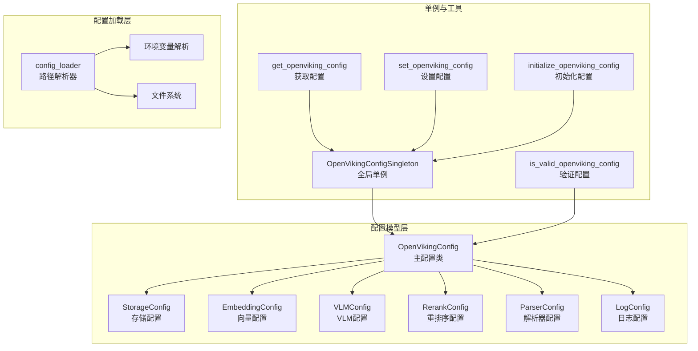

# openviking_cli.utils.config.open_viking_config 模块技术文档

## 一、模块概述

`open_viking_config` 模块是 OpenViking 系统的配置中枢，负责统一管理整个系统的所有配置项。想象一下，如果你把 OpenViking 想象成一个大型乐团——有存储模块、Embedding 向量模块、VLM 视觉语言模型模块、Rerank 重排序模块、各类文档解析器等等——那么这个模块就是乐团的**指挥**，它知道每个乐器什么时候该演奏什么内容。

在实际的软件系统中，配置管理是一个容易被低估的复杂性来源。一个没有统一配置管理的系统往往会面临以下问题：配置散落在代码各处、缺乏类型安全、难以验证配置的一致性、无法灵活切换部署模式（本地存储 vs 远程服务）。OpenVikingConfig 模块正是为了解决这些痛点而设计的。

该模块的核心职责包括：提供一个集中的配置数据模型（使用 Pydantic 实现类型安全和自动验证）、实现配置文件的加载和解析、支持灵活的配置文件路径解析策略、以及提供一个线程安全的全局单例供系统各处访问。

## 二、架构设计

### 2.1 核心类与职责



### 2.2 配置模型层次

`OpenVikingConfig` 是一个 Pydantic `BaseModel`，它采用组合模式将所有子配置项作为字段包含进来。这种设计的优势在于：配置项的结构层次与实际系统架构一致、Pydantic 自动处理类型转换和基础验证、配置序列化和反序列化变得微不足道。

主配置类包含以下核心配置域：

**存储配置（StorageConfig）**：管理 AGFS 文件系统和 VectorDB 向量数据库的后端选择、路径配置等。这是区分"服务模式"和"本地模式"的关键配置。

**Embedding 配置（EmbeddingConfig）**：管理向量模型的提供商（OpenAI、VolcEngine、VikingDB、Jina）、模型参数、并发控制等。该配置支持稠密向量、稀疏向量和混合向量三种模式。

**VLM 配置（VLMConfig）**：管理视觉语言模型的调用参数，支持多提供商配置，具备模型实例缓存能力。

**Rerank 配置（RerankConfig）**：管理重排序服务的认证信息和模型参数。

**解析器配置**：包含 PDF、Code、Image、Audio、Video、Markdown、HTML、Text 八种解析器的独立配置，每个解析器都有启用开关、内容长度限制、编码方式等通用参数，以及特定于该解析器类型的参数。

**运行时行为配置**：包括 `auto_generate_l0`（自动生成 L0 摘要）、`auto_generate_l1`（自动生成 L1 概述）、`default_search_mode`（搜索模式：fast 或 thinking）、`enable_memory_decay`（内存衰减）等运行时行为开关。

**日志配置（LogConfig）**：管理日志级别、格式、输出位置、轮转策略等。

## 三、关键组件深度解析

### 3.1 OpenVikingConfig 主配置类

`OpenVikingConfig` 是整个配置系统的核心，它继承自 Pydantic 的 `BaseModel`，利用 Pydantic 的字段验证和类型转换能力。

```python
class OpenVikingConfig(BaseModel):
    """Main configuration for OpenViking."""
    
    default_account: Optional[str] = Field(default="default")
    default_user: Optional[str] = Field(default="default")
    default_agent: Optional[str] = Field(default="default")
    
    storage: StorageConfig = Field(default_factory=lambda: StorageConfig())
    embedding: EmbeddingConfig = Field(default_factory=lambda: EmbeddingConfig())
    vlm: VLMConfig = Field(default_factory=lambda: VLMConfig())
    rerank: RerankConfig = Field(default_factory=lambda: RerankConfig())
    
    # 8种解析器配置
    pdf: PDFConfig = Field(default_factory=lambda: PDFConfig())
    code: CodeConfig = Field(default_factory=lambda: CodeConfig())
    image: ImageConfig = Field(default_factory=lambda: ImageConfig())
    audio: AudioConfig = Field(default_factory=lambda: AudioConfig())
    video: VideoConfig = Field(default_factory=lambda: VideoConfig())
    markdown: MarkdownConfig = Field(default_factory=lambda: MarkdownConfig())
    html: HTMLConfig = Field(default_factory=lambda: HTMLConfig())
    text: TextConfig = Field(default_factory=lambda: TextConfig())
    
    # 运行时行为配置
    auto_generate_l0: bool = Field(default=True)
    auto_generate_l1: bool = Field(default=True)
    default_search_mode: str = Field(default="thinking")
    default_search_limit: int = Field(default=3)
    enable_memory_decay: bool = Field(default=True)
    memory_decay_check_interval: int = Field(default=3600)
    language_fallback: str = Field(default="en")
    
    log: LogConfig = Field(default_factory=lambda: LogConfig())
    
    model_config = {"arbitrary_types_allowed": True, "extra": "forbid"}
```

**设计意图**：每个子配置都使用 `default_factory` 而不是直接赋值默认值，这确保了每次创建配置实例时都会生成一个新的子配置对象，避免了 Python 中可变默认值的常见陷阱。

`from_dict` 类方法是配置加载的关键入口。它处理了配置文件中的几种布局形式：

1. **扁平布局**：配置项直接放在根层级，如 `{"pdf": {...}, "storage": {...}}`
2. **嵌套布局**：解析器配置统一放在 `parsers` 键下，如 `{"parsers": {"pdf": {...}, "code": {...}}}`
3. **日志布局**：日志配置可能单独放在 `log` 键下

这种多布局支持的背后有一个实际痛点：不同版本的配置文件格式可能不同，或者不同的使用者有不同的偏好。通过在 `from_dict` 中统一处理这些变体，系统获得了向前兼容和向后兼容的能力。

### 3.2 OpenVikingConfigSingleton 单例类

```python
class OpenVikingConfigSingleton:
    """Global singleton for OpenVikingConfig.
    
    Resolution chain for ov.conf:
      1. Explicit path passed to initialize()
      2. OPENVIKING_CONFIG_FILE environment variable
      3. ~/.openviking/ov.conf
      4. Error with clear guidance
    """
    
    _instance: Optional[OpenVikingConfig] = None
    _lock: Lock = Lock()
```

这个单例类采用了双重检查锁定（Double-Checked Locking）模式来保证线程安全。为什么要这么复杂？考虑这样一个场景：多个线程同时首次调用 `get_instance()`，如果没有同步机制，可能会创建多个配置实例，这不仅浪费资源，还可能导致不一致的状态。

**配置解析链**是该类的核心设计亮点。它按照优先级顺序尝试三个位置：

1. **显式路径**：调用者直接传入的配置文件路径，适用于测试或者特殊部署场景
2. **环境变量**：`OPENVIKING_CONFIG_FILE` 环境变量，允许用户通过环境配置而不修改代码
3. **默认路径**：`~/.openviking/ov.conf`，即用户主目录下的隐藏配置文件

这种设计体现了"渐进式控制"的哲学：默认配置开箱即用，但高级用户可以通过环境变量或显式路径获得完全控制权。

### 3.3 辅助函数

**get_openviking_config()**：获取全局配置实例的快捷函数，是代码中最常见的配置访问方式。

**set_openviking_config()**：设置全局配置实例，用于测试或者动态配置场景。

**is_valid_openviking_config()**：验证配置的有效性。值得注意的是，这个函数只验证**跨配置项的一致性**，而不重复子配置类中已经实现的验证逻辑。例如，它检查"服务模式（VectorDB 后端为 http）+ 本地 AGFS"这种不一致组合，但不检查 Embedding 配置的内部有效性（那是 EmbeddingConfig 的职责）。

**initialize_openviking_config()**：这是最完整的初始化入口，它：
1. 加载基础配置
2. 如果提供了 `UserIdentifier`，设置默认账户、用户和代理
3. 如果提供了 `path` 参数，配置本地存储模式（嵌入式模式）
4. 同步向量维度配置
5. 执行最终验证

## 四、数据流分析

### 4.1 配置加载流程

```
┌─────────────────┐
│  JSON 配置文件  │
│   ov.conf       │
└────────┬────────┘
         │
         ▼
┌─────────────────────────────────────────┐
│  config_loader.resolve_config_path()    │
│  解析链: explicit > env > default        │
└────────┬────────────────────────────────┘
         │
         ▼
┌─────────────────────────────────────────┐
│  OpenVikingConfigSingleton._load_from_file()│
│  读取 JSON                               │
└────────┬────────────────────────────────┘
         │
         ▼
┌─────────────────────────────────────────┐
│  OpenVikingConfig.from_dict()           │
│  处理嵌套/扁平布局, 转换子配置           │
└────────┬────────────────────────────────┘
         │
         ▼
┌─────────────────────────────────────────┐
│  Pydantic 验证触发                       │
│  - 类型检查                              │
│  - 字段验证                              │
│  - model_validator 钩子                 │
└────────┬────────────────────────────────┘
         │
         ▼
┌─────────────────────────────────────────┐
│  OpenVikingConfig 实例                  │
│  返回给调用者                            │
└─────────────────────────────────────────┘
```

### 4.2 配置使用场景

当代码需要访问配置时，通常是这样使用的：

```python
# 获取配置实例
config = get_openviking_config()

# 访问存储配置
workspace = config.storage.workspace
vectordb_backend = config.storage.vectordb.backend

# 访问 Embedding 配置
embedding = config.embedding
dense_embedder = embedding.get_embedder()

# 访问 VLM 配置
if config.vlm.is_available():
    result = config.vlm.get_completion(prompt)
```

## 五、设计决策与权衡

### 5.1 为什么选择 Pydantic？

Pydantic 带来了显著的收益：开箱即用的类型验证、清晰的错误消息、自动生成 JSON Schema、易于扩展的验证器。但它也有成本：运行时验证的开销、额外的依赖、学习曲线。

对于 OpenViking 这样需要处理多种配置类型（存储、向量化、模型、解析器等）且需要良好错误提示的系统，Pydantic 的收益远大于成本。特别是在配置可能由用户编辑的情况下，Pydantic 的验证错误消息能够帮助用户快速定位问题。

### 5.2 单例模式的利弊

单例模式在这里的选择是有意识的权衡：

**优点**：
- 全局可访问：任何地方都能获取配置，不需要层层传递
- 延迟加载：只在首次访问时才加载配置文件
- 避免重复解析：配置只解析一次

**缺点**：
- 隐藏依赖：函数签名上看不出它依赖配置
- 测试困难：单例难以在测试中替换
- 状态共享：多线程环境需要额外注意

对于配置这种"全局共享的、不变的"资源，单例是合理的选择。代码中通过 `reset_instance()` 方法提供了测试支持，这是一个实用的补救措施。

### 5.3 配置验证的分层设计

系统采用了分层验证策略：

1. **Pydantic 字段验证**：基础类型检查（如 `dimension > 0`）
2. **model_validator 验证**：单个配置类的内部一致性（如 EmbeddingConfig 至少需要一个向量配置）
3. **跨配置验证**：配置项之间的关系（如 is_valid_openviking_config 检查存储后端与 AGFS 的兼容性）

这种分层避免了"所有验证挤在一个地方"的混乱，也避免了"验证逻辑散落各地难以维护"的问题。

### 5.4 解析器配置的双重布局支持

配置文件支持两种解析器布局：

```json
// 布局1: 扁平
{
  "pdf": {"strategy": "local"},
  "code": {"code_summary_mode": "ast"}
}

// 布局2: 嵌套
{
  "parsers": {
    "pdf": {"strategy": "local"},
    "code": {"code_summary_mode": "ast"}
  }
}
```

这种设计是为了兼容不同来源的配置：扁平布局更简洁，嵌套布局更有组织性（特别是当配置项增多时）。`from_dict` 方法透明地处理了这种差异，用户无需关心配置文件使用哪种布局。

## 六、使用指南与最佳实践

### 6.1 基础使用

```python
from openviking_cli.utils.config import get_openviking_config

# 最简单的使用方式 - 获取默认配置
config = get_openviking_config()
print(config.storage.workspace)
```

### 6.2 初始化配置

```python
from openviking_cli.utils.config import initialize_openviking_config

# 带参数的初始化 - 本地模式
config = initialize_openviking_config(
    path="/path/to/workspace"
)

# 或者使用 UserIdentifier
from openviking_cli.session import UserIdentifier
user = UserIdentifier(account_id="my_account", user_id="user1", agent_id="agent1")
config = initialize_openviking_config(user=user)
```

### 6.3 自定义配置字典

```python
from openviking_cli.utils.config import OpenVikingConfigSingleton

# 直接通过字典初始化
config_dict = {
    "storage": {"workspace": "/tmp/ov"},
    "embedding": {
        "dense": {
            "provider": "openai",
            "model": "text-embedding-3-small",
            "dimension": 1536
        }
    }
}
config = OpenVikingConfigSingleton.initialize(config_dict=config_dict)
```

## 七、注意事项与陷阱

### 7.1 模型验证器不会在属性赋值后重新执行

这是一个常见的 Pydantic 陷阱：

```python
config = get_openviking_config()

# 这不会触发 model_validator 的重新验证！
config.storage.workspace = "/new/path"

# 如果需要验证，应该重新创建对象
new_config_data = config.to_dict()
new_config_data["storage"]["workspace"] = "/new/path"
validated_config = OpenVikingConfig.from_dict(new_config_data)
```

这是 Pydantic 的设计选择：验证是对象创建时的一次性过程，后续的字段修改被视为"信任的"修改。如果你的代码依赖验证逻辑来设置派生值（如下面的 dimension 同步），请使用 `initialize_openviking_config()` 而不是直接修改属性。

### 7.2 向量维度需要手动同步

在 `initialize_openviking_config` 中有这个逻辑：

```python
# Ensure vector dimension is synced if not set in storage
if config.storage.vectordb.dimension == 0:
    config.storage.vectordb.dimension = config.embedding.dimension
```

这意味着如果你手动创建配置对象，需要注意 VectorDB 的 dimension 可能为空（0），这会导致后续的向量存储失败。最佳实践是始终使用 `initialize_openviking_config()` 或者确保显式设置 dimension。

### 7.3 服务模式与本地模式的配置冲突

`is_valid_openviking_config` 会检查这种冲突：

```python
is_service_mode = config.storage.vectordb.backend == "http"
is_agfs_local = config.storage.agfs.backend == "local"

if is_service_mode and is_agfs_local and not config.storage.agfs.url:
    errors.append("Service mode with local AGFS requires agfs.url")
```

这种配置在逻辑上是矛盾的：如果你使用远程 VectorDB 服务，本地文件系统的 AGFS 无法访问远程存储的数据。系统会在启动时阻止这种错误配置，而不是让它在运行时产生难以追踪的问题。

### 7.4 测试中的单例重置

在测试中使用配置时，记得重置单例：

```python
from openviking_cli.utils.config import OpenVikingConfigSingleton

def test_something():
    try:
        # 设置测试配置
        test_config = OpenVikingConfig(...)
        OpenVikingConfigSingleton.initialize(config_dict=test_config.to_dict())
        
        # 执行测试
        ...
    finally:
        # 清理 - 重要！
        OpenVikingConfigSingleton.reset_instance()
```

### 7.5 配置文件格式必须是 JSON

当前实现只支持 JSON 格式的配置文件。虽然 `parser_config` 模块支持从 YAML 加载（用于 ParserConfig 的独立加载场景），但主配置文件 `ov.conf` 强制使用 JSON。这意味着用户需要编写 JSON 而非 YAML。

## 八、相关模块参考

该模块与以下模块有密切关系：

- **[config_loader](openviking_cli.utils.config.config_loader.md)**：提供配置文件路径解析的三层策略（显式路径、环境变量、默认路径）
- **[embedding_config](openviking_cli.utils.config.embedding_config.md)**：Embedding 模型的配置，支持多种提供商和混合向量
- **[storage_config](openviking_cli.utils.config.storage_config.md)**：存储后端配置，包含 AGFS 和 VectorDB 的配置
- **[vlm_config](openviking_cli.utils.config.vlm_config.md)**：视觉语言模型配置，支持多提供商和实例缓存
- **[rerank_config](openviking_cli.utils.config.rerank_config.md)**：重排序服务配置
- **[parser_config](openviking_cli.utils.config.parser_config.md)**：八种文档解析器的配置集合
- **[log_config](openviking_cli.utils.config.log_config.md)**：日志系统配置
- **[session/user_id](openviking_cli.session.user_id.md)**：UserIdentifier 类，用于在配置初始化时设置用户上下文