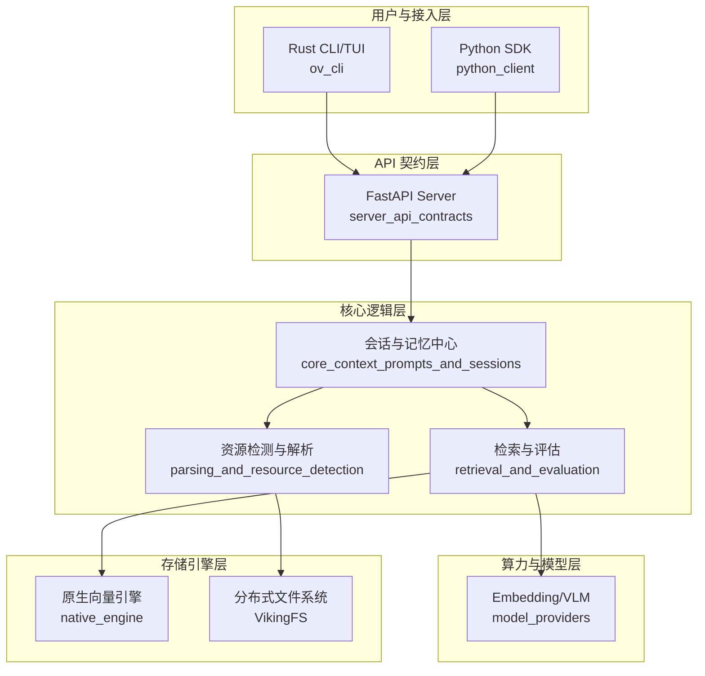

# 欢迎来到 OpenViking 项目维基 👋

作为 OpenViking 的首席架构师，我非常高兴你能加入我们。OpenViking 不仅仅是一个代码库，它是为了解决 AI Agent 时代最核心的挑战而生的：**如何让 AI 拥有可靠、持久且可进化的“记忆”与“技能库”。**

---

## 1. OpenViking 是做什么的？

简单来说，OpenViking 是一个**专门为 AI Agent 打造的智能上下文数据库**。

想象一下，你正在运行一个复杂的 AI 助手。为了让它变聪明，它需要记住你们昨天的对话（**记忆**），需要学会操作你的本地文件（**技能**），还需要查阅成千上万页的工程文档（**资源**）。

传统的数据库只负责存取，而 OpenViking 会：
*   **深度理解**：把 PDF、代码仓库、网页等各种乱七八糟的格式变成 AI 能读懂的结构。
*   **多层索引**：像人类读书一样，先看摘要（L0），再看目录（L1），最后读细节（L2），从而在海量数据中瞬间精准定位。
*   **智能去重**：自动合并重复的记忆，确保 Agent 的大脑不会因为信息冗余而混乱。

---

## 2. 架构一览

OpenViking 采用了典型的“**多语言协作架构**”：Python 负责业务逻辑编排，C++ 驱动底层向量性能，Rust 保证工具链的轻量分发，Go 负责文件系统的稳定性。

### 架构演进路线
系统从上到下可以分为四层：接入层通过 [rust_cli_interface](rust_cli_interface.md) 提供交互体验；契约层 [server_api_contracts](server_api_contracts.md) 严格定义了前后端通讯标准；核心逻辑层则通过 [parsing_and_resource_detection](parsing_and_resource_detection.md) 将原始数据转化为“上下文”；最后由 [native_engine_and_python_bindings](native_engine_and_python_bindings.md) 在 C++ 层完成极速的向量检索。

---

## 3. 核心设计决策

在构建 OpenViking 时，我们做出了几个关键的权衡（Trade-offs）：

*   **多语言混合动力**：我们没有坚持“全栈 Python”。虽然业务逻辑在 Python 中开发最快，但向量计算必须交给 C++，命令行工具则交给 Rust 以实现零依赖分发。
*   **分层索引 (L0/L1/L2)**：相比于传统 RAG 粗暴的固定分块，我们强制要求数据具备“摘要-概述-详情”的三层结构。这大大降低了向量检索的噪声，并减少了 LLM 的 Token 消耗。
*   **异步嵌入队列**：生成 Embedding 是极其耗时的。我们通过 [storage_core_and_runtime_primitives](storage_core_and_runtime_primitives.md) 中的 `NamedQueue` 实现了写入与计算的解耦，确保用户请求不会被长时间阻塞。
*   **契约优先**：所有 API 模型均基于 Pydantic 严格定义。这不仅是为了自动化文档，更是为了确保在快速迭代中，Python 客户端与 Rust CLI 永远不会出现通讯协议不一致。

---

## 4. 模块指南

为了方便你快速定位代码，我们将系统拆分为以下核心模块：

*   **接入体验**：[rust_cli_interface](rust_cli_interface.md) 提供了一个炫酷的 TUI 界面，让你可以像浏览文件一样浏览 AI 的记忆空间。而 [python_client_and_cli_utils](python_client_and_cli_utils.md) 则是开发者最常用的 SDK。
*   **智能解析**：[parsing_and_resource_detection](parsing_and_resource_detection.md) 充当了“入关处”的角色，它利用 `tree-sitter` 深度解析 C++/Python/Rust 等代码骨架，并能智能识别 URL 类型。
*   **大脑中枢**：[core_context_prompts_and_sessions](core_context_prompts_and_sessions.md) 管理着 Agent 的生命周期，负责执行耗时的记忆提取与会话压缩逻辑。
*   **检索与评估**：[retrieval_and_evaluation](retrieval_and_evaluation.md) 是系统的“质检员”，它不仅负责分层递归检索，还集成 RAGAS 框架来量化 AI 回答的质量。
*   **存储引擎**：[native_engine_and_python_bindings](native_engine_and_python_bindings.md) 是动力核心，通过 `pybind11` 将 C++ 的极致性能带入 Python，支持 AVX2 等指令集优化。
*   **构建基石**：一切的自动化安装都源于 [build_and_packaging](build_and_packaging.md)，它编排了跨越四种语言的复杂编译流程。

---

## 5. 关键端到端工作流

### A. 知识吸纳流 (Ingestion Workflow)
当用户输入一条新记忆或上传一个文档时：
1.  **识别**：`DetectInfo` 判断资源类型（本地文件、Git 仓库或网页）。
2.  **解析**：`BaseParser` 提取结构化内容，生成 `ResourceNode` 树。
3.  **入队**：内容进入 `NamedQueue` 异步等待。
4.  **嵌入**：`EmbeddingMsgConverter` 调用模型服务生成向量。
5.  **持久化**：`native_engine` 将数据压入底层 KV 存储与向量索引。

### B. 智能检索流 (Retrieval Workflow)
当 Agent 需要寻找答案时：
1.  **语义降噪**：`HierarchicalRetriever` 先在 L0 抽象层进行粗筛。
2.  **递归下探**：系统根据 L0 的分步结果，逐层深入到 L1 概述和 L2 详情。
3.  **相关性传播**：父节点的得分会按权重传递给子节点，确保上下文的连贯性。
4.  **评估**：`IORecorder` 记录整个轨迹，供后续通过 RAGAS 进行准确率分析。

---

希望这份概览能帮你快速进入角色。如果你准备好了，建议先阅读 **[本地开发环境设置指南](./development_setup.md)**，然后从 **[server_api_contracts](server_api_contracts.md)** 开始探索我们严谨的契约世界。

**Happy Coding!** 🛶