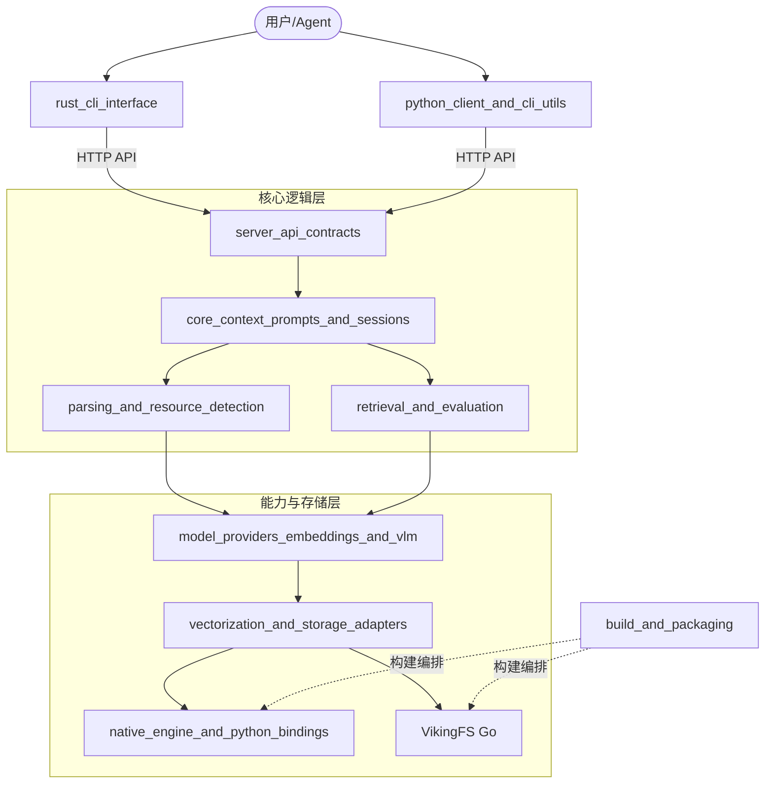

## 1. OpenViking 是什么？

简单来说，**OpenViking 是 AI Agent 的“长期记忆”与“知识大脑”**。

当你在构建一个 AI 助手时，它面临的最大挑战是如何在海量信息中不“迷失”。OpenViking 作为一个**面向 Agent 的上下文数据库**，它不仅仅存储数据，更负责理解数据。它能将杂乱的 PDF、代码库、网页转化为结构化的“记忆”与“技能”，通过独特的三层向量索引（L0 摘要 / L1 概要 / L2 详情）实现极速且精准的语义检索。

无论是一个持续数月的对话会话，还是一个包含万级文件的工程项目，OpenViking 都能让 Agent 像人类一样，既能“一目十行”地筛选，也能“字斟句酌”地深挖。

---

## 2. 架构一览

OpenViking 采用了多语言混合架构，以平衡开发效率、系统稳定性和极致的计算性能。

### 架构演进逻辑
用户通过 [rust_cli_interface](rust_cli_interface.md)（提供高性能 TUI）或 [python_client_and_cli_utils](python_client_and_cli_utils.md) 发起请求。请求进入 [server_api_contracts](server_api_contracts.md) 定义的 API 边界后，由 [core_context_prompts_and_sessions](core_context_prompts_and_sessions.md) 进行会话编排。系统调用 [parsing_and_resource_detection](parsing_and_resource_detection.md) 解析异构资源，利用 [model_providers_embeddings_and_vlm](model_providers_embeddings_and_vlm.md) 生成语义向量，最终通过 [vectorization_and_storage_adapters](vectorization_and_storage_adapters.md) 路由到 C++ 编写的 [native_engine_and_python_bindings](native_engine_and_python_bindings.md) 内核进行高并发存储与检索。

---

## 3. 核心设计决策

在构建 OpenViking 时，我们做出了几个关键的权衡：

*   **多语言混合架构 (Polyglot Architecture)**：我们没有盲目追求单一语言。Python 用于业务逻辑编排，C++ 用于向量计算内核，Go 用于文件系统抽象，Rust 用于分发轻量级的 CLI。这种组合确保了每一行代码都运行在最适合它的引擎上。
*   **分层索引策略 (L0/L1/L2)**：为了解决 RAG 系统中“检索噪声”和“计算成本”的矛盾，我们强制要求所有上下文必须具备三层抽象。L0 用于快速粗筛，L1 用于语义匹配，L2 用于最终推理。
*   **适配器模式 (Adapter Pattern)**：通过 [vectorization_and_storage_adapters](vectorization_and_storage_adapters.md)，我们屏蔽了底层向量数据库（如 VikingDB）和模型供应商（如 OpenAI、火山引擎）的差异，确保系统具备极强的云原生兼容性。
*   **防腐层设计 (Anti-Corruption Layer)**：[server_api_contracts](server_api_contracts.md) 作为严格的契约层，确保了内部复杂的领域模型不会污染外部 API，使得前后端可以独立演进。

---

## 4. 模块指南

为了帮助你快速定位代码，我们将系统划分为以下核心模块：

*   **交互门户**：[rust_cli_interface](rust_cli_interface.md) 是开发者的首选工具，它包含了一个交互式的 TUI，让你能直观地浏览 `viking://` 协议下的资源树。
*   **记忆中枢**：[core_context_prompts_and_sessions](core_context_prompts_and_sessions.md) 负责管理会话生命周期，它通过 [session_runtime](session_runtime.md) 实现记忆的自动压缩与去重。
*   **资源解析**：[parsing_and_resource_detection](parsing_and_resource_detection.md) 是系统的“入口门神”，它利用 `tree-sitter` 等技术深度解析代码和文档结构。
*   **检索与评估**：[retrieval_and_evaluation](retrieval_and_evaluation.md) 不仅负责分层检索，还内置了 RAGAS 评估框架，确保 Agent 的回答质量可量化。
*   **存储内核**：[native_engine_and_python_bindings](native_engine_and_python_bindings.md) 实现了极致紧凑的二机制行存储格式，配合 [storage_core_and_runtime_primitives](storage_core_and_runtime_primitives.md) 提供的分布式 ID 生成器，支撑起海量数据的读写。
*   **工程基座**：[build_and_packaging](build_and_packaging.md) 负责将上述所有异构组件打包成一个简单的 Python Wheel，它是项目持续集成的核心。

---

## 5. 关键端到端流程

### 流程 A：资源入库与向量化 (Ingestion)
1.  用户通过 CLI 提交一个本地目录。
2.  [parsing_and_resource_detection](parsing_and_resource_detection.md) 识别文件类型，提取代码骨架或文档段落。
3.  [model_providers_embeddings_and_vlm](model_providers_embeddings_and_vlm.md) 调用 Embedding 模型生成多层向量。
4.  [vectorization_and_storage_adapters](vectorization_and_storage_adapters.md) 将数据转换为 `DeltaRecord`。
5.  [native_engine_and_python_bindings](native_engine_and_python_bindings.md) 将其持久化到 KV 存储并更新位图索引。

### 流程 B：深度语义检索 (Thinking Retrieval)
1.  Agent 发起带 `RetrieverMode.THINKING` 标志的查询。
2.  [retrieval_and_evaluation](retrieval_and_evaluation.md) 启动分层递归检索。
3.  系统先在 L0 摘要层定位可能的目录，再进入 L1 概要层进行语义精选。
4.  结合 [storage_core_and_runtime_primitives](storage_core_and_runtime_primitives.md) 中的热度算法，对结果进行二次重排。
5.  返回包含“思考轨迹”的检索结果，供 Agent 决策。

---

我们期待你的贡献！请从阅读 [贡献指南](CONTRIBUTING.md) 开始你的 OpenViking 之旅。