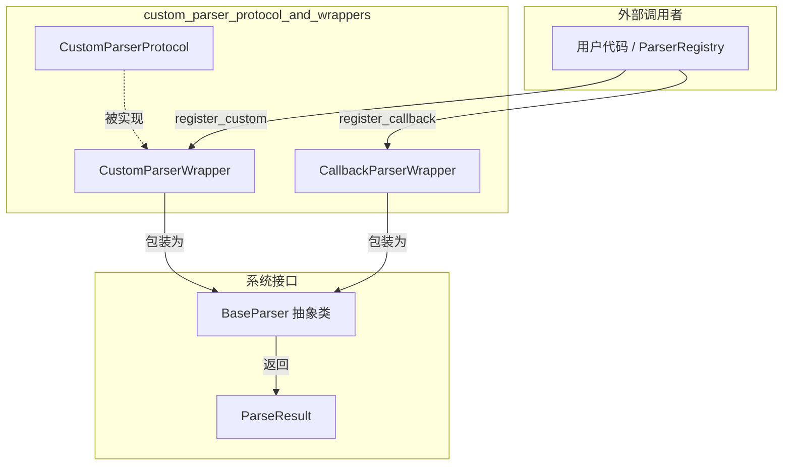

# 自定义解析器协议与包装器 (custom_parser_protocol_and_wrappers)

## 概述

你是否遇到过这样的场景：一个闭源的文档处理库能解析某种特殊格式（比如说 `.xyz` 文件），但系统的解析器注册表只认识预定义的那几种文件类型。怎么办？把整个闭源库重写一遍？引入复杂的继承关系？

**这个模块要解决的核心问题就是：为系统提供一个轻量级的扩展点，让任何第三方解析器（无论它是什么形式——是一个完整的类，还是一个简单的异步函数）都能无缝接入 OpenViking 的解析生态。**

你可以把它想象成「通用电源适配器」：无论你的设备用的是美标、英标还是欧标插头，适配器都能让它在同一个插座上工作。这个模块就是那个适配器——它把形态各异的自定义解析器统一包装成系统认识的「BaseParser」接口。

---

## 架构概览



**核心设计思想**：这是一个**适配器模式（Adapter Pattern）**的具体实现。系统内部定义了一个统一的 `BaseParser` 接口（参见 [base_parser_abstract_class](parser_abstractions_and_extension_points-base_parser_abstract_class.md)），但外部世界的自定义解析器可能：

1. 遵循完全不同的方法签名
2. 只是一个简单的函数，不想为此创建一个类
3. 是闭源库，无法修改其源码

这个模块提供了两条接入路径，让上述所有情况都能平滑地融入系统。

---

## 组件详解

### 1. CustomParserProtocol：定义契约的「插头规格」

```python
@runtime_checkable
class CustomParserProtocol(Protocol):
    def can_handle(self, source: Union[str, Path]) -> bool: ...
    async def parse(self, source: Union[str, Path], **kwargs) -> "ParseResult": ...
    @property
    def supported_extensions(self) -> List[str]: ...
```

**为什么存在？**

Python 的 `Protocol` 是 structural subtyping（结构化子类型）的实现。它不像 `ABC` 那样要求显式继承——只要你的类碰巧有这些方法，Python 运行时就会把你当作「实现了这个协议」。这意味着：

- 第三方库中的类不需要修改源码，只要它有 `can_handle`、`parse`、`supported_extensions` 这几个成员，就能直接注册使用
- `@runtime_checkable` 装饰器允许在运行时检查某个对象是否实现了协议（在 `CustomParserWrapper` 构造函数中有用到）

**设计洞察**：

这个协议只规定了三个最小必要接口：
- `supported_extensions`：让注册表知道这是什么文件类型
- `can_handle`：比扩展名更灵活的处理判断（比如同一个扩展名 `.dat` 可能对应多种格式）
- `parse`：实际执行解析的方法

注意它没有继承自 `BaseParser`——这是刻意的设计解耦。协议是「外部世界」的契约，而 `BaseParser` 是「内部系统」的契约。两者通过 `CustomParserWrapper` 进行翻译。

### 2. CustomParserWrapper：把「外来插头」转为「系统插座」

```python
class CustomParserWrapper:
    def __init__(
        self,
        custom_parser: CustomParserProtocol,
        extensions: Optional[List[str]] = None,
    ):
```

**它的核心职责是「翻译」**：

| 外部自定义解析器 | 系统内部 (BaseParser) |
|---|---|
| `can_handle(source)` | `can_parse(path)` |
| `parse(source, **kwargs)` | `parse(source, **kwargs)` |
| `supported_extensions` 属性 | `supported_extensions` 属性 |

**但它不仅仅是简单转发**，它还做了几件重要的事：

1. **类型检查**：构造函数中用 `isinstance(custom_parser, CustomParserProtocol)` 验证传入对象确实实现了协议，否则抛出 `TypeError`。这是防御性编程——如果用户误传了一个不符合协议的对象，越晚发现错误，调试成本越高。

2. **扩展名覆盖**：`extensions` 参数允许调用者覆盖自定义解析器自己声明的扩展名。这在什么场景有用？假设你有一个通用的「数据分析器」，它能处理 `.csv`、`.tsv`、`.dat`，但你只想让它处理 `.dat` 文件——这时就可以传 `extensions=[".dat"]` 来限制它。

3. **错误转换**：在 `parse()` 方法中，如果 `can_handle` 返回 `False`，它不会默默放行，而是抛出明确的 `ValueError`，告诉用户是哪个解析器无法处理哪个源。这是**快速失败（Fail Fast）**原则的体现。

### 3. CallbackParserWrapper：更轻量的「即插即用」方案

```python
class CallbackParserWrapper:
    def __init__(
        self,
        extension: str,
        parse_fn: Callable[[Union[str, Path]], "ParseResult"],
        name: Optional[str] = None,
    ):
```

**适用场景**：你不想为解析一个简单文件格式专门写一个类，只想甩一个函数过去。

```python
# 以前你得这样：
class MyParser:
    supported_extensions = [".xyz"]
    async def parse(self, source, **kwargs): ...

# 现在你可以这样：
async def my_simple_parser(source, **kwargs):
    # 几行代码搞定
    return create_parse_result(...)

registry.register_callback(".xyz", my_simple_parser)
```

**设计洞察**：这个包装器甚至更极端地简化了接口——它不支持 `parse_content()`（即直接解析内容字符串），因为典型的回调式解析器就是针对文件路径的。这是一种**有意的限制**，防止过度抽象。如果你的场景确实需要内容解析，你应该使用 `CustomParserWrapper`。

---

## 数据流向

让我们追踪一个完整的解析请求是如何流经这个模块的：

```
用户代码
    │
    ▼
ParserRegistry.parse(source)
    │
    ├─▶ get_parser_for_file(path)  ────根据扩展名找解析器
    │           │
    │           ▼
    │    _extension_map[ext] ─────────返回解析器名称
    │           │
    │           ▼
    │    _parsers[name] ────────────返回解析器实例（可能是 Wrapper）
    │           │
    │           ▼
    │    wrapper.parse(path) ───────如果这是 CustomParserWrapper
    │           │
    │           ▼
    │    custom_parser.parse(path) ─调用用户自定义的解析逻辑
    │           │
    ▼           ▼
ParseResult ◀──返回系统统一的 ParseResult
```

关键点：**对调用者（ParserRegistry）来说，包装器是完全透明的**。它不需要知道底层是一个完整的类还是一个回调函数，只需要按照 `BaseParser` 的接口调用即可。这就是适配器模式的精髓。

---

## 设计决策与权衡

### 1. 协议 vs 抽象基类：为什么选 Protocol？

如果选择 `class CustomParserProtocol(ABC)`，外部类就必须显式继承它，这会污染其继承树。而 `Protocol` 是 structural typing——「只要你有这些方法你就是对的」，无需继承。这对于第三方库尤其友好。

**权衡**：Protocol 的缺点是静态类型检查工具（如 mypy）无法在编译时发现接口不匹配的问题（除非用 `runtime_checkable`，但那也只是运行时检查）。但考虑到这个模块的主要使用者是运行时注册自定义解析器，这个代价是可以接受的。

### 2. 两个包装器 vs 一个通用包装器

为什么有两个独立的类，而不是一个同时支持「对象」和「函数」的统一包装器？

**答案**：关注点分离。

- `CustomParserWrapper` 需要处理更复杂的情况：扩展名覆盖、协议验证、错误消息定制。它是有状态的对象。
- `CallbackParserWrapper` 极简设计，不支持的内容直接抛 `NotImplementedError`。它是轻量级的。

强行合并它们会导致接口膨胀，或者需要引入复杂的内部状态机来区分两种模式。新贡献者也会困惑：「这个类到底支持哪种用法？」

### 3. 不支持 parse_content 的决策

`CallbackParserWrapper.parse_content()` 直接抛 `NotImplementedError`，而不是尝试把内容写入临时文件再调用回调。这有两个理由：

1. **语义清晰**：回调式解析器本质上就是「读取文件并解析」，不存在「我有内容字符串你要解析」这种用法。如果用户真的需要内容解析，说明回调方案选错了，应该用 `CustomParserWrapper`。

2. **避免隐式行为**：如果这里自动创建临时文件，用户可能会困惑：「我没传路径它怎么自己搞了文件？」显式抛错比隐式行为更安全。

---

## 使用指南

### 方式一：协议接入（适合复杂场景）

```python
from openviking.parse.custom import CustomParserProtocol
from openviking.parse.base import ParseResult, NodeType, create_parse_result
from openviking.parse.registry import get_registry
from typing import Union, List
from pathlib import Path

class XYZParser:
    """解析 .xyz 格式的自定义解析器"""
    
    @property
    def supported_extensions(self) -> List[str]:
        return [".xyz"]
    
    def can_handle(self, source: Union[str, Path]) -> bool:
        return str(source).endswith(".xyz")
    
    async def parse(self, source: Union[str, Path], **kwargs) -> ParseResult:
        # 你的解析逻辑
        content = Path(source).read_text()
        # ... 处理 content ...
        return create_parse_result(
            root=ResourceNode(type=NodeType.ROOT, title="XYZ Document"),
            source_path=str(source),
            source_format="xyz",
            parser_name="XYZParser"
        )

# 注册到全局注册表
registry = get_registry()
registry.register_custom(XYZParser(), name="xyz")

# 后续使用方式和内置解析器完全一致
result = await registry.parse("/path/to/file.xyz")
```

### 方式二：回调接入（适合轻量场景）

```python
from openviking.parse.registry import get_registry
from openviking.parse.base import create_parse_result, NodeType
from pathlib import Path

async def parse_dat_file(source, **kwargs) -> ParseResult:
    content = Path(source).read_text()
    # 简单处理：把每行作为一个章节
    lines = content.split("\n")
    root = ResourceNode(type=NodeType.ROOT, title="DAT File")
    for i, line in enumerate(lines):
        root.add_child(ResourceNode(
            type=NodeType.SECTION,
            title=f"Line {i+1}",
            level=1
        ))
    return create_parse_result(
        root=root,
        source_path=str(source),
        source_format="dat",
        parser_name="dat_parser"
    )

registry = get_registry()
registry.register_callback(".dat", parse_dat_file, name="dat_parser")
```

---

## 注意事项与陷阱

### 1. 扩展名注册冲突

如果注册了多个解析器支持同一扩展名，**后注册的会覆盖先注册的**：

```python
registry.register_custom(ParserA())  # 支持 .xyz
registry.register_custom(ParserB(), extensions=[".xyz"])  # 也会注册到 .xyz
# 现在 .xyz 映射到 ParserB，ParserA 仍然存在但不会被自动选中
```

### 2. 异步函数 requirement

`parse_fn` 必须是**异步函数**（`async def`），不是普通函数。系统内部所有解析操作都是异步的，这是架构要求。如果忘记加 `async`，代码会在运行时立即报错，但错误信息可能不够直观。

### 3. 路径类型兼容

协议的 `parse()` 方法接受 `Union[str, Path]`，但回调包装器的 `parse_fn` 签名也是如此。注意：传入的可能是字符串路径，也可能是 `Path` 对象。你的解析逻辑应该能处理两者（建议统一用 `str(Path(source))` 转换）。

### 4. 回调包装器的名称自动生成

如果不传 `name` 参数，回调包装器会生成类似 `callback.xyz` 这样的名字。这主要用于日志和调试。如果你在生产环境使用，建议显式传入一个有意义的名称。

### 5. 运行时检查不是万能的

`@runtime_checkable` 只检查方法存在，不检查方法签名是否正确。如果你定义的 `parse` 方法签名是 `parse(self, source)` 而不是 `parse(self, source, **kwargs)`，运行时不会报错，但调用时可能因为参数不匹配而失败。

---

## 相关模块

- [base_parser_abstract_class](parser_abstractions_and_extension_points-base_parser_abstract_class.md) - 系统解析器的抽象基类，包装器适配的目标接口
- [parser_abstractions_and_extension_points](parser_abstractions_and_extension_points.md) - 解析器扩展点模块的父文档
- [language_extractor_base](parser_abstractions_and_extension_points-language_extractor_base.md) - 代码语言 AST 提取器的基础抽象
- 解析器注册表：参见 [registry.py (openviking/parse/registry.py)](../openviking/parse/registry.md)（如存在）