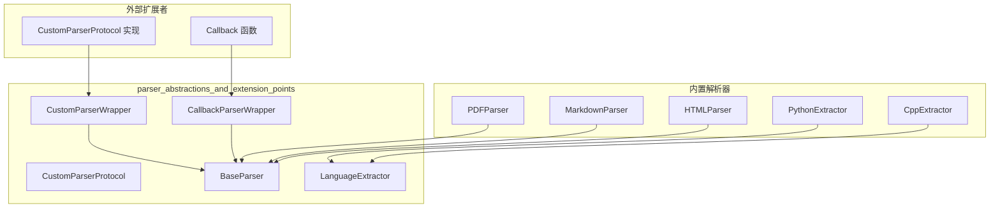

# parser_abstractions_and_extension_points

## 概述

**问题空间**：当一个系统需要处理数十种不同格式的文档（PDF、Markdown、HTML、纯文本），同时又希望允许用户无缝接入自己的解析器时，如何设计一套既能统一接口又能保持灵活性的架构？

**解决方案**：本模块定义了 OpenViking 解析层的核心抽象——一套Protocol（协议）定义、抽象基类、以及适配器封装。它解决的问题是：**如何在保持内置解析器统一管理的同时，让外部开发者也能以"一等公民"的身份扩展系统能力**。

这个模块是整个解析系统的"宪法"——它不直接解析任何文档，但它定义了谁可以成为解析器、解析器必须承诺什么契约、以及外部代码如何融入现有体系。

---

## 架构概览



**数据流说明**：

1. **外部扩展路径**：外部开发者实现 `CustomParserProtocol` 接口 → 通过 `CustomParserWrapper` 适配为 `BaseParser`；或直接传入回调函数 → 通过 `CallbackParserWrapper` 包装
2. **内置解析器路径**：内置解析器（PDF、Markdown 等）直接继承 `BaseParser`
3. **代码解析路径**：语言特定的 AST 提取器（Python、C++ 等）继承 `LanguageExtractor`

---

## 核心设计决策

### 1. 为什么选择 Protocol 而非 ABC（抽象基类）？

**决策**：使用 `typing_extensions.Protocol` 而非 `abc.ABC` 定义自定义解析器接口。

**分析**：
- **ABC 的问题**：需要显式继承，如果外部库已经有一个完整的解析器类，强行继承会破坏其继承链
- **Protocol 的优势**： Structural Subtyping（结构化子类型），只需"看起来像"就能工作——只要实现了 `can_handle`、`parse` 和 `supported_extensions`，无论这个类原来在哪个继承树下，都能被系统接纳

** tradeoff**：Protocol 是运行时检查（`@runtime_checkable`），这意味着类型错误可能在运行时才暴露。但对于插件系统，这种灵活性比编译时严格性更有价值——外部开发者要的是"能接入"，而不是"必须按我的方式继承"。

### 2. 为什么要两层封装（Wrapper）？

**决策**：提供 `CustomParserWrapper` 和 `CallbackParserWrapper` 两种适配器。

**分析**：
- `CustomParserWrapper`：当你有一个完整的类（实现了 Protocol）时使用
- `CallbackParserWrapper`：当你只想注册一个简单函数时使用——这降低了接入门槛

**设计理念**：这是**渐进式复杂度的体现**。系统不要求每个人都构建一个"正规军"式的解析器类；如果你只想写一个快速解析函数，也能直接注册。这种思想在 Go 的 `http.HandlerFunc` 和 Python 的回调函数中常见。

### 3. BaseParser 为什么是异步的？

**决策**：`parse()` 和 `parse_content()` 都是 async 方法。

**分析**：
- 文档解析涉及 I/O（读取文件、网络请求）
- V4.0 架构中，解析可能调用 VLM（Vision-Language Model）处理图像
- 同步阻塞会让整个事件循环卡住，降低吞吐量

**tradeoff**：异步增加了编写解析器的复杂度（需要处理 await），但对于需要处理大量文档的系统，这是必要的性能妥协。

### 4. 为什么 BaseParser 和 LanguageExtractor 是分开的？

**决策**：两者都是抽象类，但服务于不同的解析场景。

| 维度 | BaseParser | LanguageExtractor |
|------|------------|-------------------|
| 目标 | 文档解析（PDF、Markdown 等） | 代码 AST 提取 |
| 输出 | ParseResult（树形结构） | CodeSkeleton（扁平结构） |
| 复杂度 | 处理布局、格式、多媒体 | 处理语法树、符号表 |

**分析**：代码和文档的语义结构完全不同——代码需要提取类、函数、导入；文档需要提取章节、段落、标题。强行统一会导致两边的抽象都变得扭曲。分离是**关注点分离（Separation of Concerns）**的体现。

---

## 子模块概览

| 子模块 | 职责 | 核心组件 |
|--------|------|----------|
| [custom_parser_protocol_and_wrappers](parser_abstractions_and_extension_points-custom_parser_protocol_and_wrappers.md) | 定义外部解析器接入协议和适配器 | `CustomParserProtocol`, `CustomParserWrapper`, `CallbackParserWrapper` |
| [base_parser_abstract_class](base_parser_abstract_class.md) | 所有内置文档解析器的抽象基类 | `BaseParser` |
| [language_extractor_base](language_extractor_base.md) | 代码语言 AST 提取器的抽象基类 | `LanguageExtractor` |

---

## 与其他模块的依赖关系

### 上游依赖（什么调用这个模块）

- **资源检测模块**（`resource_detection_traversal_metadata`）：通过 `DetectInfo` 判断资源类型后，调度对应的解析器
- **ParserRegistry**（隐式，未在当前模块树中）：负责维护所有已注册解析器的注册表，根据文件扩展名分发

### 下游依赖（这个模块调用什么）

- **ParseResult**（`openviking.parse.base`）：所有解析器的返回值类型
- **CodeSkeleton**（`openviking.parse.parsers.code.ast.skeleton`）：语言提取器的返回值类型
- **VikingFS**（`openviking.storage.viking_fs`）：通过 `_get_viking_fs()` 获取临时文件 URI

---

## 新贡献者注意事项

### 1. 协议 vs 实现——别混肴

`CustomParserProtocol` 是**接口定义**，`BaseParser` 是**抽象基类**。前者是"你可以这样写"，后者是"内置解析器必须这样写"。如果你要扩展系统，你实现 Protocol；如果你要添加内置解析器，你继承 BaseParser。

### 2. parse vs parse_content 的区别

- `parse(source)`：接收文件路径，内部会读取文件
- `parse_content(content, source_path)`：直接接收内容字符串

**坑**：大多数自定义解析器只实现 `parse`，因为它们依赖文件系统。如果调用 `parse_content`，会抛出 `NotImplementedError`。调用方必须根据场景选择正确的方法。

### 3. 编码检测的隐式逻辑

`BaseParser._read_file()` 有一个编码探测列表：`["utf-8", "utf-8-sig", "latin-1", "cp1252"]`。这意味着：
- UTF-8 文件（有无 BOM 都能读）
- 如果不是，再试 Latin-1（单字节编码的 superset，几乎不会失败）
- 最后才报错

**注意**：如果你要处理非 Western 编码（如 GBK、Shift-JIS），需要在 `_read_file` 中添加。

### 4. temp_dir_path 的 V4.0 变化

ParseResult 在 V4.0 中新增了 `temp_dir_path` 字段。所有解析器在解析过程中产生的临时文件（如解压的 PDF 图片）应存入这个目录，系统会自动清理。

### 5. 扩展点是有代价的——运行时检查

`@runtime_checkable` 意味着如果你传入一个没有实现 Protocol 的对象，不会报编译错误，只会在实际调用时才抛出 `TypeError`。调试时，先检查你的类是否真的实现了所有 Protocol 方法。

---

## 使用示例

### 示例 1：注册一个简单的回调解析器

```python
from openviking.parse.custom import CallbackParserWrapper

async def parse_xyz(source, **kwargs):
    # 简单的自定义解析逻辑
    root = ResourceNode(type=NodeType.ROOT, title="XYZ Document")
    return create_parse_result(root=root, source_format="xyz")

# 注册到 ParserRegistry（假设存在）
registry.register_callback(".xyz", parse_xyz)
```

### 示例 2：实现完整的 CustomParserProtocol

```python
from typing import Union
from pathlib import Path
from openviking.parse.custom import CustomParserProtocol

class MyParser:
    @property
    def supported_extensions(self) -> List[str]:
        return [".myformat"]

    def can_handle(self, source: Union[str, Path]) -> bool:
        return str(source).endswith(".myformat")

    async def parse(self, source: Union[str, Path], **kwargs) -> ParseResult:
        # 完整的解析实现
        ...
```

---

*关联文档：*
- *[resource_and_document_taxonomy](resource_and_document_taxonomy.md)* — 资源分类和文档类型枚举
- *[code_language_ast_extractors](code_language_ast_extractors.md)* — 具体语言实现（Python、C++、Go 等）
- *[resource_detection_traversal_metadata](resource_detection_traversal_metadata.md)* — 资源检测和遍历元数据