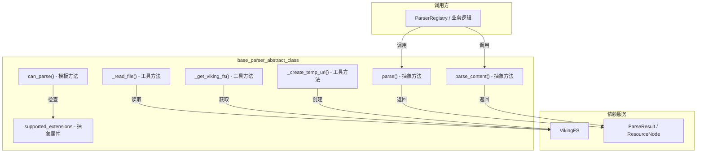

# base_parser_abstract_class 模块技术深度解析

## 模块概述

`base_parser_abstract_class` 模块是 OpenViking 文档解析系统的**契约层**（contract layer）。它定义了一套统一的接口规范，所有具体的文档解析器——无论是 PDF 解析器、Markdown 解析器，还是代码语言解析器——都必须遵循这套规范才能被系统接纳。

**解决的问题**：在 OpenViking 的检索增强生成（RAG）架构中，文档需要被解析成树形结构以保留原始文档的层级信息（章节、段落等）。然而，现实世界的文档格式千差万别——有 PDF、Markdown、HTML、纯文本，还有各种编程语言的源代码。如果每个解析器都自行其是，系统将无法统一调度它们，也难以实现跨格式的检索和抽象生成。`BaseParser` 抽象基类通过定义 `parse()` 和 `parse_content()` 两个核心异步方法，为所有解析器建立了一个**一致性契约**：无论底层文件格式如何，调用方只需要知道"给我一个 ParseResult"，而不必关心解析过程的具体细节。

**架构角色**：这是一个 **策略模式的抽象基类**。它定义了"如何解析"的接口，但不实现任何具体的解析逻辑。所有具体解析器（如 `PDFParser`、`MarkdownParser` 等）都继承自 `BaseParser`，并实现其抽象方法。这种设计允许系统在运行时根据文件类型动态选择合适的解析器，同时保持解析逻辑的可扩展性——新增一种文档格式只需要创建一个新的 `BaseParser` 子类即可。

---

## 架构图与数据流



### 组件角色解析

| 组件 | 角色 | 职责 |
|------|------|------|
| `parse()` | 抽象方法 | 核心解析入口，接收文件路径或内容字符串，返回 `ParseResult` |
| `parse_content()` | 抽象方法 | 直接解析文档内容字符串，适用于已加载到内存的内容 |
| `supported_extensions` | 抽象属性 | 返回解析器支持的文件扩展名列表（如 `[".pdf"]`） |
| `can_parse()` | 模板方法 | 基于文件扩展名判断该解析器是否适用于给定文件 |
| `_read_file()` | 工具方法 | 带编码检测的文件读取，依次尝试 UTF-8、UTF-8-SIG、Latin-1、CP1252 |
| `_get_viking_fs()` | 工具方法 | 获取 VikingFS 单例，用于临时文件管理和 URI 操作 |
| `_create_temp_uri()` | 工具方法 | 创建临时 URI（viking://temp/xxx），供三阶段解析架构使用 |

---

## 核心抽象方法详解

### parse() 方法

```python
@abstractmethod
async def parse(self, source: Union[str, Path], instruction: str = "", **kwargs) -> ParseResult:
```

**设计意图**：`parse()` 是解析器的**主要入口点**。它接收一个文件路径（`str` 或 `Path` 对象），然后返回包含完整文档树结构的 `ParseResult` 对象。

**参数语义**：
- `source`：文件路径或内容字符串。通过 `Union[str, Path]` 的类型提示，解析器需要自行判断 `source` 是路径还是内容——这是一个隐式的设计选择，将判断逻辑下放给具体实现，而不是在基类中处理。
- `instruction`：**处理指令**，这是 OpenViking 的一个关键设计点。该参数用于指导 LLM 如何理解该资源。例如，对于一段代码，`instruction` 可以是"这是 Python 代码，请关注函数签名和类结构"；对于数学论文，可以是"这是学术论文，请关注定理和证明"。这种设计将**领域知识注入**（domain knowledge injection）推迟到运行时，而非硬编码在解析器中。
- `**kwargs`：扩展参数池。当前支持 `vlm_processor` 等参数，用于多模态处理（如 PDF 中的图像提取）。

**返回语义**：返回 `ParseResult`，其中包含：
- `root`: `ResourceNode` 对象——文档树的根节点
- `source_path`: 原始文件路径
- `temp_dir_path`: 临时目录路径（v4.0 架构新增，用于存储解析过程中的中间文件）
- `meta`: 元数据字典（解析器名称、版本、耗时等）
- `warnings`: 解析过程中的警告列表

### parse_content() 方法

```python
@abstractmethod
async def parse_content(
    self, content: str, source_path: Optional[str] = None, instruction: str = "", **kwargs
) -> ParseResult:
```

**设计意图**：与 `parse()` 不同，`parse_content()` 直接接收**内存中的字符串内容**，而不是文件路径。这对于以下场景至关重要：
- 文档内容已从网络下载或数据库读取
- 需要解析动态生成的内容
- 避免文件系统 I/O 的开销

**参数语义**：
- `content`: 文档内容的原始字符串
- `source_path`: 可选的源路径，用于追溯和元数据记录
- 其余参数与 `parse()` 相同

**与 parse() 的关系**：这两个方法形成了 **两条并行的解析路径**。调用方可以根据数据来源选择合适的方法。具体实现中，许多解析器会在 `parse()` 内部调用 `_read_file()` 读取内容，然后转发给 `parse_content()`。这种**模板方法模式**的应用使得具体解析器的实现更加简洁。

### supported_extensions 属性

```python
@property
@abstractmethod
def supported_extensions(self) -> List[str]:
```

**设计意图**：这是一个**文件类型指纹**（file type fingerprint）。`ParserRegistry`（解析器注册表）使用该属性来实现自动路由——当用户上传一个 `.pdf` 文件时，系统会自动找到 `supported_extensions` 包含 `".pdf"` 的解析器。

**设计决策**：为什么用扩展名而非 MIME 类型或魔数（magic number）？这是一个**实用主义权衡**：
- 优点：实现简单、用户友好、符合常见文件命名约定
- 缺点：无法处理没有扩展名的文件或扩展名被篡改的情况
- 选择理由：在 OpenViking 的使用场景中，用户上传的文件通常都有标准扩展名，且该设计降低了系统复杂度

---

## 工具方法与三阶段解析架构

### _read_file() 方法

```python
def _read_file(self, path: Union[str, Path]) -> str:
```

**编码检测策略**：该方法按顺序尝试以下编码：
1. `utf-8`（最常用）
2. `utf-8-sig`（带 BOM 的 UTF-8）
3. `latin-1`（ISO-8859-1，覆盖所有单字节字符）
4. `cp1252`（Windows 拉丁语编码，在中国用于一些遗留文档）

这种**递增式尝试**（progressive fallback）策略是对"编码地狱"（encoding hell）的务实回应。原始文档可能来自任何年代、任何国家，使用任何编码。该方法保证至少能够读取绝大多数文本文件，即使偶尔会出现乱码——这比直接抛出异常要好。

### _create_temp_uri() 方法

```python
def _create_temp_uri(self) -> str:
```

这是 **v4.0 三阶段解析架构**的关键支撑方法。让我解释一下这个架构：

**三阶段解析架构**是 OpenViking 为了支持大规模文档解析而引入的设计：

- **阶段 1**：解析器创建临时目录，将文档拆分为若干"详情文件"（detail files），每个文件对应文档的一个语义单元（如一个章节）。详情文件以 UUID 命名（如 `a1b2c3d4.md`），存储在临时 URI（如 `viking://temp/abc123/`）下。
- **阶段 2**：系统为每个详情文件生成元数据（语义标题、摘要、概述），存入 `ResourceNode.meta`。
- **阶段 3**：文档结构最终确定，所有内容文件移动到最终目录，`content_path` 指向最终位置。

`_create_temp_uri()` 正是阶段 1 的入口——它通过 VikingFS 创建一个临时 URI，后续的中间文件都将写入这个临时目录。

---

## 依赖分析

### 上游依赖（BaseParser 依赖什么）

| 依赖 | 说明 | 依赖性质 |
|------|------|----------|
| `openviking.parse.base.ParseResult` | 返回值类型，定义解析结果的统一结构 | **强依赖**（返回契约） |
| `openviking.storage.viking_fs.get_viking_fs` | VikingFS 单例，用于临时文件管理 | **弱依赖**（仅工具方法使用） |
| `pathlib.Path` | 标准库，路径操作 | **无依赖**（直接使用） |
| `abc.ABC` | 标准库，抽象类定义 | **无依赖**（直接使用） |

### 下游依赖（什么依赖 BaseParser）

根据模块树结构，以下解析器都直接或间接依赖于 `BaseParser`：

1. **语言解析器**（继承自 `LanguageExtractor`，但通过 `BaseParser` 的模式被调用）：
   - `PythonExtractor`
   - `CppExtractor`
   - `GoExtractor`
   - `JavaExtractor`
   - `JsTsExtractor`
   - `RustExtractor`

2. **自定义解析器协议**：
   - `CustomParserProtocol` 定义了类似的接口，与 `BaseParser` 形成互补

### VikingFS 的角色

VikingFS 是 OpenViking 的**虚拟文件系统抽象层**。它：
- 将虚拟 URI（如 `viking://resources/docs/`）映射到实际存储路径
- 提供 `create_temp_uri()` 方法创建临时目录
- 支持跨账户的文件隔离和权限控制

`BaseParser` 通过 `_get_viking_fs()` 和 `_create_temp_uri()` 与 VikingFS 交互，确保解析过程中的临时文件管理符合整个系统的安全隔离要求。

---

## 设计决策与权衡

### 决策 1：异步接口设计（async/await）

**选择**：所有解析方法都使用 `async` 关键字。

**理由**：
- 文档解析通常是 I/O 密集型操作（读取文件、调用外部服务如 VLM 处理图像）
- 异步接口允许在等待 I/O 时释放控制权，提高并发吞吐量
- 与 FastAPI 等异步 Web 框架无缝集成

**权衡**：增加了同步解析场景的实现复杂度。如果解析器内部使用同步库（如一些 PDF 处理库），需要用 `asyncio.to_thread()` 包装。

### 决策 2：双入口设计（parse vs parse_content）

**选择**：同时提供 `parse()` 和 `parse_content()` 两个入口。

**理由**：
- `parse()` 适合文件路径场景——用户给定一个文件，解析器负责读取
- `parse_content()` 适合内容已加载到内存的场景——减少一次文件 I/O
- 两条路径最终收敛到相同的解析逻辑（许多实现是 `parse()` 调用 `parse_content()`）

**权衡**：维护两个入口增加了实现复杂度，但提高了调用方的灵活性。

### 决策 3：instruction 参数的自由注入

**选择**：`parse()` 和 `parse_content()` 都接受 `instruction` 参数，该参数直接传递给 LLM 用于理解资源。

**理由**：
- **领域适配**：不同领域的文档需要不同的理解视角。代码文档需要关注函数签名，学术论文需要关注定理和证明，合同文档需要关注权利义务条款。
- **延迟绑定**：将领域知识注入推迟到运行时，而非硬编码在解析器中

**权衡**：这要求调用方理解如何撰写有效的 instruction。如果 instruction 不合适，解析结果可能偏离预期。

### 决策 4：编码检测的递增策略

**选择**：`_read_file()` 依次尝试四种常见编码。

**理由**：
- 没有万精油编码——UTF-8 虽然是标准，但历史文档大量使用其他编码
- 直接抛异常会导致系统可用性下降
- 四种编码覆盖了 99% 以上的常见文本文件

**权衡**：可能产生乱码而非明确报错。设计上选择了"宁可读错也不拒绝"的实用主义。

---

## 扩展点与_EXTENSION POINTS

### 如何添加新的解析器

添加一个新的文档格式解析器（如 `WordParser`）需要以下步骤：

1. **继承 `BaseParser`**：
   ```python
   from openviking.parse.parsers.base_parser import BaseParser
   from openviking.parse.base import ParseResult
   
   class WordParser(BaseParser):
       @property
       def supported_extensions(self) -> List[str]:
           return [".docx", ".doc"]
       
       async def parse(self, source, instruction="", **kwargs) -> ParseResult:
           # 实现解析逻辑
           pass
       
       async def parse_content(self, content, source_path=None, instruction="", **kwargs) -> ParseResult:
           # 实现内容解析逻辑
           pass
   ```

2. **注册到 ParserRegistry**：系统通过注册机制发现并加载解析器（具体注册方式参考 `CustomParserProtocol` 相关模块）。

3. **返回合规的 ParseResult**：确保返回的 `ParseResult` 包含正确的 `ResourceNode` 树结构。

### 扩展点：kwargs 的使用

`**kwargs` 参数为特定解析器的扩展需求提供了**后向兼容性**通道。当前已支持 `vlm_processor`（视觉语言模型处理器，用于处理 PDF 中的图像），未来新增参数只需在具体实现中处理即可，无需修改接口契约。

---

## 常见陷阱与注意事项

### 陷阱 1：source 参数的类型歧义

`parse()` 接收 `Union[str, Path]`，但没有明确约定何时解释为路径、何时解释为内容字符串。**具体实现必须自行判断**。一个常见的实现模式是：

```python
async def parse(self, source: Union[str, Path], instruction: str = "", **kwargs) -> ParseResult:
    path = Path(source)
    if path.exists() and path.is_file():
        # 是文件路径
        content = self._read_file(path)
        return await self.parse_content(content, str(path), instruction, **kwargs)
    else:
        # 是内容字符串
        return await self.parse_content(str(source), instruction=instruction, **kwargs)
```

### 陷阱 2：临时文件的生命周期

`_create_temp_uri()` 创建的临时目录**需要手动管理**。解析器在完成解析后应确保：
- 临时文件被正确清理（通过 VikingFS 的 `delete_temp()` 方法）
- 或者临时文件的路径被正确记录在 `ParseResult.temp_dir_path` 中，供调用方后续处理

忘记清理临时文件会导致存储空间泄漏。

### 陷阱 3：编码问题导致静默失败

`_read_file()` 的递增式编码检测策略可能导致**静默失败**——文件被读取了，但内容可能是乱码。如果后续的 LLM 处理接受了乱码输入，可能会产生误导性输出。对于关键文档，建议调用方在解析前自行检测编码，或在解析后检查 `ParseResult.warnings`。

### 陷阱 4：instruction 参数的滥用

`instruction` 是一个强大的特性，但也容易被滥用：
- **过度具体**：instruction 过于详细会限制 LLM 的通用理解能力
- **自相矛盾**：多个 instruction 之间可能存在语义冲突
- **时机不当**：instruction 应该帮助 LLM 理解文档结构，而非注入答案

最佳实践是让 instruction 描述**文档类型和关注点**，而非具体内容。

---

## 相关模块参考

- **[ParseResult 与 ResourceNode 详解](parsing_and_resource_detection-resource_and_document_taxonomy_base_types.md)**：了解文档树结构的具体定义
- **[资源分类与文档类型](parsing_and_resource_detection-resource_and_document_taxonomy.md)**：了解 `ResourceCategory`、`DocumentType`、`MediaType` 等枚举
- **[CustomParserProtocol](parsing_and_resource_detection-custom_parser_protocol_and_wrappers.md)**：另一种定义解析器契约的方式
- **[LanguageExtractor](parsing_and_resource_detection-language_extractor_base.md)**：代码语言 AST 提取的抽象基类
- **[VikingFS 文件系统](storage_core_and_runtime_primitives-observer_and_queue_processing_primitives.md)**：临时文件管理的底层支持