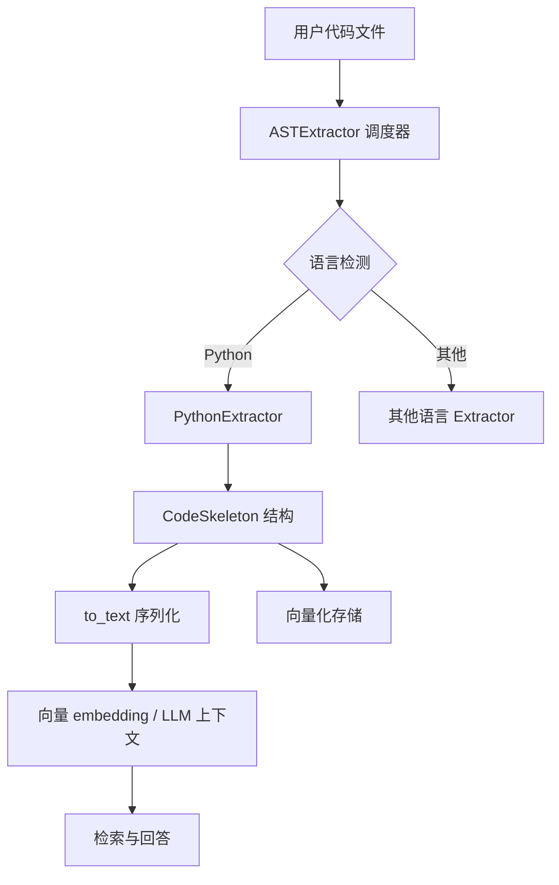

# scripting_language_ast_extractors 模块技术深度解析

## 模块概述

`scripting_language_ast_extractors` 是 OpenViking 系统中专门负责从脚本语言源代码中提取代码结构骨架（Code Skeleton）的模块。该模块的核心组件是 `PythonExtractor` 类，它利用 tree-sitter-python 解析器将 Python 源代码转换为结构化的代码骨架表示。这个骨架包含了文件级别的文档字符串、导入语句、类定义（包括基类和成员方法）以及顶层函数签名，为后续的向量化 embedding 和 LLM 上下文理解提供了精简但语义完整的代码摘要。

理解这个模块的关键在于认识到它解决的是一个**效率与精度的权衡问题**：直接将完整源代码送入 LLM 或进行 embedding 会产生过高的 token 消耗和噪声，而简单的正则匹配又无法处理 Python 复杂的语法结构。Tree-sitter 作为一个增量式的 AST 解析库，能够在保持语法精确性的同时提供足够轻量的结构提取，这使得大规模代码库的语义索引成为可能。

## 架构角色与数据流向

### 在系统中的定位

该模块位于 OpenViking 解析管道的中间层，其上游是被称为 `ASTExtractor` 的调度器（参见 [Python AST 提取器](./python_ast_extractor.md) 模块文档），下游则是向量存储和 LLM 调用层。当用户请求处理一个 Python 源文件时，调度器首先通过文件扩展名（`.py`）检测语言类型，然后路由到对应的 `PythonExtractor` 实例。



### 数据流动全过程

理解数据在模块中的转换过程是掌握该模块的核心。以下是完整的处理流水线：

**第一步：文本到字节序列的转换**。调用者传入的 `content: str` 参数被编码为 UTF-8 字节序列（`content_bytes = content.encode("utf-8")`）。这个转换是必要的，因为 tree-sitter 的 AST 节点使用字节偏移量（`start_byte` / `end_byte`）来定位源码位置，而非字符偏移量。

**第二步：AST 解析**。Tree-sitter Parser 接收字节序列并生成一棵抽象语法树。树的根节点（`root_node`）代表整个模块，其子节点对应顶层的语句和声明。值得注意的是，tree-sitter 生成的 AST 是**位置感知**的——每个节点都携带源码中的起始和结束位置信息，这为后续提取代码片段提供了精确的坐标。

**第三步：遍历与提取**。提取器遍历根节点的直接子节点，针对不同类型的节点采用不同的提取策略：
- `expression_statement` 节点可能包含模块级文档字符串
- `import_statement` 和 `import_from_statement` 节点被解析为导入列表
- `class_definition` 节点触发对类名、基类、文档字符串和成员方法的完整提取
- `function_definition` 节点提取函数签名、参数和返回类型注解
- `decorated_definition` 节点处理带有装饰器的函数或类

**第四步：结构组装**。所有提取出的信息被组装进 `CodeSkeleton` 数据结构，这是一个包含文件元信息、导入列表、类列表和函数列表的容器对象。

**第五步：文本序列化**。最后调用 `skeleton.to_text(verbose=verbose)` 将结构化数据转换为文本表示。这个方法支持两种模式：verbose 模式保留完整文档字符串（供 LLM 使用），而非 verbose 模式只保留每条文档字符串的首行（供 embedding 使用）。

## 核心组件详解

### PythonExtractor 类

`PythonExtractor` 是该模块的唯一公共组件，它实现了 `LanguageExtractor` 抽象基类定义的接口。理解这个类的设计需要关注以下几个关键点：

**延迟初始化的语言和解析器**。在 `__init__` 方法中，解析器和语言对象被创建并缓存为实例变量。这种设计的好处是避免了在模块加载时立即导入 tree-sitter 库——这是一个相对昂贵的操作，因为 tree-sitter 需要加载编译好的 WASM 或共享库。延迟初始化意味着只有当实际需要解析 Python 代码时才会触发这一开销。

```python
def __init__(self):
    import tree_sitter_python as tspython
    from tree_sitter import Language, Parser

    self._language = Language(tspython.language())
    self._parser = Parser(self._language)
```

**单次解析原则**。`extract` 方法接收文件名字符串和内容字符串作为参数，返回一个 `CodeSkeleton` 对象。需要注意的是，这个方法是**无状态的**——每次调用都会从头解析整个文件内容，没有利用 tree-sitter 的增量解析能力。这意味着该提取器适用于离线批处理场景，而非实时编辑场景。

### 辅助函数的协作模式

模块定义了四个关键的私有辅助函数，它们各自承担特定职责：

**`_node_text(node, content_bytes)`** 是最基础的工具函数，它接受一个 AST 节点和字节内容，返回该节点对应的源码文本。使用字节偏移量而非字符偏移量是 tree-sitter 的惯例，因为 Python 字符串的 `encode()` 操作可能在不同语言环境下产生不同的字节长度（例如包含非 ASCII 字符时）。函数中的 `errors="replace"` 参数确保了即使遇到无效的 UTF-8 序列也不会抛出异常，而是用替换字符填充。

**`_first_string_child(body_node, content_bytes)`** 专门用于从函数或类体中提取文档字符串。其实现逻辑值得仔细分析：它遍历 body 的直接子节点，寻找第一个 `expression_statement` 类型节点，然后在该节点内查找 `string` 或 `concatenated_string` 类型的子节点。一旦找到字符串节点，它会尝试识别常见的引号模式（三引号或单引号）并将其剥离，只返回实际的文档内容。这种设计假设 Python 的文档字符串总是出现在函数或类的第一个语句位置——这是一个合理的约定，但并非语言强制要求。

**`_extract_function(node, content_bytes)`** 负责从 `function_definition` 节点中提取完整的函数签名信息。它遍历节点的子节点，识别并提取：
- `identifier` 类型子节点作为函数名
- `parameters` 类型子节点作为参数列表（并额外移除包围的括号）
- `type` 类型子节点作为返回类型注解
- `block` 类型子节点作为函数体（用于提取文档字符串）

**`_extract_class(node, content_bytes)`** 的逻辑与函数提取类似，但增加了对类成员方法的处理。它不仅提取类名、基类和文档字符串，还会递归遍历类体，识别其中的 `function_definition` 和 `decorated_definition` 节点，将成员方法收集到 `methods` 列表中。

**`_extract_imports(node, content_bytes)`** 处理 Python 两种导入语句的复杂性。对于 `import` 语句，它提取所有的 `dotted_name` 节点；对于 `from ... import` 语句，它需要处理模块前缀和导入名称列表，还要识别相对导入（`import_prefix` 节点）和通配符导入（`wildcard_import` 节点）。该函数的返回值是一个扁平的字符串列表，每个元素是一个完整的模块路径或 `module.name` 格式的导入目标。

## 设计决策与权衡

### 为什么选择 tree-sitter 而不是内置的 ast 模块？

Python 标准库提供了 `ast` 模块，能够将 Python 源码解析为 AST。之所以选择 tree-sitter，是基于以下几个实际考量：

**语言无关的统一接口**。OpenViking 需要支持多种编程语言（Python、JavaScript、Java、C++、Go、Rust 等）。如果使用各语言的标准 AST 库，每个语言的提取逻辑都需要单独编写。而 tree-sitter 提供了统一的 Parser API 和节点遍历接口，使得新增语言支持的成本大幅降低。虽然当前实现中各个语言提取器仍然各自定义了提取逻辑，但底层的解析机制已经统一。

**位置信息的精确性**。Tree-sitter 的 AST 节点包含精确的字节偏移量，这在需要提取代码片段（如文档字符串、注释）的场景下非常有用。Python 的 `ast` 模块虽然也提供位置信息，但不如 tree-sitter 细致。

**增量解析能力**。虽然当前实现没有利用这一特性，但 tree-sitter 支持增量解析——即在源码发生部分修改时，可以基于已有解析结果只更新受影响的部分，而非全量重新解析。这为未来支持实时编辑场景留下了扩展空间。

### 文档字符串提取的简化策略

当前实现对文档字符串的提取采用了相对简化的策略：只提取**第一个**表达式语句中的字符串字面量。这基于一个常见的编码约定（PEP 257），即文档字符串应该是函数或类的第一个语句。然而，这种策略在以下情况会出现问题：

```python
def example():
    # 这是一个注释，会被跳过
    """这才是文档字符串"""
    pass
```

由于 `_first_string_child` 只检查 `expression_statement` 节点，注释会被完全忽略，这实际上是**符合预期的行为**，因为注释不应该成为文档字符串。但如果文档字符串不是第一个表达式（比如在某些高级模式中），提取就会失败。这是一种**有意的简化**，以换取实现复杂度和正确性的平衡。

### 返回类型注解的处理

当前的实现将返回类型注解作为节点的文本直接提取，而不是进行进一步的语义解析。这意味着对于复杂类型注解：

```python
def foo() -> Optional[Dict[str, List[int]]]:
    pass
```

返回类型字段将包含完整的字符串 `"Optional[Dict[str, List[int]]]"`，而非被解析为结构化的类型对象。这种设计决策反映了该模块的核心目标：**生成可读的结构化摘要，而非完整的类型信息**。如果需要精确的类型语义，应该使用 `ast` 模块或专门的类型检查工具。

### 错误处理策略

Tree-sitter 解析失败（例如源码包含语法错误）会抛出异常。当前实现选择让异常向上传播，由调用者（`ASTExtractor`）捕获并记录警告日志，同时返回 `None` 表示提取失败，触发回退到 LLM 方案。这种**失败透明**的设计意味着提取器的错误不会导致整个解析流程崩溃，而是优雅地降级。

## 依赖关系分析

### 上游依赖

该模块依赖以下外部组件：

**tree-sitter-python**。这是 tree-sitter 为 Python 语言定义的语法定义和查询接口。它提供了 `language()` 函数返回一个 tree-sitter `Language` 对象，该对象知道如何将 Python 源码解析为 AST。

**tree-sitter**（核心库）。提供了 `Parser` 和 `Language` 基础类，以及节点遍历的接口。

**CodeSkeleton 数据结构**。定义在 `openviking.parse.parsers.code.ast.skeleton` 模块中，是提取结果的容器对象。该数据结构的 `to_text` 方法负责将结构化输出序列化为文本。

### 下游消费者

**ASTExtractor 调度器**是该模块的主要调用者。它负责语言检测、解析器缓存和异常处理。当需要处理一个 Python 文件时，它会：

```python
skeleton: CodeSkeleton = extractor.extract(file_name, content)
return skeleton.to_text(verbose=verbose)
```

**向量化管道**。提取出的骨架文本被送往 embedding 模型进行向量化。verbose 模式（完整文档字符串）和非 verbose 模式（单行摘要）的区分，正是为了平衡 embedding 的语义丰富度和向量维度。

**LLM 上下文构建**。在某些场景下，骨架文本会被拼接到 LLM 的提示词中，为模型提供代码的结构化上下文。

## 扩展点与扩展指南

### 添加新的提取目标

当前实现关注四类代码元素：导入、类、函数和模块级文档字符串。如果需要扩展提取范围（例如提取全局变量、常量定义、类型别名），可以按照现有模式添加新的处理分支：

1. 在 `extract` 方法的遍历循环中添加对新节点类型的识别
2. 如有需要，定义新的数据类来承载提取结果
3. 将新字段添加到 `CodeSkeleton` 类中
4. 更新 `to_text` 方法以序列化新字段

### 支持语法变体

Python 语言本身在持续演进，新语法特性（如结构化模式匹配 `match...case`、析构赋值 `with ... as (a, b)` 等）当前可能未被提取。如果需要支持这些新语法，需要：

1. 更新 tree-sitter-python 到支持新语法的版本
2. 在遍历循环中添加对应的节点类型处理
3. 定义相应的数据结构来承载新语法元素的信息

### 缓存策略优化

当前实现中，每个 `PythonExtractor` 实例在其生命周期内只会被创建一次（由 `ASTExtractor` 的实例变量 `_cache` 管理）。对于长期运行的服务进程，这种设计是合理的。但如果需要支持动态重新加载提取器（例如在运行时更新语言定义），可以引入基于文件修改时间戳的缓存失效机制。

## 常见问题与调试指南

### 为什么某些文档字符串没有被提取？

最常见的原因是文档字符串不是函数或类的第一个语句。检查源码结构，确保文档字符串紧跟在 `def` 或 `class` 行之后，且之前没有其他表达式语句。

另一个可能的原因是文档字符串使用了不支持的引号格式。当前实现处理三引号和单引号，但如果文档字符串是原始字符串（`r"""..."""`）或字节字符串（`b"""..."""`），则不会被识别。

### 如何处理编码问题？

如果文件包含非 UTF-8 编码的字符，解析可能失败或产生乱码。确保上游调用者已经正确处理了文件编码检测（`BaseParser._read_file` 方法已经实现了多编码尝试的逻辑）。

### 为什么导入语句没有被完全提取？

检查导入语句是否符合标准形式。当前实现对以下形式有良好支持：
- `import os, sys`
- `from typing import List, Dict`
- `from . import local_module`
- `from ..package import module`

对于复杂的动态导入（如 `getattr(__import__('os'), 'path')`），提取会失败，因为这类代码无法通过静态分析确定导入目标。

### 提取结果与源码不一致？

Tree-sitter 解析器基于特定的语法版本。如果使用的 `tree-sitter-python` 版本与目标源码的 Python 版本不匹配，可能会产生不同的 AST 结构。检查依赖版本是否与目标代码环境一致。

## 相关模块参考

- **[Python AST 提取器](./python_ast_extractor.md)**：PythonExtractor 的详细技术文档
- **[Scripting Language AST Extractors](./scripting_language_ast_extractors.md)**：完整的 Python 提取系统概览
- **[Code Language AST Extractors](./code-language-ast-extractors.md)**：所有语言提取器的架构概览
- **[Parser Abstractions](./parser_abstractions_and_extension_points.md)**：LanguageExtractor 基类和接口定义
- **[Systems Programming AST Extractors](./systems_programming_ast_extractors.md)**：C++、Go、Rust 等系统编程语言的实现模式