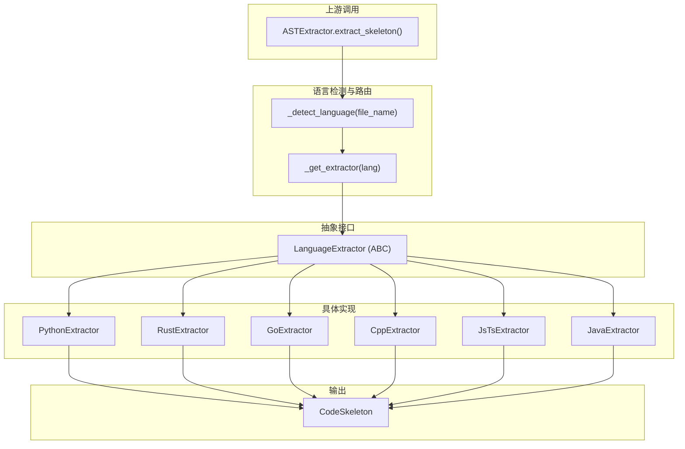

# 语言提取器基类 (language_extractor_base)

## 模块概述

`language_extractor_base` 是 OpenViking 代码解析架构中最底层的抽象接口，定义了从源代码中提取代码"骨架"（skeleton）的标准契约。

**为什么需要这个模块？** 在一个智能代码分析和检索系统中，我们面临一个核心矛盾：完整的源代码包含太多细节（变量赋值、循环体、复杂表达式），直接用于嵌入（embedding）或 LLM 分析成本太高；但完全丢弃结构信息又会让下游任务失去代码的语义。解决方案是将代码"压缩"为结构化骨架——只保留函数签名、类定义、导入语句等高层结构信息。`LanguageExtractor` 正是这个压缩过程的抽象接口，它定义了一套契约，让每种编程语言可以实现自己的提取逻辑，同时保持与上游系统的解耦。

## 架构角色与数据流

### 核心抽象：策略模式

`LanguageExtractor` 采用经典的**策略模式**。想象一个餐厅的"菜品制作"流程：厨房有一个标准接口 `CookStrategy`，它定义了一个方法 `cook(dish_name, ingredients)`，但具体的烹饪方式由川菜厨师、粤菜厨师、日料厨师各自实现。顾客只需指定菜品名称，厨房自动调度到对应的厨师。

在代码提取场景中：
- **菜品** = 特定语言的源代码文件
- **厨师** = `PythonExtractor`、`RustExtractor`、`GoExtractor` 等具体实现
- **厨房** = `ASTExtractor`（参见 [code-ast-extractor](parsing_and_resource_detection-parser_abstractions_and_extension_points-code_ast_extractor.md)），它负责语言检测、路由和错误处理
- **成品** = `CodeSkeleton`，即代码的结构化骨架



### 数据契约

| 阶段 | 输入 | 输出 |
|------|------|------|
| 抽象接口定义 | `file_name: str, content: str` | `CodeSkeleton` |
| 具体实现 | 同上，通过 tree-sitter 解析 AST | 同上，填充结构化数据 |
| 上游消费 | `CodeSkeleton.to_text(verbose=bool)` | `str` (可嵌入的文本) |

## 组件详解

### LanguageExtractor (抽象基类)

位置：`openviking.parse.parsers.code.ast.languages.base.LanguageExtractor`

```python
class LanguageExtractor(ABC):
    @abstractmethod
    def extract(self, file_name: str, content: str) -> CodeSkeleton:
        """Extract code skeleton from source. Raises on unrecoverable error."""
```

**设计意图**：

这个抽象基类只定义了一个方法 `extract()`，其设计体现了Unix哲学的"只做一件事，做好一件事"：

1. **最小化接口**：只暴露一个方法，降低实现者的认知负担。每种语言的提取逻辑差异巨大（Python的缩进语法、C++的模板、Go的接口、JavaScript的异步函数），但提取的目标一致——代码骨架。

2. **明确的失败语义**：注释明确说明"Raises on unrecoverable error"。这意味着：
   - 可恢复的错误（如语法不完整的片段）应尽可能容忍，返回部分骨架
   - 真正的解析崩溃才应该抛出异常，让上游决定是否回退到 LLM

3. **file_name 的作用**：很多人会疑惑为什么需要文件名作为输入。这是因为：
   - 文件扩展名决定了使用哪个 tree-sitter 语言包（`.rs` 用 Rust 解析器，`.go` 用 Go 解析器）
   - `CodeSkeleton.file_name` 字段需要记录原始文件名，用于后续展示或调试

### CodeSkeleton (数据载体)

位置：`openviking.parse.parsers.code.ast.skeleton.CodeSkeleton`

虽然不在当前模块中，但它是 `LanguageExtractor` 的核心输出，理解它有助于理解提取器的目标：

```python
@dataclass
class CodeSkeleton:
    file_name: str
    language: str
    module_doc: str
    imports: List[str]              # 扁平化，如 ["asyncio", "os"]
    classes: List[ClassSkeleton]
    functions: List[FunctionSig]    # 仅顶层函数
```

**关键设计决策**：`to_text(verbose: bool)` 方法体现了**双重用途**：

- `verbose=False`（默认）：用于直接嵌入向量库。此时只需第一行 docstring，减少 token 数量
- `verbose=True`（ast_llm 模式）：用于 LLM 分析。保留完整 docstring，提供更丰富的上下文

这避免了为两种用途维护两套提取逻辑。

### 具体实现模式

所有具体实现（如 `RustExtractor`、`PythonExtractor`）遵循相同模式：

1. **初始化阶段**：在 `__init__` 中加载 tree-sitter 语言包和解析器。这是一次性成本，后续 `extract()` 调用复用同一个解析器实例。

2. **解析阶段**：将内容编码为 UTF-8 字节，调用 tree-sitter 解析得到 AST 根节点。

3. **遍历阶段**：递归遍历 AST 根节点的直接子节点，根据节点类型（`function_item`、`struct_item`、`import_statement` 等）分类提取。

4. **组装阶段**：将提取结果组装为 `CodeSkeleton` 返回。

以 Rust 为例，其 AST 节点类型与 Python 完全不同：
- Python: `function_definition`、`class_definition`、`import_statement`
- Rust: `function_item`、`struct_item`、`trait_item`、`use_declaration`

这种差异正是需要抽象基类的原因——统一接口，屏蔽差异。

## 依赖分析

### 上游依赖（谁调用这个模块）

| 模块 | 关系 | 说明 |
|------|------|------|
| [code_ast_extractor](parsing_and_resource_detection-parser_abstractions_and_extension_points-code_ast_extractor.md) | 直接依赖 | `ASTExtractor` 是 `LanguageExtractor` 的唯一消费者，它负责语言检测、路由、缓存和错误处理 |

### 下游依赖（这个模块调用谁）

| 模块 | 关系 | 说明 |
|------|------|------|
| `tree_sitter_*` (各语言包) | 运行时依赖 | 如 `tree_sitter_rust`、`tree_sitter_python`，提供语言 grammar 和解析器 |
| `CodeSkeleton` | 输出类型定义 | 定义在 `skeleton.py`，非当前模块但被引用 |

### 数据流全景

```
源代码文件
    │
    ▼
[ResourceDetector] ────── 确定文件类型
    │
    ▼
[BaseParser.parse()] ──── 调用具体 parser
    │
    ▼
[CodeParser / ASTExtractor.extract_skeleton()]
    │
    ├── _detect_language() ── 通过扩展名映射语言
    │
    ├── _get_extractor() ──── 延迟加载，缓存 extractor 实例
    │
    └── extractor.extract() ─ 抽象方法，分发到具体实现
            │
            ▼
        [PythonExtractor.extract()]
        [RustExtractor.extract()]
        [GoExtractor.extract()]
        ...
            │
            ▼
        CodeSkeleton (结构化骨架)
            │
            ▼
        skeleton.to_text()
            │
            ▼
        文本 (用于 embedding 或 LLM prompt)
```

## 设计决策与权衡

### 决策一：使用 tree-sitter 而非语言内置 AST

**选择**：依赖 tree-sitter 库，而非 Python 的 `ast` 模块、Go 的 `go/ast` 等。

**理由**：
- **跨语言一致性**：所有语言使用同一套 API（`Parser.parse()` → `Tree` → `Node`），降低实现复杂度
- **容错性**：tree-sitter 对不完整/错误代码的容忍度更高，不会因为一个语法错误完全崩溃
- **统一依赖管理**：只需在 Python 环境中安装 tree-sitter-bindings，无需为每种语言配置独立的 AST 工具链

**代价**：
- 某些语言（特别是有复杂模板系统或宏的语言如 C++）的解析结果可能不如原生 AST 精确
- 额外引入一个外部依赖

### 决策二：延迟实例化 + 单例缓存

`ASTExtractor._get_extractor()` 使用了懒加载 + 缓存模式：

```python
if lang in self._cache:
    return self._cache[lang]
# 否则创建并缓存
```

**理由**：
- tree-sitter 解析器初始化成本较高（涉及 grammar 加载和编译），不应在每个文件解析时重复初始化
- 模块级单例 `get_extractor()` 确保整个进程只维护一套提取器实例

**代价**：
- 首次调用有轻微延迟（冷启动）
- 不支持运行时切换不同版本的 tree-sitter grammar

### 决策三：静默失败，返回 None 而非抛出异常

当提取失败时，`extract_skeleton()` 返回 `None`，让上游决定是否回退到 LLM：

```python
try:
    skeleton = extractor.extract(file_name, content)
    return skeleton.to_text(verbose=verbose)
except Exception as e:
    logger.warning(...)
    return None  # 信号：回退到 LLM
```

**理由**：
- 代码提取是"尽力而为"的服务，不应因为一个文件解析失败而导致整个索引任务崩溃
- 部分语言可能未安装 tree-sitter grammar，此时回退到 LLM 是合理的降级策略
- 日志记录确保运维可观测

**代价**：
- 上游需要处理 `None` 返回值，增加少许复杂性

## 扩展点与注意事项

### 添加新语言支持

如需支持新语言（如 Kotlin、Scala），需要：

1. 安装对应的 tree-sitter 绑定：`pip install tree-sitter-kotlin`
2. 在 `extractor.py` 的 `_EXTRACTOR_REGISTRY` 中注册
3. 实现继承自 `LanguageExtractor` 的类，实现 `extract()` 方法

### 边界情况与已知限制

1. **文件编码**：假设输入是 UTF-8 编码。实现中使用 `content.encode("utf-8")`，如果遇到非 UTF-8 文件可能抛出 `UnicodeEncodeError`。

2. **超大型文件**：tree-sitter 会将整个文件加载到内存，对于超过几 MB 的源文件可能存在性能问题。当前没有做流式处理或大小限制。

3. **不完整代码片段**：如果输入是代码片段而非完整文件（如复制的一段函数），tree-sitter 可能解析失败，返回空骨架。这是有意设计——代码骨架提取需要完整的语法上下文。

4. **动态语言特性**：对于 Python 的动态导入 (`importlib.import_module`)、JavaScript 的 `eval()` 等，静态分析无法捕获。骨架只包含编译时可推断的声明。

5. **宏与预处理**：C/C++ 的宏、Go 的代码生成注释、Rust 的宏调用，tree-sitter 默认不展开，可能导致提取的签名与实际可调用接口有差异。

### 运行时依赖

运行此模块需要安装对应的 tree-sitter 语言包：

```bash
pip install tree-sitter
pip install tree-sitter-python
pip install tree-sitter-rust
pip install tree-sitter-go
pip install tree-sitter-cpp
# 等等
```

如果缺少某个语言包，提取会静默失败并回退到 LLM，不会阻塞整个流程。

## 相关文档

- [code_ast_extractor](parsing_and_resource_detection-parser_abstractions_and_extension_points-code_ast_extractor.md) - AST 提取器的调度层
- [code_skeleton](parsing_and_resource_detection-parser_abstractions_and_extension_points-code_skeleton.md) - 数据结构定义
- [base_parser](parsing_and_resource_detection-parser_abstractions_and_extension_points-base_parser.md) - 解析器抽象基类