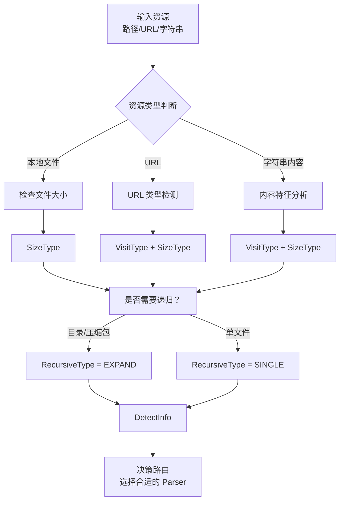

# 资源检测与遍历元数据

## 概述

资源检测模块（resource_detector）是 OpenViking 解析 pipeline 的"侦察兵"和"体检医生"。当一个资源（文件、URL、字符串）进入系统时，在正式解析之前，模块需要回答三个关键问题：

1. **如何访问它？**（VisitType）
2. **它有多大？是否需要特殊处理？**（SizeType）
3. **需要递归处理吗？**（RecursiveType）

这三个维度的信息被封装在 `DetectInfo` 数据类中，供上游系统做出正确的处理决策。可以把这个过程想象成机场的安检流程：先确定你是哪类旅客（访问方式），再检查你的行李是否超重（大小），最后决定是否需要开箱检查（递归处理）。

## 核心数据类型

### VisitType：访问方式枚举

```python
class VisitType(Enum):
    """资源访问方式"""
    
    # 直接可用的内容，如对话中的字符串、JSON 数据等
    DIRECT_CONTENT = "DIRECT_CONTENT"
    
    # 通过本地或网络文件系统工具可访问的资源，如本地文件、文件夹、压缩包等
    FILE_SYS = "FILE_SYS"
    
    # 需要下载的资源，如网络文件、网页、远程对象、远程代码仓库等
    NEED_DOWNLOAD = "NEED_DOWNLOAD"
    
    # 已经预处理好的上下文包，通常是 .ovpack 格式
    READY_CONTEXT_PACK = "READY_CONTEXT_PACK"
```

**设计意图**：这个枚举将纷繁复杂的资源来源归纳为四类。传统系统往往在处理每个具体场景时都写一套逻辑（"如果是URL就下载，如果是本地文件就直接读..."），而 VisitType 提供了一种统一的分类法，让下游决策逻辑可以基于类型而不是基于具体协议。

**典型映射**：
- 用户直接输入的文本 → DIRECT_CONTENT
- 本地文件路径 → FILE_SYS
- GitHub 仓库 URL → NEED_DOWNLOAD
- .ovpack 文件 → READY_CONTEXT_PACK

### SizeType：大小级别枚举

```python
class SizeType(Enum):
    """资源大小级别"""
    
    # 可以直接在内存中处理，如小型文本片段
    IN_MEM = "IN_MEM"
    
    # 需要外部存储处理，如多个文件、大型文件
    EXTERNAL = "EXTERNAL"
    
    # 过大无法处理，如超过 X GB，可能导致系统崩溃或性能问题
    TOO_LARGE_TO_PROCESS = "TOO_LARGE_TO_PROCESS"
```

**设计意图**：在 AI 应用中，我们经常需要在效果和资源消耗之间做权衡。一个 1GB 的 PDF 文档，理论上可以解析，但可能会耗尽内存或导致处理时间不可接受。SizeType 提供了显式的契约：上游系统应该根据这个信息决定是流式处理、降级处理，还是直接拒绝。

**实际使用场景**：
- IN_MEM：单个小文件，可以完全加载到内存
- EXTERNAL：需要分块处理或使用外部存储（如 VikingFS）
- TOO_LARGE_TO_PROCESS：提示用户文件过大，提供采样或摘要方案

### RecursiveType：递归类型枚举

```python
class RecursiveType(Enum):
    """递归处理类型"""
    
    # 单个文件，无需递归处理
    SINGLE = "SINGLE"
    
    # 需要递归处理，如目录中的所有文件、子目录中的所有文件
    RECURSIVE = "RECURSIVE"
    
    # 需要展开后再递归处理，如压缩包、READY_CONTEXT_PACK 等
    EXPAND_TO_RECURSIVE = "EXPAND_TO_RECURSIVE"
```

**设计意图**：这个枚举解决了一个常见问题：用户给的"一个资源"可能实际上是一个容器。比如用户给你一个 .zip 文件，表面上是一个文件，但里面可能有上百个源代码文件需要逐一解析。RecursiveType 将这种"展开"逻辑规范化，让处理流程更加清晰。

**典型场景**：
- 单个 .py 文件 → SINGLE
- 整个代码目录 → RECURSIVE
- .zip 压缩包 → EXPAND_TO_RECURSIVE（先解压，再递归处理内部文件）

### DetectInfo：检测结果封装

```python
@dataclass
class DetectInfo:
    """资源检测信息"""
    
    visit_type: VisitType          # 访问方式
    size_type: SizeType            # 大小级别
    recursive_type: RecursiveType  # 递归类型
```

这个 dataclass 是三个维度的统一入口。上游系统可以通过一个 `DetectInfo` 对象快速判断如何处理资源，而不必分别检查每个枚举值。

## 检测流程

虽然当前代码中资源检测逻辑分散在各个 parser 中（特别是 `HTMLParser` 的 `URLTypeDetector`），但设计意图是存在一个统一的检测阶段：



## 与其他模块的交互

### 上游：资源来源

资源检测的输入来自多个可能的来源：

| 来源 | 典型输入 | 检测重点 |
|------|----------|----------|
| 文件系统 | `/path/to/doc.pdf` | 扩展名、大小、是否是目录 |
| 网络 URL | `https://github.com/...` | Content-Type、是否可访问 |
| 用户输入 | `"帮我分析这段代码..."` | 是否包含代码特征 |

### 下游：ParserRegistry

`DetectInfo` 的核心消费者是 `ParserRegistry`。虽然当前实现中 ParserRegistry 隐式地做了检测（检查扩展名、判断文件是否存在），但理想的设计是让检测结果显式地参与路由决策：

```python
# 理想中的设计（伪代码）
info = detect_resource(source)
if info.visit_type == VisitType.NEED_DOWNLOAD:
    # 先下载
    local_path = await download(source)
elif info.size_type == SizeType.TOO_LARGE_TO_PROCESS:
    # 拒绝或降级
    raise ValueError("File too large")
    
parser = get_parser_for_type(info)
result = await parser.parse(local_path)
```

## 扩展与定制

### 添加新的访问类型

如果系统需要支持新的资源来源（如 S3 对象存储、HDFS 文件系统），可以：

1. 在 `VisitType` 中添加新的枚举值
2. 创建对应的检测器类（如 `S3TypeDetector`）
3. 在主检测流程中注册该检测器

### 自定义大小阈值

当前的 `SizeType` 阈值是硬编码的。在实际部署中，可能需要根据服务器内存、配置参数动态调整。可以通过配置注入：

```python
@dataclass
class SizeConfig:
    in_memory_limit_mb: int = 100
    external_limit_mb: int = 1024  # 超过 1GB 认为 TOO_LARGE
    
# 在检测逻辑中使用
def detect_size(file_path: Path) -> SizeType:
    size_mb = file_path.stat().st_size / (1024 * 1024)
    config = get_size_config()
    if size_mb <= config.in_memory_limit_mb:
        return SizeType.IN_MEM
    elif size_mb <= config.external_limit_mb:
        return SizeType.EXTERNAL
    return SizeType.TOO_LARGE_TO_PROCESS
```

## 常见问题

### Q: 为什么检测逻辑分散在各个 parser 中？

当前实现中，资源检测主要是作为 parser 的"预处理"步骤存在的（如 HTMLParser 内部的 URLTypeDetector）。这是渐进式架构演进的结果——最初只有 HTML parser 需要处理 URL，后来才抽象出独立的检测概念。

理想的重构方向是将检测逻辑抽取到独立的 `ResourceDetector` 服务中，统一对外提供 `DetectInfo` 接口。

### Q: 如何处理检测失败的情况？

检测可能因为网络超时、文件权限问题等原因失败。设计原则是：
- **Fail fast for size**: 如果无法判断大小，宁可保守地认为是 TOO_LARGE_TO_PROCESS
- **Fail graceful for type**: 如果无法判断类型，降级为 DIRECT_CONTENT（当作纯文本处理）

这样可以避免因为检测失败导致整个解析流程中断，同时将风险控制在可接受范围内。

---

**相关文档**：
- [parsing_and_resource_detection.md](../parsing_and_resource_detection.md) - 返回主文档
- [resource_and_document_taxonomy.md](resource_and_document_taxonomy.md) - 资源类型定义