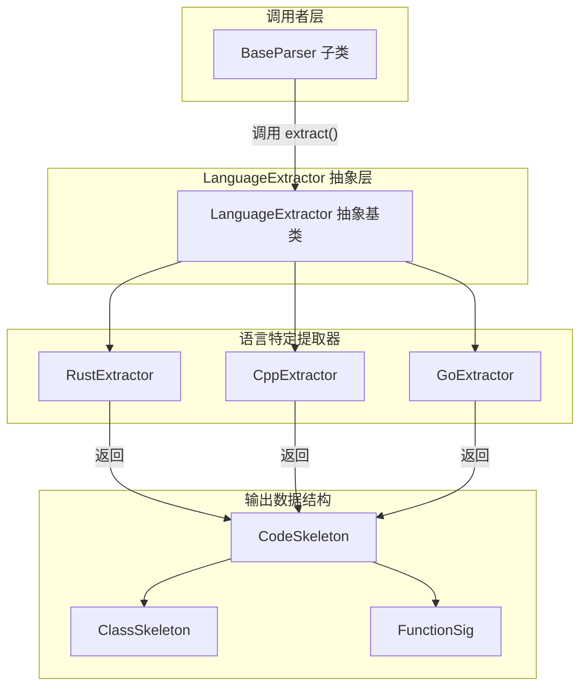

# rust_extractor 模块技术深度解析

## 概述

`rust_extractor` 模块是 OpenViking 解析系统中的一个语言专用组件，负责从 Rust 源代码中提取结构化的代码骨架信息。想象一下，如果你要让一个 AI 系统"理解"一段 Rust 代码——知道它导入了哪些模块、定义了哪些结构体或 trait、有哪些函数以及它们的签名——你需要一种方式将原始文本转换为结构化的数据。`RustExtractor` 就是完成这个转换的组件，它利用 tree-sitter-rust 解析器将 Rust 源代码解析为抽象语法树（AST），然后从 AST 中提取关键信息。

这个模块解决的问题域并不局限于 Rust：整个代码解析系统的目标是构建一个统一的知识图谱，将不同编程语言的代码转换为同构的数据结构，使得下游的检索、增强生成（RAG）或者代码分析系统能够以统一的方式处理多语言代码库。

## 架构定位与数据流



从数据流的角度来看，这个模块处于解析管道的中游位置。上游是文件读取和语言检测逻辑，它们确定"这是 Rust 代码"之后，将文件内容传递给 `RustExtractor.extract()` 方法。提取过程本身分为三个阶段：首先将内容编码为 UTF-8 字节串，然后使用 tree-sitter 解析器生成 AST，最后遍历 AST 的顶层节点（root 的直接子节点）提取感兴趣的代码元素。提取结果是一个 `CodeSkeleton` 对象，它包含了文件名、编程语言、导入语句、类（包括结构体、trait、impl 块）以及顶层函数。

下游的消费者可能是向量嵌入模块（将代码结构转换为语义向量用于相似性搜索）、RAG 系统（为 LLM 提供代码上下文），或者是代码搜索和浏览工具。无论下游如何消费，它们拿到的是统一的 `CodeSkeleton` 表示，无需关心原始语言是什么。

## 核心组件详解

### RustExtractor 类

`RustExtractor` 是整个模块的核心，它继承自 `LanguageExtractor` 抽象基类。这个类的设计遵循了一个简洁的原则：每个语言提取器只需要知道如何解析自己语言的语法，其他事情由框架处理。初始化时，它加载 tree-sitter-rust 语言绑定并创建一个解析器实例。值得注意的是，这个初始化是延迟的——tree-sitter 库只在首次使用时才被导入，这对于大型应用的整体启动性能是有益的。

```python
class RustExtractor(LanguageExtractor):
    def __init__(self):
        import tree_sitter_rust as tsrust
        from tree_sitter import Language, Parser

        self._language = Language(tsrust.language())
        self._parser = Parser(self._language)
```

`extract()` 方法是真正的入口点，它接受文件名和文件内容字符串，返回一个 `CodeSkeleton` 对象。这个方法的实现展示了 Rust 与其他语言的一个关键区别：Rust 有多种需要提取的"类"概念——`struct_item`（结构体）、`trait_item`（trait）、`enum_item`（枚举）以及 `impl_item`（impl 块）。在提取器的设计中，结构体、trait 和枚举都被归类为"类"，因为它们都是用户定义的类型，而 impl 块则被单独处理，因为它们代表方法的实现。

### 辅助函数的设计意图

模块中定义了四个辅助函数，每个都有其特定的角色：

**`_node_text(node, content_bytes)`** 是一个基础工具函数，它从 AST 节点中提取原始文本。由于 tree-sitter 使用字节偏移量而非字符偏移量，这个函数直接操作字节串然后解码为 UTF-8。选择 UTF-8 是因为 Rust 源代码普遍使用 UTF-8 编码，而 `errors="replace"` 参数确保了即使遇到无效字节序列也不会抛出异常——这是一个防御性设计。

**`_preceding_doc(siblings, idx, content_bytes)`** 负责提取文档注释。Rust 的文档注释使用 `///` 语法，可以出现在函数、结构体或 trait 定义之前。这个函数通过检查当前节点前面的兄弟节点来实现这一逻辑：如果前面有 `line_comment` 类型的节点，并且该节点包含 `doc_comment` 子节点（这区分了普通注释 `//` 和文档注释 `///`），则提取其文本。返回的多行文档注释会被合并为一个字符串。

**`_extract_function(node, content_bytes, docstring)`** 从函数定义节点中提取签名信息。它遍历节点的子节点，寻找标识符（函数名）、parameters（参数列表）、type_identifier、scoped_type_identifier 或 generic_type（返回类型）。这里需要处理多种返回类型标识符，是因为 Rust 的类型系统支持多种形式：简单的类型标识符（如 `String`）、限定类型（如 `std::vec::Vec`）以及泛型（如 `Result<T, E>`）。

**`_extract_struct_or_trait(node, content_bytes, docstring)`** 处理结构体、trait 和枚举定义。它与函数提取类似，但额外处理了 trait 约束（`trait_bounds`），这允许提取结构体实现的 trait 基类。

**`_extract_impl(node, content_bytes)`** 是一个有趣的设计决策：它将 `impl` 块视为一个"类"，其方法是该类的方法。impl 块在 Rust 中没有独立的名称，提取器通过拼接 `"impl {类型名}"` 来生成类名。这种处理方式使得 Rust 的 impl 块能够与面向对象语言中的类方法概念对齐。

### 返回类型的设计

`CodeSkeleton` 是整个提取过程的最终产物，它是一个数据容器，包含五个字段：`file_name`（文件名）、`language`（固定为 "Rust"）、`module_doc`（模块级文档注释，当前为空）、`imports`（导入语句列表）以及 `classes` 和 `functions`（类和方法列表）。这种结构设计反映了代码骨架的核心要素：代码由导入语句、类型定义和函数定义组成。

`ClassSkeleton` 用于表示结构体、trait、枚举和 impl 块，包含名称、基类（trait 约束）、文档字符串和方法列表。`FunctionSig`（函数签名）则包含名称、原始参数字符串、返回类型和文档字符串。选择将参数保持为原始字符串而非结构化列表，是为了让提取器保持简单——如果需要更精确的参数解析，可以在下游处理。

## 设计决策与权衡

### 为什么选择 tree-sitter？

tree-sitter 是一个增量解析框架，它能够生成准确的抽象语法树，同时支持语法高亮、代码导航等场景。对于代码提取任务来说，tree-sitter 相比正则表达式或简单的字符串匹配有显著优势：首先，它理解语言的语法结构，不会把注释中的代码误认为是实际代码；其次，它可以处理复杂的嵌套结构，如嵌套的泛型或复杂的函数签名；最后，它是一套通用的框架，新语言的支持可以独立添加。

然而，tree-sitter 也有其局限性：它不执行类型检查或语义分析，只做语法解析。这意味着某些信息——比如一个泛型参数的具体类型实参——可能需要额外的处理才能完整提取。当前实现选择了保持简单，只提取语法层面的信息。

### 导入语句的简化处理

当前实现中，导入语句（`use` 声明）只是简单地被提取为原始文本，并经过轻微清洗（去除尾部冒号、分号，用空字符串替换 `use` 关键字）。这种设计是有意为之的：完整解析 Rust 的 use 声明需要处理多种形式——单路径（如 `use std::collections::HashMap`）、嵌套路径（如 `use std::{collections::HashMap, io::Read}`）、重命名（如 `use std::io as stdio`）以及 glob 导入（如 `use std::collections::*`）。这些变体使完整解析变得复杂，而当前的信息（扁平化的路径字符串）对于大多数下游任务已经足够。

### 文档注释的提取策略

`_preceding_doc` 函数的设计展示了 Rust 与其他语言的一个细微差别。在 Rust 中，文档注释 `///` 实际上是 `line_comment` 节点的子节点，而不是独立的节点类型。提取器需要检查每个 line_comment 是否包含 doc_comment 子节点，才能判断它是普通注释还是文档注释。这种细粒度的检查确保了只有真正的文档注释被提取，而不会误包含代码中的普通注释。

### impl 块的特殊处理

将 `impl` 块视为类是一种设计权衡。严格来说，Rust 不是面向对象语言，没有传统的类概念。但从代码结构的角度来看，impl 块确实封装了一组相关的方法，而且 impl 块通常与一个具体类型关联。将其表示为"类"使得 Rust 代码能够与 Python、Java 等面向对象语言的代码在同一个框架下进行比较和检索。这种处理方式与 C++ 和 Go 提取器的设计一致——C++ 提取器处理命名空间内的定义，Go 提取器处理包级别的定义，它们都试图将语言特定的概念映射到更通用的抽象。

## 使用方式与扩展点

### 直接使用

如果需要从 Rust 源代码中提取结构信息，可以直接实例化 `RustExtractor`：

```python
from openviking.parse.parsers.code.ast.languages.rust import RustExtractor

extractor = RustExtractor()
with open("src/main.rs", "r") as f:
    content = f.read()

skeleton = extractor.extract("src/main.rs", content)
print(skeleton.to_text(verbose=True))
```

`CodeSkeleton` 的 `to_text()` 方法提供了两种输出模式：verbose 模式输出完整的文档注释，适合用于 LLM 输入；非 verbose 模式只输出文档的第一行，适合用于代码嵌入和相似性搜索。

### 扩展 Rust 提取器

如果要添加对更多代码元素的提取，可以修改 `_extract_impl` 或添加新的辅助函数。例如，如果需要提取 `mod` 模块声明，可以添加一个新的遍历逻辑：

```python
# 假设要添加模块提取
elif child.type == "mod_item":
    # 处理模块声明
    pass
```

这种扩展是直接的，因为整个提取逻辑就是遍历 AST 节点并根据节点类型进行相应的处理。不过需要注意，任何扩展都应该考虑与 `CodeSkeleton` 数据模型的兼容性——如果新的提取内容无法用现有字段表示，可能需要扩展数据类。

## 依赖关系与契约

### 上游依赖

`RustExtractor` 依赖以下上游组件：

- **tree-sitter-rust**：Rust 语言的 tree-sitter 语法定义，提供语言规范和 AST 节点类型
- **tree-sitter**：通用的 tree-sitter 解析框架，提供 Parser 和 Language 类
- **LanguageExtractor**：抽象基类，定义接口契约

这些依赖都是外部库或项目内的抽象基类，没有复杂的配置需求。

### 下游契约

提取结果 `CodeSkeleton` 被设计为一种稳定的契约。下游组件可以依赖以下特性：

- `imports` 是扁平化的字符串列表，不包含重复项（相对于 Rust 原生 use 声明的嵌套结构进行了展平）
- `classes` 中的方法列表按源代码中的顺序排列
- 所有字符串字段（名称、文档）都可能是空字符串，需要下游进行空值检查

### 与其他语言提取器的对比

将 `RustExtractor` 与其兄弟提取器对比，可以发现它们遵循相同的模式但处理不同的语法：

| 特征 | RustExtractor | CppExtractor | GoExtractor |
|------|---------------|--------------|-------------|
| 导入关键字 | `use` | `#include` | `import` |
| 类型定义 | struct_item, trait_item, enum_item | class_specifier, struct_specifier | type_declaration |
| 函数定义 | function_item | function_definition | function_declaration |
| 方法容器 | impl_item | (类内定义) | (无单独概念) |

这种对比表明，整个提取框架刻意保持了一致的接口和数据结构，而将语言差异封装在各个提取器内部。

## 已知局限性与注意事项

### 不支持的 Rust 特性

当前实现专注于提取顶层定义，不处理以下 Rust 特性：

- **模块内嵌套定义**：提取器只遍历 root 的直接子节点，不递归进入模块或函数体内部提取嵌套的类型和函数。这意味着嵌套在 `mod` 块或函数内部的代码不会被提取。
- **宏调用**：虽然 tree-sitter 可以识别宏，但提取器没有处理 `macro_invocation` 类型的节点。
- **完整泛型信息**：返回类型中的泛型参数没有被进一步展开，只是作为原始字符串返回。
- **属性（Attributes）**：如 `#[derive(Debug)]` 这样的属性没有被提取。

### 错误处理

解析错误通过 tree-sitter 内部处理——如果源代码有语法错误，解析器仍会返回一个不完整的 AST，提取器可能只提取部分信息。调用者应该知道，在有语法错误的代码上运行时，返回的 `CodeSkeleton` 可能是不完整的。

### 编码假设

代码假设输入是有效的 UTF-8 编码。如果遇到其他编码的 Rust 源代码，可能会出现解码问题。在实际使用中，通常通过 `BaseParser._read_file()` 方法读取文件，该方法已经尝试了多种编码。

### 性能考量

tree-sitter 解析是 CPU 密集型操作，对于大型代码库可能需要较长时间。如果性能成为瓶颈，可以考虑：缓存已解析的结果、使用增量解析（tree-sitter 支持），或者并行处理多个文件。这些优化应该在调用层实现，而不是在提取器内部——提取器本身保持无状态和纯函数式是最简单的设计。

## 相关文档

如需了解更多信息，请参考以下相关模块文档：

- [base_parser](./parsing_and_resource_detection-base_parser.md) - 解析器基类架构
- [code_skeleton](./parsing_and_resource_detection-code_skeleton.md) - 代码骨架数据模型
- [language_extractor_base](./parsing_and_resource_detection-language_extractor_base.md) - 语言提取器抽象基类
- [cpp_extractor](./parsing_and_resource_detection-cpp_extractor.md) - C++ 代码提取器
- [go_extractor](./parsing_and_resource_detection-go_extender.md) - Go 代码提取器