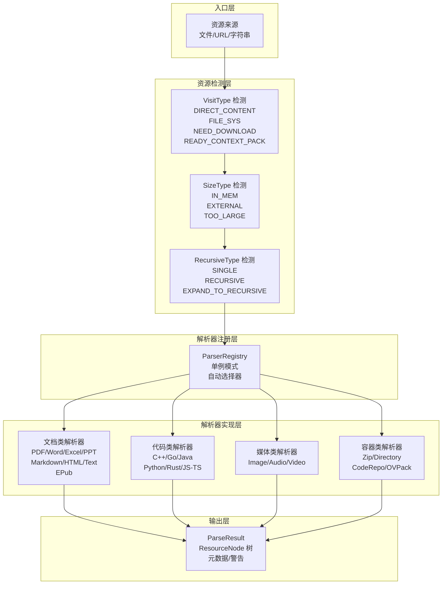
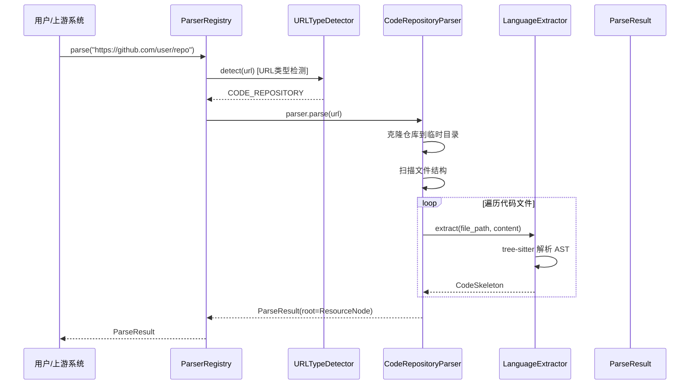

# parsing_and_resource_detection 模块技术文档

## 概述

**parsing_and_resource_detection** 模块是 OpenViking 系统的"入口门神"——它是所有外部资源进入系统后必须经过的第一个处理阶段。想象一下一个国际机场的移民局：无论你是乘坐哪家航空公司的航班、来自哪个国家，都要在这里接受检查、登记、分类，然后被引导到正确的处理通道。本模块的核心职责正是如此：接收任意格式的文档或资源，通过智能检测确定其类型，然后交给相应的解析器将其转换为系统内部统一的文档树结构。

在设计哲学上，本模块遵循 **"保持文档原有结构"**（Preserve Natural Document Structure）原则。传统的 RAG 系统往往将文档粗暴地切分成固定大小的 chunks，这就像把一本精心排版的书籍全部撕成等大小的纸片再阅读——丢失了章节层级、标题关系、上下文连贯性。OpenViking 选择了不同的道路：通过精细的解析，保持文档的层级结构（ROOT → SECTION → 段落），让 LLM 在推理时能够理解文档的逻辑架构。

## 问题空间：为什么需要这个模块？

在真实的 AI 应用场景中，用户可能会提交 **任意类型** 的资源：

- **结构化文档**：PDF 报告、Word 文档、Markdown 笔记、HTML 网页
- **二进制文件**：Excel 表格、PowerPoint 演示、EPub 电子书、图片/音频/视频
- **代码仓库**：GitHub 仓库、GitLab 项目、本地代码目录
- **混合形态**：压缩包（.zip）、代码仓库归档、上下文包（.ovpack）

如果每个消费方都要单独处理这些格式，代码将变得无法维护。更糟糕的是，当系统需要处理远程资源（如网页 URL、Git 仓库）时，还需要额外的下载、解压、类型推断逻辑。**本模块将这些复杂性封装起来，对上游提供统一的、类型无关的 `ParseResult` 接口**。

核心问题可以归结为三个子问题：

1. **类型检测**：给定一个来源（本地文件路径、URL、字符串内容），如何快速判断它是什么类型的资源？
2. **智能解析**：对于每种类型，如何高效地提取内容并构建有意义的文档树？
3. **路由分发**：当一个来源可能包含多种类型时（如网页中的 PDF 下载链接），如何正确地委托给下游处理？

## 架构概览



### 核心组件职责

**1. 资源检测层（resource_detector）**

这是模块的"侦察兵"，在正式解析之前对资源进行快速扫描，确定其基本特征。`DetectInfo` 数据类封装了三种维度的检测结果：
- `VisitType`：资源如何被访问（直接内容、文件系统、需要下载、已处理的上下文包）
- `SizeType`：资源大小级别（内存可直接处理、需要外部存储、超大无法处理）
- `RecursiveType`：是否需要递归处理（单文件、目录递归、需要展开后再递归）

**2. 解析器注册层（ParserRegistry）**

采用 **注册表模式**（Registry Pattern）实现 parser 的动态管理。系统维护一个全局单例 registry，根据文件扩展名自动路由到对应的 parser。这种设计的优势是：
- 新增 parser 无需修改核心逻辑，只需向 registry 注册
- 支持自定义 parser 和回调函数两种扩展方式
- 提供自动降级：未知类型默认回退到纯文本解析器

**3. 解析器实现层**

所有 parser 继承自 `BaseParser` 抽象基类，确保接口一致性。模块内置了丰富的 parser 实现：

| 类别 | 解析器 | 支持格式 |
|------|--------|----------|
| 文档类 | PDFParser, WordParser, ExcelParser, PowerPointParser, MarkdownParser, HTMLParser, TextParser, EPubParser | .pdf, .docx, .xlsx, .pptx, .md, .html, .txt, .epub |
| 代码类 | CodeRepositoryParser + 各语言 Extractor | .py, .rs, .go, .java, .cpp, .js, .ts + Git 仓库 |
| 媒体类 | ImageParser, AudioParser, VideoParser | 图片/音频/视频 |
| 容器类 | ZipParser, DirectoryParser, CodeRepositoryParser | .zip, 目录, Git URL |

## 数据流：一次完整的解析旅程

让我们追踪一个典型请求的数据流：用户提交一个 GitHub 仓库 URL `https://github.com/user/repo`。



关键设计点：

1. **智能 URL 检测**：HTMLParser 内部包含 `URLTypeDetector`，会先发送 HEAD 请求探测 Content-Type，决定是当作网页解析还是下载文件再委托给其他 parser。

2. **三阶段解析架构**：这是 v4.0 引入的重大架构改进。以 MarkdownParser 为例：
   - Phase 1：解析生成 `detail_file`（UUID.md 格式的中间文件）
   - Phase 2：生成语义化元数据（meta 字段中的 abstract、overview）
   - Phase 3：生成最终 `content_path` 指向的结构化文档

3. **代码骨架提取**：对于代码文件，模块不直接存储源码，而是使用 tree-sitter 解析 AST，提取类结构、函数签名、import 列表，生成 `CodeSkeleton`——这是一种对 LLM 友好、对存储友好的表示方式。

## 核心设计决策与权衡

### 决策一：使用 tree-sitter 而非语言内置 AST

**选择**：对于代码解析，使用 `tree-sitter` 库而非 Python 内置的 `ast` 模块。

**分析**：
- Python 的 `ast` 模块只能处理 Python 代码，每种语言需要不同的解析器
- tree-sitter 是一个跨语言的通用 AST 解析器生成器，用一套接口处理多种语言
- 代价是增加了第三方依赖（tree-sitter-xxx 各语言包），但换取了架构简洁性

**权衡**：这意味着代码提取是"语法级"而非"语义级"的——它能看到函数签名但无法理解运行时行为。对于文档解析场景，这是正确的取舍。

### 决策二：简化的节点类型设计（v2.0）

**选择**：`NodeType` 只保留 `ROOT` 和 `SECTION` 两种类型，所有具体内容（段落、代码块、表格）都以 Markdown 格式存储在 `content` 字段中。

**分析**：
- 早期的设计曾尝试细粒度的节点类型（paragraph, code_block, table, list 等），导致树结构复杂且难以维护
- v2.0 的简化遵循了"最小化原则"：保持层级结构（章-节），细节内容用 Markdown 格式存储
- 这样既保留了文档的逻辑结构，又获得了最大灵活性

### 决策三：ParserRegistry 单例模式

**选择**：使用全局单例 `_default_registry` 管理所有 parser。

**分析**：
- 优势：简化调用方代码，任何地方通过 `parse()` 就能处理任意文件
- 代价：单例全局状态在测试中可能造成副作用（不同测试需要不同的 parser 配置）
- 缓解：提供 `ParserRegistry` 可实例化，支持创建独立 registry 用于测试

### 决策四：混合扩展机制

**选择**：支持两种自定义 parser 扩展方式——Protocol 方式和回调函数方式。

分析：
- **Protocol 方式**：适合需要复杂状态或多个方法的 parser，通过实现 `CustomParserProtocol` 获得完整适配
- **回调函数方式**：适合一次性简单场景，只需传一个 async 函数即可
- 这类似于同时支持"完整插件"和"简易钩子"，降低了扩展门槛

## 关键数据类型

### ResourceNode（资源节点）

```python
@dataclass
class ResourceNode:
    type: NodeType                    # ROOT 或 SECTION
    detail_file: Optional[str]        # Phase 1: 中间文件名 (UUID.md)
    content_path: Optional[Path]      # Phase 3: 最终内容文件路径
    title: Optional[str]              # 标题（来自标题行）
    level: int                        # 层级深度 (0=根, 1=一级标题, ...)
    children: List[ResourceNode]      # 子节点列表
    meta: Dict[str, Any]              # 语义元数据
    
    # 多模态扩展
    content_type: str                 # text/image/video/audio
    auxiliary_files: Dict[str, str]   # 辅助文件映射
```

### ParseResult（解析结果）

```python
@dataclass
class ParseResult:
    root: ResourceNode                # 文档树根节点
    source_path: Optional[str]        # 原始文件路径
    temp_dir_path: Optional[str]      # 临时目录（v4.0架构）
    
    # 元数据
    source_format: Optional[str]      # 原始格式 (pdf, markdown, ...)
    parser_name: Optional[str]        # 使用的 parser 名称
    parser_version: Optional[str]     # parser 版本
    parse_time: Optional[float]       # 解析耗时（秒）
    meta: Dict[str, Any]              # parser 特定元数据
    warnings: List[str]               # 解析警告
```

### DetectInfo（资源检测信息）

```python
@dataclass
class DetectInfo:
    visit_type: VisitType             # DIRECT_CONTENT | FILE_SYS | NEED_DOWNLOAD | READY_CONTEXT_PACK
    size_type: SizeType               # IN_MEM | EXTERNAL | TOO_LARGE_TO_PROCESS
    recursive_type: RecursiveType     # SINGLE | RECURSIVE | EXPAND_TO_RECURSIVE
```

## 依赖关系与系统集成

### 上游依赖

本模块依赖以下核心模块：

| 模块 | 依赖关系 | 用途 |
|------|----------|------|
| `storage.viking_fs` | VikingFS 文件系统 | 解析过程中创建临时 URI、存储中间文件 |
| `storage.vectordb` | 向量数据库 | 解析完成后将内容向量化存储 |
| `server.routers.content` | 内容读取 | 从远程存储加载待解析内容 |
| `core.context` | 上下文类型 | 定义内容类型（ResourceContentType 等） |

### 下游消费者

解析后的 `ParseResult` 被以下模块消费：

| 模块 | 消费方式 |
|------|----------|
| `model_providers_embeddings` | 将 ResourceNode 内容分块、向量化 |
| `retrieval_and_evaluation` | 构建检索索引、评估 RAG 效果 |
| `session_runtime` | 将解析结果加载到对话上下文 |
| `tui_tree_navigation` | 在 TUI 中展示文档树供用户浏览 |

### 外部依赖

- **tree-sitter 家族**：tree-sitter-python, tree-sitter-rust, tree-sitter-java 等，用于代码 AST 解析
- **文档处理库**：PyMuPDF (PDF)、python-docx (Word)、openpyxl (Excel)、python-pptx (PowerPoint)、markdownify、readabilipy (HTML)
- **网络库**：httpx（URL 抓取）

## 子模块文档

本模块包含以下子模块，建议按顺序阅读：

### 1. 基础类型系统

#### [resource_and_document_taxonomy_base_types](resource_and_document_taxonomy_base_types.md)
定义系统的基础类型系统：资源分类（ResourceCategory）、文档类型（DocumentType）、媒体类型（MediaType），以及用于描述文档树结构的 NodeType 和 ResourceNode。

#### [resource_and_document_taxonomy_html_parser](resource-and-document-taxonomy-html-parser.md)
HTML 解析器和 URL 类型检测器，包括 URLType 枚举和 URLTypeDetector 类，用于智能判断网页内容的处理方式。

### 2. 解析器抽象与扩展

#### [base_parser_abstract_class](base_parser_abstract_class.md)
BaseParser 抽象基类，定义所有解析器的通用接口 contract（parse、parse_content、supported_extensions、can_parse）。

#### [custom_parser_protocol_and_wrappers](parser_abstractions_and_extension_points-custom_parser_protocol_and_wrappers.md)
自定义解析器扩展机制：CustomParserProtocol 协议接口、CustomParserWrapper 适配器类、CallbackParserWrapper 回调函数封装。

#### [language_extractor_base](language_extractor_base.md)
代码 AST 提取器的抽象基类 LanguageExtractor，定义语言无关的提取接口。

### 3. 代码语言 AST 提取器

#### [systems_programming_ast_extractors](systems_programming_ast_extractors.md)
系统编程语言的 AST 提取器：
- **CppExtractor**：C/C++ 代码结构提取（类、函数、import）
- **GoExtractor**：Go 代码结构提取（结构体、接口、函数）
- **RustExtractor**：Rust 代码结构提取（struct、trait、impl、函数）

#### [application_and_web_platform_ast_extractors](application_and_web_platform_ast_extractors.md)
应用层和 Web 平台的 AST 提取器：
- **JavaExtractor**：Java 代码结构提取（类、方法、import）
- **JsTsExtractor**：JavaScript/TypeScript 代码结构提取（类、函数、export）

#### [scripting_language_ast_extractors](scripting-language-ast-extractors.md)
脚本语言的 AST 提取器：
- **PythonExtractor**：Python 代码结构提取（类、函数、import、docstring）

### 4. 资源检测与元数据

#### [resource_detection_traversal_metadata](parsing-and-resource-detection-resource-detection-traversal-metadata.md)
资源检测模块，定义 DetectInfo、VisitType、SizeType、RecursiveType 枚举，在解析前对资源进行分类和特征识别。

## 常见问题与注意事项

### 1. 编码问题

解析文本文件时，`BaseParser._read_file()` 会尝试多种编码（UTF-8 → UTF-8-sig → Latin-1 → CP1252），这是一种防御性编程实践，但可能掩盖真正的编码问题。如果遇到乱码，检查原始文件是否为非标准编码。

### 2. URL 类型检测的回退

`URLTypeDetector` 在网络请求失败时会默认假设为 `WEBPAGE`。如果目标服务器禁止 HEAD 请求但支持 GET，这可能正常工作；但如果服务器返回 405 Method Not Allowed，可能需要配置 `HTMLParser` 的 timeout 参数。

### 3. 大文件处理

默认情况下，模块会将整个文件加载到内存。对于超大 PDF 或视频文件，可能触发 `SizeType.TOO_LARGE_TO_PROCESS`。此时需要考虑：
- 配置外部存储（VikingFS）处理
- 使用流式解析（如果 parser 支持）
- 预处理切割后再解析

### 4. 代码骨架的 docstring 截断

`CodeSkeleton.to_text()` 方法默认只保留 docstring 的第一行（`verbose=False`）。这是为了控制输出的 token 数量。如果需要完整的文档字符串，调用时传入 `verbose=True`。

### 5. 并发安全

`ParserRegistry` 本身是线程安全的（因为 CPython 的 GIL），但在多协程环境下注意不要在解析过程中修改 registry 状态。自定义 parser 如果有内部状态，需要自行保证并发安全。

## 扩展点与定制指南

### 添加新的文档格式

1. 创建新的 parser 类，继承 `BaseParser`
2. 实现 `parse()` 和 `parse_content()` 方法
3. 在 `supported_extensions` 属性中声明支持的扩展名
4. 向 `ParserRegistry` 注册：`registry.register("my_format", MyParser())`

### 添加新的代码语言支持

1. 安装对应的 tree-sitter 语言包（如 `pip install tree-sitter-kotlin`）
2. 创建新的 Extractor 类，继承 `LanguageExtractor`
3. 实现 `extract(file_name, content) -> CodeSkeleton` 方法
4. 在 `CodeRepositoryParser` 或代码处理逻辑中注册该语言

### 自定义资源检测逻辑

资源检测目前是硬编码在各个 parser 中的（特别是 HTMLParser 的 URLTypeDetector）。如果要自定义检测策略，可以：
- 继承现有 parser 并覆盖类型检测方法
- 直接使用 `DetectInfo` 数据类在应用层做预处理

---

**下一步建议**：从 [resource_and_document_taxonomy.md](resource_and_document_taxonomy.md) 开始，深入了解基础类型系统如何为整个解析 pipeline 提供统一的数据结构。