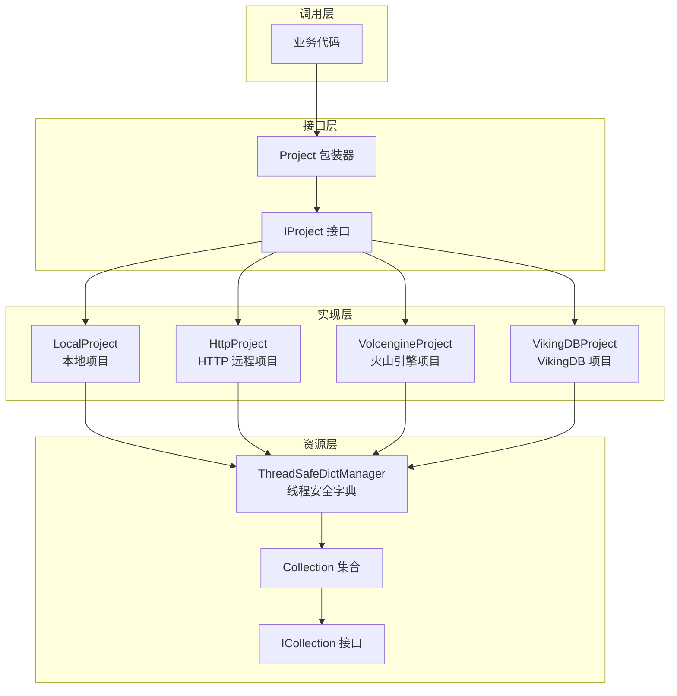

# 项目域模型与接口 (Project Domain Models and Interfaces)

## 概述

`project_domain_models_and_interfaces` 模块是 OpenViking 向量数据库存储层的核心抽象之一，它定义了 **Project（项目）** 这一层级概念，用于组织和管理多个 Collection（集合）。如果你熟悉数据库系统，可以把 Project 理解为"数据库实例"，Collection 理解为"表"，Index 理解为"索引"——Project 是容纳这些资源的最上层容器。

这个模块解决的问题是：**如何为不同的存储后端提供统一的项目管理抽象**。无论底层是本地文件系统、远程 HTTP 服务还是火山引擎 VikingDB，上层业务代码都可以通过统一的 `IProject` 接口进行集合的创建、查询、删除等操作，而无需关心具体的存储实现细节。

---

## 架构图与数据流



**数据流说明：**

1. **创建流程**：业务代码调用 `Project.create_collection(name, meta)` → 包装器验证实现类是否实现 `IProject` 接口 → 分发到具体实现类（如 `LocalProject`）→ 在内部 `ThreadSafeDictManager` 中注册新集合 → 返回 `Collection` 包装对象

2. **查询流程**：调用 `Project.get_collection(name)` → 查找 `ThreadSafeDictManager` 中的缓存 → 如不存在且是持久化后端，则尝试从存储加载 → 返回 `Collection` 对象

3. **销毁流程**：调用 `Project.drop_collection(name)` → 从 `ThreadSafeDictManager` 移除 → 调用底层集合的 `drop()` 方法 → 释放资源

---

## 核心组件详解

### 1. IProject 接口

**设计意图**：`IProject` 是一个抽象基类（ABC），定义了所有项目实现必须满足的契约。它采用**接口隔离原则**，确保任何想要作为 Project 工作的类都必须实现以下核心方法：

- `close()`：关闭项目并释放所有资源
- `has_collection(name)`：检查集合是否存在
- `get_collection(name)`：按名称获取集合
- `get_collections()`：获取所有集合的映射
- `create_collection(name, meta)`：创建新集合
- `drop_collection(name)`：删除集合

**为什么需要这个接口？** 想象一下，你要开发一个同时支持本地开发和云端部署的应用。如果每次切换后端都要修改业务代码，成本太高。通过定义统一的 `IProject` 接口，业务代码只需依赖接口，具体实现可以在运行时注入。这正是**依赖倒置原则**的应用——高层模块（业务逻辑）不应该依赖低层模块（存储实现），两者都应该依赖抽象。

### 2. Project 包装器

**设计意图**：`Project` 是一个**装饰器模式的实现**，它包装了一个 `IProject` 实例，并在初始化时进行运行时类型检查：

```python
assert isinstance(project, IProject), "project must be IProject"
```

这个检查看似简单，却有着重要的防御作用：如果有人不小心传入了错误类型的对象，程序会在第一时间（而不是在调用某个方法时才）抛出清晰的错误信息。

**与接口的区别**：接口定义"能做什么"，包装器提供"额外的安全保障"。包装器本身不包含任何业务逻辑，它只是一个安全外壳，确保传入的对象确实实现了 `IProject` 接口。

### 3. ThreadSafeDictManager

**设计意图**：这是一个**线程安全的泛型字典管理器**，用于在内存中缓存和管理集合对象。它的核心实现使用了 `threading.RLock`（可重入锁），确保在多线程并发访问时的数据一致性。

为什么需要专门设计一个线程安全的字典，而不是直接使用 Python 的 `dict`？在向量数据库场景中，多个请求可能同时访问和修改集合集合。如果不加锁，可能会出现以下问题：线程 A 正在创建集合，线程 B 也在创建同名集合，导致竞态条件；或者线程 A 遍历集合时，线程 B 正在删除集合，导致迭代器失效。

`ThreadSafeDictManager` 的设计采用了**最小锁原则**——只在必要的字典操作上加锁，并且在迭代时先复制一份快照，然后在锁外执行回调，避免了长时间持有锁导致的性能瓶颈。

### 4. 具体实现类

**LocalProject**：支持两种模式——**临时模式**（`path=""`）和**持久化模式**（`path` 指向实际目录）。临时模式的集合只存在于内存中，应用重启后消失；持久化模式的集合会保存到磁盘，并且在项目初始化时自动扫描并加载已有集合。

**HttpProject**：连接远程 VikingVectorIndex 服务的 HTTP 客户端实现。它会在初始化时从远程服务拉取已有的集合列表，并在内存中创建代理对象。

**VolcengineProject**：直接调用火山引擎 VikingDB API 的实现，需要提供 Access Key、Secret Key 和区域信息。

---

## 设计决策与权衡

### 1. 接口 vs 抽象基类

**选择**：使用 `ABC` 定义抽象接口 `IProject`，而不是简单的 duck typing 或纯文档约定。

**权衡分析**：抽象基类比纯接口（Protocol）更"重"——它需要继承，无法多重继承。但它也提供了更好的 IDE 支持和运行时类型检查。对于需要对外暴露的核心接口，这种明确的契约是值得的。

### 2. 包装器模式的必要性

**选择**：在 `IProject` 接口之上再包装一层 `Project` 类。

**权衡分析**：这增加了一层间接调用（性能略微下降），但换来了**运行时类型断言**和**统一的 API 外观**。对于需要给外部业务方使用的接口，这一层额外的保护是值得的。

### 3. 集合的延迟加载

**选择**：对于持久化后端（LocalProject、HttpProject），已存在的集合不会在项目初始化时全部加载到内存，而是**延迟加载**——只有当调用 `get_collection()` 时才真正加载。

**权衡分析**：如果一个项目包含成百上千个集合，一次性加载所有集合会非常耗时。延迟加载让"冷启动"更快，但也意味着第一次访问某个集合时会有额外延迟。这是一个典型的**启动性能 vs 首次访问延迟**的权衡。

### 4. 可变状态的内部管理

**选择**：使用 `ThreadSafeDictManager` 管理集合的内存缓存，而不是每次调用都从后端重新获取。

**权衡分析**：缓存加速了重复访问，但增加了内存占用，并且需要处理缓存失效的问题。当前实现选择"不自动失效"——一旦加载，集合会一直保持在内存中，直到显式调用 `drop_collection()` 或 `close()`。这对于大多数应用场景是合理的，但如果集合数据在外部被修改（例如其他进程直接操作磁盘文件），内存中的状态可能会过时。

---

## 使用指南与最佳实践

### 基本使用模式

```python
from openviking.storage.vectordb.project.local_project import get_or_create_local_project

# 创建临时项目（内存模式）
project = get_or_create_local_project(path="")

# 创建集合
collection = project.create_collection(
    collection_name="my_vectors",
    collection_meta={
        "Fields": [
            {"FieldName": "id", "FieldType": "String", "IsPrimary": True},
            {"FieldName": "embedding", "FieldType": "Float", "VectorDimension": 384}
        ]
    }
)

# 使用集合
collection.upsert_data([
    {"id": "doc1", "embedding": [0.1] * 384}
])

# 获取集合
collection = project.get_collection("my_vectors")

# 关闭项目，释放资源
project.close()
```

### 后端切换

只需要修改工厂方法，其他代码无需变化：

```python
# 切换到 HTTP 远程后端
from openviking.storage.vectordb.project.http_project import HttpProject
project = HttpProject(host="192.168.1.100", port=5000, project_name="myapp")

# 切换到火山引擎后端
from openviking.storage.vectordb.project.volcengine_project import VolcengineProject
project = VolcengineProject(ak="your_ak", sk="your_sk", region="cn-beijing")
```

### 集合存在性检查

```python
# 安全获取或创建
collection = project.get_or_create_collection(
    collection_name="my_vectors",
    meta_data={...}  # 只有在集合不存在时才需要提供
)
```

---

## 边界情况与注意事项

### 1. 不可逆的删除操作

调用 `drop_collection()` 会**永久删除**集合及其所有数据，且无法恢复。文档中有明确注释强调这一点，但在实际使用中仍需格外小心——建议在删除前进行二次确认，尤其是在生产环境中。

### 2. 集合命名的唯一性

在同一个项目内，集合名称必须唯一。`create_collection()` 会在集合已存在时抛出 `ValueError`。如果你不确定集合是否存在，可以使用 `get_or_create_collection()` 方法来简化逻辑。

### 3. 资源泄漏风险

**重要**：当你不再需要使用 Project 时，必须显式调用 `close()` 方法来释放所有集合资源。虽然 `Collection` 类有 `__del__` 析构器，但依赖垃圾回收来释放资源是不可靠的——特别是在长时间运行的服务中，未关闭的连接可能会逐渐耗尽文件描述符或网络套接字。

### 4. 并发安全性

`ThreadSafeDictManager` 保证了对集合映射的并发安全，但**不保证**对单个集合操作的并发安全。如果你需要并发写入同一个集合，应该在应用层使用额外的同步机制（如锁或队列）。

### 5. 持久化模式的初始化行为

对于 `LocalProject`（持久化模式），初始化时会扫描 `path` 下的所有子目录，查找包含 `collection_meta.json` 的目录作为已存在的集合。如果你手动创建了目录但没有对应的元数据文件，该目录会被忽略。

### 6. 元数据的修改

`create_collection()` 方法内部会向 `meta_data` 字典中添加 `CollectionName` 字段。这意味着传入的字典会被修改。如果你需要保留原始元数据，应该先复制一份：

```python
meta_copy = meta_data.copy()
collection = project.create_collection("name", meta_copy)
```

---

## 相关模块参考

- **[collection_contracts_and_results](collection_contracts_and_results.md)**：了解 Collection 接口的详细定义和搜索结果的返回格式
- **[local_and_http_collection_backends](local_and_http_collection_backends.md)**：了解不同后端集合的具体实现
- **[service_api_models_collection_and_index_management](service_api_models_collection_and_index_management.md)**：了解集合创建的元数据结构
- **[kv_store_interfaces_and_operation_model](kv_store_interfaces_and_operation_model.md)**：了解底层键值存储的操作抽象