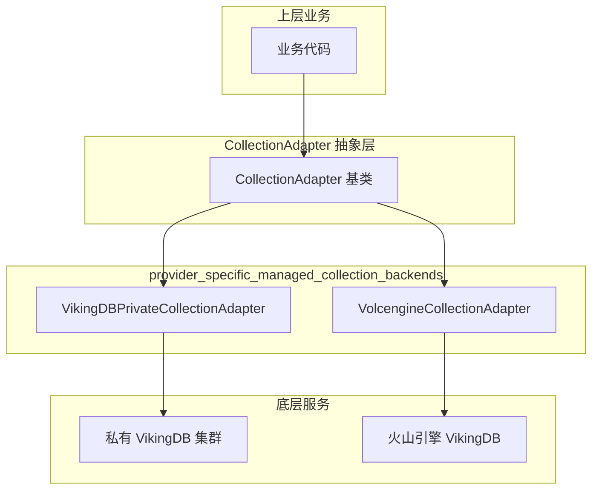
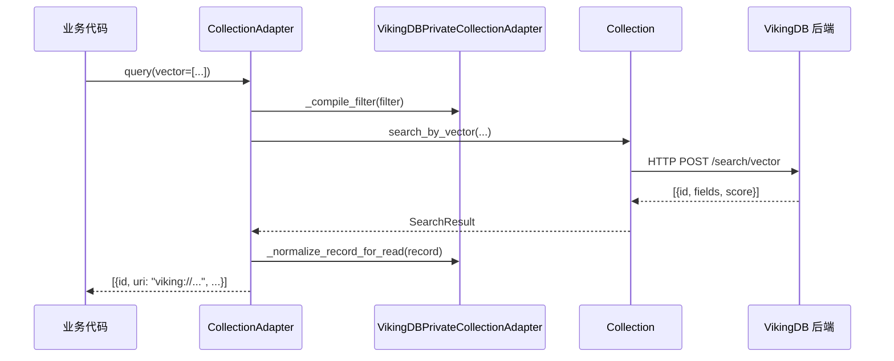
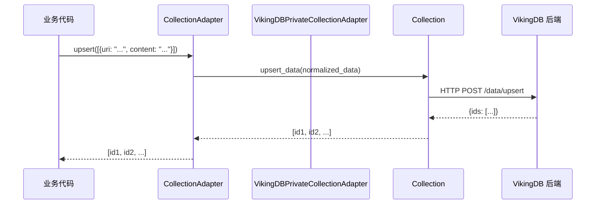
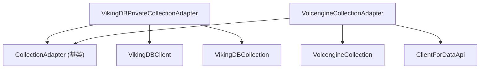

# provider_specific_managed_collection_backends

## 模块概述

**provider_specific_managed_collection_backends** 模块是向量数据库适配器架构中的"最后一公里"——它将统一的抽象接口连接到特定的后端服务。该模块包含两个核心适配器：

- **VikingDBPrivateCollectionAdapter**：连接私有化部署的 VikingDB 服务
- **VolcengineCollectionAdapter**：连接火山引擎托管的 VikingDB 服务

**核心职责**：为不同的 VikingDB 部署形态（私有云 vs 公有云）提供统一的数据操作接口，同时保留各平台特有的 Collection 创建和加载逻辑。

**解决的问题**：系统需要支持多种部署形态，但上层业务代码不应关心数据存储在哪个平台。适配器模式使得「查询向量数据」这一操作可以无视底层是私有集群还是云服务。



## 架构设计

### 核心抽象：适配器模式

本模块采用经典的 **Adapter（适配器）模式**。想象一下电源插座——各国的插座规格不同（110V/220V，不同插孔形状），但所有电器都只需要"插上电源"就能工作。适配器就是那个让不同规格的"插座"（后端服务）能够被统一的"电器"（业务代码）使用的转换器。

```
业务代码: collection.upsert_data(data)  ←  不知道数据会存到哪里
                         ↓
              CollectionAdapter 接口  ←  统一的操作契约
                         ↓
    ┌────────────────────┼────────────────────┐
    ↓                    ↓                    ↓
VikingDBPrivate    Volcengine           [未来更多适配器]
```

### 两个世界的差异

私有部署和公有云服务看似都是 VikingDB，但存在关键差异：

| 特性 | 私有部署 (VikingDBPrivate) | 公有云 (Volcengine) |
|------|---------------------------|---------------------|
| **认证方式** | 自定义 HTTP Headers | AK/SK + Region |
| **Collection 管理** | 必须预先通过控制台创建 | 可通过 API 创建 |
| **Index 管理** | 必须预先通过控制台创建 | 可通过 API 创建 |
| **Collection 删除** | 不支持 API 删除 | 支持 API 删除 |
| **数据写入 URI 规范化** | 读取时添加 `viking://` 前缀 | 写入时移除 `viking://` 前缀 |

这些差异解释了为什么需要两个独立的适配器——它们不是简单的"配置差异"，而是**不同的操作哲学**。

### 生命周期管理

两个适配器都遵循「懒加载」模式：

```python
def _load_existing_collection_if_needed(self) -> None:
    if self._collection is not None:
        return  # 已经加载过，直接复用
    # 否则尝试加载已存在的 Collection
    ...
```

**设计意图**：
1. **延迟初始化**：直到真正需要操作数据时才建立与后端的连接，避免启动时的网络开销
2. **单例缓存**：一旦加载成功，`self._collection` 会被缓存，后续操作复用同一连接
3. **按需创建**：只有"已存在的 Collection"才能被加载，不支持自动创建（这是有意为之的设计，参见下文）

### Collection 创建策略：只读不写

这是一个**非显而易见的 design decision**：

```python
def _create_backend_collection(self, meta: Dict[str, Any]) -> Collection:
    self._load_existing_collection_if_needed()
    if self._collection is None:
        raise NotImplementedError("private vikingdb collection should be pre-created")
    return self._collection
```

**为什么不支持自动创建？**

1. **运维控制权**：在私有部署场景中，Collection 和 Index 的创建是运维操作，涉及资源规划、权限配置，不应交给应用代码
2. **安全性**：自动创建意味着应用拥有创删资源的权限，这在企业环境往往是禁忌
3. **一致性**：强制预创建确保所有环境（开发、测试、生产）的 Collection 配置一致，避免"开发环境能用，生产环境报错"的坑

这种设计选择了**运维可控性**作为首要目标，牺牲了部分开发便利性。

### 数据路径规范化

URI 字段（`uri`, `parent_uri`）的规范化是一个微妙但重要的设计：

**VikingDBPrivate（读取时规范化）**：
```python
def _normalize_record_for_read(self, record: Dict[str, Any]) -> Dict[str, Any]:
    for key in ("uri", "parent_uri"):
        value = record.get(key)
        if isinstance(value, str) and not value.startswith("viking://"):
            stripped = value.strip("/")
            if stripped:
                record[key] = f"viking://{stripped}"
    return record
```

**Volcengine（写入时规范化）**：
```python
# VolcengineCollection 在数据出口处统一处理
@classmethod
def _sanitize_uri_value(cls, v: Any) -> Any:
    """Remove viking:// prefix and normalize to /.../ format"""
    if not isinstance(v, str):
        return v
    s = v.strip()
    if s.startswith("viking://"):
        s = s[len("viking://"):]
    s = s.strip("/")
    if not s:
        return None
    return f"/{s}/"
```

**为什么一个在读端做，一个在写端做？**

这是因为两个后端对 URI 格式的**处理能力不同**：
- Volcengine 后端可以处理标准化的 `/path/format`，所以在写入时转换
- 私有部署后端返回的是"裸"路径，所以读取时需要补全 `viking://` 前缀

本质上，这是**适配器模式的经典挑战**：如何让同一份数据在不同后端之间保持语义一致。

## 数据流

### 查询操作路径



### 写入操作路径



## 子模块概览

| 子模块 | 核心职责 | 关键特性 |
|--------|----------|----------|
| [vikingdb_private_adapter](./vikingdb_private_adapter.md) | 私有 VikingDB 部署的适配器 | HTTP Headers 认证、预创建 Collection、读取时 URI 规范化 |
| [volcengine_adapter](./vectorization_and_storage_adapters-provider_specific_managed_collection_backends-volcengine_adapter.md) | 火山引擎托管 VikingDB 的适配器 | AK/SK 认证、API 可创建 Collection、写入时 URI 规范化 |

## 依赖关系



### 上游依赖

- **[collection_adapter_abstractions](./collection-adapter-abstractions.md)**：基类定义，规定了适配器的接口契约
- **Collection**：底层集合抽象，是所有操作的执行者
- **VikingDBClient / ClientForDataApi**：实际的 HTTP 客户端

### 下游依赖

- **[volcengine_data_api_integration](./volcengine_data_api_integration.md)**：火山引擎 Data API 客户端
- **[collection_contracts_and_results](./vectordb-domain-models-and-service_schemas-collection-contracts-and-results.md)**：Collection 接口定义

## 设计权衡分析

### 1. 继承 vs 组合

**当前选择**：使用继承 (`extends CollectionAdapter`)

** Trade-off 分析**：
- **优点**：代码复用简单，子类自动获得父类的所有方法
- **缺点**：两个适配器有大量重复代码（`_sanitize_scalar_index_fields`, `_build_default_index_meta`, `_normalize_record_for_read` 几乎完全相同）

**可能的改进**：提取公共逻辑到 Mixin 或组合对象：

```python
class DefaultIndexMixin:
    def _sanitize_scalar_index_fields(self, ...): ...
    def _build_default_index_meta(self, ...): ...

class VikingDBPrivateCollectionAdapter(CollectionAdapter, DefaultIndexMixin):
    ...
```

### 2. 错误处理策略

**当前选择**：静默失败 + 日志警告

```python
def drop_collection(self) -> bool:
    ...
    try:
        coll.drop()
    except NotImplementedError:
        logger.warning("Collection drop is not supported by backend mode=%s", self.mode)
        return False
```

** Trade-off**：
- **优点**：程序不会崩溃，允许调用方决定如何处理
- **缺点**：可能隐藏真正的错误（网络问题 vs 不支持操作）

### 3. 懒加载 vs 预加载

**当前选择**：懒加载（延迟初始化）

** Trade-off**：
- **优点**：启动快，不需要立即建立连接
- **缺点**：首次操作有延迟，且错误会在"不经意"的时刻出现

## 贡献者注意事项

### 常见陷阱

1. **Collection 未预创建**：直接调用 `get_collection()` 但 Collection 不存在，会抛出 `CollectionNotFoundError`

2. **Index 类型混淆**：
   - 私有部署：Index 必须预创建
   - Volcengine：Index 可通过 `create_index()` 创建
   
   修改 `_create_backend_collection` 时要确保一致性

3. **URI 格式不一致**：
   - 业务层可能使用 `viking://path` 或 `/path/` 格式
   - 不同后端对格式的支持不同
   - 调试时注意检查 URI 格式是否被正确规范化

4. **日期时间字段不能作为标量索引**：
   ```python
   def _sanitize_scalar_index_fields(self, scalar_index_fields, fields_meta):
       date_time_fields = {
           field.get("FieldName") for field in fields_meta 
           if field.get("FieldType") == "date_time"
       }
       return [field for field in scalar_index_fields if field not in date_time_fields]
   ```
   这是有意过滤，因为大多数向量数据库不支持日期类型作为索引字段

### 扩展点

如果需要添加新的后端（如阿里云、AWS 等），需要：

1. 创建新的 Adapter 类，继承 `CollectionAdapter`
2. 实现抽象方法：
   - `from_config(cls, config)`：从配置创建实例
   - `_load_existing_collection_if_needed()`：加载已有 Collection
   - `_create_backend_collection(meta)`：创建新的 Collection（如果是运维可控策略，可抛出 NotImplementedError）
3. 实现 Collection 子类（如 `AliyunCollection`），实现 `ICollection` 接口
4. 在配置解析层添加新后端的识别逻辑

### 测试注意事项

- 私有部署适配器需要 mock `VikingDBClient` 的 HTTP 响应
- Volcengine 适配器可以使用真实的 AK/SK（测试环境）或 mock
- URI 规范化逻辑是重点测试边界：
  - 空 URI
  - 已带前缀的 URI (`viking://...`)
  - 带前后斜杠的 URI (`/path/`)
  - 纯路径 (`path`)

## 相关文档

- [Collection Adapter 基类](./collection_adapter_abstractions.md)
- [VikingDB 私有部署适配器](./vikingdb_private_adapter.md)
- [Volcengine 适配器](./vectorization_and_storage_adapters-provider_specific_managed_collection_backends-volcengine_adapter.md)
- [Collection 接口定义](./vectordb-domain-models-and-service_schemas-collection-contracts-and-results.md)