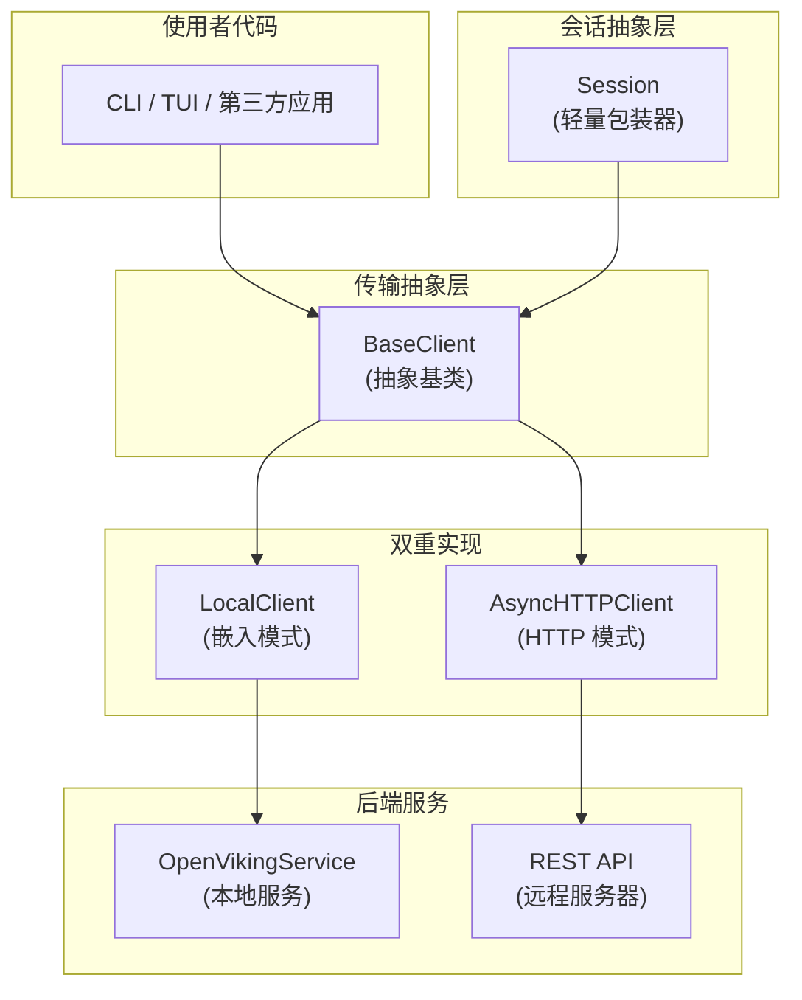

# client_session_and_transport 模块

> **模块定位**：客户端通信层与会话抽象 — 连接 OpenViking 后端服务的入口

## 概述

`client_session_and_transport` 模块是 OpenViking 客户端的核心通信层，负责将用户的操作请求传输到后端服务。无论是在本地嵌入模式（embedded mode）下直接调用服务，还是在远程模式下通过 HTTP 与服务器通信，这个模块提供了统一的抽象接口。

**为什么需要这个模块？** 

在设计 OpenViking 时，团队面临一个关键选择：如何支持不同的部署模式？一种方式是让代码中散布着 `if local else remote` 的条件分支，但这会导致代码难以维护。另一种更优雅的方案是定义一个统一的客户端接口，让嵌入模式和 HTTP 模式在使用者眼中看起来完全一致 — 这正是本模块采用的设计。

## 架构概览



### 核心组件职责

| 组件 | 职责 | 设计意图 |
|------|------|---------|
| `BaseClient` | 定义统一的客户端接口契约 | 让调用方与具体传输实现解耦 |
| `LocalClient` | 嵌入模式：直接调用本地服务 | 适用于单进程、无需网络通信的场景 |
| `AsyncHTTPClient` | HTTP 模式：通过 REST API 调用远程服务 | 适用于分布式部署、多客户端共享后端 |
| `Session` | 会话对象的 OOP 包装器 | 提供流畅的 API 体验，封装会话生命周期 |

## 设计决策与权衡

### 1. 策略模式 vs 简单工厂

**选择**：使用抽象基类（Abstract Base Class）+ 双重实现

**权衡分析**：
- 工厂模式会更简洁，但 ABC 模式提供了更强的类型约束和 IDE 自动补全
- 新增传输方式时需要修改 `BaseClient` 接口（破坏开闭原则），但这种显式声明让所有实现者清楚知道必须实现哪些方法
- 对于只有两种实现的场景，ABC 模式的成本是可接受的

### 2. Session 包装器的存在理由

**观察**：`Session` 类几乎是空壳 — 它只是简单地把方法调用委托给 `BaseClient`

**设计理由**：
- **API 美学**：`client.add_message(session_id, role, content)` vs `session.add_message(role, content)`，后者更符合面向对象的直觉
- **状态封装**：Session 绑定到特定 `session_id`，调用方无需每次都传递这个参数
- **future-proof**：未来如果 Session 需要维护自己的内部状态（如消息缓存），包装器提供了扩展空间

### 3. 双消息格式支持

`add_message` 方法支持两种调用方式：
```python
# 简单模式（向后兼容）
await client.add_message(session_id, "user", content="Hello")

# Parts 模式（完整功能）
await client.add_message(session_id, "assistant", parts=[
    {"type": "text", "text": "回答"},
    {"type": "context", "uri": "viking://resources/doc.md"}
])
```

**权衡**：
- 增加了 API 复杂度（两个参数互斥）
- 但保留了向后兼容，同时解锁了更强大的功能（多模态消息、上下文引用）
- 优先级的设计（parts > content）清晰明确

### 4. 同步 vs 异步

**选择**：全异步接口（async/await）

**权衡**：
- 异步是现代 I/O 的主流范式，尤其对于 HTTP 客户端
- 但也意味着调用方必须处理 asyncio 上下文，学习曲线略高
- LocalClient 同样使用 async，这是为了与 AsyncHTTPClient 保持接口一致

## 关键数据流

### 场景：添加消息到会话

```
用户调用 session.add_message("user", "Hello")
        ↓
Session.add_message() 验证参数，构造 Parts
        ↓
Session._client.add_message(session_id, role, parts)
        ↓
[根据客户端类型分发]
    ├─ LocalClient: 调用 OpenVikingService.sessions.session().add_message()
    └─ AsyncHTTPClient: POST /api/v1/sessions/{session_id}/messages
        ↓
返回 {"session_id": "...", "message_count": N}
```

### 场景：创建新会话

```
client.session() 被调用
        ↓
[客户端类型判断]
    ├─ LocalClient: service.sessions.session(ctx, None) → 创建新 Session
    └─ AsyncHTTPClient: POST /api/v1/sessions → 获取 session_id
        ↓
返回 Session(session_id=..., client=..., user=...)
```

## 依赖关系

### 上游依赖（被依赖）

本模块为以下模块提供基础能力：
- **CLI 命令结构** (`cli_command_structure`)：使用 HttpClient 执行用户命令
- **TUI 应用** (`tui_application_orchestration`)：App 依赖 BaseClient 与后端交互
- **检索与评估** (`retrieval_and_evaluation`)：搜索功能依赖 client 的 find/search 方法

### 下游依赖（依赖他人）

| 依赖模块 | 依赖内容 |
|---------|---------|
| `server_api_contracts` | HTTP 路由定义（AddMessageRequest, Session 等） |
| `session_runtime` | Session 运行时（LocalClient 直接调用） |
| `configuration_models` | 配置加载（AsyncHTTPClient 从 ovcli.conf 读取） |

## 子模块说明

本模块包含两个子模块，分别对应核心抽象的两个层次：

1. **[base_client](./python_client_and_cli_utils-client_session_and_transport-base_client.md)** — 抽象基类定义
   - `BaseClient`：定义完整的客户端接口契约
   - 包含生命周期、资源管理、文件系统、内容读取、搜索、会话、关系、打包等所有操作的抽象方法

2. **[session_wrapper](./python_client_and_cli_utils-client_session_and_transport-session_wrapper.md)** — 会话轻量包装器
   - `Session`：将底层客户端能力封装为面向对象的会话接口
   - 提供 add_message、commit、delete、load 等语义化的会话操作

## 潜在陷阱与注意事项

### 1. 客户端必须显式初始化

```python
# 错误：忘记初始化
client = AsyncHTTPClient(url="http://localhost:1933")
await client.read("viking://file.txt")  # 可能失败，_http 为 None

# 正确：先初始化
client = AsyncHTTPClient(url="http://localhost:1933")
await client.initialize()
try:
    await client.read("viking://file.txt")
finally:
    await client.close()
```

### 2. Session vs session_id 的混淆

`client.session()` 方法返回 `Session` 对象，而 `session_id` 是字符串。两者用途不同：
- `Session` 对象：面向对象的会话操作
- `session_id`：API 调用时的标识符参数

### 3. 嵌入模式下的用户标识

`LocalClient` 使用 `UserIdentifier.the_default_user()` 自动创建默认用户。如果需要自定义用户身份，必须使用 `AsyncHTTPClient` 并正确配置 `account_id`、`user_id`、`agent_id`。

### 4. Parts 模式的优先级

当 `content` 和 `parts` 同时提供时，`parts` 优先级更高。这是经过深思熟虑的设计 — 允许简单场景使用简洁语法，同时不牺牲复杂场景的表达能力。

## 扩展点

如果你需要为 OpenViking 添加新的传输方式（例如 WebSocket 或 gRPC），你需要：

1. **创建新类**继承 `BaseClient`
2. **实现所有抽象方法**，将调用转换为对应的传输协议
3. **保持接口一致**，特别是 `add_message` 的双模式支持
4. **更新文档**，说明新客户端的使用方式和适用场景