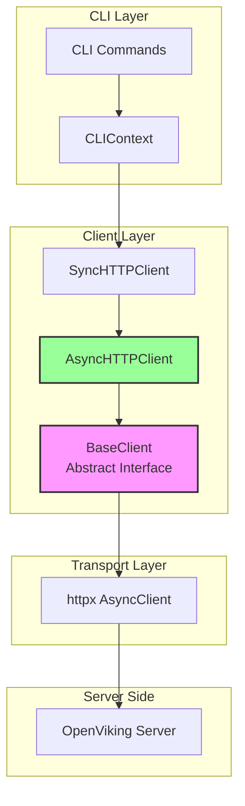

# base_client 模块技术深度解析

## 概述

`base_client` 模块是 OpenViking Python 客户端的核心抽象层，它定义了一个**统一的接口**，使得上层代码能够以相同的方式与 OpenViking 系统交互，无论底层实现是本地嵌入式模式还是远程 HTTP 模式。

想象一下 `BaseClient` 就像一把通用的"遥控器"——不论你的电视是哪个品牌，遥控器上的电源按钮、频道按钮的语义是统一的。`BaseClient` 正是如此：它将所有与 OpenViking 系统的交互（资源管理、会话操作、搜索、文件系统操作等）抽象为一套一致的 API，而具体的 HTTP 调用或本地执行则由 `AsyncHTTPClient` 和 `LocalClient`（如果存在）来实现。

这种设计的核心价值在于：**解耦**。CLI 命令不需要知道背后是远程服务器还是本地引擎，它们只需要调用 `BaseClient` 定义的方法即可完成工作。

---

## 架构设计

### 模块位置与依赖关系

```
python_client_and_cli_utils
    └── client_session_and_transport
            ├── base_client          ← 当前模块（抽象接口）
            └── session_wrapper      ← 基于 BaseClient 的会话包装器
```

### 核心组件

| 组件 | 角色 | 说明 |
|------|------|------|
| `BaseClient` | 抽象基类 | 定义客户端接口契约，所有实现必须遵循 |
| `AsyncHTTPClient` | 具体实现 | 通过 HTTP 协议与远程 OpenViking Server 通信 |
| `SyncHTTPClient` | 具体实现 | `AsyncHTTPClient` 的同步封装，供 CLI 使用 |
| `Session` | 轻量包装器 | 基于 `BaseClient` 提供的面向对象会话接口 |

### 数据流架构图



---

## 核心抽象：BaseClient

### 设计意图

`BaseClient` 采用 **抽象基类（ABC）** 模式，这并非偶然。选择 ABC 而非普通类或 Protocol，有其深刻的考量：

1. **强制接口一致性**：ABC 的 `@abstractmethod` 装饰器确保任何子类必须实现所有方法，否则无法实例化。这防止了"部分实现"导致的运行时错误。

2. **文档化作用**：ABC 本身就是一份**接口协议文档**。任何开发者阅读 `base.py` 就能全面了解客户端能做什么。

3. **类型提示友好**：相比 Protocol，ABC 在运行时提供更友好的错误信息，并且在大多数 IDE 中能提供更准确的自动补全。

### 方法分组与设计哲学

`BaseClient` 的方法按照功能领域自然分组，形成了清晰的语义区域：

**生命周期方法**
```python
async def initialize(self) -> None
async def close(self) -> None
```
这两個方法是**资源管理的起止点**。设计者选择了"显式初始化"而非"延迟初始化"，原因是：HTTP 客户端需要建立连接池、会话需要加载配置，这些操作最好在用户明确知道何时开始时进行，而非第一次调用时才意外触发。

**资源管理方法**
```python
async def add_resource(...) -> Dict[str, Any]
async def add_skill(...) -> Dict[str, Any]
async def wait_processed(...) -> Dict[str, Any]
```
这些方法处理**外部内容到 OpenViking 系统的导入**。注意 `wait_processed` 的存在——这是一个关键的设计决策：资源添加是异步的（可能涉及向量化和解析），调用者有时需要等待处理完成才能进行下一步操作。

**文件系统方法**
```python
async def ls(...) -> List[Any]
async def tree(...) -> List[Dict[str, Any]]
async def stat(...) -> Dict[str, Any]
async def mkdir(...) -> None
async def rm(...) -> None
async def mv(...) -> None
```
这些方法操作 OpenViking 内部的**虚拟文件系统**（Viking URI）。这里有一个微妙的设计：`ls` 和 `tree` 返回 `List` 而 `stat` 返回 `Dict`——这是因为目录列表可能有多种输出格式（原始、表格、JSON），而单个文件的元数据则是结构化的字典。

**内容读取方法**
```python
async def read(uri: str, offset: int = 0, limit: int = -1) -> str
async def abstract(uri: str) -> str
async def overview(uri: str) -> str
```
这里体现了 OpenViking 的**分层抽象概念**：
- `read` 读取 L2 级别的原始内容
- `abstract` 读取 L0 级别的摘要（`.abstract.md`）
- `overview` 读取 L1 级别的概览（`.overview.md`）

这种分层设计允许不同场景下使用不同粒度的内容——快速概览用 L0，详细分析用 L2。

**搜索方法**
```python
async def find(...)        # 无会话上下文的语义搜索
async def search(...)      # 带会话上下文的语义搜索
async def grep(...)        # 模式匹配搜索
async def glob(...)        # 文件路径模式匹配
```
`find` 与 `search` 的区别值得注意：`search` 接受可选的 `session_id`，这意味着搜索可以**利用会话上下文中积累的上下文信息**来做更精准的检索。这是一个上下文感知的设计决策。

**会话方法**
```python
async def create_session() -> Dict[str, Any]
async def list_sessions() -> List[Dict[str, Any]]
async def get_session(session_id: str) -> Dict[str, Any]
async def delete_session(session_id: str) -> None
async def commit_session(session_id: str) -> Dict[str, Any]
async def add_message(...) -> Dict[str, Any]
```
会话是 OpenViking 的核心抽象单元。值得注意的是 `commit_session` 方法——它执行"归档消息并提取记忆"的操作，这是系统**主动学习和知识沉淀**的关键机制。

**健康检查与状态**
```python
async def health() -> bool
def is_healthy() -> bool
def get_status() -> Any
@property
def observer(self) -> Any
```
这里有一个**有趣的混合**：既有异步的 `health()`，也有同步的 `is_healthy()`。这种设计考虑到了不同场景——CLI 命令通常是同步的，所以需要同步的健康检查；而在异步上下文中，可以使用异步版本获取更详细的状态信息。

`observer` 属性返回一个**观察者服务**，用于监控系统各组件（队列、VikingDB、VLM、System）的健康状况。

---

## 具体实现：AsyncHTTPClient

### 核心职责

`AsyncHTTPClient` 是 `BaseClient` 在 HTTP 模式下的实现。它的职责包括：
1. 管理 HTTP 连接生命周期
2. 将 BaseClient 方法调用转换为 HTTP 请求
3. 处理响应，将 JSON 解析为结果或抛出异常
4. 配置管理与错误映射

### HTTP 请求处理

```python
def _handle_response(self, response: httpx.Response) -> Any:
    """处理 HTTP 响应并提取结果或抛出异常。"""
    try:
        data = response.json()
    except Exception:
        if not response.is_success:
            raise OpenVikingError(...)
        return None
    
    if data.get("status") == "error":
        self._raise_exception(data.get("error", {}))
    
    return data.get("result")
```

这个方法揭示了 API 的响应契约：
- 成功响应：`{"status": "ok", "result": ...}`
- 失败响应：`{"status": "error", "error": {"code": "...", "message": "..."}}`

### 错误码映射机制

```python
ERROR_CODE_TO_EXCEPTION = {
    "INVALID_ARGUMENT": InvalidArgumentError,
    "NOT_FOUND": NotFoundError,
    "ALREADY_EXISTS": AlreadyExistsError,
    # ... 更多映射
}
```

这是一个经典的反模式映射表。当服务器返回错误码时，客户端将其转换为对应的异常类型。这种设计的优点是**错误处理的一致性**——无论底层是 HTTP 还是本地调用，上层代码看到的都是同一种异常体系。

### 自动配置加载

```python
def __init__(self, url: Optional[str] = None, api_key: Optional[str] = None, ...):
    if url is None:
        config_path = resolve_config_path(None, OPENVIKING_CLI_CONFIG_ENV, DEFAULT_OVCLI_CONF)
        if config_path:
            cfg = load_json_config(config_path)
            url = cfg.get("url")
            api_key = api_key or cfg.get("api_key")
```

配置加载遵循**三级回退策略**：
1. 显式参数（优先级最高）
2. 环境变量 `OPENVIKING_CLI_CONFIG_FILE`
3. 默认配置文件 `~/.openviking/ovcli.conf`

这种设计让 CLI 使用既灵活又简单——用户在配置文件中设置一次，之后只需 `SyncHTTPClient()` 即可自动加载所有配置。

---

## Session 包装器

`Session` 类是一个**轻量级对象包装器**，它将 `BaseClient` 的会话方法封装为面向对象的接口：

```python
class Session:
    def __init__(self, client: "BaseClient", session_id: str, user: UserIdentifier):
        self._client = client
        self.session_id = session_id
        self.user = user
    
    async def add_message(self, role: str, content: str) -> Dict[str, Any]:
        return await self._client.add_message(self.session_id, role, content)
    
    async def commit(self) -> Dict[str, Any]:
        return await self._client.commit_session(self.session_id)
```

设计意图很清晰：**提供更友好的 API**。想象一下：

```python
# 直接使用 BaseClient
await client.add_message(session_id="abc", role="user", content="Hello")
await client.commit_session(session_id="abc")

# 使用 Session 包装器
session = client.session("abc")
await session.add_message(role="user", content="Hello")
await session.commit()
```

后者更符合面向对象的直觉，也让会话相关的操作自然地聚集在一起。

---

## 设计决策与权衡

### 决策一：全异步接口

**选择**：所有 BaseClient 方法都是 `async` 的。

**权衡分析**：
- **优点**：I/O 密集型操作（HTTP 请求、文件读取）不会被同步阻塞，吞吐量更高
- **缺点**：对于简单的 CLI 工具，使用异步需要 `await` 或者额外的同步封装

为了解决这个矛盾，系统提供了 `SyncHTTPClient` 作为同步封装。这是一种**关注点分离**的设计——异步接口保留给需要高并发的场景，同步封装则服务于交互式 CLI。

### 决策二：抽象类而非 Protocol

**选择**：使用 `ABC` 而非 `typing.Protocol`。

**权衡分析**：
- **ABC 的优势**：强制子类实现所有方法，运行时错误更明确
- **Protocol 的优势**：更灵活，不要求显式继承，允许"鸭子类型"

选择 ABC 是因为这是一个**面向公众的接口**——LocalClient 和 AsyncHTTPClient 都需要完整实现所有方法，任何遗漏都会导致功能缺失。使用 ABC 能在类实例化时就发现问题，而不是在实际调用时。

### 决策三：wait_processed 的存在

**选择**：提供显式的 `wait_processed()` 方法等待资源处理完成。

**权衡分析**：
- **替代方案**：让 `add_resource` 默认等待完成
- **当前选择**：分离"添加"和"等待"两个操作

这种设计支持**流水线式的工作流**：你可以在等待的过程中做其他事情，或者一次性添加多个资源后再统一等待。这给了调用者更多的控制权。

### 决策四：Viking URI 抽象

**选择**：所有文件/目录操作使用 `uri: str` 而非 `path: str`。

**权衡分析**：
- `path` 暗示本地文件系统路径
- `uri` 则更通用，可以是 `viking://project/file.py`、`s3://bucket/key` 等

使用 URI 保持了系统的**可扩展性**——未来添加新的 URI scheme 只需要实现新的解析器，而不需要改变接口。

---

## 使用指南

### 基本使用模式

```python
from openviking_cli.client import SyncHTTPClient

# 方式一：显式配置
client = SyncHTTPClient(url="http://localhost:1933", api_key="your-key")
client.initialize()

# 方式二：自动从 ~/.openviking/ovcli.conf 加载
client = SyncHTTPClient()  # 自动读取配置
client.initialize()

try:
    # 资源管理
    client.add_resource("/path/to/code", wait=True)
    
    # 搜索
    results = client.search("How does auth work?", limit=5)
    
    # 会话操作
    session = client.session()
    await session.add_message("user", "Explain the architecture")
    await session.commit()
finally:
    client.close()
```

### Session 使用

```python
# 创建新会话
session = client.session()
print(f"New session: {session.session_id}")

# 加载已有会话
existing_session = client.session("session-id-123", must_exist=True)

# 添加消息
await existing_session.add_message("user", "Hello AI")
await existing_session.add_message("assistant", "Hello! How can I help?")

# 提交并提取记忆
await existing_session.commit()
```

---

## 边缘情况与注意事项

### 1. 资源添加的异步性

`add_resource()` 是异步的——它将资源加入处理队列后立即返回。**如果立即读取该资源的内容，可能会得到不完整的结果**。正确的做法：

```python
client.add_resource("/path/to/docs", wait=False)
# 做其他事情...
client.wait_processed()  # 等待处理完成
# 现在可以安全读取
content = client.read("viking://docs/file.md")
```

### 2. Session 的 must_exist 参数

```python
# 如果会话不存在，会静默创建一个新的空会话
session = client.session("non-existent-id")  

# 如果会话不存在，抛出 NotFoundError
session = client.session("non-existent-id", must_exist=True)
```

注意 `must_exist=True` 只在提供了 `session_id` 时才有意义。如果 `session_id=None`（创建新会话），该参数被忽略。

### 3. 配置文件的优先级

配置加载的优先级可能导致意外行为：

```python
# 即使显式传入 url，如果环境变量设置了不同的值，环境变量优先
import os
os.environ["OPENVIKING_CLI_CONFIG_FILE"] = "/custom/path/ovcli.conf"
client = SyncHTTPClient(url="http://localhost:1933")  # 这个 url 会被配置文件覆盖！
```

要避免这个问题，要么不设置环境变量，要么在显式提供参数后不加载配置文件。

### 4. Observer 的线程安全性

`observer` 属性返回的对象在 HTTP 模式下是 `_HTTPObserver`，它的属性访问（如 `observer.queue`）内部会调用 `run_async()`。这在多线程环境下**不是线程安全的**。如果需要线程安全的监控，请直接使用 API 调用而非 observer 包装器。

### 5. 超时设置

默认超时是 60 秒，但对于大规模资源导入可能不够。`add_resource()` 和 `wait_processed()` 接受 `timeout` 参数覆盖默认值：

```python
# 大型代码库导入可能需要更长的超时
client.add_resource("/path/to/large-repo", wait=True, timeout=3600.0)
```

---

## 相关模块参考

- **[session_wrapper](./python_client_and_cli_utils-client_session_and_transport-session_wrapper.md)** - Session 轻量包装器的详细文档
- **[configuration_models_and_singleton](./configuration_models_and_singleton.md)** - 配置管理系统的完整设计
- **[cli_bootstrap_and_runtime_context](./cli_bootstrap_and_runtime_context.md)** - CLI 如何初始化和使用客户端
- **[http_client](./http_client.md)** - HTTP 客户端的深入实现细节（Rust 版本）

---

## 总结

`BaseClient` 是 OpenViking Python 客户端的**核心抽象层**，它通过清晰的接口定义，实现了两种运行模式的统一：
- **本地模式**：直接操作嵌入式存储
- **HTTP 模式**：通过 HTTP 与远程服务通信

理解这个模块的关键在于把握其**抽象意图**：它不是简单的网络客户端，而是一个**功能完整的系统代理**——几乎所有与 OpenViking 引擎的交互都要经过这个接口。掌握它，就掌握了使用 OpenViking 的钥匙。