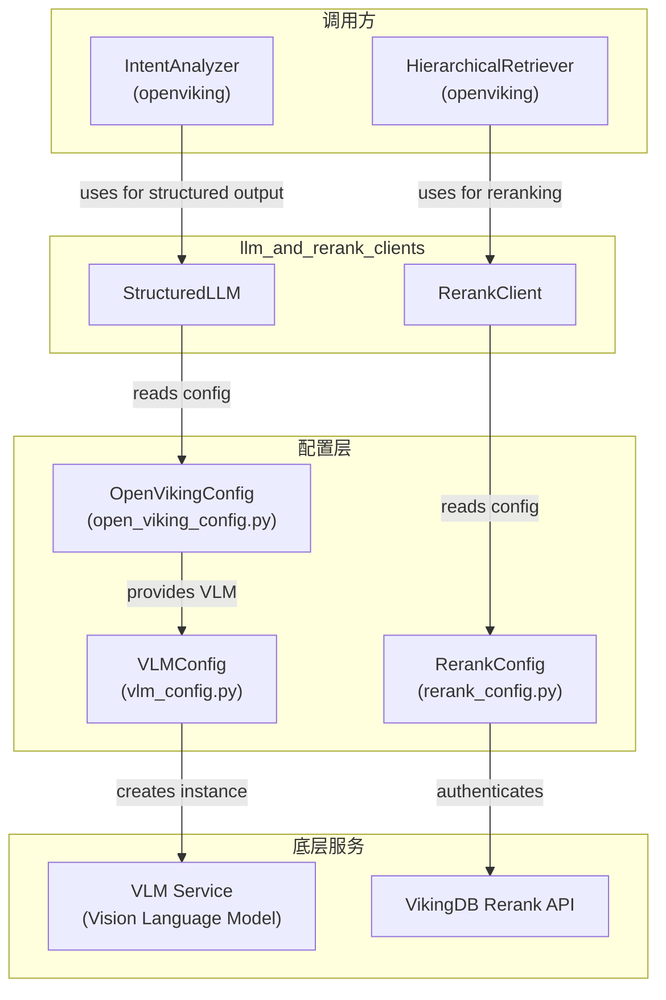
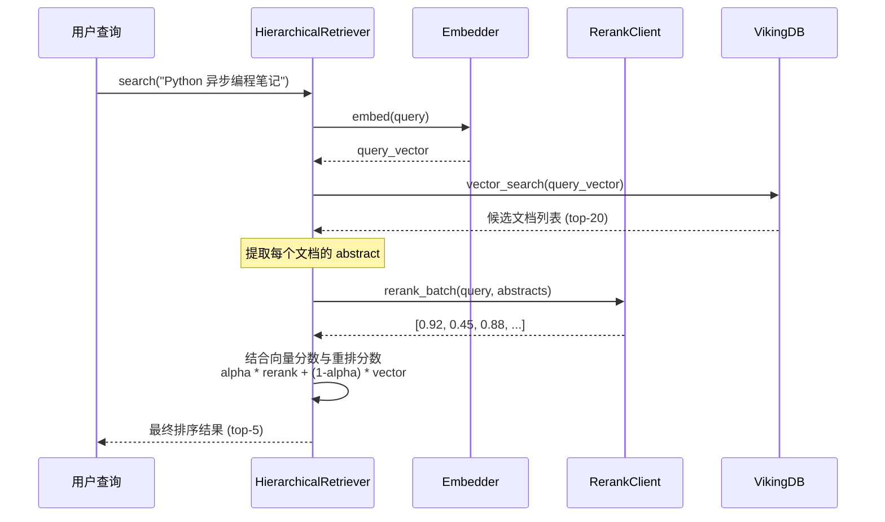

# llm_and_rerank_clients 模块技术深度解析

## 概述

本模块是 OpenViking Python CLI 工具中的**大语言模型（LLM）与重排序（Rerank）客户端封装层**。它解决了两个核心问题：

1. **StructuredLLM**：提供结构化输出能力，将 LLM 的自由文本响应解析为类型安全的 JSON 或 Pydantic 模型实例。这类似于一个"翻译层"——把 LLM 模糊的自然语言输出，精确地转换为下游代码可以安全使用的结构化数据。

2. **RerankClient**：封装 VikingDB Rerank API，提供批量文档重排序能力。在层次化检索（Hierarchical Retrieval）场景中，当向量相似度搜索返回候选文档后，RerankClient 负责对这些文档进行更精细的相关性评分，从而提升检索结果的质量。

**设计洞察**：这两个组件都采用**门面模式（Facade Pattern）**——对外提供简洁统一的接口，内部屏蔽了配置获取、API 签名、响应解析等复杂细节。调用方无需关心底层实现，只需关注业务逻辑。

---

## 架构图



---

## 核心组件深度解析

### 1. StructuredLLM —— 结构化输出的守护者

**定位**：一个轻量级的 LLM 包装器，核心职责是**让 LLM 输出可预测、可校验**。

#### 为什么需要这个组件？

直接调用 LLM API 会面临一个问题：LLM 返回的是自由文本，即使我们在提示词中要求输出 JSON，模型也可能：
- 返回带有 Markdown 代码块的 JSON（```json ... ```）
- 返回略微格式错误的 JSON（如内部引号未转义）
- 返回解释性文本而非纯 JSON

**StructuredLLM 的解决思路**是采用**渐进式解析策略**——用一系列越来越"宽容"的解析方法，逐个尝试直到成功。这类似于一个**层层递进的异常处理链**：

```python
# 解析策略优先级（从严到宽）：
# 1. 直接解析（最严格）→ 2. 提取代码块 → 3. 正则匹配 JSON 结构 → 4. 修复引号问题 → 5. json_repair 库兜底
```

#### 关键方法

| 方法 | 职责 | 返回类型 |
|------|------|----------|
| `complete_json(prompt, schema?)` | 获取 JSON 格式响应 | `Optional[Dict[str, Any]]` |
| `complete_model(prompt, model_class)` | 获取 Pydantic 模型实例 | `Optional[T]` |  
| `complete_json_async` / `complete_model_async` | 异步版本 | 对应的 Optional 类型 |

#### 内部机制

1. **`parse_json_from_response`**：这是核心解析器，采用五层fallback策略：
   - 第一层：`json.loads()` 直接解析（要求完全合法）
   - 第二层：正则提取 ` ```json...``` ` 代码块内容
   - 第三层：正则匹配 `{...}` 或 `[...]` JSON 结构
   - 第四层：调用 `_fix_json_quotes()` 修复未转义引号
   - 第五层：使用 `json_repair` 库进行智能修复（最宽容）

2. **`get_json_schema_prompt`**：生成带 JSON Schema 的提示词，引导 LLM 输出符合指定结构的数据。

3. **`_get_vlm`**：通过 `get_openviking_config().vlm` 获取 VLM 实例，这是一种**依赖注入**模式，通过全局配置单例解耦了 LLM 具体实现。

#### 使用示例

```python
from openviking_cli.utils.llm import StructuredLLM
from pydantic import BaseModel

class QueryIntent(BaseModel):
    intent: str
    entities: list[str]
    confidence: float

llm = StructuredLLM()

# 方式1：获取原始 JSON
result = llm.complete_json("分析这个用户查询的意图", schema={...})

# 方式2：获取 Pydantic 模型（推荐）
intent = llm.complete_model(
    "用户说：'帮我找找上周关于 Python 异步编程的笔记'", 
    QueryIntent
)
if intent:
    print(f"意图: {intent.intent}, 置信度: {intent.confidence}")
```

#### 设计权衡

- **为什么不用 LLM 原生的 `response_format` 参数**？部分 LLM 提供商（如 OpenAI）支持原生结构化输出，但 Volcan Engine 的 VLM 可能不支持。StructuredLLM 提供了**跨提供商的统一方案**，同时通过提示词工程实现了"伪结构化输出"。
- **为什么同时提供 sync 和 async 方法**？CLI 场景中既有同步调用（如批量处理），也有异步调用（如高并发 API 请求）。完整的 API 覆盖避免了调用方自行封装。

---

### 2. RerankClient —— 相关性排序的精密仪器

**定位**：VikingDB Rerank API 的 Python 客户端，专注于**批量文档重排序**。

#### 问题背景

在层次化检索场景中，向量相似度搜索只能提供"语义相似"的初步筛选。但真正"相关"的文档不一定在向量空间中距离最近——比如查询"Python 异步代码"，一篇讲解"asyncio 原理"的文章可能比"Python 异步实战"距离更远，但实际更相关。

**Rerank 的价值**：使用专门的**重排序模型**（如 doubao-seed-rerank）对候选文档进行**更精细的语义匹配**，输出每篇文档与查询的相关性分数。

#### 核心方法

```python
class RerankClient:
    def rerank_batch(self, query: str, documents: List[str]) -> List[float]:
        """
        批量重排序
        
        Args:
            query: 查询文本
            documents: 待排序的文档文本列表（通常取每篇文档的 abstract/摘要）
        
        Returns:
            与输入 documents 顺序对应的分数列表（分数越高越相关）
        """
```

#### 内部机制

1. **`_prepare_request`**：构建带签名的 HTTP 请求。使用 **Volcengine SignerV4** 认证机制（类似 AWS SigV4），这是云服务 API 的标准安全实践。

2. **请求体格式**：
   ```python
   {
       "model_name": "doubao-seed-rerank",
       "model_version": "251028",
       "data": [[{"text": doc1}], [{"text": doc2}], ...],  # 每个文档单独一组
       "query": [{"text": query}],
       "instruction": "Whether the Document answers the Query..."
   }
   ```

3. **响应解析**：从 `result["result"]["data"]` 提取分数数组，按原始顺序返回。

4. **容错设计**：任何异常都返回全零分数列表 `[0.0] * len(documents)`，保证调用方不会因重排序失败而崩溃。

#### 工厂方法

```python
@classmethod
def from_config(cls, config) -> Optional["RerankClient"]:
    """从 RerankConfig 创建客户端"""
    if not config or not config.is_available():
        return None  # 配置不可用时返回 None，体现"可选项"设计
    return cls(ak=config.ak, sk=config.sk, ...)
```

这种设计允许调用方**优雅降级**：当重排序不可用时，继续使用向量相似度分数。

#### 使用示例

```python
from openviking_cli.utils.rerank import RerankClient
from openviking_cli.utils.config import get_openviking_config

# 从配置创建
config = get_openviking_config()
rerank_client = RerankClient.from_config(config.rerank)

if rerank_client:
    docs = [doc["abstract"] for doc in candidate_docs]
    scores = rerank_client.rerank_batch("如何实现 Python 异步", docs)
    # scores: [0.95, 0.32, 0.87, ...]
else:
    # 降级使用向量分数
    scores = [doc["_score"] for doc in candidate_docs]
```

---

## 数据流分析

### 典型场景：层次化检索中的重排序



### StructuredLLM 的调用路径

虽然当前模块树显示 StructuredLLM 暂未被 `HierarchicalRetriever` 直接使用，但它在其他场景中发挥作用：

1. **Intent Analysis**：分析用户查询的意图和实体
2. **Query Planning**：生成结构化的查询计划
3. **Result Summarization**：对检索结果进行摘要

调用方通过 `get_openviking_config().vlm` 获取 VLM 配置，然后创建对应的 VLM 实例。

---

## 设计决策与权衡

### 1. 渐进式解析 vs. 严格解析

**决策**：StructuredLLM 使用多层 fallback 策略，而非严格要求 LLM 输出合法 JSON。

**权衡**：
- **优点**：极高的鲁棒性，几乎不会出现解析失败
- **缺点**：增加了一定的计算开销（多重正则匹配），且可能"修复"本不该修复的错误
- **适用场景**：CLI 工具对可靠性要求高宁可多尝试，也不能让用户看到解析错误

### 2. 静默降级 vs. 显式报错

**决策**：RerankClient 在失败时返回零分数列表，而非抛出异常。

**权衡**：
- **优点**：调用方无需编写异常处理代码，检索流程可以继续
- **缺点**：静默降级可能掩盖真正的配置错误（如 AK/SK 错误）
- **缓解**：通过日志记录错误，运维人员可排查

### 3. 配置单例模式

**决策**：使用 `OpenVikingConfigSingleton` 全局单例管理配置。

**权衡**：
- **优点**：简化调用，避免层层传递配置对象
- **缺点**：引入全局状态，测试时需要显式 reset
- **适用场景**：CLI 工具通常是单次运行，全局配置是合理的

### 4. 同步/异步双版本

**决策**：为每个核心方法提供 sync 和 async 两个版本。

**权衡**：
- **优点**：灵活性——同步代码可以直接用，异步代码可以并发
- **缺点**：代码量翻倍，需要维护两套逻辑
- **当前实现**：内部实际上复用了相同的解析逻辑，只是调用了 VLM 的不同版本

---

## 依赖分析

### 上游依赖（谁调用这个模块）

| 组件 | 依赖方式 | 用途 |
|------|----------|------|
| `HierarchicalRetriever` | 使用 `RerankClient` | 检索结果重排序 |
| `IntentAnalyzer` | 可能使用 `StructuredLLM` | 查询意图分析 |
| 其他业务模块 | 通过配置间接依赖 | 获取 VLM 实例 |

### 下游依赖（这个模块依赖谁）

| 组件 | 依赖方式 | 说明 |
|------|----------|------|
| `OpenVikingConfig` | 配置注入 | 提供 VLM 和 Rerank 配置 |
| `VLMConfig` | 依赖配置 | 创建 VLM 实例 |
| `RerankConfig` | 依赖配置 | 初始化 RerankClient |
| `json_repair` | 第三方库 | 最后的 JSON 修复手段 |
| `volcengine` SDK | 第三方库 | API 签名认证 |
| `requests` | 第三方库 | HTTP 请求 |
| `Pydantic` | 依赖 | 模型验证 |

### 关键契约

1. **配置契约**：调用方必须确保 `openviking.conf` 中正确配置了 `vlm` 和 `rerank` 部分
2. **VLM 接口契约**：`get_completion(prompt)` 和 `get_completion_async(prompt)` 方法必须存在
3. **响应格式契约**：Rerank API 返回格式必须符合 `{result: {data: [{score: float}, ...]}}`

---

## 扩展点与边界

### 可扩展之处

1. **新增解析策略**：在 `parse_json_from_response` 中添加新的解析方法
2. **新增重排序提供商**：RerankClient 目前只支持 VikingDB，未来可扩展支持 Cohere、Cross-encoder 等
3. **结构化输出格式**：目前支持 JSON Schema，未来可扩展支持 JSON Lines、XML 等

### 边界与限制

1. **RerankClient 暂未集成**：当前 `HierarchicalRetriever` 代码显示 `self._rerank_client = None`，说明重排序功能尚未完全启用（TODO 注释）
2. **StructuredLLM 的 VLM 依赖**：假设 `get_openviking_config().vlm` 已经初始化，否则会抛出配置错误
3. **网络依赖**：两个客户端都需要网络访问，offline 模式下不可用

---

## 常见问题与注意事项

### Q1: 为什么解析还是失败？

可能原因：
- LLM 返回了完全无关的内容（如拒绝回答）
- JSON Schema 过于复杂，LLM 无法正确遵循
- 网络超时导致响应不完整

建议：检查日志，使用 `complete_model` 的错误信息定位问题。

### Q2: RerankClient 返回全零分数？

可能原因：
- AK/SK 配置错误
- 网络请求超时（默认30秒）
- API 返回格式变更

建议：查看日志中的 `[RerankClient] Rerank failed: ...` 详细信息。

### Q3: 如何在不修改代码的情况下禁用重排序？

在 `openviking.conf` 中将 `rerank` 的 `ak` 和 `sk` 设为空即可：

```json
{
  "rerank": {
    "ak": null,
    "sk": null
  }
}
```

系统会自动降级到纯向量搜索模式。

---

## 相关文档

- [配置管理模块](./python_client_and_cli_utils-configuration_models_and_singleton.md) - OpenVikingConfig 详解
- [VLM 配置](./python_client_and_cli_utils-configuration_models_and_singleton.md) - VLMConfig 详解  
- [检索类型定义](./python_client_and_cli_utils-retrieval_trace_and_scoring_types.md) - ThinkingTrace、ScoreDistribution
- [层次化检索器](retrieval_and_evaluation.md) - HierarchicalRetriever 完整实现