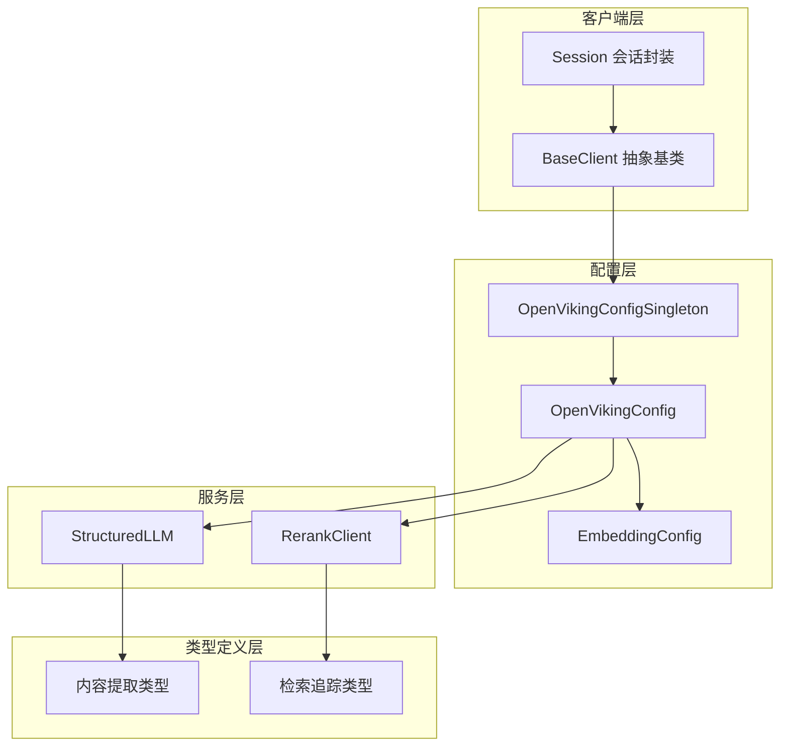

# python_client_and_cli_utils 模块文档

## 概述

`python_client_and_cli_utils` 是 OpenViking 系统的 Python 客户端工具库，为开发者提供了与 OpenViking 后端服务交互的统一接口。本模块解决了分布式知识管理系统的几个核心挑战：如何优雅地管理客户端配置、如何抽象不同传输层（本地嵌入模式 vs HTTP 远程模式）、如何统一处理结构化输出、以及如何可视化检索决策过程。

把 OpenViking 想象成一座大型图书馆：后端是图书馆的存储和管理系统，而 `python_client_and_cli_utils` 就是读者手中的「索书单」和「借书系统」。它不仅帮你找到想要的书（检索），还能告诉你为什么推荐这些书（思维追踪），同时处理借阅过程中的各种细节（配置管理、内容提取）。

## 架构概览



这个架构体现了「关注点分离」的设计原则：配置层负责管理所有运行时参数，服务层负责与外部 AI 服务交互，类型层定义数据结构，而客户端层则将这些整合在一起，对外提供统一的 OOP 接口。

### 核心组件职责

| 组件 | 职责 | 设计意图 |
|------|------|----------|
| `BaseClient` | 定义客户端抽象接口 | 统一本地模式和 HTTP 模式的 API surface，让调用方无需关心底层传输方式 |
| `Session` | 会话生命周期管理 | 将底层的 add_message/commit/delete 操作封装为面向对象的会话对象 |
| `OpenVikingConfigSingleton` | 全局配置单例 | 确保整个进程只有一个配置实例，避免配置不一致导致的微妙 bug |
| `StructuredLLM` | LLM 结构化输出 | 解决 LLM 返回非结构化文本的问题，提供可靠的 JSON 解析和 Pydantic 验证 |
| `RerankClient` | 文档重排序 | 在检索后使用专用模型对结果进行二次排序，提升相关性 |
| `ExtractionResult` | 内容提取结果 | 统一 PDF、图片、表格等不同媒体类型的提取结果格式 |

## 关键设计决策

### 1. 抽象基类模式 vs 接口模式

`BaseClient` 采用抽象基类（ABC）而非 Protocol 接口，这是因为它需要提供**有默认实现的模板方法**。例如 `session()` 方法同时支持创建新会话和加载已有会话，这种复杂性适合用基类实现而非要求每个客户端重复编写。

**Tradeoff**：这带来了轻微的耦合——新增客户端必须继承 BaseClient 而非自由实现。但收益是明显的：统一的错误处理、日志记录、参数校验可以在基类一次性完成。

### 2. 配置单例的线程安全

`OpenVikingConfigSingleton` 使用双重检查锁定（Double-Checked Locking）模式：

```python
@classmethod
def get_instance(cls) -> OpenVikingConfig:
    if cls._instance is None:
        with cls._lock:
            if cls._instance is None:
                # 加载配置
```

这种设计在配置只读读取一次的场景下平衡了性能和线程安全。值得注意的是，`initialize()` 方法允许运行时替换整个配置，这为测试和配置热重载提供了可能。

### 3. 多提供商支持的工厂模式

`EmbeddingConfig` 使用工厂注册表模式支持多种 embedding 提供商（OpenAI、VolcEngine、VikingDB、Jina）：

```python
factory_registry = {
    ("openai", "dense"): (OpenAIDenseEmbedder, lambda cfg: {...}),
    ("volcengine", "dense"): (VolcengineDenseEmbedder, lambda cfg: {...}),
    # ...
}
```

这种设计的优势是**开放封闭原则**——新增提供商只需添加注册表条目，无需修改现有代码。代价是注册表会随着提供商增加而膨胀，但当前四家提供商的结构是可控的。

### 4. 结构化输出的多层降级策略

`parse_json_from_response` 展现了防御性编程的思路：它尝试五种不同的 JSON 解析策略，从直接解析到使用 `json_repair` 库。这反映了 LLM 输出本质上的不确定性——即使使用了 `response_format` 参数，模型仍可能返回带 Markdown 包装、格式错误或微妙语法问题的响应。

## 数据流分析

### 典型检索流程

当用户执行一次语义搜索时，数据流经以下路径：

1. **配置初始化** → `OpenVikingConfigSingleton.get_instance()` 读取 ov.conf
2. **客户端创建** → `BaseClient` 子类（如 AsyncHTTPClient）初始化 HTTP 连接池
3. **查询构建** → 调用方创建 `Session` 对象或直接调用 client 方法
4. **向量检索** → 使用 `EmbeddingConfig` 创建 embedder，将查询向量化
5. **结果重排** → 可选地使用 `RerankClient` 对初检结果重排序
6. **结果返回** → 封装为 `FindResult`，包含 `ThinkingTrace` 用于可视化

```
用户调用 client.search()
         ↓
   BaseClient.search()  [抽象接口]
         ↓
   AsyncHTTPClient 实现  [HTTP 调用]
         ↓
   EmbeddingConfig.get_embedder()  [工厂创建]
         ↓
   向量化查询 → VikingDB/VectorDB
         ↓
   RerankClient.rerank_batch()  [可选重排]
         ↓
   FindResult + ThinkingTrace  [结果封装]
```

### 配置加载优先级

`OpenVikingConfigSingleton` 实现了清晰的配置解析链：

1. `initialize(config_dict=...)` 传入的字典（最高优先级）
2. `OPENVIKING_CONFIG_FILE` 环境变量指定的文件
3. `~/.openviking/ov.conf` 默认位置
4. 抛出 `FileNotFoundError` 并提供清晰的错误指引

这种设计避免了「配置到底从哪里来的」这种调试噩梦。

## 子模块文档

本模块包含以下子模块，点击链接查看详细文档：

- **[client_session_and_transport](python_client_and_cli_utils-client_session_and_transport.md)** — 客户端抽象基类和会话封装，定义了统一的客户端接口和会话生命周期管理
- **[configuration_models_and_singleton](python_client_and_cli_utils-configuration_models_and_singleton.md)** — 配置模型和单例管理，包含嵌入模型配置和全局配置的管理
- **[content_extraction_schema_and_strategies](python_client_and_cli_utils-content_extraction_schema_and_strategies.md)** — 内容提取的类型定义和策略，定义了 PDF、图片、表格等多媒体内容的提取结果格式
- **[llm_and_rerank_clients](python_client_and_cli_utils-llm_and_rerank_clients.md)** — LLM 封装和重排序客户端，提供结构化输出支持和文档重排序功能
- **[retrieval_trace_and_scoring_types](python_client_and_cli_utils-retrieval_trace_and_scoring_types.md)** — 检索追踪和评分类型，用于可视化和调试检索决策过程

## 与其他模块的交互

| 依赖模块 | 交互方式 | 说明 |
|----------|----------|------|
| `rust_cli_interface` | 共同依赖配置 | Rust CLI 和 Python 客户端共享 `OpenVikingConfig` 格式定义 |
| `core_context_prompts_and_sessions` | 客户端调用 | `BaseClient.add_message()` 会触发 `Session` 的消息添加 |
| `model_providers_embeddings_and_vlm` | 使用 embedder | `EmbeddingConfig.get_embedder()` 委托给具体的 embedder 实现 |
| `vectordb_domain_models_and_service_schemas` | 数据格式 | 检索结果类型与 vector DB 的 `SearchResult` 概念对应 |

## 开发者注意事项

### 配置验证是分层的

配置验证不是单一入口，而是分散在多个层级：
- `EmbeddingModelConfig` 验证单个 embedding 模型配置完整性
- `EmbeddingConfig` 验证至少配置了一种 embedding 类型
- `OpenVikingConfig` 验证跨配置一致性（如 service mode 与 local AGFS 的冲突）

这种设计的代价是错误信息可能来自多个位置，调试时需要逐层检查。

### Session 对象不是线程安全的

`Session` 对象持有对 `BaseClient` 的引用，后者通常是共享的。如果在多线程环境中使用，确保只从同一线程操作 `Session` 实例，或者使用 `client.session()` 方法为每个线程创建独立的 Session。

### 嵌入维度必须一致

配置中有三处可能指定向量维度：`EmbeddingModelConfig.dimension`、`StorageConfig.vectordb.dimension`、和实际的 embedding 模型输出。`initialize_openviking_config()` 会尝试自动同步这些值，但如果你在运行时动态创建 embedder，需要注意手动确保维度一致。

### ThinkingTrace 的并发安全

`ThinkingTrace` 使用 `queue.Queue` 实现线程安全，这允许在异步并发检索场景下收集追踪事件。但请注意，`get_events()` 返回的是队列的快照，不反映后续添加的新事件——如果需要实时追踪，考虑在循环中反复调用获取增量。