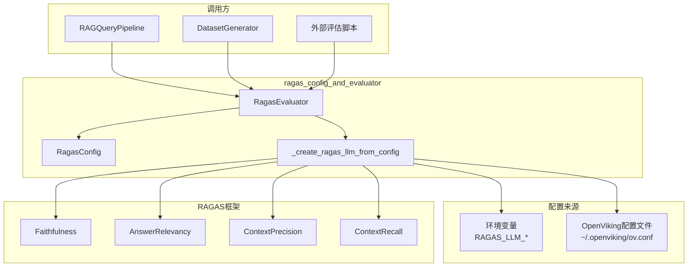

# ragas_config_and_evaluator 模块技术深度解析

## 概述

`ragas_config_and_evaluator` 模块是 OpenViking 评估框架的核心组成部分，它将 RAGAS（Retrieval-Augmented Generation Assessment）框架集成到 OpenViking 生态系统中。简单来说，这个模块解决了一个关键问题：**如何客观、定量地衡量一个 RAG（检索增强生成）系统的质量**。

在真实的生产环境中，RAG 系统的质量评估长期以来依赖于人工review——这不仅效率低下，而且难以规模化。RAGAS 提供了一套自动化的评估指标体系，能够从多个维度评估 RAG 系统的表现。OpenViking 通过这个模块，将 RAGAS 的评估能力封装成易于使用的接口，同时解决了企业级应用中的一个核心挑战：**LLM 配置的灵活性**。不同用户可能使用不同的 LLM 提供商（OpenAI、Azure OpenAI、自托管模型等），该模块通过环境变量优先、配置文件兜底的策略，确保评估器能够适应各种 LLM 配置场景。

## 架构概览



### 核心组件角色

| 组件 | 角色 | 职责 |
|------|------|------|
| `RagasConfig` | 配置载体 | 封装评估器的运行时参数（并发数、超时、重试等） |
| `RagasEvaluator` | 评估执行器 | 协调 RAGAS 框架执行评估，聚合结果 |
| `_create_ragas_llm_from_config` | LLM 工厂 | 解决 LLM 实例化的配置优先级问题 |

## 设计意图与问题空间

### 解决的痛点

在企业级 RAG 系统中，评估往往面临三个核心挑战：

**1. 评估指标的专业性**。单纯的准确率、召回率无法全面反映 RAG 系统的质量。RAGAS 定义了四个核心指标——Faithfulness（答案忠实度）、AnswerRelevancy（答案相关性）、ContextPrecision（上下文精确度）、ContextRecall（上下文召回率）——每个指标捕捉 RAG 流程中的一个关键环节。该模块直接封装了这些指标，用户无需理解每个指标的计算细节。

**2. LLM 配置的灵活性**。OpenViking 是一个多云、多模型的 AI 平台，用户可能使用 OpenAI、字节跳动的火山引擎、或者其他 LLM 提供商。评估器必须能够适配各种 LLM 配置，同时保持代码的简洁。该模块采用了「环境变量优先、配置文件兜底」的策略：开发者可以通过 `RAGAS_LLM_API_KEY` 等环境变量快速测试，也可以通过 OpenViking 的统一配置文件管理生产环境的 LLM。

**3. 评估性能的可控性**。RAG 评估涉及多次 LLM 调用，成本和时间都不可控。该模块通过 `RagasConfig` 提供了细粒度的性能控制：`max_workers` 控制并发评估的并行度，`batch_size` 控制每次提交给 RAGAS 的样本数量，`timeout` 和 `max_retries` 则处理网络波动和 LLM 不稳定的场景。

### 为什么不直接用 RAGAS？

RAGAS 本身是一个独立的库，可以直接导入使用。那么为什么要封装这一层？原因有三：

第一，**接口适配**。RAGAS 的输入输出是原生的 Hugging Face `Dataset` 格式，而 OpenViking 内部使用 Pydantic 模型（`EvalSample`、`EvalDataset` 等）。该模块在 RAGAS 和 OpenViking 之间做了格式转换，使两者能够无缝对接。

第二，**配置统一**。OpenViking 有一套完整的配置体系（通过 `OpenVikingConfig` 管理），评估器需要融入这个体系，而不是另起炉灶。用户不希望在评估时还要学习一套新的配置方式。

第三，**异步支持**。RAGAS 的核心 `evaluate()` 函数是同步的，而 OpenViking 是一个异步架构（大量使用 `async/await`）。该模块通过 `asyncio.get_event_loop().run_in_executor()` 将同步调用封装为异步接口，使其融入 OpenViking 的异步生态。

## 数据流分析

### 评估流程：端到端追踪

当用户调用 `RagasEvaluator.evaluate_dataset()` 时，数据经历了以下流转：

```
用户代码
    │
    ▼
┌─────────────────────────────────────────────────────────────┐
│ RagasEvaluator.evaluate_dataset(dataset: EvalDataset)      │
│  1. 将 EvalDataset 转换为 RAGAS 需要的 dict 格式            │
│  2. 构建 RunConfig（超时、重试、并发参数）                    │
│  3. 调用 ragas.evaluate() 执行评估（在线程池中）            │
└─────────────────────────────────────────────────────────────┘
    │
    ▼
┌─────────────────────────────────────────────────────────────┐
│ ragas.evaluate()                                            │
│  - 为每个样本调用 LLM 计算指标                               │
│  - 并行度由 max_workers 和 batch_size 控制                  │
│  - 返回 RAGAS Result 对象                                   │
└─────────────────────────────────────────────────────────────┘
    │
    ▼
┌─────────────────────────────────────────────────────────────┐
│ 结果转换与聚合                                               │
│  1. 将 RAGAS Result 转换为 pandas DataFrame                 │
│  2. 遍历每个样本，提取各指标分数                             │
│  3. 计算均值，生成 SummaryResult                             │
└─────────────────────────────────────────────────────────────┘
    │
    ▼
返回 SummaryResult（含 mean_scores 和各样本的 EvalResult）
```

### LLM 配置的解析优先级

`_create_ragas_llm_from_config()` 函数的决策逻辑值得仔细剖析，因为它体现了「渐进式配置」的理念：

```python
def _create_ragas_llm_from_config() -> Optional[Any]:
    # 优先级 1：环境变量（最高优先级，最灵活）
    env_config = _get_llm_config_from_env()
    if env_config:
        # 使用环境变量中的配置
        return llm_factory(model_name, client=OpenAI(...))
    
    # 优先级 2：OpenViking 配置文件（标准化、可版本化）
    try:
        config = get_openviking_config()
        vlm_config = config.vlm
        if vlm_config.is_available():
            # 使用配置文件中的 VLM 配置
            return llm_factory(model_name, client=OpenAI(...))
    except FileNotFoundError:
        return None
    
    # 优先级 3：返回 None，评估时抛出明确错误
    return None
```

这种设计的意图是：**环境变量用于开发调试和 CI/CD 场景**（快速覆盖配置，无需修改文件），**配置文件用于生产环境**（可版本化、可审计、类型安全）。

## 核心组件深度解析

### RagasConfig：评估器的配置契约

`RagasConfig` 是一个简单的 dataclass，但它定义了你与评估器之间的「服务等级协议」（SLA）：

```python
@dataclass
class RagasConfig:
    max_workers: int = 16      # 并发评估的 worker 数量
    batch_size: int = 10       # 每批处理的样本数
    timeout: int = 180         # 单次 LLM 调用的超时（秒）
    max_retries: int = 3       # 失败重试次数
    show_progress: bool = True # 是否显示进度条
    raise_exceptions: bool = False  # 是否在评估失败时抛出异常
```

**关键设计决策**：`raise_exceptions` 默认为 `False`。这意味着即使某个样本评估失败，评估器也会继续处理其他样本，并在最终结果中记录失败。这个决策背后的理念是：**评估的鲁棒性比严格性更重要**。在生产环境中，你可能评估成百上千个样本，几个样本的失败不应该中断整个评估流程。

### RagasEvaluator：评估执行引擎

`RagasEvaluator` 的初始化逻辑体现了「智能默认值」的思想：

```python
def __init__(self, metrics=None, llm=None, embeddings=None, 
             config=None, max_workers=None, batch_size=None, 
             timeout=None, max_retries=None, show_progress=True, 
             raise_exceptions=False):
    # 1. 默认使用四个核心 RAGAS 指标
    self.metrics = metrics or [
        Faithfulness(),
        AnswerRelevancy(),
        ContextPrecision(),
        ContextRecall(),
    ]
    
    # 2. LLM 延迟初始化——只有在真正评估时才创建
    self.llm = llm or _create_ragas_llm_from_config()
    
    # 3. 参数合并：显式参数 > config 对象 > 环境变量 > 默认值
    if config is None:
        config = RagasConfig.from_env()
    
    self.max_workers = max_workers if max_workers is not None else config.max_workers
    # ... 其他参数同理
```

**为什么使用延迟初始化（Lazy Initialization）？** 因为 LLM 实例化可能涉及网络调用、凭证验证等耗时操作。如果用户只是创建一个评估器但不做任何评估，这些开销就浪费了。延迟初始化确保这些成本只在真正需要时才产生。

### _create_ragas_llm_from_config：配置优先级的实现

这是模块中最「聪明」的部分，也是新贡献者最容易误解的地方。函数名暗示它只是「从配置创建 LLM」，但实际上它承担了两个职责：

1. **配置解析**：从环境变量或配置文件读取 LLM 参数
2. **凭证验证**：检查配置是否有效，避免创建无效的 LLM 实例

特别注意 `except FileNotFoundError` 的处理：当 OpenViking 配置文件不存在时，函数静默返回 `None`，而不是抛出异常。这是因为在某些场景（如快速原型开发）下，用户可能根本没有配置文件，只有环境变量。静默失败允许后续的 `evaluate_dataset()` 给出更友好的错误信息。

## 设计决策与权衡

### 1. 同步调用封装为异步 vs 纯异步设计

RAGAS 的核心 `evaluate()` 函数是同步的，而 OpenViking 是异步架构。代码中使用了 `asyncio.get_event_loop().run_in_executor()` 将其包装为异步：

```python
loop = asyncio.get_event_loop()
result = await loop.run_in_executor(
    None,  # 使用默认的 ThreadPoolExecutor
    lambda: evaluate(...)
)
```

**权衡分析**：这种「在线程池中运行同步代码」的模式是 Python 中常见的异步兼容方案。优点是代码改动最小，缺点是存在线程切换开销。对于评估这种 I/O 密集型任务，开销可接受，但如果评估变成系统瓶颈，可以考虑将 RAGAS 替换为纯异步的实现。

### 2. 异常处理策略：静默继续 vs 快速失败

如前所述，`raise_exceptions=False` 是默认行为。这是一种**防御性设计**——在批量评估场景中，一个样本的失败不应该导致整个批次失败。但这也意味着用户可能 unaware 到某些样本评估失败了。代码通过在 `EvalResult.scores` 中不包含失败样本的分数（留空）来隐式表达失败。

### 3. 配置来源的双轨制

环境变量 + 配置文件的双轨制增加了代码复杂度，但解决了真实需求：

- **单元测试**：测试可以通过环境变量临时覆盖配置，无需修改文件
- **CI/CD**：CI 脚本可以通过环境变量注入测试用的 LLM 凭证
- **多租户**：不同租户可以使用不同的配置文件

### 4. 指标选择：默认值 vs 可扩展性

默认使用四个指标（Faithfulness、AnswerRelevancy、ContextPrecision、ContextRecall）是经过实践验证的「黄金组合」。但代码允许用户传入自定义指标列表：

```python
evaluator = RagasEvaluator(
    metrics=[Faithfulness(), AnswerRelevancy(), CustomMetric()]
)
```

这种设计在「简单性」和「灵活性」之间取得了平衡——默认行为开箱即用，高级用户可以深度定制。

## 依赖关系与契约

### 上游依赖：谁调用这个模块？

根据模块树结构，以下组件依赖 `ragas_config_and_evaluator`：

1. **`RAGQueryPipeline`**：RAG 查询管道，在执行查询后可以使用 `RagasEvaluator` 评估检索和生成质量
2. **`DatasetGenerator`**：数据集生成器，生成评估样本后可立即评估
3. **外部评估脚本**：用户编写的评估流程脚本

### 下游依赖：这个模块依赖什么？

1. **RAGAS 框架**：`ragas.metrics` 中的各个指标类
2. **Hugging Face Datasets**：`datasets.Dataset` 用于批量评估
3. **OpenAI 客户端**：`openai.OpenAI` 用于 LLM 调用
4. **OpenViking 配置系统**：`OpenVikingConfig` 用于读取 VLM 配置

### 隐式契约

调用 `RagasEvaluator` 前，必须满足以下条件：

1. **LLM 已配置**：通过环境变量或配置文件，否则 `evaluate_dataset()` 会抛出 `ValueError`
2. **RAGAS 已安装**：`ragas` 和 `datasets` 包必须可用，否则初始化时会抛出 `ImportError`
3. **数据集非空**：`EvalDataset.samples` 必须非空，否则返回空的 `SummaryResult`

## 常见陷阱与注意事项

### 1. 环境变量覆盖的陷阱

`RagasConfig.from_env()` 读取以 `RAGAS_` 为前缀的环境变量：

```python
RAGAS_MAX_WORKERS_ENV = "RAGAS_MAX_WORKERS"
RAGAS_BATCH_SIZE_ENV = "RAGAS_BATCH_SIZE"
# ...
```

但 `_create_ragas_llm_from_config()` 读取的是没有前缀的变量：

```python
RAGAS_LLM_API_KEY_ENV = "RAGAS_LLM_API_KEY"
RAGAS_LLM_API_BASE_ENV = "RAGAS_LLM_API_BASE"
RAGAS_LLM_MODEL_ENV = "RAGAS_LLM_MODEL"
```

**注意**：这是两套不同的环境变量！前者控制评估器行为，后者配置 LLM。混淆它们会导致意想不到的行为。

### 2. 异步上下文中的评估

`evaluate_dataset()` 内部使用 `asyncio.get_event_loop().run_in_executor()`。这意味着：

- 评估可以在 `async def` 函数中调用
- 但评估本身是 CPU 密集型的（格式转换、结果聚合），不是真正的异步 I/O
- 如果在没有运行事件循环的上下文中调用，会失败

### 3. LLM 实例的可复用性

`RagasEvaluator` 接受 `llm` 参数，这允许用户传入自定义的 LLM 实例。但需要注意：

- RAGAS 期望的 LLM 必须是通过 `ragas.llms.llm_factory()` 创建的
- 直接传入原始的 `openai.OpenAI` 实例不会工作

### 4. 嵌入模型的可选性

代码中 `embeddings` 参数默认为 `None`：

```python
self.embeddings = embeddings  # 可能为 None
```

某些指标（如 AnswerRelevancy）需要嵌入模型来计算语义相似度。如果没有提供嵌入模型，这些指标会使用 RAGAS 的默认嵌入（通常是 OpenAI 的 text-embedding-ada-002），这可能产生额外的 API 调用和费用。

### 5. 评估结果的可序列化

`EvalResult.scores` 是一个简单的 `Dict[str, float]`，不包含时间戳、执行耗时等元数据。如果需要这些信息用于审计或调试，需要自行扩展类型定义。

## 扩展点与定制化

### 添加自定义指标

RAGAS 支持自定义指标。要在 OpenViking 中使用：

```python
from ragas.metrics.base import MetricWithLLM

class CustomContextQuality(MetricWithLLM):
    name = "context_quality"
    # 实现 _score 方法...
    
evaluator = RagasEvaluator(
    metrics=[Faithfulness(), AnswerRelevancy(), CustomContextQuality()]
)
```

### 替换 LLM 后端

当前仅支持通过 `openai.OpenAI` 兼容接口的 LLM。如果需要支持其他协议（如 Anthropic、Claude），可以修改 `_create_ragas_llm_from_config()` 函数，添加对应的客户端创建逻辑。

### 集成其他评估框架

模块遵循 `BaseEvaluator` 抽象。如果需要集成其他评估框架（如 LangChain 的 evaluate、DeepEval），只需实现相同的抽象接口即可在 OpenViking 中互换使用。

## 相关文档

- [base_evaluator](./ragas-evaluation-core-base-evaluator.md) —— 评估器抽象基类
- [data_types](./ragas-evaluation-core-data-types.md) —— 评估数据类型定义
- [dataset_generator](./ragas-evaluation-core-dataset-generator.md) —— 数据集生成器
- [retrieval_query_orchestration](./retrieval_query_orchestration.md) —— RAG 查询管道
- [open_viking_config](./python_client_and_cli_utils-configuration_models_and_singleton-open_viking_config.md) —— OpenViking 配置系统