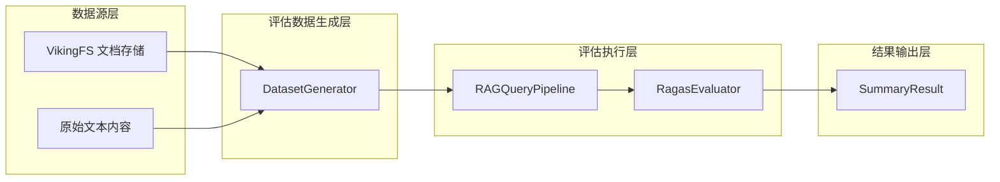

# dataset_generator 技术深度解析

## 概述

`dataset_generator` 模块是 OpenViking 评估框架的核心组件之一，负责**生成 RAG（检索增强生成）系统的评估数据集**。它解决的问题是：如何从海量的文档、代码仓库等原始资源中，自动构造高质量的问答对（Question-Answer pairs），以便后续对 RAG 系统进行定量评估。

想象一下一个食品工厂的品质检验流程：在产品出厂前，需要从每批产品中抽取样本进行质量检测。`DatasetGenerator` 的作用就相当于这个"抽样"环节——它从 VikingFS 存储的原始文档资源中"抽取"有代表性的问答样本，这些样本随后会被送入 [RagasEvaluator](ragas_config_and_evaluator.md) 进行质量评分。

## 架构定位与数据流

在完整的评估流水线中，`dataset_generator` 扮演的是**数据准备层**的角色：



**数据流转过程**：
1. **输入阶段**：`DatasetGenerator` 接收两种形式的输入——VikingFS 中的资源路径，或者原始文本内容（通过 `generate_from_viking_path` 或 `generate_from_content` 方法）
2. **处理阶段**：如果提供了 LLM 实例，生成器会调用 LLM 的文本生成能力，从内容中提取问答对
3. **输出阶段**：生成器输出 `EvalDataset` 对象，其中包含若干 `EvalSample` 实例
4. **后续使用**：生成的 `EvalDataset` 可以直接用于 [RAGQueryPipeline](retrieval_query_orchestration.md) 执行检索测试，或送入 [RagasEvaluator](ragas_config_and_evaluator.md) 计算质量指标

## 核心组件分析

### DatasetGenerator 类

`DatasetGenerator` 是模块中唯一的公开类，它的设计遵循了**策略模式**——通过注入不同的 LLM 实现，可以支持多种问答对生成策略。

#### 初始化逻辑

```python
def __init__(self, llm: Optional[Any] = None):
    self.llm = llm
```

设计意图非常简洁：LLM 是可选依赖。这种设计带来了很好的灵活性——如果没有提供 LLM，生成器仍然可以工作（虽然功能受限），这对于单元测试和快速原型开发非常友好。

#### 生成方法一：generate_from_viking_path

```python
async def generate_from_viking_path(
    self,
    path: str,
    count: int = 5,
    scope: str = "resources",
    recursive: bool = True,
) -> EvalDataset:
```

**设计意图**：这个方法试图从 VikingFS 的指定路径下扫描文件并生成问答对。

**当前实现状态**：从代码来看，这是一个**占位实现**（stub implementation）。方法内部只是简单地构建了 URI，设置了错误处理，但实际的文件枚举逻辑被标记为 `pass`。这意味着：

- 该方法目前无法真正从 VikingFS 目录中提取文件
- 返回的 `EvalDataset` 始终为空样本列表
- 这是一个待完成的接口，留下了扩展点

**参数解读**：
- `path`: VikingFS 中的路径，例如 `"docs/ai"`
- `count`: 期望生成的样本数量（指导性质）
- `scope`: VikingFS 的作用域，默认为 `"resources"`
- `recursive`: 是否递归扫描子目录

#### 生成方法二：generate_from_content

```python
async def generate_from_content(
    self,
    content: str,
    count: int = 3,
    source_name: str = "raw_content",
) -> EvalDataset:
```

**设计意图**：这是当前模块中**真正实现功能的方法**。它接收原始文本内容，使用 LLM 生成问答对。

**工作流程**：
1. 构建提示词（prompt），要求 LLM 从给定内容中生成指定数量的问答对
2. 调用 LLM 的异步补全接口获取响应
3. 使用 `json_repair` 库修复可能存在的 JSON 格式问题（这是一个防御性编程的细节）
4. 将生成的问答对转换为 `EvalSample` 对象

**关键设计决策**：
- **内容截断**：`content[:4000]` 限制了输入长度，这是因为大多数 LLM 有上下文窗口限制，同时过长输入会显著增加 token 消耗和延迟
- **JSON 修复**：使用 `repair_json` 而非直接解析，这是一个明智的选择——LLM 输出的 JSON 常常存在语法错误（如缺少逗号、多余引号等），直接解析会频繁失败
- **异步设计**：使用 `async/await` 模式是与现代 LLM API 调用模式匹配的，允许并发处理多个生成任务

**参数解读**：
- `content`: 原始文本内容
- `count`: 要生成的问答对数量
- `source_name`: 来源标识，用于元数据记录

## 数据类型契约

`DatasetGenerator` 的输入输出遵循严格的数据契约，这些契约定义在 [data_types](ragas_evaluation_core.md) 模块中：

### EvalSample（评估样本）

```python
class EvalSample(BaseModel):
    query: str              # 用户问题
    context: List[str]      # 检索到的上下文片段
    response: Optional[str] # LLM 生成的回答（可选，评估时填充）
    ground_truth: Optional[str]  # 参考答案（可选，评估时使用）
    meta: Dict[str, Any]    # 额外元数据
```

### EvalDataset（评估数据集）

```python
class EvalDataset(BaseModel):
    samples: List[EvalSample]  # 样本集合
    name: str                  # 数据集名称
    description: Optional[str] # 描述信息
```

这些类型使用了 Pydantic 的 `BaseModel`，提供了自动验证和序列化能力。

## 依赖分析

### 上游依赖（DatasetGenerator 依赖什么）

| 依赖项 | 作用 | 耦合程度 |
|--------|------|----------|
| `openviking.storage.viking_fs.get_viking_fs` | 访问 VikingFS 文件系统 | 松耦合（通过函数调用，非强依赖） |
| `openviking_cli.utils.logger.get_logger` | 日志记录 | 极松耦合 |
| `json_repair` | 修复 LLM 输出的 JSON | 可选依赖，失败时有回退 |
| LLM 实例 (`self.llm`) | 生成问答对 | 依赖抽象接口 |

### 下游依赖（什么依赖 DatasetGenerator）

从模块树来看，`DatasetGenerator` 被归类在 `ragas_evaluation_core` 下，它与以下组件协作：

1. **[RagasEvaluator](ragas_config_and_evaluator.md)**：消费生成的 `EvalDataset` 进行质量评估
2. **[RAGQueryPipeline](retrieval_query_orchestration.md)**：使用 `EvalDataset` 进行端到端的 RAG 流程测试
3. **评估录制器**（[evaluation_recording_and_storage_instrumentation](evaluation_recording_and_storage_instrumentation.md)）：可能记录生成的数据集用于回溯分析

## 设计决策与权衡

### 决策一：可选的 LLM 依赖

**选择**：LLM 作为可选构造参数，而非必需依赖。

**权衡**：
- **优点**：降低耦合，支持无需 LLM 的场景（如手动构造数据集、测试模式）
- **缺点**：`generate_from_content` 方法在无 LLM 时会抛出运行时错误，而非编译时错误

### 决策二：异步设计

**选择**：所有生成方法都是 `async` 的。

**权衡**：
- **优点**：与 LLM API 的异步特性匹配，支持高并发场景
- **缺点**：调用方必须使用 `asyncio` 事件循环，增加了使用复杂度

### 决策三：VikingFS 路径方法的占位实现

**选择**：`generate_from_viking_path` 目前是空实现。

**权衡**：
- **当前问题**：开发者看到有方法签名，但调用后返回空数据集，可能感到困惑
- **未来收益**：预留了接口，未来可以实现完整的 VikingFS 扫描逻辑
- **替代方案**：可以通过 `generate_from_content` + 手动内容提取的组合方式来绕过这个限制

### 决策四：内容截断策略

**选择**：固定截断到 4000 字符。

**权衡**：
- **优点**：简单、可预测，避免 LLM 上下文溢出
- **缺点**：对于超长文档，可能丢失关键信息
- **改进空间**：可以引入基于 token 的动态截断，或分段处理后聚合

## 使用指南与最佳实践

### 基本用法

```python
from openviking.eval.ragas.generator import DatasetGenerator
from openviking_cli.utils.config import get_openviking_config

# 初始化 LLM
config = get_openviking_config()
llm = config.vlm

# 创建生成器
generator = DatasetGenerator(llm=llm)

# 从原始内容生成数据集
content = """
OpenViking 是一个企业级的 AI 知识管理平台。
它支持文档的自动向量化、语义搜索和智能问答。
核心特性包括：
1. 多模态内容理解
2. 分布式向量存储
3. 灵活的知识图谱
"""

dataset = await generator.generate_from_content(
    content=content,
    count=3,
    source_name="openviking_intro"
)

print(f"生成了 {len(dataset.samples)} 个样本")
for sample in dataset.samples:
    print(f"Q: {sample.query}")
    print(f"A: {sample.ground_truth}")
```

### 评估流水线集成

```python
from openviking.eval.ragas.generator import DatasetGenerator
from openviking.eval.ragas import RagasEvaluator

# 生成评估数据
generator = DatasetGenerator(llm=llm)
dataset = await generator.generate_from_content(content=doc_content, count=5)

# 评估 RAG 质量
evaluator = RagasEvaluator()
summary = await evaluator.evaluate_dataset(dataset)

print(f"平均得分: {summary.mean_scores}")
```

## 边缘情况与已知限制

### 1. LLM 输出格式不稳定

LLM 可能输出格式错误的 JSON，即使使用了 `json_repair` 库，也可能存在无法修复的情况。当前代码在这种情况下会捕获异常并返回空数据集，而不是抛出错误。

**建议**：在高可靠性场景中，增加重试机制或人工审核环节。

### 2. VikingFS 路径方法不可用

`generate_from_viking_path` 目前是空实现，直接调用会返回空的 `EvalDataset`。

**建议**：在实现完整功能前，使用 `generate_from_content` 配合手动文件读取作为替代方案。

### 3. 内容截断导致信息丢失

对于超过 4000 字符的内容，尾部信息会被截断，可能导致生成的问答对无法覆盖全文要点。

**建议**：在调用前对内容进行智能分块，或者使用支持更长上下文的 LLM。

### 4. 异步调用必须正确初始化事件循环

由于方法使用 `async/await`，在同步上下文中调用会出错。确保使用 `asyncio.run()` 或在 async 函数中调用。

## 扩展点与未来方向

### 可扩展的生成策略

当前只有一种基于提示词的生成策略。未来可以通过以下方式扩展：

- **多轮对话生成**：从文档中提取实体，生成多轮问答
- **对抗性样本生成**：刻意生成容易混淆的问答对，测试 RAG 的鲁棒性
- **领域自适应**：针对特定领域（如代码、医疗）使用专门的提示词模板

### VikingFS 深度集成

一旦 `generate_from_viking_path` 实现完整功能，将可以：

- 自动扫描目录下的所有支持文件类型
- 根据文件类型选择不同的处理策略（代码文档使用 AST 解析，普通文档使用文本提取）
- 支持增量生成，只处理新增或修改的文件

### 评估数据版本管理

当前没有数据集版本管理机制。未来的改进可以包括：

- 数据集签名/哈希，用于追踪数据来源
- 数据集版本历史
- A/B 测试支持（对比不同 RAG 策略的效果）

## 相关文档

- [ragas_evaluation_core](ragas_evaluation_core.md) - RAG 评估核心模块概览
- [ragas_config_and_evaluator](ragas_config_and_evaluator.md) - RAGAS 配置与评估器
- [retrieval_query_orchestration](retrieval_query_orchestration.md) - RAG 查询编排管道
- [data_types](ragas_evaluation_core.md) - 评估数据类型定义