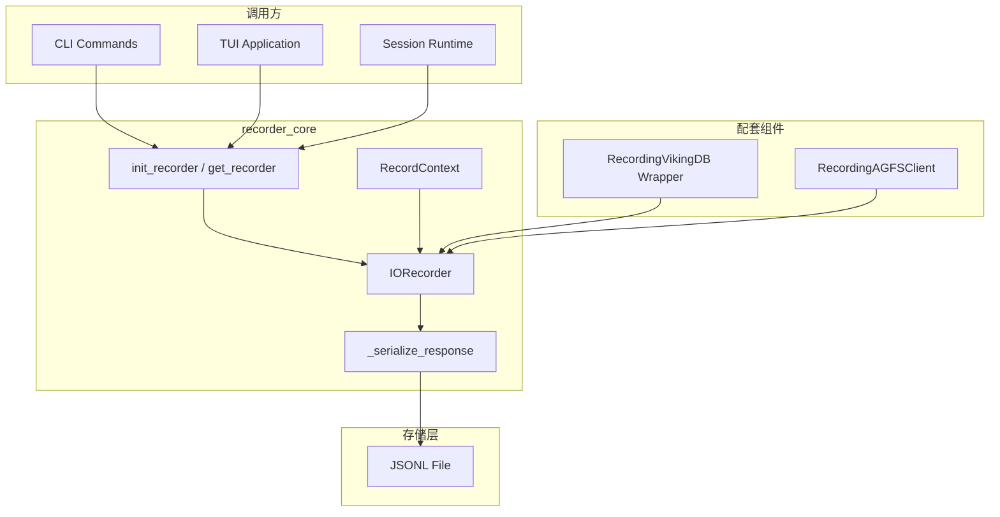

# recorder_core 模块技术深度解析

## 一、模块概述与设计意图

`recorder_core` 是 OpenViking 评估框架的核心组件，负责**记录系统运行时的输入输出操作**。如果你曾经遇到过这样的场景——想要重现某个 bug，但不确定具体是哪次 API 调用出了问题；或者想分析生产环境中的性能瓶颈，却苦于没有足够详细的日志——那么这个模块就是为了解决这类问题而设计的。

**这个模块解决的问题**：在分布式文件系统和向量数据库的交互中，操作往往是毫秒级的，失败可能源于网络抖动、服务端超时或者数据不一致。如果没有一个可靠的"黑匣子"来记录每一次操作，我们在调试和性能分析时就会陷入盲人摸象的困境。`recorder_core` 充当了这个黑匣子的角色，它以极低的性能开销记录每一次 IO 操作，包括请求参数、响应数据、执行延迟和错误信息，使得事后回放和根因分析成为可能。

**为什么不用简单的日志记录？** 普通日志的问题是信息分散、格式不统一、难以结构化查询。`recorder_core` 采用 JSONL（JSON Lines）格式，每次操作记录为一行，既保证了人类可读性，又便于程序解析和批量处理。同时，它通过上下文管理器和自动序列化机制，将技术细节抽象掉，让调用者只需要关注业务逻辑。

---

## 二、核心抽象与心智模型

理解这个模块的关键在于把握三个核心概念：**IORecorder（记录器）**、**RecordContext（记录上下文）** 和 **IOType（操作类型）**。

### 2.1 IORecorder：单例模式的全局记录器

`IORecorder` 采用**单例模式**确保整个进程只有一个记录器实例。这是有意为之的设计选择——如果允许多个实例，每个实例都可能打开不同的文件，结果就是记录分散在各处，难以汇总分析。

**想象一下**：`IORecorder` 就像是公司里的前台接待员——所有访客（IO 操作）都要经过它登记，它负责把访客信息记录到访客簿（JSONL 文件）中。无论哪个部门的人需要登记，都找同一个前台，确保记录不遗漏、不重复。

它包含几个关键配置：

- **enabled**：开关控制。默认关闭，因为记录本身有 I/O 开销，在生产环境中可能不需要。
- **records_dir**：记录文件存储目录，默认为 `./records`。
- **record_file**：具体的记录文件路径，按日期自动生成（例如 `io_recorder_20250101.jsonl`）。

```python
class IORecorder:
    _instance: Optional["IORecorder"] = None
    _lock = threading.Lock()
```

### 2.2 RecordContext：带计时的上下文管理器

`RecordContext` 是这个模块最优雅的设计之一。它使用了**上下文管理器模式**，让你不需要手动调用"开始记录"和"结束记录"。

**想象一下**：**RecordContext 就像是跑步比赛中的计时器**——你按下开始键（`__enter__`），开始跑步（执行业务逻辑），跑完后停止计时器（`__exit__`），它会自动计算出用了多长时间。

```python
with RecordContext(recorder, "fs", "read", {"uri": "viking://..."}) as ctx:
    result = fs.read(uri)
    ctx.set_response(result)
```

这个模式的精妙之处在于：

1. **自动计时**：进入上下文时记录开始时间，退出时自动计算 `latency_ms`。
2. **自动捕获异常**：如果代码块抛出异常，上下文管理器会自动将 `success` 设为 `False` 并记录错误信息。
3. **AGFS 追踪**：对于涉及底层 AGFS 调用的操作，可以逐个添加子调用记录。

这就像给每次操作配备了一个"尽职调查员"——它旁观操作的执行，自动记录所有重要信息，你只需要专注于业务逻辑。

### 2.3 IOType：操作类型枚举

系统支持两种 IO 类型的记录：

- **IOType.FS**：文件系统操作（读取、写入、列表、状态等）
- **IOType.VIKINGDB**：向量数据库操作（插入、搜索、过滤等）

这种区分的意义在于：文件系统操作和向量数据库操作有不同的性能特征和故障模式，分开记录有助于分别分析。

---

## 三、架构图与数据流



### 数据流说明

1. **初始化阶段**：调用方通过 `init_recorder(enabled=True)` 激活记录器。如果不激活，记录器会以"静默模式"运行，所有 `record_*` 方法实际上什么都不做。

2. **记录阶段**：有两条路径
   - **直接记录**：调用 `recorder.record_fs()` 或 `recorder.record_vikingdb()`
   - **上下文记录**：使用 `RecordContext`，在退出时自动完成记录

3. **序列化阶段**：所有响应数据经过 `_serialize_response()` 转换为 JSON 兼容格式。特殊类型（如 `bytes`）会被特殊处理，添加 `__bytes__` 标记以便于后续识别。

4. **持久化阶段**：记录以 JSONL 格式追加到文件。使用文件锁 `_file_lock` 保证多线程安全。

---

## 四、核心组件深度解析

### 4.1 IORecorder 类

这是模块的核心类，负责实际的记录逻辑。让我们深入它的设计决策。

#### 关键方法

| 方法 | 职责 | 返回值 |
|------|------|--------|
| `__init__` | 初始化录制器，设置存储路径 | - |
| `get_instance()` | 获取单例实例（双重检查锁定） | `IORecorder` |
| `initialize()` | 初始化或重置单例 | `IORecorder` |
| `record_fs()` | 录制文件系统操作 | - |
| `record_vikingdb()` | 录制向量数据库操作 | - |
| `get_records()` | 读取所有历史记录 | `List[IORecord]` |
| `get_stats()` | 获取统计信息 | `Dict[str, Any]` |

#### 初始化参数

```python
def __init__(
    self,
    enabled: bool = False,           # 是否启用录制
    records_dir: str = "./records",  # 存储目录
    record_file: Optional[str] = None # 指定文件路径
):
```

**注意**：`enabled=False` 是故意的默认设计。这体现了模块的设计哲学——录制是**按需启用**的能力，默认不开启以避免生产环境性能开销。

#### 录制文件命名规则

如果未指定 `record_file`，则自动生成：
```
io_recorder_{YYYYMMDD}.jsonl
```

这意味着同一天的所有操作会写入同一个文件，便于后续按日期分析。

#### 线程安全实现

`IORecorder` 使用两个锁：

```python
_lock = threading.Lock()  # 类级别锁，保护单例创建
_file_lock = threading.Lock()  # 实例级别锁，保护文件写入
```

使用**双重检查锁定（Double-Checked Locking）**模式创建单例，既保证线程安全又避免每次调用都加锁。文件写入锁则确保多个线程同时记录时不会产生文件损坏。

#### 响应序列化

`_serialize_response` 方法处理各种类型的响应：

- `None` → `null`
- `bytes` → `{"__bytes__": "解码后的字符串"}`
- `dict` → 递归序列化每个值
- `list` → 递归序列化每个元素
- 基本类型 → 直接返回
- 其他 → 转换为字符串

为什么需要这个？因为响应可能是任意类型，而 JSON 只支持有限类型。序列化逻辑试图保留尽可能多的信息，特别是对于二进制数据（文件内容、网络返回），通过 `__bytes__` 标记让后续解析知道这是编码后的二进制。

#### 统计功能

`get_stats()` 方法展示了记录的元数据价值：

```python
{
    "total_count": len(records),
    "fs_count": 0,
    "vikingdb_count": 0,
    "total_latency_ms": 0.0,
    "operations": {},  # 按 operation 类型统计
    "errors": 0
}
```

这个聚合统计对于快速定位性能热点和错误分布非常有用。

### 4.2 RecordContext 类

作为上下文管理器，它的工作流程是：

```python
def __enter__(self):
    self._start_time = datetime.now()
    return self

def __exit__(self, exc_type, exc_val, exc_tb):
    latency_ms = (datetime.now() - self._start_time).total_seconds() * 1000
    
    if exc_type is not None:  # 发生异常
        self.success = False
        self.error = str(exc_val)
    
    # 根据 io_type 选择记录方法
    if self.io_type == IOType.FS.value:
        self.recorder.record_fs(...)
    else:
        self.recorder.record_vikingdb(...)
    
    return False  # 不吞掉异常，让它继续传播
```

**关键设计**：`return False` 表示不拦截异常。这意味着调用方仍然会看到原始异常，只是记录已经完成了。这很重要——我们记录是为了分析，不是为了掩盖问题。

### 4.3 AGFS 调用追踪

`AGFSCallRecord` 用于追踪 VikingFS 操作内部可能发生的多个 AGFS 调用。这是一个嵌套记录机制：

```python
with RecordContext(recorder, "vikingdb", "search", request) as ctx:
    # 假设 search 内部调用了 AGFS
    ctx.add_agfs_call("read", {"path": "..."}, response, latency_ms)
    ctx.add_agfs_call("stat", {"path": "..."}, response, latency_ms)
    ctx.set_response(results)
```

这对于分析 VikingFS 到 AGFS 的调用链路非常有用——你可以看到一次高级操作内部发生了哪些底层文件操作。

---

## 五、依赖分析与集成模式

### 5.1 上游依赖（什么调用这个模块）

根据模块树结构，`recorder_core` 被以下模块使用：

1. **[storage_wrappers](evaluation-recording-and-storage-instrumentation-storage-wrappers.md)**：提供了 `RecordingVikingDB` 包装器，自动包装向量数据库操作
2. **CLI 和应用层**：在调试模式下启用记录
3. **评估流程**：RAGAS 评估时记录真实操作，后续用于回放测试

### 5.2 下游依赖（这个模块调用什么）

- `openviking.eval.recorder.types`：定义了 `IORecord`、`IOType`、`AGFSCallRecord` 等数据结构
- `openviking_cli.utils.logger`：获取模块级日志记录器
- 文件系统：写入 JSONL 文件

### 5.3 配套包装器

除了核心的 `IORecorder`，模块还提供了两个配套的包装器：

**RecordingVikingDB**：
```python
from openviking.eval.recorder.wrapper import RecordingVikingDB

db = RecordingVikingDB(vector_store)  # 包装已有实例
result = await db.search(...)  # 自动记录
```

**RecordingAGFSClient**：
```python
from openviking.eval.recorder import create_recording_agfs_client

client = create_recording_agfs_client(agfs_client)
result = client.ls("/")  # 自动记录
```

这两个包装器展示了**装饰器模式**的应用——它们透明地添加记录功能，不需要修改原有代码。

---

## 六、设计权衡与 Trade-offs

### 6.1 单例模式 vs 依赖注入

**选择**：单例模式

**理由**：记录器是一个横切关注点，在代码的各个位置都可能需要访问。如果采用依赖注入，每个需要记录的组件都要接受记录器作为参数，这会导致大量构造函数签名变更。单例模式虽然降低了可测试性（可以通过 `initialize` 方法注入 mock 实例来缓解），但大大简化了实际使用。

### 6.2 JSONL vs 数据库

**选择**：JSONL 格式

**理由**：
- **简单**：不需要额外依赖数据库
- **追加友好**：每次记录是独立的一行，适合高频写入
- **可读性**：人类可以直接阅读
- **回放友好**：可以逐行读取进行重放测试

**代价**：查询效率低。如果需要复杂查询（比如按时间范围聚合），需要先加载到内存或导入数据库。

### 6.3 同步写入 vs 异步写入

**选择**：同步写入（通过 `_write_record` 直接写文件）

**理由**：在当前实现中，记录是同步的。这保证了记录不会因为异步问题丢失（比如进程崩溃时异步缓冲区未刷新）。对于大多数场景，记录的 I/O 开销是可接受的。

**注意**：`RecordingAGFSClient` 内部使用了 `AsyncRecordWriter` 进行异步批量写入，这是一个优化点——批量写入减少了文件系统调用次数。

### 6.4 延迟记录 vs 提前记录

**选择**：延迟记录（上下文退出时才写入）

**理由**：只有知道操作结果（成功/失败、响应数据、延迟时间）后，记录才有意义。提前记录需要维护状态，而且在异常情况下可能导致不完整的记录。

---

## 七、使用指南与最佳实践

### 7.1 基本用法

**方式一：手动记录**

```python
from openviking.eval.recorder import init_recorder, get_recorder

# 初始化（通常在应用启动时）
init_recorder(enabled=True, records_dir="./debug_records")

# 获取记录器
recorder = get_recorder()

# 记录文件系统操作
recorder.record_fs(
    operation="read",
    request={"uri": "viking://data/file.txt"},
    response={"content": "..."},
    latency_ms=15.3,
    success=True
)

# 记录向量数据库操作
recorder.record_vikingdb(
    operation="search",
    request={"collection": "docs", "top_k": 10},
    response=[...],
    latency_ms=45.2,
    success=True
)
```

**方式二：使用上下文管理器**

```python
recorder = get_recorder()

with RecordContext(recorder, "fs", "read", {"uri": "viking://..."}) as ctx:
    result = read_file(uri)
    ctx.set_response(result)
    # 或者在 VikingFS 操作中添加 AGFS 调用追踪
    for call in agfs_calls:
        ctx.add_agfs_call(call.operation, call.request, call.response, call.latency_ms)
# 退出时自动记录
```

### 7.2 使用包装器

```python
from openviking.eval.recorder import init_recorder
from openviking.eval.recorder.wrapper import RecordingVikingDB
from openviking.storage.vectordb_adapters import VikingDBPrivateCollectionAdapter

# 初始化
init_recorder(enabled=True)

# 创建并包装向量数据库
adapter = VikingDBPrivateCollectionAdapter(...)
recording_adapter = RecordingVikingDB(adapter)

# 使用
results = await recording_adapter.search(collection="docs", vector=[...], top_k=10)
# 自动记录
```

### 7.3 分析记录数据

```python
from openviking.eval.recorder import get_recorder

recorder = get_recorder()

# 获取统计信息
stats = recorder.get_stats()
print(f"总操作数: {stats['total_count']}")
print(f"文件系统操作: {stats['fs_count']}")
print(f"向量数据库操作: {stats['vikingdb_count']}")
print(f"总延迟: {stats['total_latency_ms']:.2f}ms")
print(f"错误数: {stats['errors']}")

# 查看详细记录
records = recorder.get_records()
for r in records:
    print(f"{r.timestamp} {r.io_type}.{r.operation} {r.latency_ms:.2f}ms")
```

---

## 八、边界情况与注意事项

### 8.1 记录未启用时的行为

当 `enabled=False`（默认值），所有记录方法都是空操作：

```python
def _write_record(self, record: IORecord) -> None:
    if not self.enabled:
        return  # 直接返回，不写入
```

这意味着即使在生产环境中保持记录启用，也不会影响正常流程，只是会写入一些"无用"的记录。**建议**：在生产环境使用 `enabled=False`，只在调试或评估时启用。

### 8.2 大响应数据的序列化

`_serialize_response` 会尝试序列化任意对象，但有以下限制：

- 大型二进制数据会占用大量磁盘空间
- 不可序列化的对象会被转换为字符串，可能丢失结构信息
- 循环引用的对象会导致栈溢出

**建议**：如果响应数据很大，考虑只记录元数据（如大小、摘要），而不是完整内容。

### 8.3 多线程环境

记录器使用了两个锁：

- `cls._lock`：保护单例创建
- `self._file_lock`：保护文件写入

这意味着多线程记录是安全的，但高频记录场景下可能成为瓶颈。如果需要更高的吞吐量，考虑使用异步批量写入（参考 `RecordingAGFSClient` 的实现）。

### 8.4 文件权限和磁盘空间

- 记录目录和文件需要有写入权限
- 长时间运行的应用会产生大量记录文件，需要定期清理
- 建议配置日志轮转策略

### 8.5 异常处理与记录的关系

`RecordContext.__exit__` 返回 `False`，这意味着异常会被**重新抛出**：

```python
def __exit__(self, exc_type, exc_val, exc_tb):
    # ... 记录完成后 ...
    return False  # 不阻止异常传播
```

这是正确的设计——记录是为了调试，不是为了掩盖问题。调用方应该自行处理异常。

### 8.6 敏感数据处理

请求和响应可能包含敏感信息（如用户数据、密钥等），需要注意：

- 存储和传输记录文件时注意安全
- 可以在序列化前对敏感字段进行脱敏处理
- 生产环境建议关闭录制功能

---

## 九、扩展点与定制

### 9.1 自定义序列化

如果默认的 `_serialize_response` 不满足需求，可以：

1. 继承 `IORecorder` 并重写 `_serialize_response`
2. 在包装器层面处理序列化逻辑

### 9.2 添加新的 IO 类型

如果要记录其他类型的操作（如 HTTP API 调用）：

1. 在 `IOType` 枚举中添加新类型
2. 添加对应的 `record_*` 方法
3. 更新 `RecordContext.__exit__` 中的分支逻辑

### 9.3 批量和异步写入

当前 `IORecorder` 是同步写入。对于超高频场景，可以参考 `RecordingAGFSClient` 中的 `AsyncRecordWriter` 实现。

---

## 十、相关文档链接

- **[recording_types](evaluation-recording-and-storage-instrumentation-recording-types.md)**：数据类型定义（IORecord、IOType、AGFSCallRecord）
- **[storage_wrappers](evaluation-recording-and-storage-instrumentation-storage-wrappers.md)**：VikingDB 和 AGFS 的记录包装器
- **[ragas_config_and_evaluator](ragas-evaluation-core-ragas-config-and-evaluator.md)**：评估框架如何利用记录进行回放测试

---

*文档版本：1.0*  
*最后更新：2025年1月*