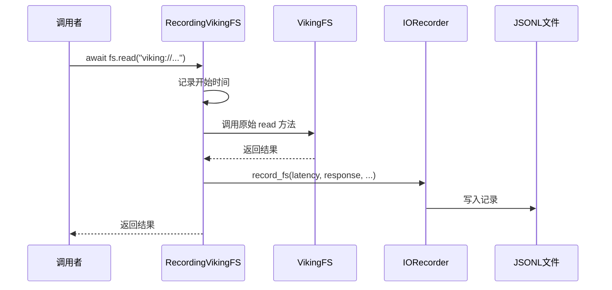
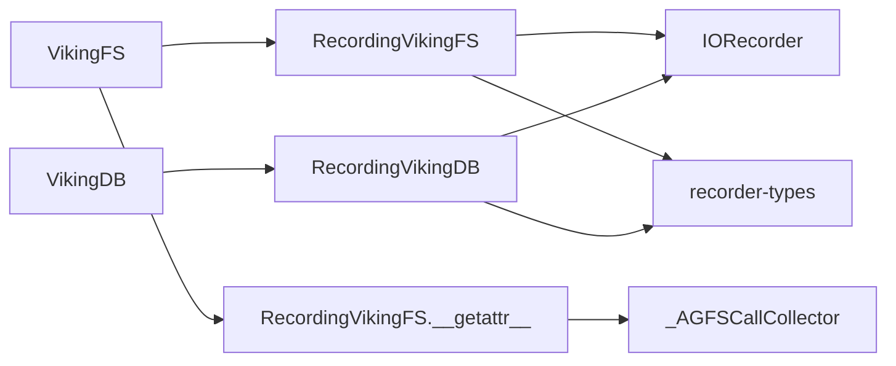

# recorder-wrappers

## 概述

`recorder-wrappers` 提供了两个包装器类——`RecordingVikingFS` 和 `RecordingVikingDB`。它们的核心职责是：**在不改写原有类的情况下，透明地拦截所有方法调用，并自动记录操作**。

这是整个模块最巧妙的设计——它利用 Python 的动态特性，实现了非侵入式的观测能力。

---

## 设计理念：代理模式 + 魔法方法

### 为什么不直接修改原类？

想象一下：如果要让 VikingFS 支持录制，你可能会直接在 `VikingFS.read()` 方法里添加录制代码。但这意味着：
1. 需要修改 VikingFS 的源代码
2. 每次 VikingFS 更新，你都要同步更新录制代码
3. 如果有多个地方需要录制，你得复制粘贴

**更好的方案**：创建一个"套娃"——VikingFS 外包装一层，这层包装具有 VikingFS 的所有能力，但多了一个"记录"的功能。

---

## RecordingVikingFS

### 核心原理

使用 `__getattr__` 实现**动态代理**：

```python
class RecordingVikingFS:
    def __init__(self, viking_fs: Any, recorder: Optional[IORecorder] = None):
        self._fs = viking_fs
        self._recorder = recorder or get_recorder()

    def __getattr__(self, name: str) -> Any:
        original_attr = getattr(self._fs, name)
        # 如果是方法，包装它
        return wrapped_async if is_async else wrapped_sync
```

**工作流程**：



### 拦截的操作

包装器只会拦截**文件操作相关**的方法：

```python
if name not in (
    "ls", "mkdir", "stat", "rm", "mv",
    "read", "write", "grep", "glob", "tree",
    "abstract", "overview", "relations",
    "link", "unlink", "write_file", "read_file",
    "read_file_bytes", "write_file_bytes",
    "append_file", "move_file", "delete_temp",
    "write_context", "get_relations",
    "get_relations_with_content", "find", "search",
):
    return original_attr  # 非文件操作，不拦截
```

**为什么这样设计**：VikingFS 可能有很多辅助方法（如配置、内部状态管理），录制这些没有意义，反而增加噪音。

### AGFS 调用收集

这是最强大的特性——包装器能捕获 VikingFS 内部对底层 AGFS 的每次调用：

```python
collector = _AGFSCallCollector(self._fs.agfs)
self._fs.agfs = collector  # 偷梁换柱

try:
    result = await original_attr(*args, **kwargs)
    # collector.calls 现在包含了所有 AGFS 调用
    self._recorder.record_fs(..., agfs_calls=collector.calls)
finally:
    self._fs.agfs = self._original_agfs  # 恢复原状
```

#### _AGFSCallCollector

这个辅助类使用相同的代理模式，包装原始 AGFS 客户端，收集所有调用：

```python
class _AGFSCallCollector:
    def __init__(self, agfs_client: Any):
        self._agfs = agfs_client
        self.calls: List[AGFSCallRecord] = []

    def __getattr__(self, name: str):
        original_attr = getattr(self._agfs, name)
        
        def wrapped(*args, **kwargs):
            # 记录调用
            call = AGFSCallRecord(...)
            self.calls.append(call)
            return original_attr(*args, **kwargs)
        
        return wrapped
```

---

## RecordingVikingDB

### 核心原理

`RecordingVikingDB` 采用**显式方法包装**而非 `__getattr__`：

```python
class RecordingVikingDB:
    async def search(self, collection: str, vector: List[float], ...):
        request = {"collection": collection, "vector": vector, ...}
        start_time = time.time()
        try:
            result = await self._db.search(...)
            self._record("search", request, result, latency_ms)
            return result
        except Exception as e:
            self._record("search", request, None, latency_ms, False, str(e))
            raise
```

**为什么与 RecordingVikingFS 不同**：
- VikingDB 的方法签名更规范，接口更稳定
- 显式包装可以提供更好的类型提示和 IDE 支持
- VikingDB 操作不需要收集子调用（没有 AGFS 那样复杂的内部调用链）

### 支持的操作

| 操作 | 方法 |
|------|------|
| 插入 | `insert()` |
| 更新 | `update()` |
| 插入或更新 | `upsert()` |
| 删除 | `delete()` |
| 获取 | `get()` |
| 存在检查 | `exists()` |
| 向量搜索 | `search()` |
| 标量过滤 | `filter()` |
| 创建集合 | `create_collection()` |
| 删除集合 | `drop_collection()` |
| 集合存在检查 | `collection_exists()` |

---

## 使用示例

### 基本用法

```python
from openviking.eval.recorder import init_recorder
from openviking.eval.recorder.wrapper import RecordingVikingFS

# 1. 初始化录制器
init_recorder(enabled=True)

# 2. 包装 VikingFS
recording_fs = RecordingVikingFS(viking_fs)

# 3. 正常使用，所有操作都会被录制
content = await recording_fs.read("viking://docs/readme.md")
files = await recording_fs.ls("viking://projects/")
```

### 包装 VikingDB

```python
from openviking.eval.recorder.wrapper import RecordingVikingDB

# 包装向量数据库
recording_db = RecordingVikingDB(vector_store)

# 搜索会被录制
results = await recording_db.search(
    collection="docs",
    vector=[0.1, 0.2, ...],
    top_k=10
)
```

---

## 设计权衡

### 权衡 1：RecordingVikingFS 用 `__getattr__` vs 显式方法

**选择**：`__getattr__` 动态代理

**优点**：
- 不需要为每个方法写样板代码
- 自动覆盖未来新增的方法
- 代码量少

**缺点**：
- 难以静态类型检查
- IDE 提示不完整
- 性能略差（每次调用都走一遍拦截逻辑）

**为什么适合**：VikingFS 的接口在快速迭代，动态代理确保新方法自动获得录制能力。

---

### 权衡 2：为什么需要 _AGFSCallCollector？

**设计**：用一个"假的"AGFS 客户端替换原有的，收集完调用后再恢复。

**另一种方案**：修改 VikingFS 代码，在每个 AGFS 调用处添加录制逻辑。

**为什么当前方案更好**：
- 无需修改 VikingFS 代码
- 录制逻辑与业务逻辑完全解耦
- 收集逻辑是自动的，不需要 VikingFS 感知

**潜在风险**：如果 AGFS 客户端有副作用（如连接池），替换可能有问题。当前实现使用 `finally` 确保恢复，风险可控。

---

### 权衡 3：同步 vs 异步处理

**观察**：包装器同时支持同步和异步方法

```python
if inspect.iscoroutinefunction(original_attr):
    return wrapped_async
return wrapped_sync
```

**为什么都需要**：VikingFS 可能在不同场景使用同步或异步接口，包装器需要兼容。

---

## 注意事项

### 1. 包装器是"一次性"的

```python
# 错误示例：每次都创建新包装器
def process_file(fs, uri):
    recording_fs = RecordingVikingFS(fs)  # 每次创建新实例
    return await recording_fs.read(uri)
```

**正确做法**：在应用初始化时创建一次，复用包装器实例。

### 2. 恢复原始 AGFS 的时机

包装器在 `finally` 块中恢复原始 AGFS，确保即使发生异常也不会影响后续操作：

```python
try:
    result = await original_attr(*args, **kwargs)
    ...
finally:
    self._fs.agfs = self._original_agfs  # 确保恢复
```

### 3. 性能影响

包装器会为每次调用增加：
- 方法调用的间接层
- JSON 序列化开销
- 文件写入开销（如果启用）

在评估场景下这是可接受的，但在高性能要求的生产路径上应避免使用。

---

## 依赖关系



- 两个包装器都依赖 `IORecorder` 写入记录
- 都依赖 `recorder-types` 中的数据类型定义
- `_AGFSCallCollector` 被 `RecordingVikingFS` 用于收集子调用