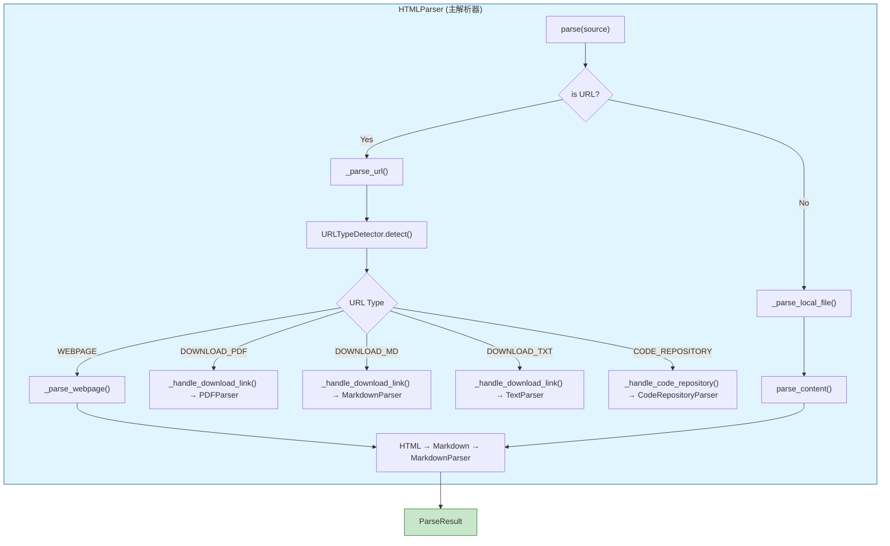

# resource-and-document-taxonomy-html-parser

> HTML 与 URL 解析模块 — 统一处理本地 HTML 文件、网页内容和下载链接

## 概述

在 OpenViking 的文档处理流水线中，**`resource_and_document_taxonomy_html_parser`** 模块承担着一个看似简单实则复杂的任务：将各种形式的 HTML 内容（本地文件、网页 URL、可下载文件、代码仓库）转换为统一的 `ParseResult` 结构。这个模块的核心价值在于**屏蔽了输入源的异构性**——调用方只需要传入一个路径或 URL，无需关心背后是本地文件、远程网页还是需要下载的 PDF。

为什么这需要专门设计？想象一个场景：用户可能传入 `https://github.com/user/repo`（代码仓库）、`https://example.com/docs.pdf`（PDF 下载链接）、或 `https://example.com/article.html`（普通网页）。如果每个调用方都要写一堆 if-else 来判断类型、选择处理方式，代码会迅速腐化。这个模块把这种复杂性**封装**起来，对外呈现为统一的解析接口。

---

## 架构概览



这个架构的核心思路是**分而治之**：HTMLParser 作为统一入口，根据输入类型分发给不同的处理路径，最终都汇聚到 MarkdownParser 完成文档结构的提取。

---

## 核心组件

### 1. URLType — URL 内容类型枚举

```python
class URLType(Enum):
    WEBPAGE = "webpage"           # 普通网页
    DOWNLOAD_PDF = "download_pdf" # PDF 下载
    DOWNLOAD_MD = "download_md"   # Markdown 下载
    DOWNLOAD_TXT = "download_txt" # 纯文本下载
    DOWNLOAD_HTML = "download_html" # HTML 文件下载
    CODE_REPOSITORY = "code_repository" # 代码仓库
    UNKNOWN = "unknown"           # 未知类型
```

这个枚举定义了模块能处理的所有 URL 类型。设计时采用**穷举式枚举**而非布尔标志，优点是类型安全、易于扩展，代价是每新增一种类型需要修改枚举和对应的处理分支。对于当前的应用场景（6-7 种类型），这是合理的设计选择。

### 2. URLTypeDetector — URL 类型检测器

这是模块中最具**策略性**的组件。它的任务是仅通过 URL 字符串（和一次 HTTP HEAD 请求）判断远程资源的类型。

**检测策略采用三级过滤：**

1. **代码仓库优先检查**：最先检查是否是代码仓库 URL。因为代码仓库 URL（如 `github.com/user/repo`）看起来像普通网页，需要优先识别，避免后续误判。

2. **扩展名检查**：检查 URL 路径后缀（`.pdf`、`.md`、`.html` 等），这是最 cheap 的判断，成本为 O(1)。如果命中，直接返回，避免网络请求。

3. **HTTP HEAD 探测**：如果扩展名不明确，发起 HEAD 请求检查 `Content-Type` header。这种方式比 GET 更轻量（不下载 body），但仍需一次网络往返。

**设计洞察**：为什么不用 GET 而是用 HEAD？因为我们只需要 Content-Type，不需要 body。HEAD 响应更快、资源消耗更低。但这里有个隐含假设：服务器正确实现了 HEAD 方法。大多数主流 CDN 和文件托管服务都支持，但自托管服务可能不遵守这一点。

**与配置的耦合**：URLTypeDetector 内部调用 `get_openviking_config()` 读取 `html.github_domains` 和 `code.github_domains`，合并后用于构建正则表达式匹配模式。这意味着模块的行为**受全局配置影响**——如果用户在配置文件中添加了自定义的 GitHub 镜像域名，检测器会自动适配。这种设计提高了灵活性，但也意味着测试时需要 mock 配置。

```python
def _is_code_repository_url(self, url: str) -> bool:
    # 动态从配置构建匹配模式
    config = get_openviking_config()
    github_domains = list(set(config.html.github_domains + config.code.github_domains))
    # 为每个域名构建正则表达式...
```

这种设计允许企业用户使用私有 GitLab 实例，而无需修改代码。

### 3. HTMLParser — 主解析器

继承自 `BaseParser`，实现了统一的异步解析接口。这是整个模块的门面，调用方只与它交互。

**初始化参数**：
- `timeout`：HTTP 请求超时时间，默认 30 秒。对于大型网页或慢速服务器，这个值可能需要调整。
- `user_agent`：发送请求时使用的 User-Agent 头。默认使用真实的浏览器 User-Agent（Chrome on macOS），这是为了**规避反爬虫机制**——很多网站会根据 User-Agent 决定是否返回完整内容。

**核心方法 `parse()`**：
```python
async def parse(self, source: Union[str, Path], instruction: str = "", **kwargs) -> ParseResult
```

这个方法是**同步入口**，内部根据 source 是 URL 还是本地路径分发给 `_parse_url()` 或 `_parse_local_file()`。设计者选择让 `parse()` 是 async 的，但内部根据输入类型有两条完全不同的代码路径——这是典型的**外观模式**，隐藏了实现复杂性。

**网页解析的三阶段转换**：
```
HTML → readabilipy (提取正文) → Markdown → MarkdownParser → ParseResult
```

这个pipeline的设计灵感来自 Anthropic 的文档处理方法。核心思路是：
1. **readabilipy**：基于 Mozilla Readability 算法，从混乱的网页中提取"有意义的内容"，过滤掉导航栏、广告、页脚等噪声
2. **markdownify**：将净化的 HTML 转换为 Markdown——这是关键的一步，因为下游的 MarkdownParser 已经非常成熟，能正确处理标题层级、代码块、表格等结构
3. **MarkdownParser**：利用已有的 Markdown 解析能力生成文档树

**为什么绕一圈而不是直接解析 HTML？** 直接解析 HTML 的问题是：HTML 的语义结构（div、span、section）与文档结构（标题、段落、列表）往往不一致。转换成 Markdown 是**一种降级**，但这种降级反而让结构提取更可靠。MarkdownParser 处理的是结构化文本，比处理原始 HTML DOM 更容易。

---

## 数据流分析

### 场景一：解析本地 HTML 文件

```
parse("local/page.html")
  → _parse_local_file()
    → _read_file() 读取文件内容
    → parse_content(content)
      → _html_to_markdown() 转换为 Markdown
      → MarkdownParser.parse_content() 生成 ParseResult
```

这里的关键是**本地文件也走 Markdown 转换**，确保与网页处理一致。不会因为输入是文件还是 URL 导致输出结构不同。

### 场景二：解析远程网页

```
parse("https://blog.example.com/article")
  → _parse_url()
    → URLTypeDetector.detect() → WEBPAGE
    → _parse_webpage()
      → _fetch_html() 获取 HTML
      → _html_to_markdown() 转换
      → MarkdownParser.parse_content()
```

### 场景三：解析 PDF 下载链接

```
parse("https://docs.example.com/manual.pdf")
  → _parse_url()
    → URLTypeDetector.detect() → DOWNLOAD_PDF
    → _handle_download_link(url, "pdf")
      → _download_file() 下载到临时文件
      → PDFParser.parse() 委托给 PDF 解析器
      → 清理临时文件
```

这里体现了**委托模式**：HTMLParser 不自己解析 PDF，而是下载后委托给 `PDFParser`。这样做的好处是职责分离——HTMLParser 只需要知道"这是个下载链接"，具体解析逻辑由专业 parser 负责。

---

## 设计决策与权衡

### 决策一：HTML → Markdown → ParseResult 的转换pipeline

**选择**：不直接解析 HTML DOM，而是先转换成 Markdown。

**权衡分析**：
- **优点**：复用现有的 MarkdownParser，代码量少；Markdown 的结构化程度高，解析更可靠；便于调试（中间产物是文本）
- **缺点**：转换有信息损失（比如 HTML 的 class 和 id 属性会丢失）；增加了一次转换的计算开销

对于 OpenViking 的场景（提取文档结构和文本内容），这个选择是合理的。如果需要保留原始 HTML 的所有语义（例如提取所有链接关系），这个方案就不合适了。

### 决策二：URL 类型检测使用 HTTP HEAD 而非直接获取

**选择**：先用 HEAD 探测类型，再决定后续处理。

**权衡分析**：
- **优点**：HEAD 比 GET 轻量，不需要下载整个 body；对于大文件（PDF）尤其有价值
- **缺点**：部分服务器不支持 HEAD（或行为不一致）；增加了一次网络往返；对于小文件可能比直接 GET 还慢

这个决策隐含了一个假设：**网络请求的成本主要在 body 传输，而非连接建立**。在大多数情况下这个假设成立，但如果目标服务器网络延迟很高（>500ms），两次请求（HEAD + 实际请求）可能成为瓶颈。

### 决策三：临时文件清理在 finally 块

```python
finally:
    if temp_path:
        try:
            p = Path(temp_path)
            if p.exists():
                p.unlink()
        except Exception:
            pass
```

**选择**：使用 try-finally 确保临时文件被清理，即使解析失败。

**权衡分析**：
- **优点**：防止磁盘空间泄漏
- **缺点**：静默吞掉了异常（`pass`）——如果删除失败，调用方不会知道

在生产环境中，如果频繁出现临时文件清理失败，可能表明文件系统权限问题或并发冲突。这个设计选择优先保证**不阻塞主流程**（解析成功），代价是隐藏了清理失败的诊断信息。

### 决策四：依赖全局配置确定代码仓库域名

```python
config = get_openviking_config()
github_domains = list(set(config.html.github_domains + config.code.github_domains))
```

**选择**：代码仓库 URL 的判断逻辑依赖于运行时配置，而非硬编码。

**权衡分析**：
- **优点**：用户可以配置私有 GitHub Enterprise / GitLab Self-hosted 域名
- **缺点**：测试更复杂（需要 mock 配置）；配置错误会导致检测失败

这个设计符合 OpenViking 作为企业级产品的定位——允许客户使用自己的代码托管平台。但对于开源版或简单场景的用户，可能增加了不必要的复杂性。

---

## 依赖关系

### 上游依赖（被谁调用）

- **Parser 注册与调度系统**：`openviking.parse.registry` 根据文件扩展名（`.html`、`.htm`）或 URL 前缀（`http://`、`https://`）选择 HTMLParser
- **直接调用**：用户代码可能直接实例化 `HTMLParser` 并调用 `parse()`

### 下游依赖（调用什么）

| 依赖组件 | 用途 |
|---------|------|
| `MarkdownParser` | 将 HTML 转换后的 Markdown 解析为文档树 |
| `PDFParser` | 处理 PDF 下载链接 |
| `TextParser` | 处理纯文本下载 |
| `CodeRepositoryParser` | 处理代码仓库 URL |
| `readabilipy.simple_json` | HTML 净化的核心算法 |
| `markdownify` | HTML → Markdown 转换 |
| `httpx` | HTTP 客户端（网络请求） |
| `BeautifulSoup` | HTML 预处理（微信文章特殊处理） |

**延迟导入的设计考量**：模块使用了大量的延迟导入（如 `from openviking.parse.base import lazy_import`）。这不是随意为之，而是经过深思熟虑的选择：

- **可选依赖**：不是所有用户都需要处理 HTML——只处理本地 Markdown 文件的用户不应该被迫安装 `readabilipy`、`markdownify`、`httpx` 等包
- **启动性能**：延迟导入将这些"重量级"依赖的加载推迟到实际使用时，减少 CLI 的冷启动时间
- **依赖诊断**：当用户尝试解析 HTML 但缺少依赖时，延迟导入允许模块给出清晰的错误信息和安装指引

### 数据契约

**输入**：`source` 参数可以是：
- 本地文件路径：`/path/to/file.html`
- HTTP URL：`https://example.com/page.html`
- HTTPS URL：`https://example.com/docs.pdf`

**输出**：`ParseResult` 对象，包含：
- `root`：文档树的根节点（`ResourceNode`）
- `source_format`：`"html"`
- `parser_name`：`"HTMLParser"`
- `parse_time`：解析耗时（秒）
- `meta`：包含检测元数据（`url_type`、`detected_by`、`content_type` 等）

---

## 边缘情况与陷阱

### 1. 网络超时导致的静默降级

当 URL 检测或抓取失败时，模块不会抛出异常，而是**返回一个包含警告的 ParseResult**：

```python
warnings=[f"Failed to fetch webpage: {e}"]
```

调用方需要检查 `result.warnings` 或 `result.success` 属性来判断是否真正成功。默认行为是**fail-open**——即使部分失败也返回结果，这对用户体验可能更好（至少能看到尝试的结果），但也可能掩盖问题。

### 2. 临时文件未清理的隐患

在 `_handle_download_link()` 中，临时文件在 `finally` 块中删除。但如果进程被 SIGKILL 终止、或解析过程中发生段错误，临时文件会残留。对于长时间运行的解析服务，这可能导致磁盘空间逐渐耗尽。

**建议**：配置日志监控 `/tmp` 目录使用情况，或实现定期清理的 cron job。

### 3. User-Agent 伪装的可维护性问题

代码中硬编码了 Chrome 的 User-Agent：

```python
DEFAULT_USER_AGENT = (
    "Mozilla/5.0 (Macintosh; Intel Mac OS X 10_15_7) "
    "AppleWebKit/537.36 (KHTML, like Gecko) "
    "Chrome/120.0.0.0 Safari/537.36"
)
```

这个值是"凝固"的。如果 Chrome 版本更新（当前是 120），这个值会逐渐过时。可能被反爬虫系统识别为伪造。

**改进建议**：从配置或外部文件读取 User-Agent，或实现定期更新机制。

### 4. 微信公众平台文章的特殊处理

代码中有一段针对微信公众平台的特殊处理：

```python
def _preprocess_html(self, html: str) -> str:
    soup = BeautifulSoup(html, "html.parser")
    js_content = soup.find(id="js_content")
    if js_content:
        if js_content.get("style"):
            del js_content["style"]
        # Handle lazy loading images
        for img in js_content.find_all("img"):
            if img.get("data-src") and not img.get("src"):
                img["src"] = img["data-src"]
        return str(js_content)
    return html
```

这段代码的存在说明模块需要**处理中国特色网站的 HTML 结构**。代价是代码中出现了特定平台的耦合逻辑。随着时间推移，可能需要更多类似的山寨处理。

### 5. GitHub Blob URL 到 Raw URL 的转换

```python
def _convert_to_raw_url(self, url: str) -> str:
    # github.com/user/repo/blob/main/file.txt → raw.githubusercontent.com/user/repo/main/file.txt
```

这个转换逻辑仅处理了 GitHub 和 GitLab 的标准模式。如果用户配置了自定义域名或使用了其他代码托管平台，这个转换可能失效。

---

## 扩展与定制

### 添加新的 URL 类型

假设需要支持 Word 文档下载（`.docx`）：

1. 在 `URLType` 枚举中添加 `DOWNLOAD_DOCX = "download_docx"`
2. 在 `URLTypeDetector.EXTENSION_MAP` 中添加 `.docx` 映射
3. 在 `URLTypeDetector.CONTENT_TYPE_MAP` 中添加 `application/vnd.openxmlformats-officedocument.wordprocessingml.document` 映射
4. 在 `HTMLParser._parse_url()` 中添加对应分支
5. 导入 `DocxParser` 并委托处理

这种扩展方式符合开闭原则——不修改已有逻辑，只是添加新的分支。

### 替换 HTML → Markdown 的转换引擎

如果需要使用其他转换工具（如 `html2text`、`tidy`），只需要修改 `_html_to_markdown()` 方法的实现。调用方（`_parse_webpage()`、`parse_content()`）不需要任何变化。

### 自定义 User-Agent 和超时

```python
from openviking.parse.parsers.html import HTMLParser

# 使用自定义配置
parser = HTMLParser(
    timeout=60.0,  # 60秒超时，适用于慢速网络
    user_agent="MyBot/1.0 (+https://example.com/bot)"
)

# 处理本地文件
result = await parser.parse("/path/to/file.html")

# 处理 URL
result = await parser.parse("https://example.com/page")
```

### 处理 HTML 内容字符串

如果已经有 HTML 内容，不需要先写入文件：

```python
from openviking.parse.parsers.html import HTMLParser

parser = HTMLParser()
html_content = """
<html>
<head><title>Example</title></head>
<body>
    <h1>Main Title</h1>
    <p>First paragraph with some content.</p>
    <h2>Subsection</h2>
    <p>More content here.</p>
</body>
</html>
"""

result = await parser.parse_content(
    html_content,
    source_path="example.html",
    instruction="Extract the main content structure"
)
```

### 检查解析结果的元数据

URL 类型检测会将诊断信息记录在 `result.meta` 中：

```python
result = await parser.parse("https://example.com/document.pdf")

# 查看检测结果
print(result.meta.get("url_type"))        # "download_pdf"
print(result.meta.get("detected_by"))       # "extension"
print(result.meta.get("extension"))         # ".pdf"
print(result.meta.get("downloaded_from"))   # "https://example.com/document.pdf"

# 检查是否有警告
if result.warnings:
    for warning in result.warnings:
        print(f"Warning: {warning}")

---

## Mental Model：心智模型与核心抽象

理解这个模块的关键是把握它的**网关/路由器**角色定位。想象一个医院的分诊台：护士（HTMLParser）根据患者（输入资源）的症状（URL 类型），将其分配到不同的专科科室（专业解析器）。护士不负责做手术，但她知道什么症状应该看什么科。

这个心智模型帮助理解几个设计要点：

1. **委托优于自建**：HTMLParser 不执着于自己完成所有解析工作，而是将下载的 PDF 委托给 PDFParser、代码仓库委托给 CodeRepositoryParser。这不是能力不足，而是专注。
2. **类型系统是决策基础**：`URLType` 枚举就像分诊台的分诊手册，定义了所有可能的"症状"类型及其对应的处理路径。
3. **配置影响行为**：URLTypeDetector 读取 `get_openviking_config()` 的配置来决定哪些域名算"代码仓库"，这就像分诊手册可以根据医院政策调整。

---

## 依赖分析与数据契约

### 上游依赖（调用本模块的组件）

- **ParserRegistry**（`openviking/parse/registry.py`）：这是最核心的调用方，它将 HTMLParser 注册为 `.html` 和 `.htm` 文件的默认解析器。当系统需要解析 HTML 文件时，Registry 会根据文件扩展名选择 HTMLParser 进行处理。
- **资源检测模块**（resource_detector）：在扫描文件系统时，如果遇到 HTML 文件，会通过 Registry 调用本模块。
- **用户直接调用**：开发者也可以直接实例化 HTMLParser 并调用其 `parse()` 方法。

### 下游依赖（本模块调用的组件）

本模块的外部依赖体现了其"网关"特性：

| 依赖组件 | 职责 | 说明 |
|---------|------|------|
| `openviking.parse.base` | 基础类型 | 提供 `ResourceNode`、`ParseResult`、`NodeType` 等核心数据结构 |
| `MarkdownParser` | 文档结构化 | 将 Markdown 内容转换为文档树 |
| `PDFParser` | PDF 处理 | 处理 PDF 下载链接 |
| `TextParser` | 文本处理 | 处理纯文本下载 |
| `CodeRepositoryParser` | 代码仓库 | 处理代码仓库 URL |
| `httpx` | HTTP 客户端 | 异步网络请求 |
| `readabilipy` | 内容提取 | 基于 Mozilla Readability 的文章提取 |
| `markdownify` | 格式转换 | HTML 到 Markdown 转换 |
| `BeautifulSoup` | HTML 预处理 | 处理微信公众号等特殊场景 |

### 数据契约

本模块与上下游的数据契约体现在 `ParseResult` 结构中。对于 URL 类型的输入，`meta` 字段包含丰富的诊断信息：

- `url_type`: URL 类型（如 "webpage"、"download_pdf"）
- `detected_by`: 检测方式（"extension"、"content_type"、"code_repository_pattern"）
- `downloaded_from`: 下载源 URL（对于下载链接）
- `intermediate_markdown`: Markdown 转换预览（用于调试）

---

## 设计决策与权衡深度分析

### 权衡一：委托模式 vs 自我实现

**选择**：HTMLParser 不自己完成所有解析工作，而是将下载的 PDF、Markdown 等委托给专业解析器。

**分析**：这是软件工程中"单一职责原则"的体现。HTML 处理和网络获取是 HTMLParser 的专长，但 PDF 解析、代码仓库分析是各自专业领域的复杂问题。强行在 HTMLParser 中实现这些功能会导致类膨胀和职责混乱。

**代价**：委托模式引入了组件间的耦合——如果被委托的解析器接口发生变化，HTMLParser 也需要相应修改。但在当前架构中，所有解析器都实现统一的 `BaseParser` 接口，这种耦合是可控的。

### 权衡二：两阶段 URL 类型检测

**选择**：URLTypeDetector 先检查扩展名，再发送 HTTP HEAD 请求。

**分析**：这是一个经典的性能 vs 准确性权衡。扩展名检测是纯本地操作，没有任何延迟，可以立即处理 `https://example.com/doc.pdf` 这样的明确类型。但扩展名检测有局限性——`https://example.com/file` 这样的 URL 根本无法判断。HTTP HEAD 请求可以获取服务器的 Content-Type 头，但增加了网络延迟。

**代价**：对于需要认证的 URL、响应慢的服务器、超时等情况，代码有相应的异常处理。如果网络完全不可用，检测会回退到默认的 `WEBPAGE` 类型。

### 权衡三：HTML → Markdown → 结构化的转换管道

**选择**：不直接解析 HTML 为文档树，而是先转换为 Markdown，再复用 MarkdownParser。

**分析**：这是"利用现有组件"策略的体现。Markdown 解析器已经实现了完善的标题层级识别、代码块提取、表格处理等功能。如果 HTMLParser 自己实现这些逻辑，会与 MarkdownParser 大量重复。

**代价**：转换过程中可能丢失一些 HTML 特有的语义（如复杂的表格布局、动态加载的内容）。但对于"提取文章主要内容"这个目标而言，基于 Readability 的提取算法已经足够好用。

### 权衡四：微信公众号特殊处理

**选择**：在 `_preprocess_html()` 中特别处理微信公众号文章的 `js_content` 隐藏内容。

**分析**：微信公众号的文章内容默认是隐藏的（通过 `style="display: none"`），直接解析会得到空内容。中国的开发者社区经常需要处理这类内容，这是一个务实的"特例处理"。

**代价**：代码需要对中国互联网生态的特定模式有认知，可能导致后续需要更多类似的山寨处理。

---

## 边缘情况与陷阱

### 1. 网络超时与重定向

代码设置了 `timeout=30.0` 作为默认超时，并通过 `follow_redirects=True` 自动处理重定向。但需要注意：
- 某些网站会阻止自动化请求，User-Agent 虽然设置为常见浏览器，但可能仍被检测
- 大量重定向可能导致超时，建议在生产环境中监控这类情况
- HEAD 请求可能不被某些服务器支持，会降级为 GET 请求

### 2. 临时文件管理

`_handle_download_link()` 使用 `tempfile.NamedTemporaryFile` 创建临时文件，并在 `finally` 块中尝试删除。但如果解析过程崩溃或被中断，临时文件可能残留。生产环境应该配置定时清理任务来清理这些文件。

### 3. 大文件处理

对于下载链接，代码没有限制文件大小。处理大型 PDF 或视频文件时可能耗尽内存或导致长时间阻塞。如果需要处理大文件，应该添加大小限制和流式下载逻辑。

### 4. 编码问题

HTML 内容可能包含各种字符编码（UTF-8、GB2312、GBK 等，特别是处理中文网页时）。`httpx` 默认尝试自动检测编码，但某些情况下可能需要手动指定。

### 5. HTTPS 证书

代码使用 `httpx` 默认配置，不验证 SSL 证书。这对于公开网页是合适的，但如果需要处理内部资源或增强安全性，应该配置 `verify=True`。

### 6. URL 重定向后的类型检测失效

`URLTypeDetector.detect()` 发送 HEAD 请求时会自动跟随重定向（`follow_redirects=True`），但这可能导致类型检测失效。例如，一个原本指向 PDF 的 URL 经过多次重定向后，最终可能指向一个 HTML 页面，而检测器只会看到最终响应的 Content-Type。在当前实现中，这是预期的行为——最终是什么类型就按什么类型处理。

### 7. 路径安全与文件命名

模块使用 `_sanitize_for_path()` 方法将标题转换为安全的文件名：

```python
def _sanitize_for_path(self, text: str, max_length: int = 50) -> str:
    safe = re.sub(
        r"[^\w\u4e00-\u9fff\u3040-\u309f\u30a0-\u30ff\uac00-\ud7af\u3400-\u4dbf\U00020000-\U0002a6df\s-]",
        "",
        text,
    )
    safe = re.sub(r"\s+", "_", safe)
    if len(safe) > max_length:
        hash_suffix = hashlib.sha256(text.encode()).hexdigest()[:8]
        return f"{safe[: max_length - 9]}_{hash_suffix}"
    return safe
```

这段代码支持 Unicode 字符（包括中文、日文、韩文），但如果转换后为空，会返回 `"section"` 作为默认值。这个行为在多语言环境中可能导致文件命名冲突。

---

## 相关文档

- [base_parser](./base_parser_abstract_class.md) — 解析器基类与接口定义
- [resource_category](./resource_and_document_taxonomy.md) — 资源分类体系
- [resource_and_document_taxonomy_base_types](./resource_and_document_taxonomy_base_types.md) — 资源节点与解析结果类型定义
- [open_viking_config](../python_client_and_cli_utils-configuration_models_and_singleton-open_viking_config.md) — 全局配置系统（HTMLParser 通过它读取 GitHub/GitLab 域名配置）
- [parser_abstractions_and_extension_points](./parser_abstractions_and_extension_points.md) — 解析器抽象与扩展点（包含 CustomParserProtocol 等）