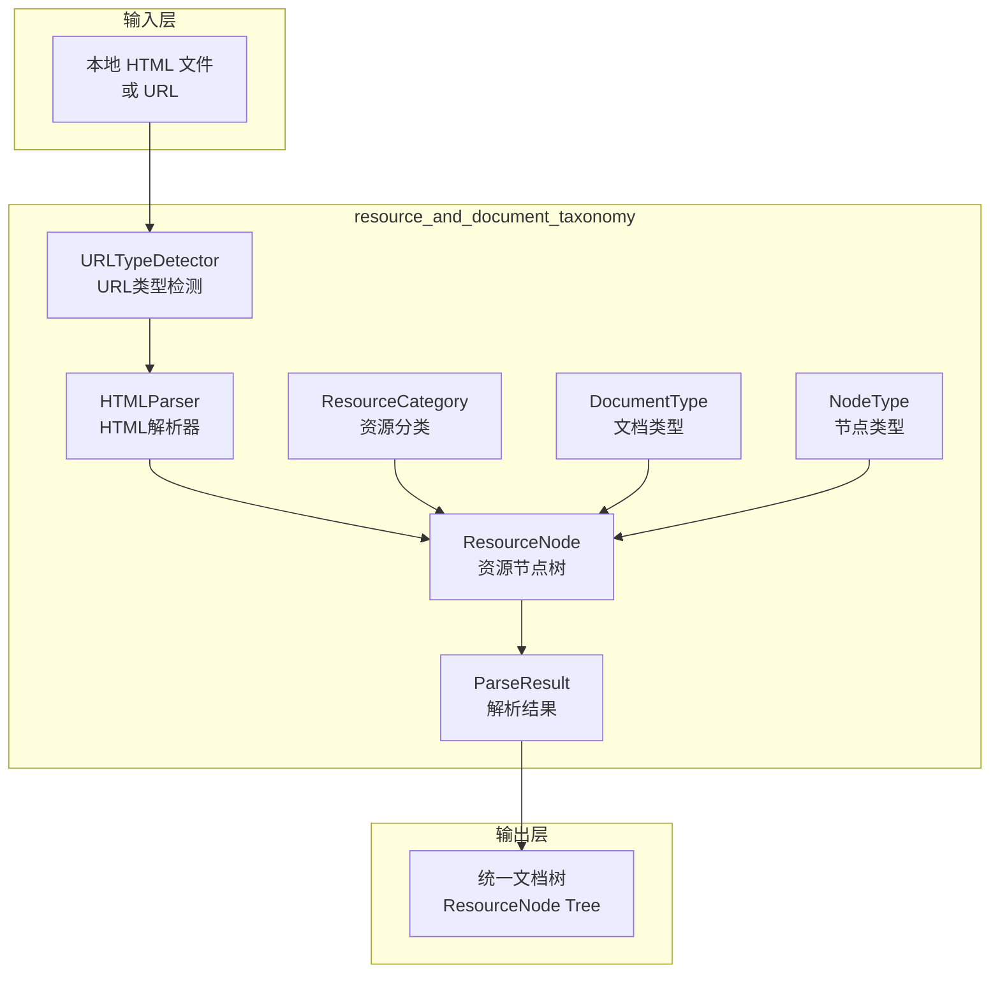

# resource_and_document_taxonomy 模块文档

## 模块概述

`resource_and_document_taxonomy` 是 OpenViking 系统中负责**资源分类与文档解析**的核心模块。把它想象成系统的"入口门卫"——当用户提交任何需要处理的文档（无论是本地文件还是网页链接）时，这个模块首先回答一个问题："这是什么类型的资源？应该用什么方式解析它？"

本模块解决的核心问题是：**如何统一处理来自不同来源（本地文件、URL）、不同格式（HTML、PDF、Markdown）的文档，并把它们转换为统一的内部树形结构**。这样，上层模块（如检索、向量化和评估模块）就不需要关心文档的原始来源和格式，只需要处理统一的 `ResourceNode` 树即可。

## 架构概览



### 数据流动说明

1. **输入阶段**：接收本地文件路径或 HTTP/HTTPS URL
2. **类型检测阶段**：
   - 如果是 URL，通过 `URLTypeDetector` 判断是网页、下载链接还是代码仓库
   - 根据 URL 类型决定后续处理策略
3. **内容获取阶段**：
   - 本地文件：直接读取
   - 网页：使用 HTTP 客户端获取 HTML 内容
   - 下载链接：先下载文件，再委托给对应的专用解析器
4. **解析转换阶段**：
   - HTML 内容转换为 Markdown（保留语义结构）
   - Markdown 由专门的 MarkdownParser 处理
5. **树形构建阶段**：根据标题层级（h1-h6）构建 `ResourceNode` 树
6. **输出阶段**：返回包含完整元数据的 `ParseResult`

## 核心设计决策

### 1. 枚举式类型系统 vs 字符串字面量

**选择**：使用 Python Enum 定义所有类型分类

```python
class ResourceCategory(Enum):
    DOCUMENT = "document"
    MEDIA = "media"

class DocumentType(Enum):
    PDF = "pdf"
    MARKDOWN = "markdown"
    PLAIN_TEXT = "plain_text"
    HTML = "html"
```

**为什么这样选择**：
- **类型安全**：静态分析工具能捕获无效的类型使用
- **自文档化**：IDE 自动补全和文档提示
- **重构友好**：重命名枚举成员时，IDE 可以同步更新所有引用
- **性能优势**：枚举比较比字符串比较更快（在高频调用场景下有意义）

**tradeoff**：灵活性略低于字符串——如果要动态添加新类型，需要修改代码。但对于这个系统来说，可预测的类型集合是更好的设计，因为类型直接影响后续处理流程。

### 2. 简化版 NodeType 设计（v2.0）

**选择**：只保留 `ROOT` 和 `SECTION` 两种节点类型

```python
class NodeType(Enum):
    ROOT = "root"
    SECTION = "section"
```

**为什么这样选择**：

传统的文档树可能有 `PARAGRAPH`、`CODE_BLOCK`、`TABLE`、`LIST` 等十几种节点类型。但 OpenViking 采用了**"保留自然文档结构"**的哲学——具体内容以 Markdown 格式存储在 `SECTION` 节点中，而不是细分为多种节点类型。

**tradeoff 分析**：
- ✅ **优点**：结构简单、灵活；所有内容都可用统一的 Markdown 工具链处理；避免过度工程
- ❌ **缺点**：失去细粒度结构信息（例如，无法直接区分"代码块"和"段落"）

这个设计选择反映了 **"简单的正确答案优于复杂的错误答案"** 的理念。如果将来需要细粒度，可以升级数据结构；但如果一开始就设计过度，后续很难简化。

### 3. ResourceNode 三阶段架构

**选择**：ResourceNode 的内容路径经历三个阶段的演变

```python
@dataclass
class ResourceNode:
    # Phase 1: 临时文件阶段 - 只有文件名
    detail_file: Optional[str] = None  # e.g., "a1b2c3d4.md"
    
    # Phase 2: 元数据阶段 - 语义信息
    meta: Dict[str, Any] = field(default_factory=dict)  # abstract, overview, semantic_title
    
    # Phase 3: 最终内容阶段 - 永久存储路径
    content_path: Optional[Path] = None  # 指向最终目录下的 content.md
```

**为什么这样选择**：

这个设计反映了系统演进的历史：
- **Phase 1**：解析早期使用临时文件系统，所有中间文件放在 `/tmp/openviking_parse_xxx`
- **Phase 2**：引入 VikingFS 分布式存储，需要跟踪元数据
- **Phase 3**：内容迁移到最终目录，需要 `content_path` 指向永久位置

**tradeoff**：
- 优点：向后兼容，支持渐进式迁移
- 缺点：代码中有多个获取内容的方法（`get_detail_content`、`get_detail_content_async`、`get_content`），增加了理解成本

### 4. 统一 HTML Parser 处理多种输入

**选择**：单个 `HTMLParser` 类同时处理本地文件和 URL

```python
async def parse(self, source: Union[str, Path], instruction: str = "", **kwargs) -> ParseResult:
    source_str = str(source)
    if source_str.startswith(("http://", "https://")):
        return await self._parse_url(source_str, start_time, **kwargs)
    else:
        return await self._parse_local_file(Path(source), start_time, **kwargs)
```

**为什么这样选择**：

这是一个**关注点分离**的设计决策：
- 上游调用者（CLI、TUI、API）只需要知道"解析这个源"，不需要关心它是本地还是远程
- 解析器内部根据输入类型选择策略，对外暴露统一的接口

**tradeoff**：
- 优点：调用方代码简单；便于添加统一的功能（如缓存、重试）
- 缺点：Parser 内部逻辑稍复杂；如果需要针对特定来源做优化（比如本地文件用不同策略），需要加更多条件分支

### 5. URL 类型检测策略

**选择**：采用"扩展名优先 + HEAD 请求确认"的二级检测

```python
async def detect(self, url: str, timeout: float = 10.0) -> Tuple[URLType, Dict[str, Any]]:
    # 1. 先检查 URL 扩展名
    for ext, url_type in self.EXTENSION_MAP.items():
        if path_lower.endswith(ext):
            return url_type, meta
    
    # 2. 发送 HEAD 请求检查 Content-Type
    response = await client.head(url)
    content_type = response.headers.get("content-type", "").lower()
    # ... 根据 Content-Type 映射到 URLType
    
    # 3. 默认假设是网页
    return URLType.WEBPAGE, meta
```

**为什么这样选择**：

这个设计平衡了**准确性**和**效率**：
- 扩展名检测：O(1) 时间复杂度，无需网络请求
- HEAD 请求：对于扩展名无法判断的情况（如 `https://example.com/doc`），通过 HTTP 头信息确认
- 代码仓库特殊处理：GitHub/GitLab 仓库 URL 需要模式匹配，不是简单扩展名

**潜在问题**：
- HEAD 请求可能失败（超时、被拒绝），此时降级为"默认网页"可能不是最优解
- 对于重定向链较长的 URL，`follow_redirects=True` 可能导致检测结果不准确

## 子模块说明

本模块包含两个主要组成部分：

### 1. 基础分类体系（base.py）

见 [resource_and_document_taxonomy_base_types](resource_and_document_taxonomy_base_types.md)

包含资源分类、文档类型、媒体类型、节点类型等枚举定义，以及 `ResourceNode`、`ParseResult` 等核心数据结构。

### 2. HTML 解析器（html.py）

见 [resource-and-document-taxonomy-html-parser](resource-and-document-taxonomy-html-parser.md)

包含 URL 类型检测器、HTML 解析器实现，能够处理本地 HTML 文件、网页 URL、下载链接和代码仓库。

## 依赖关系

### 上游依赖（被哪些模块调用）

| 模块 | 调用方式 |
|------|---------|
| `cli_bootstrap_and_runtime_context` | 通过 CLI 命令触发解析 |
| `tui_application_orchestration` | TUI 应用中预览文件时调用 |
| `server_api_contracts` | API 路由处理文件上传/URL 解析 |
| `session_runtime_and_skill_discovery` | 会话中加载 skill 文档 |

### 下游依赖（调用哪些模块）

| 模块 | 依赖内容 |
|------|---------|
| `parser_abstractions_and_extension_points` | 继承 `BaseParser` 抽象类 |
| `content_extraction_schema_and_strategies` | 使用 `MediaStrategy` 相关定义 |
| `vectorization_and_storage_adapters` | 向量化存储文档内容 |
| `storage_core_and_runtime_primitives` | 使用 VikingFS 读取内容 |

## 新贡献者注意事项

### 边缘情况与陷阱

1. **MediaType 是占位符**：当前 `MediaType.IMAGE/AUDIO/VIDEO` 只是未来扩展的占位符，实际处理尚未实现。如果尝试处理媒体资源，会遇到功能缺失。

2. **三阶段路径的兼容性问题**：代码中有多达三个获取内容的方法：
   - `get_detail_content()` - 读取临时目录（Phase 1）
   - `get_detail_content_async()` - 异步读取 VikingFS（Phase 2）
   - `get_content()` - 读取最终目录（Phase 3）
   
   新增代码时，需要明确当前系统处于哪个阶段，选择正确的方法。

3. **URL 检测的超时敏感性**：`URLTypeDetector.detect()` 有默认 10 秒超时，但在网络不稳定环境下可能频繁失败。失败的默认行为是"当作网页处理"，可能导致解析失败。

4. **HTML 到 Markdown 的信息丢失**：`HTMLParser` 依赖 `readabilipy` + `markdownify` 转换，这个过程会丢失部分格式信息（如复杂的 CSS 样式、特定布局）。期望保留精确格式的场景需要额外处理。

5. **代码仓库 URL 的模式匹配**：`URLTypeDetector._is_code_repository_url()` 使用正则匹配 GitHub/GitLab 域名，这个列表来自配置文件。如果公司内部使用自定义域名托管代码，可能需要更新配置。

### 扩展点

1. **添加新的 DocumentType**：在 `DocumentType` 枚举中添加新值，并确保有对应的 Parser 处理该类型

2. **添加新的 URLType**：在 `URLType` 枚举中添加新值，在 `URLTypeDetector` 中添加检测逻辑

3. **自定义内容预处理**：覆盖 `_preprocess_html()` 方法可以添加站点特定的清理逻辑（如处理 WeChat 公众号的隐藏内容）

4. **多模态扩展**：`ResourceNode` 已预留 `content_type` 和 `auxiliary_files` 字段支持多模态内容，当前默认都是 `text`

### 性能考量

- URL 类型检测中的 HEAD 请求是串行的，如果有大量 URL 需要处理，考虑添加批量检测或异步并行
- `ResourceNode.to_dict()` 和 `from_dict()` 在树较深时可能产生较大对象，注意内存使用
- HTML 到 Markdown 的转换依赖外部库，解析大文档时可能成为瓶颈