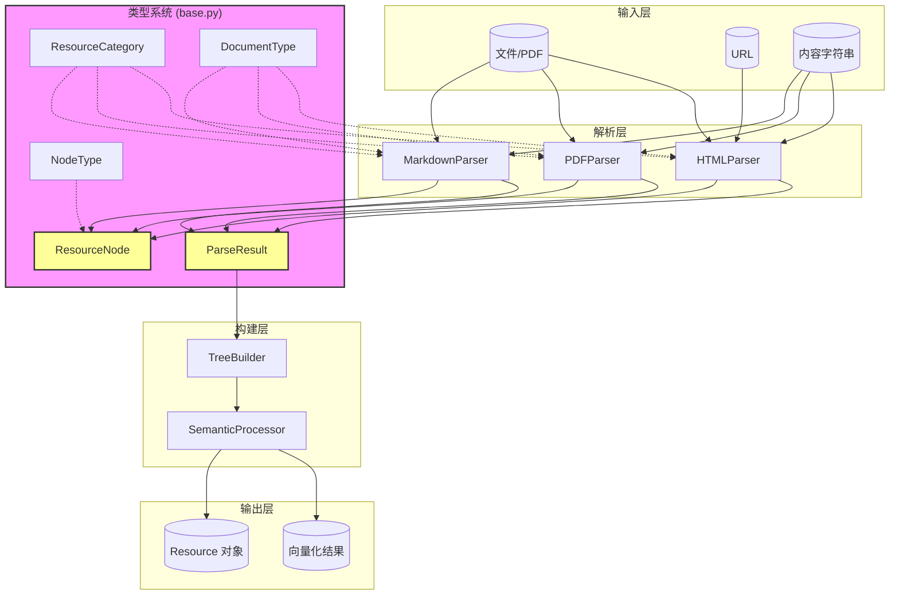

# 资源与文档分类基础类型模块 (resource_and_document_taxonomy_base_types)

## 模块概述

本模块是 OpenViking 解析系统的「宪法」——它定义了所有文档处理流程的根基类型。当系统接收到任何需要解析的资源时，从 PDF 到 Markdown，从本地文件到网页 URL，最终都会被转换为这个模块定义的数据结构。理解这个模块，是理解整个解析 pipeline 的前提。

这个模块解决的问题是「表达的统一性」：不同的文档格式需要被抽象为统一的内部表示。如果每个解析器都返回自己特有的数据结构，上层的存储、检索、向量化模块将不得不为每种文档格式编写专门的适配代码。通过定义 `ResourceNode` 树形结构和 `ParseResult` 统一结果类型，这个模块实现了「百花齐放进，一致流出」的架构目标。

### 数据流架构图



### 核心抽象的心智模型

把这个模块想象成**文档的「X光机」**——它不关心文档最初是什么格式（PDF、Markdown、HTML），只关心解析后呈现出的内部结构。就像医院的X光机不管病人是站着还是躺着、穿什么衣服，拍出来的都是标准的骨骼影像。

`ResourceNode` 就是那个「骨骼」——它是文档的骨架，定义了「这里是一个章节」「那里是子章节」的结构关系。`ParseResult` 则是完整的「体检报告」——不仅有骨骼（root节点），还有检查过程中的各种元数据（解析耗时、警告信息、版本号等）。

## 核心设计理念：保留自然文档结构

在深入类型定义之前，需要理解这个模块背后最重要的设计哲学：OpenViking 遵循 PageIndex 理念，即**保留自然文档结构而非任意分块**。

传统的文档处理系统往往将文档切分成「块」（chunks），每个块是固定大小的文本片段。这种方法简单，但丢失了文档的层级关系——章节之间的关系、标题与内容的从属关系全部消失。

OpenViking 选择了不同的道路：保留文档的树形结构，让每个「节」（SECTION）作为独立的处理单元。这意味着检索时可以按章节粒度返回结果，而不是生硬的文本片段。当你在搜索一个技术文档时，得到「第八章：配置选项」整个章节，要比得到一段没有上下文的文本片段有意义得多。

## 枚举类型体系

### ResourceCategory：资源大类

```python
class ResourceCategory(Enum):
    DOCUMENT = "document"
    MEDIA = "media"
```

这是最简单的枚举，只有两个成员：文档（DOCUMENT）和媒体（MEDIA）。这个分类决定了资源后续的处理流程——文档走文本解析 pipeline，媒体走多媒体处理 pipeline（虽然当前 MediaType 尚未完全实现）。

这个枚举的存在价值在于提供「第一层过滤」。当系统接收一个资源时，首先判断它是文档还是媒体，然后路由到不同的处理分支。类似于机场安检的「入口分流」——不同类型的旅客走不同的通道。

### DocumentType：文档格式类型

```python
class DocumentType(Enum):
    PDF = "pdf"
    MARKDOWN = "markdown"
    PLAIN_TEXT = "plain_text"
    HTML = "html"
```

这个枚举定义了当前系统支持的四种文档格式。注意这个列表是精简的——不是所有文档格式都被支持。系统采用了「支持核心格式」的策略，而非「支持所有格式」的策略。这是有意的设计决策：支持的格式越少，维护成本越低，每个格式的处理质量越高。

当前支持的格式：
- **PDF**：最常见的文档格式，处理复杂度最高
- **Markdown**：轻量级标记语言，结构清晰
- **HTML**：网页内容，需要从 HTML 转换为 Markdown
- **PLAIN_TEXT**：纯文本，最简单的格式

如果你需要支持新的格式（比如 Word 的 .docx），需要在 `DocumentType` 中添加新成员，同时实现对应的解析器。

### NodeType：节点类型（精简设计）

```python
class NodeType(Enum):
    ROOT = "root"
    SECTION = "section"
```

这是最值得深入讨论的枚举。v2.0 版本采用了极度精简的设计——只有根节点（ROOT）和节节点（SECTION）两种类型。

为什么做得这么「少」？

传统的文档树可能有丰富的节点类型：PARAGRAPH（段落）、CODE_BLOCK（代码块）、TABLE（表格）、LIST（列表）、HEADING（标题）等等。理论上这种细粒度分类很有吸引力——你可以精确知道每个节点的类型，从而做针对性的处理。

但 OpenViking 选择了不同的道路。原因如下：

1. **Markdown 格式的自包含性**：当所有内容都以 Markdown 存储时，代码块的```块、表格的|格式都已经包含在内容字符串中。不需要额外的类型标签来标记「这是代码块」——只要解析 Markdown，自然就能识别。

2. **避免过度工程**：添加一个新节点类型意味着上游解析器需要识别并标记它，下游消费者需要理解并处理它。每增加一个类型，系统复杂度呈线性增长，但收益递减。

3. **灵活的查询能力**：一个简化的树结构更容易遍历和查询。如果你想找到所有「代码块」，遍历树并检查内容中的 ``` 要比遍历特定类型的节点更简单（在内容已经是 Markdown 格式的前提下）。

**设计权衡**：这种设计牺牲了细粒度结构信息。如果你需要精确区分「代码块」和「普通段落」，当前架构需要你在内容层面解析 Markdown。这是「结构优先」与「内容优先」两种范式的选择，OpenViking 选择了后者。

### MediaType：媒体类型（占位符）

```python
class MediaType(Enum):
    IMAGE = "image"
    AUDIO = "audio"
    VIDEO = "video"
```

这个枚举目前是「未来扩展的占位符」。系统设计了处理图片、音频、视频的能力，但当前实现主要集中在文档（文本）处理上。MediaType 的存在表明架构已经为多媒体处理预留了扩展空间——当需要支持图片检索、视频理解等功能时，可以基于这个枚举扩展处理逻辑。

## ResourceNode：文档树节点

`ResourceNode` 是整个模块最核心的类。它表示文档树中的一个节点——可以是根节点，也可以是章节节点。

### 三阶段架构

理解 `ResourceNode` 的设计需要理解「三阶段」的概念。这不是简单的「一个字段走天下」，而是根据系统演进历史设计的兼容性架构：

**阶段一（Phase 1）**：解析结果存储在临时文件系统
- 使用 `detail_file` 字段，值为类似 "a1b2c3d4.md" 的临时文件名
- 内容存储在 `/tmp/openviking_parse_xxx` 目录
- 适合本地开发和小规模处理

**阶段二（Phase 2）**：引入 VikingFS 分布式存储
- `meta` 字段存储语义信息（semantic_title、abstract、overview）
- 内容存储在 VikingFS 临时目录
- `get_detail_content_async()` 方法异步读取 VikingFS 内容

**阶段三（Phase 3）**：内容迁移到最终目录
- `content_path` 字段指向最终存储位置（如 `/final/storage/content.md`）
- 这是内容「定稿」后的长期存储位置
- `get_content()` 方法读取最终内容

这种三阶段设计不是过度工程，而是**向后兼容的渐进式迁移**。系统不可能一次性升级到最新架构，一定存在「部分节点处于阶段一、部分节点处于阶段三」的混合状态。ResourceNode 的设计允许这种共存。

### 核心字段

```python
@dataclass
class ResourceNode:
    type: NodeType                          # 节点类型（ROOT 或 SECTION）
    detail_file: Optional[str] = None       # 阶段一：临时文件名
    content_path: Optional[Path] = None     # 阶段三：最终内容路径
    title: Optional[str] = None             # 标题（来自 Markdown 标题）
    level: int = 0                          # 层级（0=根，1=一级标题，2=二级标题...）
    children: List["ResourceNode"] = ...    # 子节点列表
    meta: Dict[str, Any] = ...              # 元数据（abstract、overview 等）
    content_type: str = "text"              # 内容类型（text/image/video/audio）
    auxiliary_files: Dict[str, str] = ...   # 辅助文件映射
```

### 关键方法

**get_text()** - 获取节点的文本内容

```python
def get_text(self, include_children: bool = True) -> str:
    """获取节点及其子节点的文本内容"""
    content = self.get_content()
    texts = [content] if content else []
    if include_children:
        for child in self.children:
            texts.append(child.get_text(include_children=True))
    return "\n".join(texts)
```

这个方法将树形结构「拍平」为文本。如果 `include_children=True`（默认值），会递归收集所有子孙节点的内容。如果你想获取某个章节及其所有子节的内容，直接调用这个方法即可。

**get_abstract()** - 生成 L0 级别的摘要

```python
def get_abstract(self, max_length: int = 256) -> str:
    """生成最多 256 字符的摘要"""
    if "abstract" in self.meta:
        return self.meta["abstract"]
    if self.title:
        abstract = self.title
    else:
        content = self.get_content()
        abstract = content[:max_length] if content else ""
    if len(abstract) > max_length:
        abstract = abstract[: max_length - 3] + "..."
    return abstract
```

这个方法用于「快速预览」场景。检索结果展示时，不需要显示完整内容，只需要显示摘要。优先使用 `meta["abstract"]`（如果存在），否则使用标题或内容的前 256 字符。

**get_overview()** - 生成 L1 级别的概述

```python
def get_overview(self, max_length: int = 4000) -> str:
    """生成最多 4000 字符的概述，包含结构信息"""
```

这个方法比 `get_abstract()` 更详细，不仅包含内容预览，还包含子节点摘要。用于「了解一个章节大体讲什么」的场景。

**to_dict() / from_dict()** - 序列化与反序列化

```python
def to_dict(self) -> Dict[str, Any]:
    """转换为字典（用于 JSON 序列化）"""

@classmethod
def from_dict(cls, data: Dict[str, Any]) -> "ResourceNode":
    """从字典恢复节点（用于 JSON 反序列化）"""
```

这两个方法支持 ResourceNode 的序列化和反序列化，使得文档树可以持久化存储或跨网络传输。

## ParseResult：解析结果容器

`ParseResult` 是解析器的最终产出。它包含完整的解析结果以及元数据信息。

### 核心字段

```python
@dataclass
class ParseResult:
    root: ResourceNode                      # 文档树根节点
    source_path: Optional[str] = None       # 源文件路径
    temp_dir_path: Optional[str] = None     # 临时目录路径（v4.0 架构）
    source_format: Optional[str] = None     # 文件格式（如 "pdf", "markdown"）
    parser_name: Optional[str] = None       # 解析器名称（如 "PDFParser"）
    parser_version: Optional[str] = None    # 解析器版本
    parse_time: Optional[float] = None      # 解析耗时（秒）
    parse_timestamp: Optional[datetime] = None  # 解析时间戳
    meta: Dict[str, Any] = ...              # 额外元数据
    warnings: List[str] = ...               # 解析警告
```

### 关键属性和方法

**success** 属性 - 快速判断解析是否成功

```python
@property
def success(self) -> bool:
    """检查解析是否成功（无警告即成功）"""
    return len(self.warnings) == 0
```

这是一个便利属性。如果解析过程中有任何警告（比如「图片提取失败」「某些字符无法识别」），`success` 返回 `False`。调用者可以根据这个属性决定是否需要告警或重试。

**get_all_nodes()** 方法 - 扁平化获取所有节点

```python
def get_all_nodes(self) -> List[ResourceNode]:
    """获取树中的所有节点（扁平列表）"""
    nodes = []
    def collect(node: ResourceNode):
        nodes.append(node)
        for child in node.children:
            collect(child)
    collect(self.root)
    return nodes
```

这个方法将树形结构「展平」为节点列表。适用于需要遍历所有节点的场景，比如「统计节点总数」「对所有节点执行某个操作」。

**get_sections()** 方法 - 获取指定层级的章节

```python
def get_sections(self, min_level: int = 0, max_level: int = 10) -> List[ResourceNode]:
    """获取指定层级范围内的章节节点"""
```

这个方法用于「提取特定层级的章节」。例如，`get_sections(min_level=1, max_level=2)` 返回所有一级和二级标题对应的章节。

## 辅助函数

### calculate_media_strategy()

```python
def calculate_media_strategy(image_count: int, line_count: int) -> str:
    """
    根据图片数量和行数计算媒体处理策略
    
    返回: "full_page_vlm" | "extract" | "text_only"
    """
    if line_count > 0 and (image_count / line_count > 0.3 or image_count >= 5):
        return "full_page_vlm"
    elif image_count > 0:
        return "extract"
    else:
        return "text_only"
```

这个函数决定了文档的多媒体处理策略：
- **full_page_vlm**：高图片密度（图片占比 > 30% 或数量 >= 5），使用 VLM 理解整页
- **extract**：有少量图片，提取图片内容
- **text_only**：无图片，纯文本处理

这是资源消耗和效果之间的权衡——全页 VLM 效果最好但成本最高，纯文本成本最低但可能丢失图片信息。

### format_table_to_markdown()

```python
def format_table_to_markdown(rows: List[List[str]], has_header: bool = True) -> str:
    """将表格数据格式化为 Markdown"""
```

这个函数将二维数组转换为 Markdown 表格格式。用于解析器提取表格内容后转换为标准 Markdown 格式。

### lazy_import()

```python
def lazy_import(module_name: str, package_name: Optional[str] = None) -> Any:
    """延迟导入模块，模块不可用时给出友好错误提示"""
```

这是一个防御性工具函数。在解析过程中可能需要可选依赖（比如 `pymupdf` 处理 PDF，`markdownify` 处理 HTML），这些依赖不是核心必需的。`lazy_import` 在需要时尝试导入，如果失败则给出清晰的错误信息（包括如何安装缺失的包）。

## create_parse_result() 工厂函数

```python
def create_parse_result(
    root: ResourceNode,
    source_path: Optional[str] = None,
    source_format: Optional[str] = None,
    parser_name: Optional[str] = None,
    parser_version: str = "2.0",
    parse_time: Optional[float] = None,
    meta: Optional[Dict[str, Any]] = None,
    warnings: Optional[List[str]] = None,
) -> ParseResult:
    """创建 ParseResult，自动填充时间戳等派生字段"""
```

这是创建 `ParseResult` 的推荐方式。相比直接实例化 `ParseResult`，`create_parse_result` 提供了默认值并自动计算派生字段（比如 `parse_timestamp`）。

默认值 `parser_version = "2.0"` 反映了当前使用的解析架构版本。如果将来升级到 v3.0，这个默认值会更新。

## 依赖关系分析

### 上游依赖（哪些模块调用这个模块）

| 模块 | 调用方式 |
|------|---------|
| `resource_and_document_taxonomy_html_parser` | 使用枚举和 ResourceNode 构建解析结果 |
| `parser_abstractions_and_extension_points` | BaseParser 返回 ParseResult |
| 代码语言 AST 提取器（C++、Python、Java 等） | 返回 ParseResult 作为解析结果 |
| `resource_detection_traversal_metadata` | 使用 NodeType 判断节点类型 |

### 下游依赖（这个模块调用哪些模块）

| 模块 | 调用内容 |
|------|---------|
| `storage.viking_fs` | `get_viking_fs()` 用于异步读取内容 |
| 第三方库 (spdlog) | 时间戳生成 |

### 数据流动

典型数据流：
1. **输入**：用户上传 PDF 文件或提供 URL
2. **解析**：对应格式的解析器解析内容
3. **构建**：解析器创建 ResourceNode 树（章节、层级、内容路径）
4. **封装**：调用 `create_parse_result()` 封装为 ParseResult
5. **输出**：ParseResult 传递给存储、检索、向量化模块

## 设计决策与权衡

### 决策一：枚举 vs 字符串字面量

**选择**：使用 Python Enum 而非字符串

**权衡分析**：
- **优势**：类型安全（静态分析可捕获无效类型）、IDE 自动补全、重构友好、性能略优
- **劣势**：灵活性略低（添加新类型需要修改枚举定义）

对于这个系统来说，类型集合是可预测的，且类型直接影响后续处理流程，枚举是更优选择。

### 决策二：精简节点类型

**选择**：NodeType 只有 ROOT 和 SECTION

**权衡分析**：
- **优势**：结构简单、处理逻辑统一、避免过度工程、Markdown 自包含内容
- **劣势**：丢失细粒度结构信息

这是「简单的正确答案优于复杂的错误答案」理念的体现。先简后繁是容易的，先繁后简是痛苦的。

### 决策三：三阶段路径设计

**选择**：detail_file、meta、content_path 共存

**权衡分析**：
- **优势**：向后兼容、支持渐进迁移
- **劣势**：多个获取内容的方法增加理解成本、需要明确当前阶段

系统演进的历史包袱导致了这种设计。在新代码中可以默认使用 `get_content()` 方法。

### 决策四：MediaType 占位符

**选择**：定义枚举但不实现处理逻辑

**权衡分析**：
- **优势**：预留扩展空间、不影响当前实现
- **劣势**：调用者可能误用

文档中已标注 MediaType 为占位符，调用者需要注意。

## 使用指南与最佳实践

### 创建文档树

```python
from openviking.parse.base import (
    ResourceCategory, DocumentType, NodeType,
    ResourceNode, ParseResult, create_parse_result
)

# 创建根节点
root = ResourceNode(
    type=NodeType.ROOT,
    title="技术文档",
    level=0
)

# 创建一级章节
chapter1 = ResourceNode(
    type=NodeType.SECTION,
    title="第一章：入门",
    level=1,
    content_path=Path("/data/docs/chapter1.md")
)
root.add_child(chapter1)

# 创建二级章节
section1_1 = ResourceNode(
    type=NodeType.SECTION,
    title="1.1 安装",
    level=2,
    content_path=Path("/data/docs/chapter1_1.md"),
    meta={"abstract": "安装步骤详解"}
)
chapter1.add_child(section1_1)

# 创建解析结果
result = create_parse_result(
    root=root,
    source_path="/data/docs/technical_doc.md",
    source_format="markdown",
    parser_name="MarkdownParser",
    parse_time=1.23
)
```

### 遍历文档树

```python
# 方法一：使用 get_all_nodes 获取扁平列表
all_nodes = result.get_all_nodes()
for node in all_nodes:
    print(f"{'  ' * node.level}{node.title or '(无标题)'}")

# 方法二：使用 get_sections 获取特定层级章节
sections = result.get_sections(min_level=1, max_level=2)
for section in sections:
    print(f"{section.title}: {section.get_abstract()}")
```

### 生成摘要和概述

```python
# L0 摘要（256 字符）
abstract = root.get_abstract(max_length=256)

# L1 概述（4000 字符，包含结构）
overview = root.get_overview(max_length=4000)
```

## 边缘情况与陷阱

### 1. content_path 与 detail_file 的选择

代码中有多个获取内容的方法：
- `get_detail_content(temp_dir)` — 阶段一，从临时目录读取
- `get_detail_content_async(temp_uri)` — 阶段二，从 VikingFS 异步读取
- `get_content()` — 阶段三，从最终目录读取

新增代码时需要明确当前系统处于哪个阶段。如果不确定，使用 `get_content()` 作为默认选择（它会在内容不存在时返回空字符串，不会崩溃）。

### 2. NodeType 的简化假设

当前只有 ROOT 和 SECTION 两种类型。如果你在代码中期待其他节点类型（比如假设存在 PARAGRAPH），会得到意外的结果。检查内容是否包含 Markdown 格式标记（如 ```、|）来判断具体内容类型。

### 3. 文本截断

`get_abstract()` 和 `get_overview()` 都会截断内容。截断是按字符数而非单词数，可能在单词中间断开。使用前注意这个行为。

### 4. 序列化循环

`ResourceNode` 是递归结构（children 字段包含 ResourceNode）。在序列化时（如 JSON），需要注意可能的循环引用问题。`to_dict()` 方法会递归处理所有子节点，对于深度较大的树可能产生较大的输出。

### 5. MediaType 未实现

MediaType 枚举已定义，但相关的媒体处理逻辑尚未实现。如果尝试使用 `content_type = "image"` 或 `content_type = "video"`，当前不会有任何实际的多模态处理。

### 6. 时区陷阱

`create_parse_result` 使用 `datetime.now()` 创建时间戳，这是**本地时区**。如果系统需要跨时区一致性（例如审计日志或性能分析），这可能造成困惑。例如，同一个解析任务在欧洲和中国运行时，`parse_timestamp` 会相差 7 或 8 小时。考虑在系统层面统一使用 UTC 时区（`datetime.now(timezone.utc)`）以确保一致性。

### 7. success 属性的语义边界

`ParseResult.success` 属性仅检查 `warnings` 数组是否为空。这意味着：
- 解析器可以将严重问题放入 `warnings` 而不是抛出异常
- 一个"成功"解析的文档可能包含警告（例如"部分图像提取失败"）
- 下游代码不应将 `success` 理解为"完美解析"，而应理解为"未致命失败"

如果你需要区分"完全成功"和"部分成功"，需要同时检查 `warnings` 数组的内容。

## 扩展点

如果要扩展这个模块：

1. **添加新的 DocumentType**：在枚举中添加新值，实现对应的解析器
2. **添加新的资源类别**：在 ResourceCategory 中添加新成员（极少见）
3. **扩展 ResourceNode**：可以添加新字段（如 `language` 用于代码块的编程语言），需要考虑序列化兼容性

## 总结

`resource_and_document_taxonomy_base_types` 模块是 OpenViking 解析系统的根基。它定义了文档的分类体系和树形结构表示，使得不同格式的文档可以被统一处理。核心的设计理念是「保留自然文档结构」——通过精简的节点类型和 Markdown 格式的内容存储，系统能够完整保留文档的层级关系，为后续的检索和展示提供丰富的上下文。

理解这个模块的关键在于理解它的「简约哲学」：用最少的类型表达最多的信息，用最简的结构保留最丰富的语义。这种设计使得系统易于理解、易于维护、易于扩展。

---

## 相关文档

- **[resource_and_document_taxonomy](resource_and_document_taxonomy.md)** - 资源分类体系的完整概览，包含本模块在分类层级中的位置
- **[resource_and_document_taxonomy_html_parser](resource_and_document_taxonomy_html_parser.md)** - HTML 解析特定的类型扩展
- **[parser_abstractions_and_extension_points](parser_abstractions_and_extension_points.md)** - 解析器抽象基类和扩展协议，ParseResult 的主要生产者
- **[base_parser_abstract_class](base_parser_abstract_class.md)** - BaseParser 抽象类，定义了返回 ParseResult 的接口契约