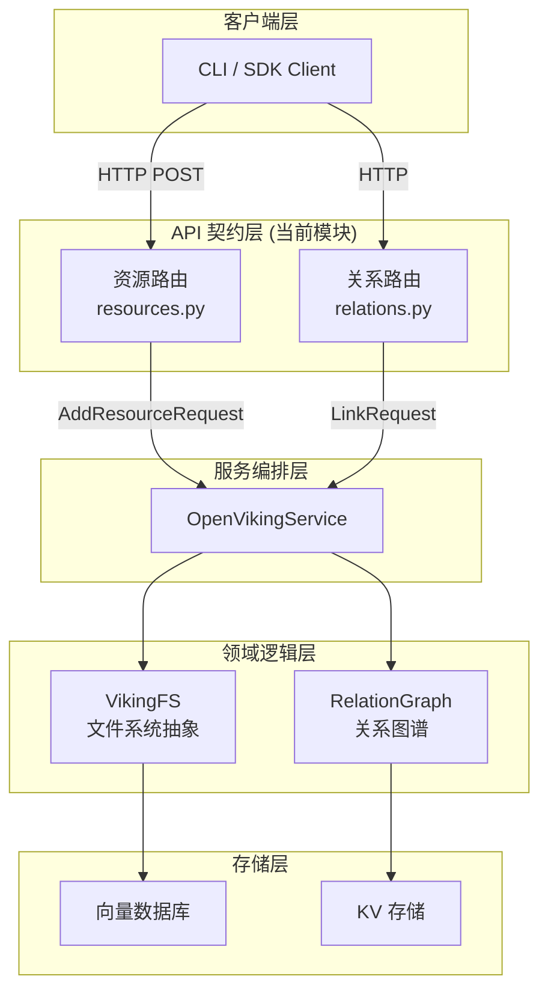

# resource_and_relation_contracts

## 模块概述

`resource_and_relation_contracts` 模块是 OpenViking HTTP 服务器的**API 契约层**，负责定义资源管理（添加资源和技能）以及资源间关系（链接与取消链接）的 HTTP 接口规范。

> 换个更直白的说法：这个模块就是服务器的"前台接待"——外部请求进来后，先经过这里被验证、解析成标准格式，然后被分发到后端的业务逻辑服务层去执行具体操作。

**解决的问题**：在分布式 AI 系统中，需要一个标准化的接口来：
1. **导入外部知识** — 将用户的文件、文档、技能（skill）等转化为系统可管理的资源
2. **建立知识关联** — 将分散的资源通过关系图谱连接起来，支持语义检索和推理

---

## 架构定位与数据流向



**数据流转路径**：

1. **资源添加流程**：
   - 客户端上传文件 → `temp_upload` 端点 → 临时文件存储
   - 客户端发送 `AddResourceRequest` → 路由层验证 → 服务层 `service.resources.add_resource()`
   - 服务层调用 VikingFS 解析文件、生成向量、存入向量数据库

2. **关系建立流程**：
   - 客户端发送 `LinkRequest` → 路由层验证 → 服务层 `service.relations.link()`
   - 服务层更新关系图谱 → 持久化到 KV 存储

---

## 核心设计决策

### 1. 请求模型与业务逻辑分离

**设计选择**：路由层只负责请求验证和格式转换，不包含任何业务逻辑。

```python
# 路由层：纯粹的契约定义
@router.post("/resources")
async def add_resource(
    request: AddResourceRequest,
    _ctx: RequestContext = Depends(get_request_context),
):
    service = get_service()  # 获取服务层
    # 只做参数透传，不做任何业务判断
    result = await service.resources.add_resource(
        path=path,
        ctx=_ctx,
        target=request.target,
        ...
    )
```

**权衡分析**：
- ✅ **优点**：职责单一、易于测试、契约层可以独立演进
- ❌ **缺点**：增加了一层函数调用开销，调试时需要跨越多个层级
- **适用场景**：中大型系统，需要多人协作开发不同模块

### 2. 双路径输入模式（path / temp_path）

**设计选择**：`AddResourceRequest` 和 `AddSkillRequest` 都支持两种输入路径：

```python
class AddResourceRequest(BaseModel):
    path: Optional[str] = None           # 直接指定本地路径
    temp_path: Optional[str] = None      # 使用预上传的临时文件
    
    @model_validator(mode="after")
    def check_path_or_temp_path(self):
        if not self.path and not self.temp_path:
            raise ValueError("Either 'path' or 'temp_path' must be provided")
        return self
```

**设计意图**：
- **path**：适用于 CLI 本地文件上传场景
- **temp_path**：适用于 Web UI 或 API 调用场景——先调用 `temp_upload` 端点获得临时路径，再将该路径作为 `add_resource` 的输入

** tradeoff**：这增加了请求模型的复杂度，但极大地提升了 API 的灵活性，支持多种客户端场景。

### 3. 关系的一对多建模

**设计选择**：

```python
class LinkRequest(BaseModel):
    from_uri: str
    to_uris: Union[str, List[str]]  # 支持单个或多个目标
    reason: str = ""
```

**设计意图**：现实世界中，一个资源往往与多个资源相关联。例如，一篇技术文档可能同时"引用"多篇参考资料。`to_uris` 支持列表形式，使得批量建联成为可能，减少客户端的请求次数。

### 4. 临时文件自动清理机制

**设计选择**：在 `temp_upload` 端点中实现了定时清理：

```python
def _cleanup_temp_files(temp_dir: Path, max_age_hours: int = 1):
    """Clean up temporary files older than max_age_hours."""
    now = time.time()
    max_age_seconds = max_age_hours * 3600
    for file_path in temp_dir.iterdir():
        if file_path.is_file():
            file_age = now - file_path.stat().st_mtime
            if file_age > max_age_seconds:
                file_path.unlink(missing_ok=True)
```

**设计意图**：防止临时上传目录膨胀，1 小时的保留期平衡了"用户可能需要重试"与"存储空间清理"的需求。

---

## 组件清单

### 路由处理函数

| 组件 | 职责 | 关键依赖 |
|------|------|----------|
| `temp_upload` | 接收文件上传，返回临时路径 | `get_openviking_config()` 获取存储配置 |
| `add_resource` | 将外部文件/内容添加为系统资源 | `service.resources.add_resource()` |
| `add_skill` | 将技能（skill）添加到系统 | `service.resources.add_skill()` |
| `relations` | 查询指定资源的所有关系 | `service.relations.relations()` |
| `link` | 建立资源间的关联关系 | `service.relations.link()` |
| `unlink` | 移除资源间的关联关系 | `service.relations.unlink()` |

### 请求模型

| 模型 | 用途 | 核心字段 |
|------|------|----------|
| `AddResourceRequest` | 添加资源到系统 | `path`/`temp_path`, `target`, `reason`, `instruction`, `strict`, `include`/`exclude` |
| `AddSkillRequest` | 添加技能到系统 | `data`/`temp_path`, `wait`, `timeout` |
| `LinkRequest` | 建立资源关联 | `from_uri`, `to_uris`, `reason` |
| `UnlinkRequest` | 移除资源关联 | `from_uri`, `to_uri` |

---

## 依赖关系分析

### 上游依赖（谁调用这个模块）

- **HTTP 客户端**（CLI、SDK、Web UI）→ 发送 HTTP 请求到这些端点
- **FastAPI 框架** → 负责路由注册、请求解析、依赖注入

### 下游依赖（这个模块调用谁）

```python
# 核心依赖链
get_request_context     # 身份认证 → RequestContext
get_service()           # 获取服务单例 → OpenVikingService
  ├─ service.resources.add_resource()   # 资源服务
  ├─ service.resources.add_skill()      # 技能服务
  └─ service.relations.*                 # 关系服务
```

### 契约约定

| 约定类型 | 具体内容 |
|----------|----------|
| **输入契约** | 所有请求必须通过 Pydantic 模型验证，`path`/`temp_path` 至少提供一个 |
| **输出契约** | 统一返回 `Response` 模型：`{status: "ok"|"error", result: Any, error?: ErrorInfo}` |
| **上下文契约** | 所有端点注入 `RequestContext`，包含 `user.account_id` 用于多租户隔离 |

---

## 新贡献者注意事项

### 1. 路径二选一的隐式契约

```python
# ❌ 错误示例：两个路径都为空
AddResourceRequest(path=None, temp_path=None)  # 触发验证错误

# ❌ 错误示例：同时提供两个路径
AddResourceRequest(path="/a.txt", temp_path="/tmp/b.txt")  
# 不会报错，但行为是：temp_path 优先级高于 path
```

代码中的实际逻辑是：如果 `temp_path` 存在，则忽略 `path`。这在文档中没有明确说明，是潜在的认知陷阱。

### 2. `reason` 字段的设计意图

`LinkRequest` 和 `AddResourceRequest` 都有 `reason` 字段，这是一个**可选但有意义的字段**：

```python
reason: str = ""  # "为什么建立这个关联？"
instruction: str = ""  # "如何处理这个资源？"
```

这些字段用于：
- **审计追溯** — 记录操作意图，便于事后分析
- **LLM 上下文** — 在 Agent 场景中，这些文本会作为系统提示词的一部分

> **注意**：如果你在添加新端点时引入类似的"意图描述"字段，请确保与现有的语义约定保持一致。

### 3. 异步处理与等待模式

```python
class AddResourceRequest(BaseModel):
    wait: bool = False        # 是否等待处理完成
    timeout: Optional[float] = None  # 超时时间
```

OpenViking 是一个异步系统，资源添加操作可能涉及向量生成等耗时任务。`wait` 字段控制：
- `wait=False`（默认）：立即返回任务提交成功，客户端通过轮询或 WebSocket 获取结果
- `wait=True`：阻塞等待处理完成，或直到超时

**扩展点**：如果你要为新端点添加类似的异步控制，请参考这个模式。

### 4. 严格模式与过滤规则

```python
class AddResourceRequest(BaseModel):
    strict: bool = True
    ignore_dirs: Optional[str] = None  # 忽略的目录，如 ".git,node_modules"
    include: Optional[str] = None      # 只包含匹配的文件
    exclude: Optional[str] = None      # 排除匹配的文件
```

- `strict=True`：如果目标路径不存在或无法访问，直接报错
- `strict=False`：静默跳过无法处理的文件，继续处理其他文件
- `ignore_dirs`/`include`/`exclude`：使用 Glob 模式匹配，用于批量添加资源时过滤文件

### 5. 关系查询是单向的

```python
@router.get("")
async def relations(uri: str = Query(...)):
    """Get relations for a resource."""
    # 这里的语义是：获取"以 uri 为起点"的所有关系
    # 不会返回"指向 uri"的关系（反向关系）
```

如果需要双向关系查询，上层调用方需要自行合并结果，或使用专门的图遍历接口。

---

## 相关文档

- [server-api-contracts-filesystem-mutation-contracts](./server-api-contracts-filesystem-mutation-contracts.md) — 文件系统变更契约（与资源管理同层）
- [server-api-contracts-admin-user-and-role-contracts](./server-api-contracts-admin-user-and-role-contracts.md) — 用户与角色管理契约
- [core_context_prompts_and_sessions](./core_context_prompts_and_sessions.md) — 上下文与会话管理
- [storage_core_and_runtime_primitives](./storage_core_and_runtime_primitives.md) — 存储层原语