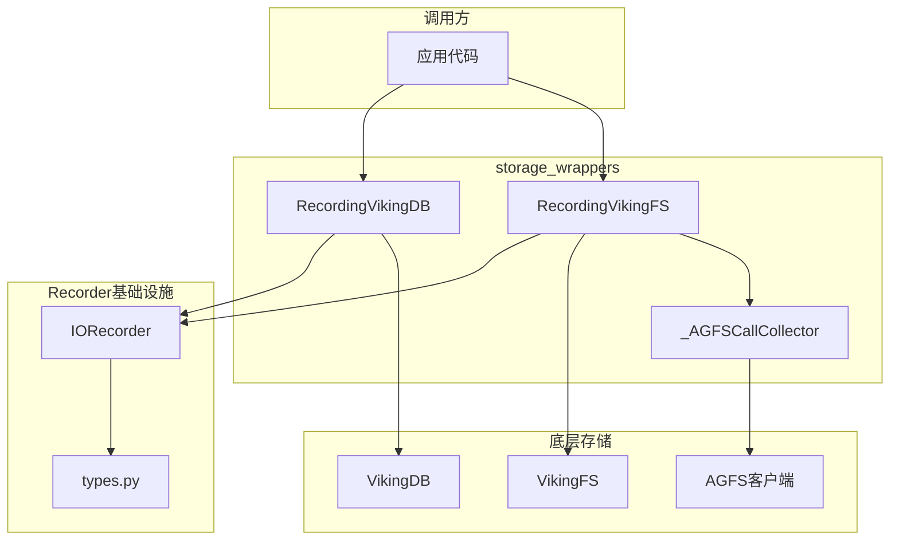

# storage_wrappers 模块技术深度解析

## 概述

想象一下，你在开发一个复杂的 AI 助手系统，它同时与分布式文件系统（VikingFS）和向量数据库（VikingDB）交互。当系统出现异常或性能问题时，你如何追溯问题根源？传统的日志记录方式往往是分散的、格式不统一的，难以完整重建一次请求的完整 IO 轨迹。

**`storage_wrappers` 模块正是为解决这个「可观测性」问题而设计的。** 它通过装饰器模式（Decorator Pattern）透明地包装 VikingFS 和 VikingDB 实例，自动记录每一次操作的请求参数、响应内容、耗时和执行结果。这些记录以结构化的 JSONL 格式持久化，为后续的回放测试、性能分析和问题排查提供了完整的「磁带录制」能力。

从架构角度看，这个模块属于**评估与可观测性基础设施**（Evaluation and Instrumentation Layer）。它不改变底层存储的行为，但为每一次 IO 操作打上了时间戳和上下文标记，使系统变得可追溯、可重现。

---

## 架构解析

### 核心组件与职责



**RecordingVikingFS** 是文件系统的记录代理。它的核心职责是拦截 VikingFS 的所有文件操作（`read`、`write`、`ls`、`stat` 等），在操作前后注入计时逻辑，并将完整的调用轨迹发送给 IORecorder。值得注意的是，它还利用 `_AGFSCallCollector` 捕获 VikingFS 内部对 AGFS 客户端的每一次调用，形成「操作级 + 底层调用级」的双层观测能力。

**RecordingVikingDB** 是向量数据库的记录代理。与文件系统版本类似，它包装了向量数据库实例，记录 `insert`、`update`、`upsert`、`delete`、`search`、`filter` 等核心操作。由于向量数据库的操作通常涉及昂贵的向量计算和检索，这种延迟信息对性能优化极具价值。

**`_AGFSCallCollector`** 是一个有趣的辅助组件。VikingFS 本身是一个抽象层，它的底层依赖 AGFS（Another Granular File System）客户端。RecordingVikingFS 在执行一个高级操作（如 `read_file`）时，会临时将 AGFS 客户端替换为收集器，从而捕获整个操作过程中触发的所有底层文件调用。这种设计类似于在调用栈上「埋点」，可以观察到高层 API 如何被翻译为一系列底层操作。

### 数据流向

以一次 `search` 查询为例，数据流经以下路径：

1. **请求入口**：应用代码调用 `recording_db.search(collection="docs", vector=[0.1, 0.2, ...], top_k=10)`
2. **时间戳记录**：`RecordingVikingDB.search` 记录起始时间 `start_time`
3. **委托执行**：调用底层 `self._db.search(...)`，获取真实结果
4. **延迟计算**：`latency_ms = (now - start_time) * 1000`
5. **记录写入**：调用 `self._recorder.record_vikingdb(...)`，将操作名、请求参数、响应、延迟、是否成功等信息写入 JSONL 文件
6. **结果返回**：原始结果返回给调用方

整个过程对调用方是透明的——除了多了一次记录写入，性能上仅有毫秒级的额外开销。

---

## 核心设计决策

### 1. 动态代理 vs 显式方法

**选择**：使用 Python 的 `__getattr__` 魔法方法实现动态代理，而非为每个操作显式定义包装方法。

**理由**：VikingFS 和 VikingDB 的接口非常丰富（几十个操作），显式包装会导致大量样板代码。更重要的是，底层存储接口可能随版本演进，新增或弃用某些操作。动态代理确保只要底层对象支持某个方法，包装器就能透明地工作。

**代价**：静态类型检查工具（如 mypy）无法识别这些代理方法，需要通过类型注解或 stub 文件补充。但这对于一个「工具层」模块而言是可接受的折中。

### 2. 异步优先策略

**选择**：`RecordingVikingFS` 优先将方法包装为异步版本（`wrapped_async`），即使原始方法是同步的。

**理由**：OpenViking 是一个异步优先的系统，核心路径大量使用 `await`。将所有操作异步化可以避免阻塞事件循环，确保在高并发场景下的响应性。

**副作用**：对于真正的同步方法，包装器仍会返回一个协程函数。调用方需要使用 `await` 或 `asyncio.run()` 处理。这是设计上的一个微妙之处——调用方必须意识到包装器改变了方法的调用方式。

### 3. 双层记录架构

**选择**：VikingFS 操作既记录「VikingFS 级别」的操作，也记录内部「AGFS 级别」的调用。

**理由**：在分布式文件系统中，一个高级操作（如 `tree` 遍历目录）可能触发数百次底层网络请求。仅仅记录高级操作无法定位真正的性能瓶颈。双层记录允许开发者追溯「慢究竟慢在哪里」——是网络往返次数太多？还是单次请求数据传输量过大？

**实现细节**：通过临时替换 `viking_fs.agfs` 属性为 `_AGFSCallCollector` 实例实现。操作完成后必须在 `finally` 块中恢复原始 AGFS 客户端，这是防止状态泄露的关键。

### 4. 零侵入设计

**选择**：包装器不修改被包装对象的内部状态，不强制调用方改变使用习惯。

**理由**：可观测性基础设施应该「即插即用」。在生产环境中，可以通过配置开关决定是否启用记录；在测试环境中，记录的数据可以用于离线回放。这种非侵入式设计意味着可以在不修改业务代码的情况下动态开启/关闭观测。

---

## 使用指南

### 基础用法

启用记录功能非常简单，只需要初始化全局 Recorder 并包装存储实例：

```python
from openviking.eval.recorder import init_recorder, get_recorder
from openviking.eval.recorder.wrapper import RecordingVikingFS, RecordingVikingDB

# 1. 初始化记录器（通常在应用启动时）
init_recorder(enabled=True, records_dir="./records")

# 2. 包装 VikingFS 实例
original_fs = VikingFS(...)
recording_fs = RecordingVikingFS(original_fs)

# 3. 包装 VikingDB 实例  
original_db = VikingDB(...)
recording_db = RecordingVikingDB(original_db)

# 4. 正常使用，所有操作都会被记录
await recording_fs.read("/project/docs/readme.md")
results = await recording_db.search(collection="docs", vector=query_vector)
```

### 记录文件格式

记录文件是标准的 JSONL（每行一个 JSON 对象）：

```json
{"timestamp": "2026-01-15T10:23:45.123456", "io_type": "vikingdb", "operation": "search", "request": {"collection": "docs", "vector": [0.1, 0.2, ...], "top_k": 10, "filter": null}, "response": [{"id": "doc1", "score": 0.95}, ...], "latency_ms": 45.3, "success": true, "error": null}
```

### 分析记录数据

Recorder 提供了内置的统计分析能力：

```python
from openviking.eval.recorder import get_recorder

recorder = get_recorder()
stats = recorder.get_stats()

# 查看各类操作的调用次数和总延迟
print(stats["operations"])
# {
#   "vikingdb.search": {"count": 150, "total_latency_ms": 6750.0},
#   "fs.read": {"count": 320, "total_latency_ms": 1200.0},
#   ...
# }

# 查看错误率
print(f"Total errors: {stats['errors']}")
```

---

## 依赖关系分析

### 上游依赖

| 依赖模块 | 依赖原因 |
|---------|---------|
| `openviking.eval.recorder.recorder.IORecorder` | 提供记录能力，接收操作数据并写入 JSONL 文件 |
| `openviking.eval.recorder.types` | 定义数据结构（`AGFSCallRecord`、`IORecord`、`IOType` 等） |
| `openviking_cli.utils.logger` | 获取模块级日志记录器 |

### 下游调用者

根据模块结构，以下组件可能使用这些包装器：

- **评估模块**（ragas 等）：用于记录检索链路上的 IO 操作
- **索引引擎**（`src.index.index_engine`）：记录向量检索的延迟和结果
- **HTTP 客户端**（当 VikingDB 通过 HTTP 访问时）：记录网络请求

### 数据契约

包装器与 Recorder 之间的契约非常简洁：

```python
# RecordingVikingDB 发送给 Recorder 的数据结构
{
    "operation": str,        # 操作名，如 "search"、"insert"
    "request": Dict,         # 请求参数
    "response": Any,         # 响应数据（已序列化）
    "latency_ms": float,     # 耗时（毫秒）
    "success": bool,         # 是否成功
    "error": Optional[str],  # 错误信息（失败时）
}
```

---

## 潜在陷阱与注意事项

### 1. AGFS 客户端状态泄露

这是最需要警惕的 bug 源头。在 `RecordingVikingFS.__getattr__` 的 `wrapped_async` 中：

```python
try:
    result = await original_attr(*args, **kwargs)
    # ... 记录结果
finally:
    self._fs.agfs = self._original_agfs  # 必须恢复！
```

如果操作抛出异常但 `finally` 块未被执行（或被跳过），`viking_fs.agfs` 将永久替换为 `_AGFSCallCollector` 实例，后续所有 VikingFS 操作将无法正常工作。因此 `finally` 块的执行是**强保障**，不应在中间插入可能导致提前退出的代码。

### 2. 响应序列化丢失精度

Recorder 在写入文件前会将响应序列化为 JSON 可表示的格式。这可能导致：

- **浮点精度损失**：Python 的 `float` 转为 JSON 后可能丢失精度
- **字节数据**：二进制内容会被转换为 `{"__bytes__": "..."}` 格式
- **自定义对象**：调用 `str()` 转为字符串表示

这对于调试通常足够，但如果你的调试流程依赖精确的数据回放，需要注意这一点。

### 3. 同步方法的异步包装

如前所述，`RecordingVikingFS` 会将所有方法（包括同步方法）包装为异步：

```python
# 如果原始方法不是 async，包装后仍然返回协程
if inspect.iscoroutinefunction(original_attr) or name.startswith("_"):
    return wrapped_async  # 即使 original_attr 是同步的！
```

这意味着调用方必须始终使用 `await`：

```python
# 这会返回协程对象，而不是结果！
result = recording_fs.read_file("/path")

# 正确用法
result = await recording_fs.read_file("/path")
```

如果你的代码中有同步路径直接调用 VikingFS，需要特别注意这一点。

### 4. 大响应数据的内存压力

一次 `search` 操作可能返回成千上万条结果，每条记录包含向量、文本、元数据。RecordingVikingDB 会将完整响应序列化后写入磁盘。如果在高频查询场景下不加控制，记录文件会快速膨胀，可能导致磁盘 I/O 成为新的瓶颈。

**建议**：仅在需要调试时才启用记录；生产环境可以通过环境变量或配置开关控制。

### 5. 未捕获的操作

`RecordingVikingFS` 的 `__getattr__` 中硬编码了需要包装的操作列表：

```python
if name not in (
    "ls", "mkdir", "stat", "rm", "mv", "read", "write", 
    "grep", "glob", "tree", "abstract", "overview", ...
):
    return original_attr  # 不记录！
```

如果 VikingFS 添加了新操作，它不会自动被记录。这是有意为之的设计（避免意外捕获非 IO 方法），但新贡献者需要意识到这一点。

---

## 与其他模块的关联

- **[recorder-core](./retrieval-and-evaluation-evaluation-recording-and-storage-instrumentation-recorder-core.md)**：提供核心的 `IORecorder` 实现和 `RecordContext` 上下文管理器。本模块是 recorder 的「前端」，负责拦截和封装操作；recorder 是「后端」，负责持久化。

- **[recording-types](./retrieval-and-evaluation-evaluation-recording-and-storage-instrumentation-recording-types.md)**：定义所有数据类型。如果你需要扩展记录字段（如添加用户 ID、请求 ID），需要修改这里。

- **[recording-client](./retrieval-and-evaluation-evaluation-recording-and-storage-instrumentation-recording-client.md)**：提供了 `RecordingAGFSClient`，是 AGFS 客户端级别的记录器。本模块的 `_AGFSCallCollector` 实现了类似但更轻量的功能（仅在 VikingFS 操作期间临时使用）。

- **向量数据库集合**（`openviking.storage.vectordb.collection`）：VikingDB 包装器记录的操作最终来源于此。当评估检索质量时，这些记录可以与 ragas 评估结果关联分析。

---

## 小结

`storage_wrappers` 模块是 OpenViking 可观测性体系的关键一环。它通过装饰器模式实现了对 VikingFS 和 VikingDB 操作的透明拦截，以最小的侵入代价提供了完整的 IO 可追溯性。理解这个模块的设计思路——动态代理、异步优先、双层记录、零侵入——对于参与评估系统开发或扩展记录能力都至关重要。

新加入的工程师应特别关注 `RecordingVikingFS` 中 AGFS 客户端的状态管理（`finally` 块），以及异步包装对同步方法调用方式的改变。这两个点是生产环境中潜在问题的多发地带。