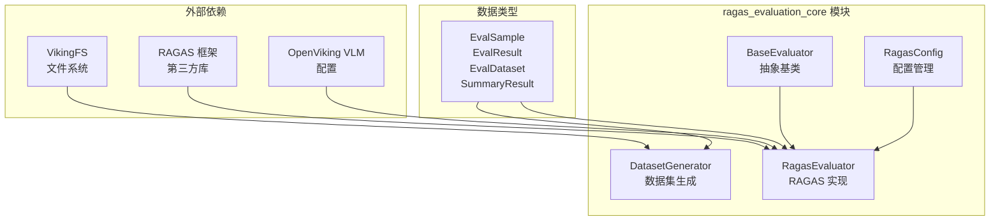
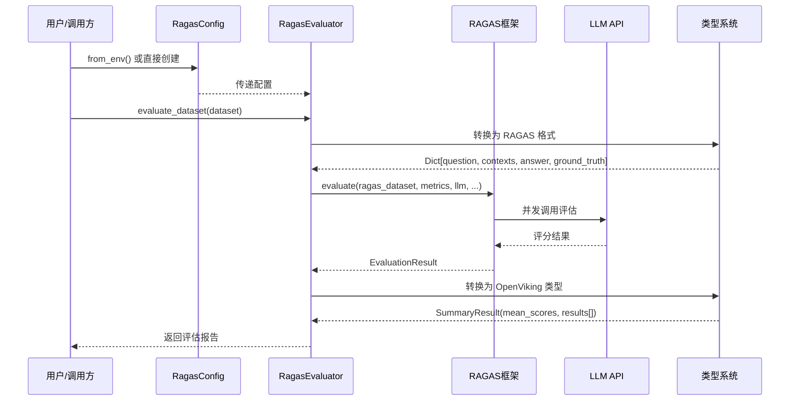

# ragas_evaluation_core 模块文档

## 概述

`ragas_evaluation_core` 模块是 OpenViking 系统中负责 **RAG（检索增强生成）评估** 的核心组件。如果你是第一次接触这个模块，可以把它想象成一个"质量检验员"——它专门负责回答这样一个问题：**"我们的 RAG 系统回答问题回答得好不好？"**

在实际的 RAG 应用中，一个典型的工作流程是：用户提问 → 系统从知识库检索相关文档 → 将检索到的文档作为上下文提供给 LLM → LLM 生成回答。这个流程涉及两个关键环节的"好坏"：**检索质量**（是否找到了相关的文档）和**生成质量**（基于检索到的文档，回答是否准确、是否产生了幻觉）。

RAGAS（Retrieval Augmented Generation Assessment）框架正是为了量化这两个质量指标而设计的。本模块将 RAGAS 框架集成到 OpenViking 中，提供了开箱即用的评估能力，同时保持了与 OpenViking 现有基础设施（VLM 配置、VikingFS 存储）的无缝衔接。

---

## 架构概览



### 核心组件职责

| 组件 | 职责 | 设计意图 |
|------|------|----------|
| **RagasConfig** | 集中管理评估配置（并发数、超时、重试等） | 允许运行时灵活调整评估行为，无需修改代码 |
| **BaseEvaluator** | 定义评估器的抽象接口 | 为将来支持其他评估框架（如 LangChain Eval）预留扩展点 |
| **DatasetGenerator** | 从 VikingFS 或原始文本生成测试数据集 | 实现评估数据的自动化生成，降低人工标注成本 |
| **RagasEvaluator** | RAGAS 框架的具体实现 | 整合 RAGAS metrics 与 OpenViking 的配置体系 |

---

## 核心抽象与心智模型

### 评估的数据流

理解这个模块的关键在于理解 **评估样本（EvalSample）** 的生命周期：

1. **构建阶段**：一个评估样本包含四个核心字段：
   - `query`：用户提出的问题
   - `context`：检索系统返回的上下文文档列表
   - `response`：LLM 基于上下文生成的答案
   - `ground_truth`：标准答案（用于计算真实分数）

2. **评估阶段**：RagasEvaluator 接收样本，使用 RAGAS 的多个指标（如 Faithfulness、Answer Relevancy、Context Precision、Context Recall）计算分数。

3. **聚合阶段**：SummaryResult 将所有样本的分数汇总为平均值，同时保留每个样本的详细结果。

### 为什么使用这些指标？

RAGAS 框架设计了四个核心指标来评估 RAG 系统：

| 指标 | 衡量内容 | 公式直觉 |
|------|----------|----------|
| **Faithfulness** | 生成答案是否忠实于检索到的上下文（没有"幻觉"） | "答案中的每个陈述是否都能在上下文中找到依据？" |
| **Answer Relevancy** | 生成答案与问题的相关程度 | "答案是否真正回答了问题，而不是答非所问？" |
| **Context Precision** | 检索到的上下文与问题的相关程度 | "top-k 检索结果中，有多少比例是真正相关的？" |
| **Context Recall** | 检索到的上下文覆盖ground truth的程度 | "标准答案中的信息有多少被检索到了？" |

这四个指标形成了一个完整的评估视角：既看检索（Context Precision/Recall），又看生成（Faithfulness/Answer Relevancy）。

---

## 关键设计决策与权衡

### 1. 配置优先级策略

RagasConfig 实现了三级配置优先级：

```python
# 实际优先级（从高到低）
llm = llm or _create_ragas_llm_from_config()  # 参数传入 > 环境变量 > 配置文件
```

**为什么这样设计？**

- **参数传入最高**：在代码中显式传入 LLM 是最可控的方式，适合测试和脚本场景
- **环境变量次之**：适合需要快速切换模型但不方便修改配置文件的 CI/CD 场景
- **配置文件最低**：适合长期稳定的默认配置

**权衡**：这种设计增加了代码复杂度（需要解析多个来源），但极大地提升了灵活性。新加入的开发者需要注意，如果同时设置了环境变量和配置文件，代码的行为可能与直觉相反。

### 2. 异步评估的实现

```python
loop = asyncio.get_event_loop()
result = await loop.run_in_executor(
    None,
    lambda: evaluate(...)  # RAGAS 的 evaluate 是同步函数
)
```

**为什么这样做？**

RAGAS 框架的 `evaluate()` 函数是同步的，但评估是一个 I/O 密集型任务（需要调用 LLM API）。如果直接在 async 函数中调用同步函数，会阻塞事件循环。

这里使用了 `run_in_executor` 将同步调用"封装"到线程池中执行，从而不阻塞 asyncio 事件循环。

**潜在风险**：如果评估量非常大（数千个样本），线程池可能成为瓶颈。更激进的做法是使用 `ProcessPoolExecutor` 来绕过 GIL，但会增加进程间通信的开销。

### 3. 配置与实现的耦合

`RagasEvaluator` 接收大量可选参数（max_workers、batch_size、timeout 等），这些参数既可以通过 `RagasConfig` 对象传入，也可以单独传入。

```python
def __init__(
    self,
    metrics: Optional[List[Any]] = None,
    llm: Optional[Any] = None,
    embeddings: Optional[Any] = None,
    config: Optional[RagasConfig] = None,
    max_workers: Optional[int] = None,  # 可以覆盖 config
    batch_size: Optional[int] = None,   # 可以覆盖 config
    # ...
):
```

**权衡**：这种设计允许两种使用模式：
- 简单模式：创建一个 config 对象，传给 evaluator
- 精细模式：直接覆盖特定参数

但这增加了 API 的复杂度，需要文档清晰说明参数覆盖的逻辑。

### 4. LLM 配置的双轨制

```python
env_config = _get_llm_config_from_env()
if env_config:
    # 优先使用环境变量
    return llm_factory(...)

# 其次尝试 OpenViking 配置文件
config = get_openviking_config()
vlm_config = config.vlm
```

**为什么需要两套？**

- **环境变量**：适合容器化部署和云函数场景，配置随进程生命周期
- **配置文件**：适合本地开发和企业级部署，配置持久化

---

## 数据流追踪

### 完整评估流程



### 数据转换的关键点

RAGAS 期望的数据格式是一个 flat 的字典：

```python
data = {
    "question": [s.query for s in dataset.samples],
    "contexts": [s.context for s in dataset.samples],
    "answer": [s.response or "" for s in dataset.samples],
    "ground_truth": [s.ground_truth or "" for s in dataset.samples],
}
```

这与 OpenViking 内部使用的 `EvalSample`（Pydantic 模型）不同。评估器承担了数据格式转换的职责。

---

## 依赖关系

### 上游依赖（谁调用这个模块）

| 模块 | 依赖方式 |
|------|----------|
| **retrieval_query_orchestration** | `RAGQueryPipeline` 使用本模块进行端到端 RAG 评估 |
| **evaluation_recording_and_storage_instrumentation** | 录制/回放机制与评估结果存储 |

### 下游依赖（这个模块依赖什么）

| 依赖 | 作用 |
|------|------|
| **ragas** | 核心评估框架（第三方） |
| **datasets** | 将评估数据转为 HuggingFace Dataset 格式 |
| **openviking_cli.utils.config** | 读取 OpenViking VLM 配置 |
| **openviking.storage.viking_fs** | DatasetGenerator 访问 VikingFS |

---

## 扩展点与边界

### 可扩展的地方

1. **新增评估指标**：RAGAS 支持自定义指标，可以通过扩展 `metrics` 参数添加
2. **自定义数据集生成器**：DatasetGenerator 的 `generate_from_viking_path` 和 `generate_from_content` 方法可以子类化
3. **新的评估框架**：BaseEvaluator 定义了抽象接口，可以实现 `LangChainEvaluator`、`AutoEvalEvaluator` 等

### 锁定的地方

- **数据类型**：EvalSample、EvalResult 等 Pydantic 模型是与其他模块的数据契约，修改需谨慎
- **RAGAS 依赖**：评估核心逻辑绑定在 RAGAS 框架上，短期内不会解耦

---

## 新贡献者注意事项

### 常见陷阱

1. **LLM 未配置时的静默失败**
   
   如果没有配置 LLM，`RagasEvaluator` 不会在初始化时抛出异常，而是在 `evaluate_dataset` 时抛出：
   
   ```python
   if self.llm is None:
       raise ValueError("RAGAS evaluation requires an LLM...")
   ```
   
   **建议**：在调用评估前检查 LLM 是否可用。

2. **空数据集的处理**
   
   `BaseEvaluator.evaluate_dataset` 使用简单的串行循环：
   
   ```python
   for sample in dataset.samples:
       res = await self.evaluate_sample(sample)
       results.append(res)
   ```
   
   如果 `dataset.samples` 为空，会返回 `mean_scores={}` 而不是抛出异常。这可能导致下游分析代码的空指针异常。

3. **环境变量类型转换**
   
   `RagasConfig.from_env()` 使用 `int(os.environ.get(...))`，如果环境变量设置了非数字字符串（如 `"abc"`），会抛出 `ValueError` 而非静默使用默认值。

4. **RAGAS 版本兼容性**
   
   代码中使用了 RAGAS 的内部模块：
   
   ```python
   from ragas.metrics._answer_relevance import AnswerRelevancy
   from ragas.metrics._faithfulness import Faithfulness
   ```
   
   这些路径可能在不同版本中变化。如果 RAGAS 升级后导入失败，需要检查新的导入路径。

### 调试技巧

1. **开启详细日志**
   
   ```python
   import logging
   logging.getLogger("openviking.eval.ragas").setLevel(logging.DEBUG)
   ```

2. **使用小数据集测试**
   
   评估 LLM 调用是按量计费的，先用小数据集验证流程：
   
   ```python
   dataset = EvalDataset(samples=dataset.samples[:3])
   result = await evaluator.evaluate_dataset(dataset)
   ```

---

## 子模块文档

本模块包含以下子模块，点击链接查看详细文档：

- [base_evaluator](base_evaluator.md) - 抽象评估器基类，定义评估接口契约
- [ragas_evaluation_core-dataset_generator](ragas_evaluation_core-dataset_generator.md) - 数据集生成器，从 VikingFS 或文本生成评估样本
- [ragas_evaluation_core-ragas_config_and_evaluator](ragas_evaluation_core-ragas_config_and_evaluator.md) - RAGAS 配置与 RagasEvaluator 实现
- [openviking-eval-ragas-types](openviking-eval-ragas-types.md) - 数据类型定义（EvalSample、EvalResult、EvalDataset、SummaryResult）

---

## 相关文档

- [检索与评估整体架构](retrieval_and_evaluation.md)
- [RAG 查询管道](retrieval_and_evaluation-retrieval_query_orchestration.md)
- [评估录制与存储](evaluation-recording-and-storage-instrumentation.md)