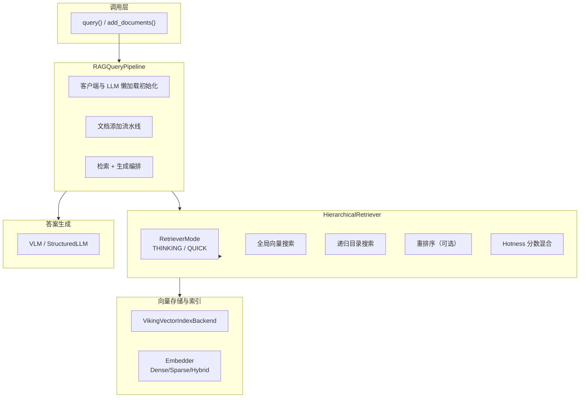

# retrieval_query_orchestration 模块技术深度解析

## 概述

`retrieval_query_orchestration` 模块是 OpenViking 系统中负责**检索查询编排**的核心组件。它解决的问题是：如何在庞大的知识空间（包含文档、代码仓库、记忆、技能等）中高效定位与用户查询最相关的上下文，并将检索结果与 LLM 生成能力结合，形成完整的 RAG（检索增强生成）管道。

这个模块的独特之处在于它采用了**分层递归检索**策略——不是简单地在大规模向量数据库中进行"平铺式"搜索，而是模拟人类查找信息的方式：从顶层目录或全局搜索结果出发，逐层向下探索，同时通过分数传播机制将父目录的相关性传递给子节点。这意味着一个高相关的父目录会"拉动"其所有子节点的整体得分，使得检索结果更加符合人类的直觉认知。

---

## 架构概览



从架构图中可以看出，该模块处于整个系统的**编排层**位置：它向下调用向量存储和嵌入服务，向上对接 LLM 进行答案生成。`RAGQueryPipeline` 提供了面向用户的简化 API，而 `HierarchicalRetriever` 实现了核心的检索逻辑，两者的职责边界清晰：前者负责流程编排和资源管理，后者负责搜索算法的实现。

---

## 核心组件深度解析

### 1. RAGQueryPipeline：面向用户的 RAG 编排器

**设计意图**：许多 RAG 系统的使用者需要编写大量样板代码来初始化客户端、处理文档、调用检索、拼接提示词、调用 LLM。`RAGQueryPipeline` 将这一系列操作封装为三个简洁的方法：`add_documents()`、`add_code_repos()` 和 `query()`，让用户可以像调用普通函数一样完成完整的 RAG 流程。

**懒加载机制**：该类采用了**延迟初始化**模式，客户端和 LLM 并不在 `__init__` 时创建，而是在首次调用时才创建。这是有意为之的设计——在某些场景下，用户可能只需要添加文档而不需要立即查询，如果过早初始化客户端会造成不必要的资源消耗和启动延迟。

```python
def _get_client(self):
    """Lazy initialization of OpenViking client."""
    if self._client is None:
        # 仅在首次调用时读取配置文件并初始化
        config = OpenVikingConfig.from_dict(config_dict)
        self._client = ov.SyncOpenViking(path=self.data_path, config=config)
        self._client.initialize()
    return self._client
```

**数据流追踪**：

1. 用户调用 `add_documents(docs_dirs, wait, timeout)`
2. 遍历每个路径，调用 `client.add_resource()` 将文档添加到 OpenViking
3. 返回根 URI 列表供后续查询使用

4. 用户调用 `query(question, top_k, generate_answer)`
5. 调用 `client.search()` 获取 top_k 个最相关上下文
6. 如果 `generate_answer=True`，提取前 3 个上下文片段，拼接提示词，调用 LLM 生成答案
7. 返回包含 `question`、`contexts`、`answer`、`retrieved_uris` 的字典

**返回值契约**：无论是否生成答案，返回结构始终包含 `question`、`contexts`、`retrieved_uris` 四个键。即使 LLM 调用失败，`answer` 字段也会包含错误信息而非抛出异常，确保调用方可以安全地处理结果。

**配置依赖**：`RAGQueryPipeline` 依赖外部配置文件（默认 `./ov.conf`）来初始化客户端，这意味着它假设运行时环境中存在有效的配置文件。新加入团队的开发者需要注意：如果配置文件路径错误或内容格式不正确，初始化会失败并抛出异常。

---

### 2. HierarchicalRetriever：分层递归检索器

**设计意图**：传统的向量检索在大规模知识库中存在"语义漂移"问题——查询与文档的向量相似度并不总是与人对相关性的判断一致。`HierarchicalRetriever` 通过引入**层级结构**和**分数传播**来解决这个问题：将目录树视为有向图，父目录的相关性分数会按一定权重传递给子节点，从而实现"浏览式"检索体验。

**核心参数**：

- `MAX_CONVERGENCE_ROUNDS = 3`：连续多少轮检索结果top-k集合不变化则提前终止。这是一个重要的性能优化——如果继续搜索不能改变结果，何必浪费计算资源？
- `SCORE_PROPAGATION_ALPHA = 0.5`：分数传播系数。设置为 0.5 表示父目录分数和子节点分数各占 50%，这个值是经验值，在实际使用中可能需要根据数据特点调整。
- `DIRECTORY_DOMINANCE_RATIO = 1.2`：目录得分必须超过其最高子节点得分的倍数。这个参数防止低相关目录因为分数传播而排挤高相关叶子节点。
- `GLOBAL_SEARCH_TOPK = 3`：全局检索返回的补充起始点数量。
- `HOTNESS_ALPHA = 0.2`：热度和语义分数的混合权重，0 表示禁用热度加权。

**RetrieverMode 枚举**：

```python
class RetrieverMode(str):
    THINKING = "thinking"  # 深度模式，使用重排序
    QUICK = "quick"        # 快速模式，跳过重排序
```

这个枚举体现了**准确性与速度的权衡**：`THINKING` 模式会调用重排序服务对候选结果进行二次排序（虽然当前版本的重排序客户端尚未完全实现），`QUICK` 模式则跳过这一步直接使用向量相似度。默认使用 `THINKING` 模式意味着系统倾向于准确性。

**递归搜索算法流程**：

1. **准备阶段**：生成查询向量（稠密和稀疏），确定起始目录列表
2. **全局搜索**：在顶层目录执行向量搜索，获取补充的起始点
3. **起点合并**：将用户指定的目录与全局搜索结果合并，去重后形成优先队列
4. **递归探索**：使用最小堆维护待探索目录队列，按分数排序依次弹出处理
5. **分数计算**：对每个子节点计算 `final_score = alpha * child_score + (1 - alpha) * parent_score`
6. **阈值过滤**：仅保留超过阈值的候选结果
7. **收敛检测**：每轮检索后检查 top-k 集合是否变化，连续 3 轮不变则提前终止
8. **结果转换**：将候选结果转换为 `MatchedContext`，并应用热度加权

**热度分数机制**：这是该模块最巧妙的设计之一。检索结果不仅考虑语义相似度，还引入了"热度"概念——一个被频繁访问、最近更新的上下文应该获得额外加分。热度分数的计算公式为：

```
score = sigmoid(log1p(active_count)) * time_decay(updated_at)
```

其中 `sigmoid(log1p(active_count))` 将访问次数映射到 (0,1) 区间，`time_decay` 是基于半衰期的指数衰减。这确保了：
- 访问次数越多，分数越高（但增长曲线逐渐放缓）
- 更新时间越近，分数越高
- 长时间未访问的冷门内容即使语义相关也会被适度降权

---

## 依赖分析与数据契约

### 上游调用者

该模块被以下组件调用：

- **Ragas 评估框架**：`RAGQueryPipeline` 是 Ragas 评估流水线的核心组件，用于生成评估所需的问答对。参考 [ragas_evaluation_core](./ragas_evaluation_core.md) 了解评估框架如何与检索模块交互。
- **搜索 API 路由**：`HierarchicalRetriever` 被 `server/routers/search` 中的端点调用，处理来自前端的搜索请求。
- **会话上下文管理**：当用户与 AI 助手对话时，系统需要检索相关上下文，这会调用 `HierarchicalRetriever`。

### 下游依赖

- **向量存储** (`VikingVectorIndexBackend`)：负责实际执行向量搜索和目录遍历。模块假设向量存储已经过正确初始化，否则会返回空结果并记录警告。
- **嵌入服务** (`Embedder`)：支持稠密向量、稀疏向量或混合向量。嵌入器负责将文本查询转换为向量表示，这是检索的入口。
- **重排序服务** (`RerankClient`)：可选依赖，当前版本代码显示重排序功能尚未完全实现，但架构已预留扩展点。
- **VLM/LLM** (`StructuredLLM`)：用于答案生成。仅在 `generate_answer=True` 时调用。
- **配置系统** (`OpenVikingConfig`, `RerankConfig`)：提供运行时配置参数。

### 数据契约

**输入**：`TypedQuery` 对象，包含：
- `query`: 查询文本
- `context_type`: 目标上下文类型（MEMORY / RESOURCE / SKILL）
- `target_directories`: 可选的目录 URI 列表
- `intent`, `priority`: 额外元信息

**输出**：`QueryResult` 对象，包含：
- `query`: 原始查询
- `matched_contexts`: `MatchedContext` 列表，按最终得分降序排列
- `searched_directories`: 搜索过的顶层目录列表

**MatchedContext 关键字段**：
- `uri`: 资源的唯一标识符
- `context_type`: 上下文类型
- `abstract`: 摘要内容
- `score`: 最终混合得分（语义分数 + 热度分数）
- `relations`: 相关上下文列表（最多 5 个）

---

## 设计决策与 tradeoff 分析

### 1. 同步 vs 异步

`HierarchicalRetriever` 的 `retrieve()` 方法是 `async` 的，但内部调用了大量 `await`。这是一个有意为之的设计选择：向量存储搜索是 I/O 密集型操作，异步可以让检索在等待网络响应时释放 GIL，提升并发处理能力。但如果调用方是同步代码（如简单的 CLI 工具），需要使用 `asyncio.run()` 或类似的机制来执行检索。

### 2. 分数传播策略

采用 `alpha * child_score + (1 - alpha) * parent_score` 的线性混合，而非更复杂的贝叶斯推理或图神经网络，是出于**简单性和可解释性**的考量。线性公式的参数少、易调优、结果可解释——用户可以直观理解"为什么这个文件被排在这么前面"。当然，这也意味着模块的算法天花板受限，未来可能需要引入更复杂的图算法。

### 3. 热度分数作为"软"排名因子

热度分数的权重默认为 0.2，这意味着它只占总分数的 20%。这是一个**谨慎的平衡**：引入热度机制可以让检索结果更贴近用户的实际关注点，但过高的权重会导致搜索结果频繁变化（因为访问模式不稳定），降低结果的可预测性。设置为 0.2 既能体现"热门内容更相关"的直觉，又不会过度干扰语义相关性。

### 4. 收敛检测作为早期退出机制

`MAX_CONVERGENCE_ROUNDS = 3` 的设计基于一个观察：在大多数情况下，如果连续几轮检索都不能改变 top-k 结果，继续搜索只是在做无用功。这不仅节省了计算资源，更重要的是**改善了用户体验**——用户不希望等待一个"永远无法给出更好结果"的搜索过程。不过，这也意味着在某些边界情况下（如数据分布极其不均匀），系统可能过早退出。

### 5. 重排序功能的未完成状态

代码中多次出现重排序相关的逻辑（如 `_rerank_client.rerank_batch()`），但实际的 `_rerank_client` 初始化被标记为 `TODO`。这表明团队**预留了架构扩展点**，但当前版本优先保证核心检索功能的稳定性。开发者在使用 THINKING 模式时应该意识到这一点——目前 THINKING 和 QUICK 模式的实际行为可能差别不大。

---

## 使用指南与示例

### 基本使用：RAGQueryPipeline

```python
from openviking.eval.ragas.pipeline import RAGQueryPipeline

# 初始化流水线
pipeline = RAGQueryPipeline(
    config_path="./ov.conf",
    data_path="./data"
)

# 添加文档
docs = ["./docs/api.md", "./docs/architecture.md"]
root_uris = pipeline.add_documents(docs, wait=True, timeout=300)
print(f"Added: {root_uris}")

# 执行检索和生成
result = pipeline.query(
    question="How does the retrieval pipeline work?",
    top_k=5,
    generate_answer=True
)

print(f"Question: {result['question']}")
print(f"Contexts: {len(result['contexts'])}")
print(f"Answer: {result['answer']}")

# 清理资源
pipeline.close()
```

### 低级使用：HierarchicalRetriever

```python
from openviking.retrieve.hierarchical_retriever import HierarchicalRetriever, RetrieverMode
from openviking_cli.retrieve.types import TypedQuery, ContextType
from openviking.server.identity import RequestContext, Role, User

# 假设你已经初始化了 storage 和 embedder
retriever = HierarchicalRetriever(
    storage=vector_store,
    embedder=embedder,
    rerank_config=None  # 当前版本不使用重排序
)

# 构建查询
query = TypedQuery(
    query="authentication flow",
    context_type=ContextType.RESOURCE,
    target_directories=["viking://resources/api"]
)

# 执行检索
result = await retriever.retrieve(
    query=query,
    ctx=RequestContext(user=User(...), role=Role.USER),
    limit=10,
    mode=RetrieverMode.THINKING,
    score_threshold=0.1
)

# 处理结果
for ctx in result.matched_contexts:
    print(f"{ctx.uri}: score={ctx.score:.3f}, abstract={ctx.abstract[:50]}...")
```

### 配置调优

对于大规模知识库，可能需要调整以下参数：

```python
retriever = HierarchicalRetriever(
    storage=storage,
    embedder=embedder,
    rerank_config=None
)

# 调整分数传播系数（提高父目录影响）
retriever.SCORE_PROPAGATION_ALPHA = 0.7

# 调整热度权重（降低热度影响）
retriever.HOTNESS_ALPHA = 0.1

# 调整收敛轮数（更激进的早期退出）
retriever.MAX_CONVERGENCE_ROUNDS = 2
```

---

## 边缘情况与常见陷阱

### 1. 空结果处理

如果集合尚未创建（`collection_exists_bound()` 返回 `False`），检索会返回空的 `QueryResult` 而非抛出异常。调用方应该检查 `matched_contexts` 是否为空，而非假设一定能获取到结果。

### 2. 配置缺失

`RAGQueryPipeline` 在配置文件缺失或格式错误时会抛出异常。由于懒加载机制，这个问题不会在初始化时暴露，而会在首次调用时暴露。建议在应用启动时进行配置验证。

### 3. 稀疏向量兼容性

代码中同时处理了 `dense_vector` 和 `sparse_vector`，但并非所有嵌入器都支持稀疏向量。如果 `embedder.embed()` 返回的 `EmbedResult` 不包含稀疏向量，后续的向量搜索会降级为仅使用稠密向量（如果后端支持）。这不一定是错误，但可能影响检索质量。

### 4. 热度分数的时区问题

`hotness_score` 函数会将 naive datetime 自动转换为 UTC aware datetime，但如果系统的 `datetime.now()` 与存储的 `updated_at` 时区不一致，可能导致计算结果不准确。建议在数据写入时就使用 UTC 时间戳。

### 5. 目录层级的假设

代码假设目录树中存在 `level` 字段用于判断节点是否为叶子节点（`level == 2` 被视为叶子）。如果数据源的层级定义与此不符，递归搜索的行为可能会异常。开发者需要确保向量存储中的文档正确设置了 `level` 字段。

### 6. 作用域过滤的交互

`scope_dsl` 参数允许调用方传入额外的过滤条件（如权限过滤），但这个参数会直接传递给向量存储的后端搜索方法。如果 `scope_dsl` 包含的字段与索引字段不匹配，可能会导致过滤失效或意外结果。

---

## 相关文档

- **[检索与评估整体架构](retrieval_and_evaluation.md)**：模块在整体系统中的定位
- **[ragas_evaluation_core](retrieval_and_evaluation-ragas_evaluation_core.md)**：RAG 评估框架如何使用 `RAGQueryPipeline` 生成测试数据
- **[model_providers_embeddings_and_vlm](./model_providers_embeddings_and_vlm.md)**：嵌入服务的抽象接口和实现
- **[client_session_and_transport](./client_session_and_transport.md)**：`SyncOpenViking` 客户端的内部实现
- **[configuration_models_and_singleton](./configuration_models_and_singleton.md)**：配置管理机制详解
- **[session_memory_deduplication](./session_memory_deduplication.md)**：记忆去重机制，与检索结果的后处理相关
- **[storage_core_and_runtime_primitives](./storage_core_and_runtime_primitives.md)**：向量存储底层接口

---

## 总结

`retrieval_query_orchestration` 模块是 OpenViking 系统中连接**语义检索**与**知识生成**的关键桥梁。它的设计体现了几个核心原则：首先是**分层抽象**——从高层 API 到低级检索算法，职责清晰分离；其次是**可调优性**——通过暴露各种参数（alpha、threshold、convergence rounds）让使用者可以根据具体场景优化效果；最后是**务实取舍**——在准确性、速度、可解释性之间选择了保守但稳健的方案。

对于新加入的开发者，建议先从 `RAGQueryPipeline` 入手理解整体流程，再深入 `HierarchicalRetriever` 的递归搜索算法。特别注意热度分数机制和收敛检测这两个设计，它们是该模块区别于普通向量检索的核心创新点。