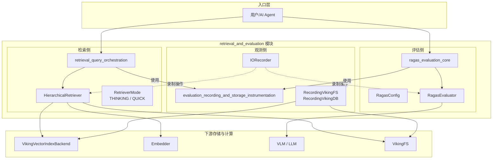
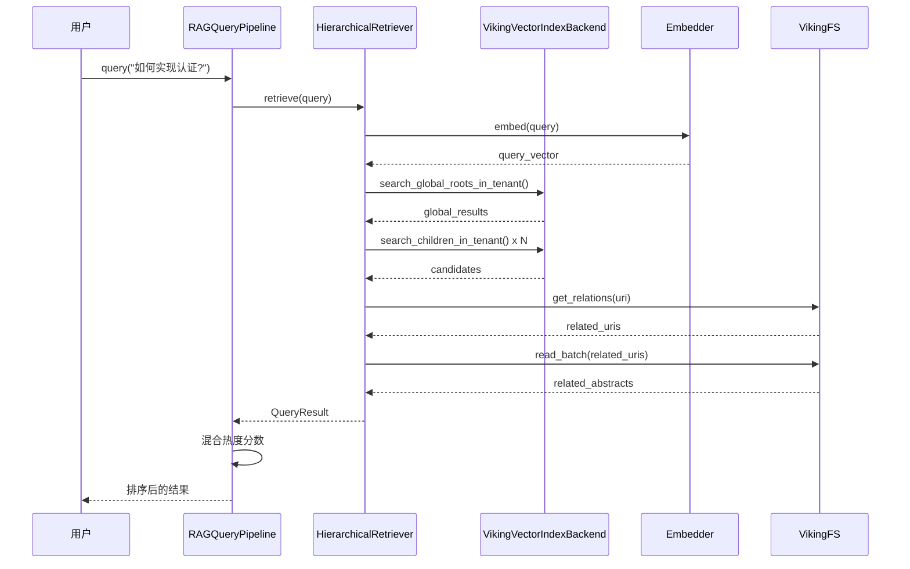
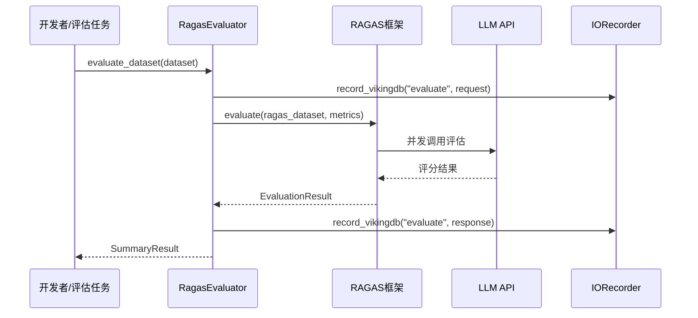

# retrieval_and_evaluation 模块技术深度解析

## 概述

`retrieval_and_evaluation` 是 OpenViking 系统中负责**检索与评估**的核心模块。如果你刚加入团队，可以把这个模块想象成整个系统的"眼睛"和"质检员"——它一方面负责在浩瀚的知识海洋中精准定位用户需要的信息，另一方面则负责评估这些信息的质量如何。

这个模块解决的问题具有双重性：**检索侧**需要解决"如何在分级目录结构中找到最相关的文档"，**评估侧**需要解决"如何量化 RAG 系统（检索增强生成）的质量"。前者是一个搜索算法问题，后者是一个可观测性和指标量化问题。OpenViking 将这两个看似独立的问题统一在同一个模块下，因为它们共享同一个目标——让 AI 系统能够更好地利用知识。

本模块由三个核心子模块构成：
- **[retrieval_query_orchestration](retrieval_and_evaluation-retrieval_query_orchestration.md)**：负责从知识库中检索相关内容
- **[ragas_evaluation_core](retrieval_and_evaluation-ragas_evaluation_core.md)**：负责评估 RAG 系统的质量
- **[evaluation_recording_and_storage_instrumentation](evaluation-recording-and-storage-instrumentation.md)**：负责录制和存储评估过程中的 IO 操作

---

## 问题空间：为什么需要这个模块

### 检索侧的问题

在实际的 RAG 应用中，一个典型的工作流程是：用户提问 → 系统从知识库检索相关文档 → 将检索到的文档作为上下文提供给 LLM → LLM 生成回答。这个流程涉及两个关键环节：

1. **检索质量问题**：向量检索在大规模知识库中存在"语义漂移"问题——查询与文档的向量相似度并不总是与人对相关性的判断一致。简单的 top-k 搜索无法捕捉目录结构的语义层级关系。

2. **检索效率问题**：如果每次查询都遍历整个向量空间，计算成本高昂。需要一种机制来限制搜索范围，同时不牺牲召回率。

### 评估侧的问题

即使检索系统运行正常，我们仍然需要回答：**"我们的 RAG 系统回答问题回答得好不好？"** 这不是一个简单的是非题，而是需要分解为多个可量化的指标：

- **检索质量**：是否找到了真正相关的文档？
- **生成质量**：基于检索到的文档，回答是否准确、是否产生了幻觉？
- **性能问题**：哪个环节耗时最长？哪个操作最容易失败？

没有评估能力，团队只能在黑暗中摸索优化方向。

---

## 架构概览



### 各子模块的职责边界

| 子模块 | 职责 | 核心抽象 |
|--------|------|----------|
| **retrieval_query_orchestration** | 分层递归检索 + RAG 管道编排 | `HierarchicalRetriever`、`RAGQueryPipeline` |
| **ragas_evaluation_core** | RAG 质量评估框架 | `RagasEvaluator`、`EvalDataset` |
| **evaluation_recording_and_storage_instrumentation** | IO 操作录制与回放 | `IORecorder`、`RecordingVikingDB` |

---

## 核心抽象与心智模型

理解这个模块的关键在于把握**三层抽象**：

### 第一层：检索编排（RAGQueryPipeline）

这是面向用户的**高级 API**。如果你只需要一个"添加文档 → 查询 → 获取答案"的简单流程，只需要与这一层交互。它将复杂的初始化、配置加载、资源管理封装在内部，对外提供三个简洁方法：

```python
pipeline = RAGQueryPipeline(config_path="./ov.conf", data_path="./data")
root_uris = pipeline.add_documents(["./docs"])
result = pipeline.query("How do I authenticate?", top_k=5, generate_answer=True)
```

### 第二层：分层检索（HierarchicalRetriever）

这是检索算法的**核心实现**。它采用了**分层递归检索**策略——不是简单地在大规模向量数据库中进行"平铺式"搜索，而是模拟人类查找信息的方式：从顶层目录或全局搜索结果出发，逐层向下探索，同时通过分数传播机制将父目录的相关性传递给子节点。

```python
result = await retriever.retrieve(
    query=TypedQuery(query="authentication", context_type=ContextType.RESOURCE),
    ctx=RequestContext(user=User(...), role=Role.USER),
    limit=10,
    mode=RetrieverMode.THINKING
)
```

### 第三层：评估与录制

这是支撑**质量保障**的两套机制：
- **RAGAS 评估**：使用量化指标（Faithfulness、Answer Relevancy、Context Precision、Context Recall）评估检索和生成质量
- **IO 录制**：记录所有文件系统和向量数据库操作，供事后分析

---

## 关键设计决策与权衡

### 1. 分层递归检索 vs 平铺式搜索

**选择**：分层递归检索 + 分数传播

**为什么这样设计？**

传统的向量检索是"平铺式"的——所有文档处于同一层级，top-k 依据向量相似度排序。但这忽略了一个关键观察：**目录结构本身携带语义信息**。一个父目录"AI/论文/Transformer"与其子文件"Attention is All You Need.pdf"存在语义关联。

`HierarchicalRetriever` 将目录树视为有向图，父目录的相关性分数会按一定权重（`SCORE_PROPAGATION_ALPHA = 0.5`）传递给子节点。这实现了"浏览式"检索体验——用户感觉系统像人一样在目录中逐层筛选。

** tradeoff**：

- 优点：结果更符合人类直觉，语义漂移问题得到缓解
- 缺点：计算复杂度更高（需要遍历目录树），参数需要调优

### 2. 热度分数作为"软"排名因子

**选择**：语义分数与热度分数的线性混合（默认 80% 语义 + 20% 热度）

**为什么这样设计？**

一个被频繁访问、最近更新的上下文应该获得额外加分——这符合"热门内容更可能相关"的直觉。热度分数的计算公式综合了访问次数（`active_count`）和更新时间（`updated_at`）：

- 访问次数越多，分数越高（但增长曲线逐渐放缓，由 sigmoid 调节）
- 更新时间越近，分数越高（基于半衰期的指数衰减）

** tradeoff**：

- 优点：检索结果更贴近用户的实际关注点
- 缺点：权重为 0.2 意味着热度机制是"软"的，不会过度干扰语义相关性

### 3. 异步评估的实现

**选择**：使用 `asyncio.run_in_executor` 将同步的 RAGAS 评估调用封装到线程池

```python
loop = asyncio.get_event_loop()
result = await loop.run_in_executor(
    None,
    lambda: evaluate(...)  # RAGAS 的 evaluate 是同步函数
)
```

**为什么这样设计？**

RAGAS 框架的 `evaluate()` 函数是同步的，但评估是 I/O 密集型任务（需要调用 LLM API）。如果直接在 async 函数中调用同步函数，会阻塞事件循环。

** tradeoff**：

- 优点：不阻塞事件循环，可以并发处理多个评估任务
- 缺点：如果评估量非常大（数千个样本），线程池可能成为瓶颈

### 4. 包装器模式 vs 装饰器模式

**选择**：`RecordingVikingFS` 和 `RecordingVikingDB` 使用 `__getattr__` 动态代理

**为什么这样设计？**

VikingFS 和 VikingDB 是外部维护的核心类，不适合直接修改。使用包装器可以在不侵入原有代码的情况下添加观测能力——每次调用都会自动记录请求、响应、延迟和成功状态。

** tradeoff**：

- 优点：透明拦截所有方法（包括未来新增的方法），无需修改原有类
- 缺点：运行时拦截有一定性能开销（约 5-10%），IDE 无法静态提示

### 5. JSONL 而不是数据库

**选择**：使用 JSONL 格式持久化录制数据

**为什么这样设计？**

评估录制是**离线批处理**场景，不是实时查询场景。JSONL 的顺序写入性能好，且便于后续用 Spark/Flink 等批处理框架分析。

** tradeoff**：

- 优点：Append-only 写入简单、无需额外依赖、可直接用 `grep`/`jq` 查看
- 缺点：大量小文件会导致文件系统压力、查询能力弱

---

## 数据流追踪

### 完整检索流程



### 完整评估流程



---

## 依赖关系

### 上游调用者

| 模块 | 依赖方式 |
|------|----------|
| **server_api_contracts** | 搜索 API 端点调用 `HierarchicalRetriever` |
| **core_context_prompts_and_sessions** | 会话上下文管理调用检索获取相关记忆 |
| **ragas_evaluation_core** | 内部使用 `RAGQueryPipeline` 生成测试数据 |

### 下游依赖

| 依赖模块 | 作用 |
|----------|------|
| **model_providers_embeddings_and_vlm** | 提供嵌入服务和 LLM 生成能力 |
| **storage_core_and_runtime_primitives** | 向量存储后端接口 |
| **python_client_and_cli_utils** | 配置管理和类型定义 |
| **vectorization_and_storage_adapters** | 具体的向量存储实现（VikingDB、Volcengine 等） |

### 数据契约

**输入（检索侧）**：`TypedQuery` 对象
- `query`: 查询文本
- `context_type`: 目标上下文类型（MEMORY / RESOURCE / SKILL）
- `target_directories`: 可选的目录 URI 列表

**输出（检索侧）**：`QueryResult` 对象
- `matched_contexts`: 按最终得分排序的 `MatchedContext` 列表
- `searched_directories`: 搜索过的顶层目录列表

**输入（评估侧）**：`EvalDataset` 对象
- `samples`: `EvalSample` 列表，每个样本包含 query、context、response、ground_truth

**输出（评估侧）**：`SummaryResult` 对象
- `mean_scores`: 各指标的均值
- `results`: 每个样本的详细评估结果

---

## 使用指南与示例

### 场景一：简单 RAG 查询

如果你只需要一个"问答"功能：

```python
from openviking.eval.ragas.pipeline import RAGQueryPipeline

pipeline = RAGQueryPipeline(config_path="./ov.conf", data_path="./data")
pipeline.add_documents(["./docs/api.md"])
result = pipeline.query("API 认证如何实现?", top_k=5, generate_answer=True)
print(result["answer"])
pipeline.close()
```

### 场景二：精细化检索控制

如果你需要调整检索参数：

```python
from openviking.retrieve.hierarchical_retriever import HierarchicalRetriever, RetrieverMode
from openviking_cli.retrieve.types import TypedQuery, ContextType
from openviking.server.identity import RequestContext, Role, User

retriever = HierarchicalRetriever(storage, embedder, rerank_config=None)

# 调整分数传播系数
retriever.SCORE_PROPAGATION_ALPHA = 0.7
retriever.HOTNESS_ALPHA = 0.1

result = await retriever.retrieve(
    query=TypedQuery(query="authentication", context_type=ContextType.RESOURCE),
    ctx=RequestContext(user=User(...), role=Role.USER),
    limit=10,
    mode=RetrieverMode.THINKING
)
```

### 场景三：评估 RAG 质量

如果你需要评估系统的检索和生成质量：

```python
from openviking.eval.ragas import RagasEvaluator, RagasConfig, EvalDataset, EvalSample

config = RagasConfig(max_workers=16, batch_size=10)
evaluator = RagasEvaluator(config=config)

dataset = EvalDataset(samples=[
    EvalSample(
        query="什么是 Transformer?",
        context=[["Transformer 是..."]],
        response="Transformer 是一种...",
        ground_truth="Transformer 是..."
    )
])

summary = await evaluator.evaluate_dataset(dataset)
print(summary.mean_scores)
```

### 场景四：录制 IO 操作用于分析

如果你需要分析性能瓶颈或复现问题：

```python
from openviking.eval.recorder import init_recorder
from openviking.eval.recorder.wrapper import RecordingVikingFS

# 启用录制
init_recorder(enabled=True, records_dir="./records")

# 包装 VikingFS
recording_fs = RecordingVikingFS(viking_fs)
await recording_fs.read("viking://docs/readme.md")

# 分析结果
recorder = get_recorder()
stats = recorder.get_stats()
print(f"总操作数: {stats['total_count']}, 总延迟: {stats['total_latency_ms']}ms")
```

---

## 新贡献者注意事项

### 常见陷阱

1. **配置优先级混乱**
   
   `RagasConfig` 实现了三级配置优先级（参数 > 环境变量 > 配置文件），但这也可能导致配置行为与直觉相反。如果你同时设置了环境变量和配置文件，实际使用的是环境变量。

2. **空结果处理**
   
   如果集合尚未创建，检索会返回空的 `QueryResult` 而非抛出异常。调用方应该检查 `matched_contexts` 是否为空。

3. **重排序功能未完成**
   
   代码中多次出现重排序相关的逻辑，但实际的 `_rerank_client` 初始化被标记为 TODO。目前 THINKING 和 QUICK 模式的实际行为差别不大。

4. **LLM 未配置时的静默失败**
   
   如果没有配置 LLM，`RagasEvaluator` 不会在初始化时抛出异常，而是在 `evaluate_dataset` 时抛出。

5. **热度分数的时区问题**
   
   `hotness_score` 函数会将 naive datetime 自动转换为 UTC aware datetime，但如果系统的 `datetime.now()` 与存储的 `updated_at` 时区不一致，可能导致计算结果不准确。

### 调试技巧

1. **开启详细日志**
   ```python
   import logging
   logging.getLogger("openviking.retrieve").setLevel(logging.DEBUG)
   logging.getLogger("openviking.eval.ragas").setLevel(logging.DEBUG)
   ```

2. **使用小数据集测试**
   ```python
   dataset = EvalDataset(samples=dataset.samples[:3])
   result = await evaluator.evaluate_dataset(dataset)
   ```

3. **查看录制统计**
   ```python
   recorder = get_recorder()
   stats = recorder.get_stats()
   # 查看各操作的延迟分布
   print(stats["operations"])
   ```

---

## 子模块文档

本模块包含以下子模块，点击链接查看详细文档：

- [retrieval_query_orchestration](retrieval_and_evaluation-retrieval_query_orchestration.md) - 分层递归检索与 RAG 管道编排
- [ragas_evaluation_core](retrieval_and_evaluation-ragas_evaluation_core.md) - RAG 质量评估框架
- [evaluation_recording_and_storage_instrumentation](evaluation-recording-and-storage-instrumentation.md) - IO 操作录制与存储

---

## 相关模块参考

- **[model_providers_embeddings_and_vlm](model_providers_embeddings_and_vlm.md)**：嵌入服务和 VLM 的抽象接口
- **[storage_core_and_runtime_primitives](storage_core_and_runtime_primitives.md)**：向量存储底层接口
- **[python_client_and_cli_utils](python_client_and_cli_utils.md)**：配置管理与类型定义
- **[client_session_and_transport](client_session_and_transport.md)**：客户端实现细节

---

## 总结

`retrieval_and_evaluation` 模块是 OpenViking 系统中连接**语义检索**与**知识生成**的关键桥梁，同时承担着**质量评估**的职责。它的设计体现了几个核心原则：

1. **分层抽象**：从高级 API (`RAGQueryPipeline`) 到低级检索算法 (`HierarchicalRetriever`)，职责清晰分离
2. **可调优性**：通过暴露各种参数（alpha、threshold、convergence rounds）让使用者可以根据具体场景优化效果
3. **观测内建**：录制和评估能力不是事后添加的可选功能，而是模块设计的核心部分
4. **务实取舍**：在准确性、速度、可解释性之间选择了保守但稳健的方案

对于新加入的开发者，建议的学习路径是：
1. 先从 `RAGQueryPipeline` 入手理解整体流程
2. 深入 `HierarchicalRetriever` 的递归搜索算法，特别是热度分数机制和收敛检测
3. 理解 `IORecorder` 的录制机制，学会用它来诊断问题
4. 最后掌握 `RagasEvaluator` 的评估指标及其局限性