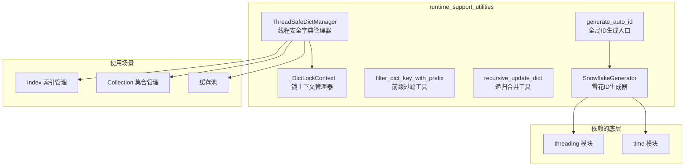

# runtime_support_utilities 模块技术文档

## 概述

`runtime_support_utilities` 模块是向量数据库存储层的**基础设施工具箱**——它不直接参与数据存储或检索的核心逻辑，而是为上层组件提供两类关键的运行时支持：**线程安全的资源管理**和**分布式唯一ID生成**。

把这个模块想象成一座摩天大楼的**地基和管线系统**：它们看不见摸不着，但每一层楼的每一次用水、用电、乘坐电梯都依赖于这些基础设施。`ThreadSafeDictManager` 就像楼的**电梯调度系统**，确保多人同时使用时不会发生混乱；`SnowflakeGenerator` 就像楼的**房间编号系统**，确保每个房间都有一个全球唯一的地址。

这个模块要解决的核心问题是：**在多线程/多进程的向量数据库运行环境中，如何安全地管理共享资源（索引缓存、集合注册表）并生成不会冲突的唯一标识符**。

---

## 架构概览



### 组件角色

| 组件 | 角色 | 职责 |
|------|------|------|
| `ThreadSafeDictManager<T>` | 线程安全容器 | 提供并发安全的字典操作（get/set/remove/iterate） |
| `_DictLockContext` | 锁上下文 | 封装 RLock 的获取/释放，确保异常时也能释放锁 |
| `SnowflakeGenerator` | ID生成器 | 基于 Snowflake 算法生成 64 位全局唯一 ID |
| `generate_auto_id` | 全局入口 | 封装默认生成器实例的便捷函数 |
| `filter_dict_key_with_prefix` | 工具函数 | 递归过滤以指定前缀开头的字典键 |
| `recursive_update_dict` | 工具函数 | 递归合并两个字典（嵌套 dict 合并，list 扩展） |

---

## 核心抽象详解

### 1. ThreadSafeDictManager：并发安全的资源注册表

`ThreadSafeDictManager` 是对 Python 内置 `dict` 的线程安全封装。想象一个图书馆的**图书管理系统**：当多个管理员同时需要查询、借阅、归还图书时，必须有一个协调机制确保同一本书不会被两个人同时借走。`ThreadSafeDictManager` 就是这个协调机制。

```python
class ThreadSafeDictManager(Generic[T]):
    def __init__(self):
        self._items: Dict[str, T] = {}
        self._lock = threading.RLock()  # 可重入锁
```

**为什么选择 RLock 而非 Lock？**

Python 的 `threading.RLock`（可重入锁）允许**同一线程多次获取锁**。这在嵌套调用场景中至关重要：

```python
# 场景：先检查是否存在，再决定是否添加
def get_or_create(self, name: str, factory: Callable[[], T]):
    with self._lock:  # 第一次获取锁
        item = self._items.get(name)
        if item is None:
            with self._lock:  # 嵌套调用，需要再次获取锁
                item = factory()
                self._items[name] = item
        return item
```

如果使用 `threading.Lock`，上述代码会触发死锁（同一个线程无法重复获取自己持有的锁），但 `RLock` 可以安全地处理这种情况。

**关键设计决策：迭代时复制数据**

```python
def iterate(self, callback: Callable[[str, T], None]):
    with self._lock:
        items = list(self._items.items())  # 在锁内复制
    
    # 在锁外执行回调，避免长时间持有锁
    for name, item in items:
        callback(name, item)
```

这是一个**重要的性能优化**：
- 如果在持有锁的情况下执行回调，其他线程会被阻塞等待
- 复制一份数据快照后释放锁，让回调在无锁状态下执行
- 代价是短暂的数据不一致（迭代期间可能被其他线程修改），但对于"遍历所有元素"的场景，这是可接受的 tradeoff

### 2. SnowflakeGenerator：分布式系统的"心跳"

`SnowflakeGenerator` 实现了 Twitter 提出的 Snowflake 算法，用于生成**全局唯一的 64 位整数 ID**。把它想象成**每台服务器都有自己的生日蛋糕制作机器**：
- 每台机器（worker）有不同的编号
- 每毫秒只能烤有限数量的蛋糕（sequence）
- 蛋糕上刻着时间戳，永远不会重复

```python
# 64 位结构
# | 1 位符号 | 41 位时间戳 | 5 位数据中心 | 5 位 worker | 12 位序列号 |
```

**时间戳部分（41 位）**

- 以自定义纪元（`EPOCH = 1704067200000`，即 2024-01-01）为起点
- 41 位可以支持约 69 年的 ID 生成（$2^{41}$ 毫秒 ≈ 69.7 年）
- 超过这个时间后，ID 会与早期冲突

**机器标识部分（10 位）**

- 5 位数据中心 ID + 5 位 Worker ID = 最多 32 个数据中心 × 32 个 Worker = 1024 个独立节点
- 在单机环境下，使用随机数初始化 datacenter_id
- worker_id 基于进程 PID 自动分配

**序列号部分（12 位）**

- 每毫秒内最多生成 4096 个 ID（$2^{12}$）
- 用尽后会阻塞到下一毫秒

**时钟回拨保护**

```python
if timestamp < self.last_timestamp:
    offset = self.last_timestamp - timestamp
    if offset <= 5:  # 小幅回拨，等待恢复
        time.sleep(offset / 1000.0 + 0.001)
        timestamp = self._current_timestamp()
    else:  # 大幅回拨，抛出异常
        raise Exception("Clock moved backwards...")
```

这是**分布式 ID 生成中最棘手的问题**：如果服务器时钟回拨，新生成的 ID 可能与历史上的 ID 冲突。代码选择：
- **小幅回拨**（≤5ms）：等待时钟恢复，温和处理
- **大幅回拨**：拒绝生成，强制运维介入

### 3. 字典操作工具函数

**filter_dict_key_with_prefix**

递归过滤字典中以指定前缀（默认为 `_`）开头的键。这在**序列化配置对象时非常有用**——可以将内部实现细节（以 `_` 开头）排除在外：

```python
class Config:
    def __init__(self):
        self.api_key = "secret"      # 公开字段
        self._internal_cache = {}    # 内部字段
        self._debug_mode = True      # 调试字段

config = Config()
filtered = filter_dict_key_with_prefix(asdict(config))
# 结果不包含 _internal_cache 和 _debug_mode
```

**recursive_update_dict**

递归合并两个字典，规则如下：
- 如果两者都是 dict，递归合并
- 如果两者都是 list，扩展目标列表
- 否则，直接覆盖

```python
target = {"a": 1, "b": {"c": 2, "d": [1, 2]}}
source = {"b": {"d": [3, 4], "e": 3}, "f": 5}

result = recursive_update_dict(target, source)
# 结果: {"a": 1, "b": {"c": 2, "d": [1, 2, 3, 4], "e": 3}, "f": 5}
```

---

## 数据流分析

### 场景一：索引的线程安全访问

```
请求线程 A                    请求线程 B
      │                          │
      ▼                          ▼
┌──────────────┐          ┌──────────────┐
│ TSDM.get()   │          │ TSDM.get()   │
│   - 获取锁   │          │   - 获取锁   │
│   - 读取     │          │   - 读取     │
│   - 释放锁   │          │   - 释放锁   │
└──────────────┘          └──────────────┘
```

**关键点**：
- 多个线程可以同时读取（读锁兼容）
- 写操作互斥，但读操作不阻塞读操作（因为 RLock 允许多个读者）
- 写操作会阻塞所有其他操作

### 场景二：唯一 ID 生成

```
生成请求
     │
     ▼
┌─────────────────────────────────────┐
│ SnowflakeGenerator.next_id()        │
│  1. 获取当前时间戳                   │
│  2. 检查时钟回拨                    │
│  3. 递增序列号或等待下一毫秒          │
│  4. 组装 64 位 ID                   │
└─────────────────────────────────────┘
     │
     ▼
   返回 int64
     │
     ▼
可用于：Collection ID、Document ID、Session ID...
```

---

## 设计决策与权衡

### 1. RLock vs Lock

**选择**：使用 `threading.RLock`
**权衡分析**：
- **优点**：支持嵌套获取，避免死锁；允许同时多个读者
- **缺点**：比普通 Lock 稍慢（需要维护获取计数）；可能导致"写饥饿"（读者太多时写操作等待）

**替代方案**：如果追求更高性能，可以考虑：
- `threading.Lock` + 精心设计的无嵌套代码
- 使用 `concurrent.futures` 的线程池
- 改用无锁数据结构（如 `queue.Queue`）

### 2. Snowflake 纪元选择

**选择**：`EPOCH = 1704067200000`（2024-01-01）
**权衡分析**：
- **优点**：比默认的 Twitter 纪元（2010-11-04）更新，给未来的预留时间更长
- **缺点**：如果系统需要回溯到 2024 年之前的数据，会出现问题

### 3. Worker ID 的自动分配

**选择**：基于 PID 自动分配 worker_id
**权衡分析**：
- **优点**：开箱即用，无需配置
- **缺点**：在同一台机器上运行多个进程实例时，可能会有 PID 冲突风险（但代码使用 `& max_worker_id` 做了掩码处理）

### 4. 字典迭代的设计

**选择**：在锁内复制，锁外迭代
**权衡分析**：
- **优点**：减少锁的持有时间，提高并发度
- **缺点**：迭代的是"快照"，不是实时数据；内存开销（复制整个字典）

**替代考虑**：
- 可以在回调中持锁（但会降低并发）
- 可以使用迭代器协议 + 锁（但 Python GIL 使这更复杂）

---

## 依赖分析

### 依赖该模块的组件

| 上游组件 | 依赖方式 | 预期契约 |
|----------|---------|----------|
| 向量索引管理 | 使用 `ThreadSafeDictManager` 管理索引缓存 | 通过 `get()`/`set()`/`remove()` 访问索引 |
| Collection 管理 | 使用 `ThreadSafeDictManager` 管理集合注册 | 同上 |
| 向量数据库操作 | 使用 `SnowflakeGenerator` 生成记录 ID | 通过 `generate_auto_id()` 获取唯一 ID |

### 该模块依赖的组件

- `threading`: Python 内置线程库
- `time`: Python 内置时间库
- `os`: Python 内置操作系统库（用于获取 PID）
- `random`: Python 内置随机库（用于 datacenter_id 初始化）

**无外部 heavy 依赖**，这是基础设施模块的刻意选择——它应该是最小依赖的"瑞士军刀"。

---

## 常见陷阱与注意事项

### 1. 线程安全的边界

`ThreadSafeDictManager` 只保证**字典操作本身**是线程安全的。如果你的回调函数中有耗时操作：

```python
manager.iterate(lambda name, item:
    # ⚠️ 这个 lambda 是在锁外执行的！
    expensive_operation(item)  # 可能被多个线程同时调用
)
```

如果回调需要修改共享状态，请自行加锁。

### 2. Snowflake 的时间依赖

**ID 生成依赖于系统时钟**。如果系统时钟不稳定（虚拟机挂起、NTP 同步跳跃），会：
- 小幅回拨时增加延迟（等待时钟恢复）
- 大幅回拨时抛出异常（服务中断）

**运维建议**：
- 在容器环境中，使用 `--privileged` 权限并配置合适的 NTP 服务
- 监控 `last_timestamp`，设置告警

### 3. Worker ID 的配置

对于**多实例部署**（非单机多进程），datacenter_id 和 worker_id 需要**手动配置**以避免冲突：

```python
# 生产环境配置示例
generator = SnowflakeGenerator(
    worker_id=int(os.environ["WORKER_ID"]),
    datacenter_id=int(os.environ["DATACENTER_ID"])
)
```

如果不配置，两个实例可能生成相同的 ID。

### 4. 序列号耗尽

每毫秒只能生成 4096 个 ID。在极端高吞吐场景下：

```python
# 序列号用尽时的处理
if self.sequence == 0:
    while timestamp <= self.last_timestamp:
        timestamp = self._current_timestamp()
```

这会导致**短暂的同步阻塞**。如果预期吞吐量超过 4096 IDs/ms，需要：
- 增加 worker 数量（多实例）
- 或考虑使用 UUID 替代

### 5. 类型参数的使用

`ThreadSafeDictManager` 是泛型类：

```python
# 推荐：明确类型
index_manager = ThreadSafeDictManager[IIndex]()
collection_manager = ThreadSafeDictManager[Collection]()

# 不推荐：类型信息丢失
generic_manager = ThreadSafeDictManager()  # 等同于 ThreadSafeDictManager[Any]
```

使用泛型可以享受 IDE 的类型检查和自动补全。

---

## 扩展指南

### 添加新的全局资源管理器

如果需要管理其他类型的全局资源（如连接池），可以扩展 `ThreadSafeDictManager`：

```python
class ConnectionPoolManager(ThreadSafeDictManager[ConnectionPool]):
    def get_pool(self, name: str) -> Optional[ConnectionPool]:
        return self.get(name)
    
    def register_pool(self, name: str, pool: ConnectionPool):
        self.set(name, pool)
```

### 自定义 ID 生成策略

如果 Snowflake 不满足需求（例如需要更短的字符串 ID），可以实现替代方案：

```python
class UUIDGenerator:
    """基于 UUID 的简单生成器"""
    def next_id(self) -> str:
        return uuid.uuid4().hex
```

注意：UUID 是字符串而非整数，且长度更长，但不需要时钟同步。

---

## 相关文档

- [storage_core_and_runtime_primitives-kv_store_interfaces_and_operation_model.md](storage_core_and_runtime_primitives-kv_store_interfaces_and_operation_model.md) - KV 存储接口定义
- [storage_schema_and_query_ranges.md](storage_schema_and_query_ranges.md) - 存储模式与查询范围
- [observer_and_queue_processing_primitives.md](observer_and_queue_processing_primitives.md) - 观察者与队列处理原语