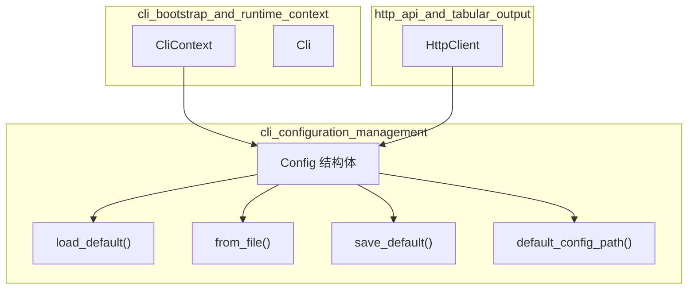

# cli_configuration_management 模块技术深度解析

## 概述

`cli_configuration_management` 模块是 OpenViking CLI 的配置管理中枢，负责在客户端启动时加载和持久化用户偏好设置。想象一下当你走进一家咖啡店时，咖啡师已经记住了你的口味偏好——这个模块做的事情类似：它确保每次运行 CLI 命令时，用户的连接配置、输出格式偏好和认证凭证都能自动生效，无需重复指定。

与 Python 端的 [open_viking_config](./python_client_and_cli_utils-configuration_models_and_singleton-open_viking_config.md) 模块不同（后者负责管理整个 OpenViking 系统的运行时配置，包括存储、嵌入模型、VLM 等复杂组件），Rust 端的 `Config` 模块聚焦于一个非常具体的问题：**CLI 如何连接到服务器**。它解决的问题是：「用户第一次使用 CLI 时只需要配置一次，之后所有命令都应该自动使用这些配置」。

## 架构设计

### 核心组件



### 组件职责

**Config 结构体** 是整个模块的核心，它承载了 CLI 与服务器通信所需的所有连接参数。这个结构体设计得非常直接——每个字段都有清晰的语义，不需要复杂的文档解释就能理解它的用途。

`load_default()` 函数负责「发现」配置文件。它遵循「渐进式配置」原则：首先检查用户是否在默认位置（`~/.openviking/ovcli.conf`）放置了配置文件；如果文件不存在，就返回一个包含合理默认值的 `Config` 实例。这意味着即使用户从未创建过配置文件，CLI 也能正常工作。

`save_default()` 函数则实现了配置的「持久化」。当用户运行 `ov config show` 或通过其他方式修改配置时，更改会被写回到默认配置文件。下次 CLI 启动时，这些更改会自动生效。

### 数据流向

```
用户home目录
     │
     ▼
~/.openviking/ovcli.conf ──────► Config::load_default()
     │                                │
     │                                ▼
     │                         Config 实例
     │                                │
     ├────────────────────────────────┤
     │                                │
     ▼                                ▼
CliContext::new() ◄────────── HttpClient::new()
     │                                │
     ▼                                ▼
每个命令处理器                    HTTP 请求
```

数据的流动是单向的：配置文件 → Config 实例 → CliContext → HttpClient → 所有网络请求。这个流程在每次 CLI 启动时都会执行，确保配置始终是最新的。

## 设计决策与权衡

### 决策一：使用 JSON 作为配置文件格式

代码选择了 JSON 而非 YAML、TOML 或其他格式。这看似是一个随意的选择，但实际上有几个考量：

首先，JSON 是 Rust 内置序列化支持最好的格式之一。通过 `serde` 库，Config 结构体可以零成本地与 JSON 文件互转，不需要额外的配置代码。其次，JSON 的受众最广，用户即使不了解 Rust 或 OpenViking，只要看到配置文件也能大致理解其结构。最后，JSON 的解析是严格的，这对于配置验证来说是一个优点——格式错误会立即被发现，而不是静默地产生意外行为。

**权衡**：JSON 的缺点是冗长。对于有经验的开发者来说，YAML 或 TOML 可能更简洁。但考虑到这是面向用户的配置文件，清晰性和工具支持比简洁更重要。

### 决策二：采用「有默认值的可选配置」模式

观察 Config 结构体的字段定义：

```rust
pub struct Config {
    #[serde(default = "default_url")]
    pub url: String,
    pub api_key: Option<String>,
    pub agent_id: Option<String>,
    #[serde(default = "default_timeout")]
    pub timeout: f64,
    #[serde(default = "default_output_format")]
    pub output: String,
    #[serde(default = "default_echo_command")]
    pub echo_command: bool,
}
```

这里有两种不同的处理方式：对于 `url`、`timeout`、`output`、`echo_command` 这些字段，即使配置文件缺失或为空，CLI 也能通过默认值正常运行；而 `api_key` 和 `agent_id` 是 `Option` 类型，允许为空。

这种设计体现了「渐进式复杂度」的思想：基础用户只需要安装 CLI 就能连接本地默认服务器（`http://localhost:1933`）；高级用户可以逐步添加 API 密钥、agent ID 等配置而无需了解全部选项。

### 决策三：配置路径硬编码为 ~/.openviking/ovcli.conf

代码中使用 `dirs::home_dir()` 获取用户主目录，然后拼接 `.openviking/ovcli.conf` 作为配置路径。这是一个实用主义的决定——它适用于所有主流操作系统（Linux、macOS、Windows），不需要用户费心选择路径。

**权衡**：这种设计的缺点是无法自定义配置路径。不过，从 CLI 的使用场景来看，这是一个合理的取舍——大多数用户只需要一套配置，而且这个路径足够「隐藏」，不会污染用户主目录的根目录。

### 决策四：将 Config 加载与 CliContext 初始化耦合

在 `main.rs` 中可以看到：

```rust
let ctx = match CliContext::new(output_format, compact) {
    Ok(ctx) => ctx,
    Err(e) => {
        eprintln!("Error: {}", e);
        std::process::exit(2);
    }
};
```

Config 的加载是 CliContext 初始化的第一步，如果加载失败，整个 CLI 无法启动。这是一种「快速失败」（fail-fast）策略：在用户开始执行命令之前就暴露配置问题，而不是等到第一个网络请求时才报错。

## 依赖分析

### 上游依赖（谁调用这个模块）

**main.rs 中的 CliContext** 是 Config 的主要消费者。CliContext 在初始化时立即加载 Config，并将其传递给 HttpClient。查看 `CliContext::get_client()` 方法可以看到：

```rust
pub fn get_client(&self) -> client::HttpClient {
    client::HttpClient::new(
        &self.config.url,
        self.config.api_key.clone(),
        self.config.agent_id.clone(),
        self.config.timeout,
    )
}
```

这意味着 Config 的所有字段都会被 HttpClient 消费：
- `url` → HTTP 请求的 base URL
- `api_key` → 认证头部
- `agent_id` → 请求头部的 agent 标识
- `timeout` → HTTP 客户端的超时设置

### 下游依赖（这个模块调用什么）

Config 模块本身非常精简，它只依赖：
- `serde` 的序列化/反序列化功能
- `std::path::PathBuf` 处理路径
- `dirs` crate 获取用户主目录
- 自定义的 `Error` 类型（在 error.rs 中定义）

这种极简的依赖图是刻意为之的——配置模块不应该有复杂的依赖，它只需要做好「读取和保存」这两件事。

### 与 Python 配置模块的关系

值得注意的是，OpenViking 系统中存在两套独立的配置体系：

1. **Rust CLI 配置**（当前模块）：管理 CLI 如何连接服务器
2. **Python 配置**（[open_viking_config](./python_client_and_cli_utils-configuration_models_and_singleton-open_viking_config.md)）：管理整个系统的运行时行为，包括存储后端、嵌入模型、解析器参数等

这两套配置是解耦的：CLI 通过 HTTP 与服务器通信，配置的是「如何找到服务器」；Python SDK 直接与各种存储和计算组件交互，配置的是「这些组件如何工作」。这种分离有其合理性——CLI 是一个轻量级入口点，不应该承担整个系统的配置复杂性。

## 使用指南

### 首次使用

安装 CLI 后，第一次运行任何命令都会使用默认配置：

```bash
# 默认连接到 localhost:1933，无需任何配置
ov status
```

### 查看当前配置

```bash
ov config show
```

这会输出类似以下的 JSON：

```json
{
  "url": "http://localhost:1933",
  "api_key": null,
  "agent_id": null,
  "timeout": 60.0,
  "output": "table",
  "echo_command": true
}
```

### 修改配置

有两种方式修改配置：

**方式一：直接编辑配置文件**

打开 `~/.openviking/ovcli.conf` 并修改 JSON 内容：

```json
{
  "url": "https://api.openviking.com",
  "api_key": "your-api-key-here",
  "timeout": 120.0
}
```

**方式二：通过环境变量（推荐用于敏感信息）**

对于 API 密钥等敏感信息，可以使用环境变量覆盖配置文件：

```bash
export OVCLI_API_KEY="your-api-key-here"
ov status  # 自动使用环境变量中的 api_key
```

注意：当前代码中 `api_key` 是直接存储在配置文件中的，没有特殊的环境变量处理。如果需要更强的安全性，未来可以考虑添加环境变量支持。

### 验证配置

```bash
ov config validate
```

这会尝试加载配置并在格式正确时输出 "Configuration is valid"，否则显示具体的解析错误。

## 字段详解

| 字段 | 类型 | 默认值 | 用途 |
|------|------|--------|------|
| `url` | String | `http://localhost:1933` | OpenViking API 服务器地址 |
| `api_key` | Option\<String\> | None | 认证 API 密钥 |
| `agent_id` | Option\<String\> | None | 标识特定 agent 的 ID |
| `timeout` | f64 | 60.0 | HTTP 请求超时时间（秒） |
| `output` | String | `"table"` | 输出格式（table/json） |
| `echo_command` | bool | true | 是否在执行前打印命令 |

## 边界情况与陷阱

### 陷阱一：配置文件损坏导致 CLI 完全无法启动

由于 Config 加载失败会导致 `std::process::exit(2)`，损坏的配置文件会使整个 CLI 不可用。解决方法：

```bash
# 删除损坏的配置文件，CLI 会使用默认配置重新运行
rm ~/.openviking/ovcli.conf
ov config validate  # 验证默认配置有效
```

### 陷阱二：JSON 格式错误被静默忽略的风险

当前代码在 JSON 解析失败时会返回错误，但如果配置文件存在但为空 `{}`，所有字段都会使用默认值。这意味着用户可能以为自己的配置已生效，但实际上被完全忽略了。建议在修改配置后始终运行 `ov config validate`。

### 陷阱三：路径不存在时的行为

`default_config_path()` 函数假设 `dirs::home_dir()` 总是能返回有效的路径。在某些极端情况下（如容器环境或特殊权限配置），这可能失败。错误信息是 `"Could not determine home directory"`，这会让用户困惑。

### 陷阱四：echo_command 的全局影响

`echo_command` 字段会影响所有命令的输出。设置为 `true` 时，每次运行命令都会先打印 `cmd: <command> <params>`。这个设计原本用于调试，但在生产环境中可能造成干扰。

## 扩展点

当前模块的扩展能力有限，但以下是一些可能的扩展方向：

1. **多配置文件支持**：添加 `--config` 参数允许指定自定义配置文件路径
2. **环境变量覆盖**：实现 `OVCLI_URL`、`OVCLI_API_KEY` 等环境变量支持
3. **配置模板**：添加 `ov config init` 命令创建带注释的配置文件模板
4. **敏感信息加密**：对 `api_key` 等敏感字段实现加密存储

## 相关模块

- [cli_command_structure](./rust_cli_interface-cli_bootstrap_and_runtime_context-cli_command_structure.md) - CLI 命令定义
- [cli_runtime_context](./rust_cli_interface-cli_bootstrap_and_runtime_context-cli_runtime_context.md) - 运行时上下文
- [http_client](./rust_cli_interface-http_api_and_tabular_output-http_client.md) - HTTP 客户端实现
- [open_viking_config](./python_client_and_cli_utils-configuration_models_and_singleton-open_viking_config.md) - Python 端配置管理